[toc]
# `VsCode` integrado en `GitHub`

## Localizar repositorio.

Primero localizamos el repositorio con el que queremos colaborar:

1. Buscamos al usuario (En todo `GitHub`):

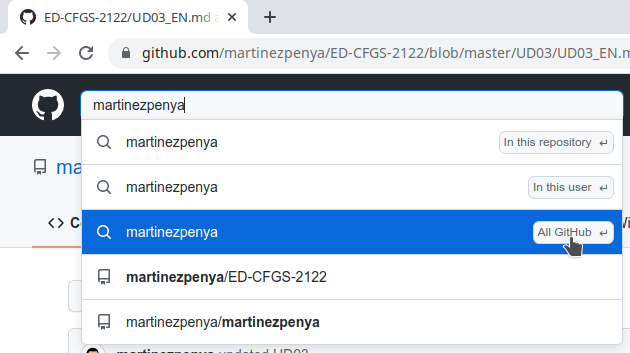

2. Elegimos la pestaña `Repositorios`:

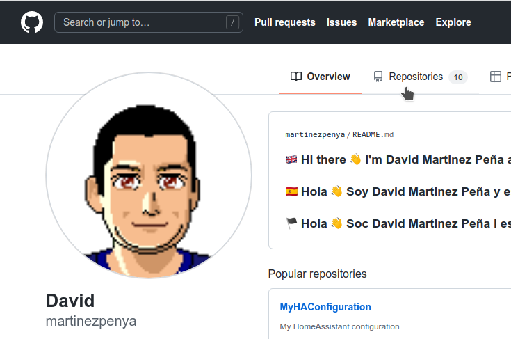

3. Elegimos el que nos interesa modificar, en nuestro caso `PRG-CFGS-2324`:

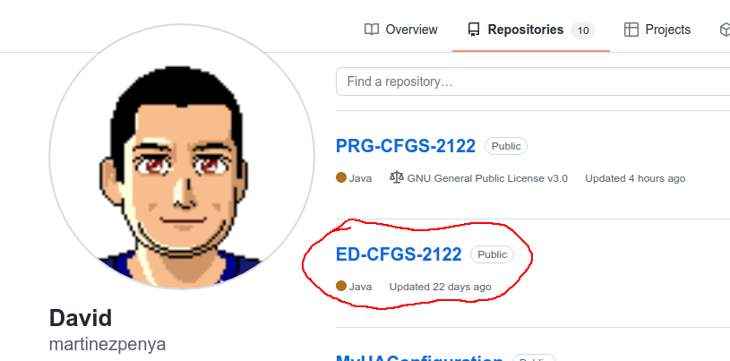

## Abrir `VSCode` integrado.

Github cuenta con un editor online muy potente basado en `VSCode`.

Una vez visualizamos el código del repositorio en cuestión:

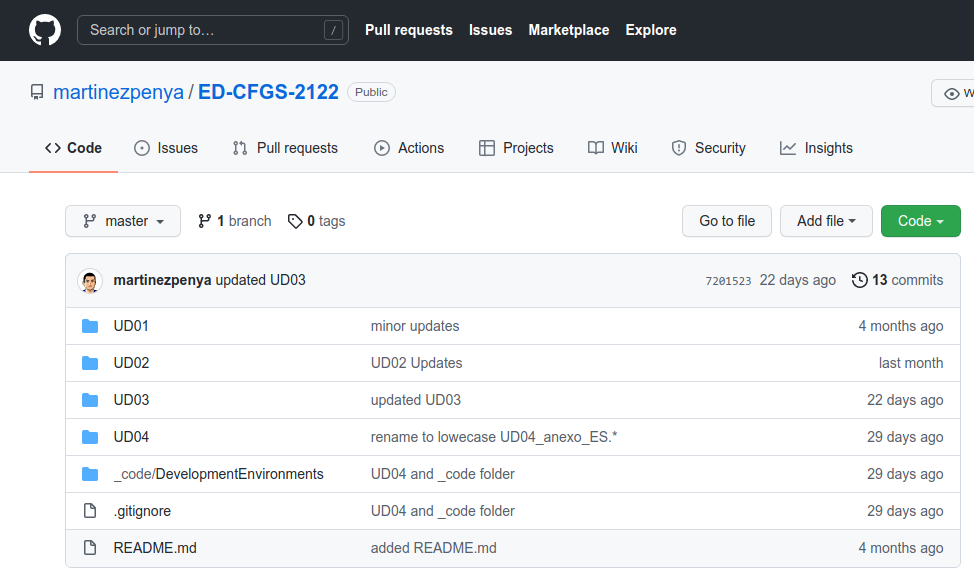

Para abrir el editor solo debemos pulsar la tecla "." (punto) de nuestro teclado:

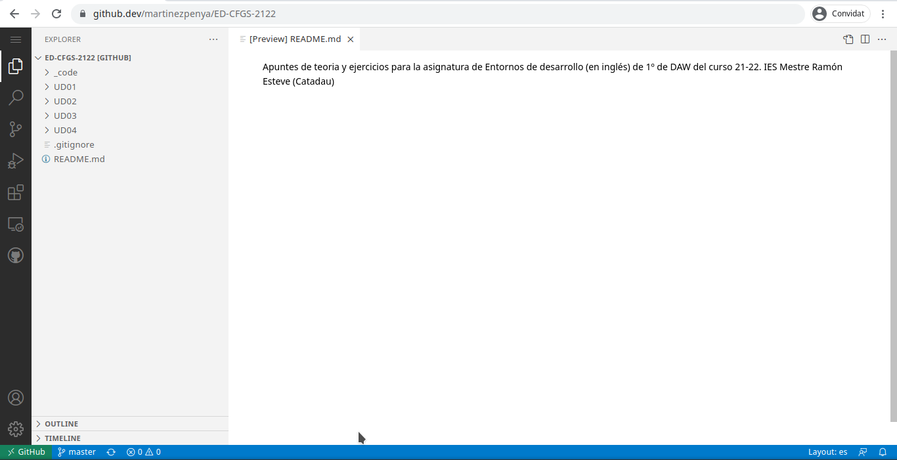

Visualizaremos la estructura de carpetas y archivos en un editor `VSCode` integrado en el navegador Web.

## Modificar un archivo.

Una vez detectada la errata dentro del código [markdown](https://markdown.es/) que es muy fácil de interpretar (a poco que le dediquéis unos minutos) podemos modificar el archivo en cuestión, y a su lado aparecerá una **M** porqué el archivo está modificado.

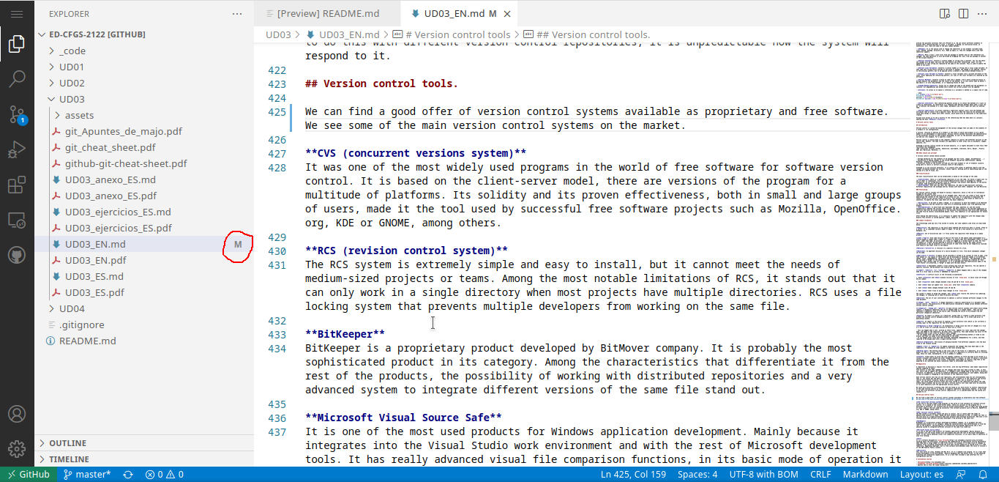

## Git integrado

VSCode lleva integrado un gestor de GIT, el tercer icono de la barra lateral: 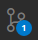

1. Verificamos los archivos cambiados:
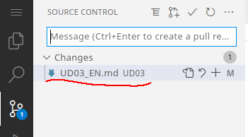

2. Los pasamos al area "staged" con el símbolo "+":
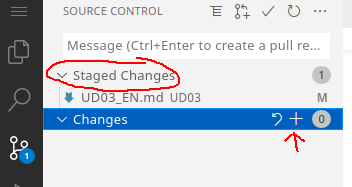

4. Añadimos el comentario del commit:
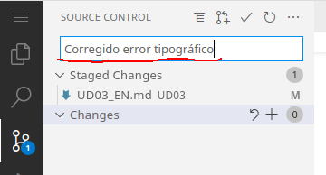

4. Realizamos el commit:
    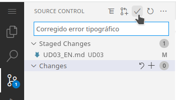

Como el repositorio no es nuestro mostrará este mensaje:

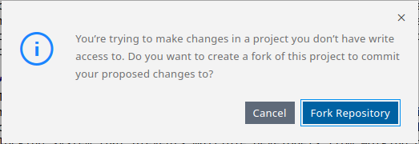

En realidad podemos hacer el fork antes o después, aquí tienes un pequeño [vídeo](https://www.youtube.com/watch?v=zyT0sl3-kxE) que explica que es un fork.

A continuación nos pide el nombre de la rama que se creará y que luego podremos solicitar se incluya en el proyecto original:

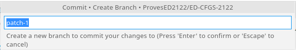

Ahora nos pregunta si ya que hemos creado un fork, queremos cambiar el repositorio, y trabajar sobre nuestro fork en lugar de sobre el proyecto original, pulsamos sobre [Switch to Fork]:

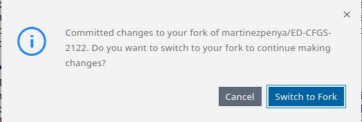

Ahora ya podemos salir del editor VSCode pulsando sobre el botón de las tres lineas horizontales y elegir la opción "Go to Repository":
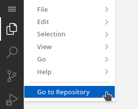

## Pull request

Una vez volvemos a nuestro repositorio (nuestro fork), detectará que hay cambios respecto al repositorio original y nos propone que realicemos un pull request (una petición al usuario propietario del repositorio original para que incluya nuestra modificación).

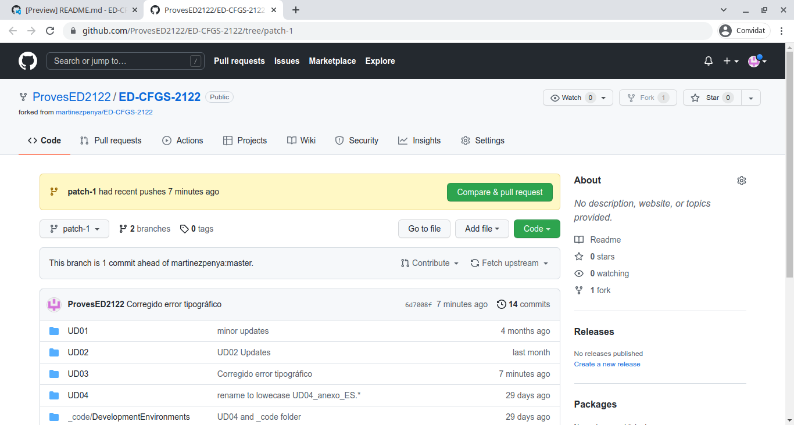

Una vez pulsado el botón [Compare & pull request] nos aparece la siguiente pantalla:

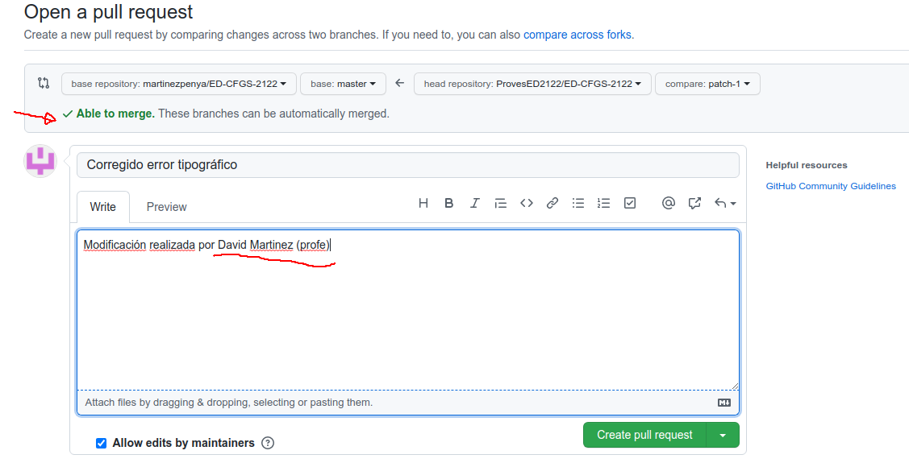

Debemos asegurarnos de que la modificación se puede agregar al repositorio original "Able to merge", y que indicamos en los comentarios nuestro nombre completo para que el profesor nos identifique. Fíjate que el nombre del pull request es el nombre del commit que hicimos desde VSCode.

Ahora debemos pulsar el botón [Create pull request].

# Tareas

##  GitHub 1

Sigue los pasos de esta práctica guiada para sugerir una modificación de cualquiera de los archivos de los repositorios del profesor [martinezpenya](https://github.com/martinezpenya). Adjunta a la tarea de AULES un pdf con la captura de pantalla similar a esta donde se vé que has solicitado el pull request y que estás esperando a que se integre en el repositorio original. Explica que significan cada uno de los 5 apartados señalados en la captura:
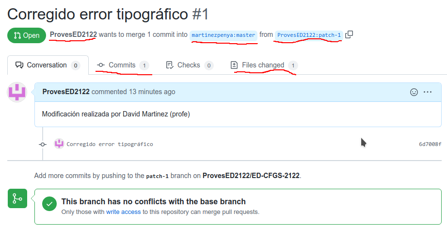
