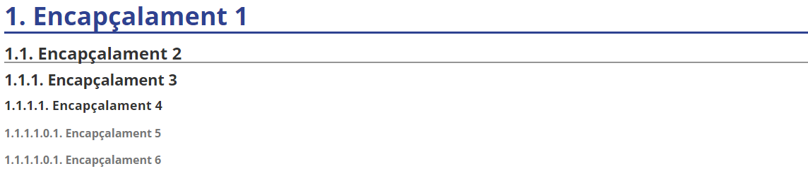

[TOC]


# Introducción


**Markdown** nace como herramienta de **conversión de texto plano a HTML**. Fue creada en 2004 por John Gruber, y se distribuye de manera gratuita bajo una [licencia BSD](https://es.wikipedia.org/wiki/Licencia_BSD).

Markdown es un maravilloso **lenguaje** para escribir documentos de una manera **sencilla de escribir, y que en todo momento mantenga un diseño legible** que contengan elementos como *secciones*, *párrafos*, *listas*, *vínculos* e *imágenes*, *etc*. Pandoc [http://pandoc.org](http://pandoc.org/) ha extendido enormemente la [sintaxis original de Markdown](http://daringfireball.net/projects/markdown/) y ha añadido unas pequeñas nuevas características tales como notas al pie de página, citas y tablas. Lo más importante que hace Pandoc es hacer posible la generación de documentos en una amplia variedad de formatos desde Markdown, HTML, LaTeX/PDF, MSWord y Slides.

Este método te permitirá añadir formatos tales como **negritas**, *cursivas* o [enlaces](http://iesmre.com/), utilizando texto plano, lo que permitirá hacer de tu escritura algo más simple y eficiente al evitar distracciones.

Con Markdown **no vas a reemplazar *todo***, sino cubrir las funcionalidades más comunes que se requieren para escribir un documento relativamente complicado.

## Para qué sirve Markdown

Markdown será perfecto para ti sobre todo **si publicas de manera constante en Internet**, donde el lenguaje HTML está más que presente: WordPress, Squarespace, Jekyll…

Pero no estoy hablando solo de [blogs](http://www.amazon.es/Cómo-ganar-dinero-con-blog-ebook/dp/B010KC4NDW/?tag=markdown-21) o páginas web. **Servicios** como Trello o **foros** como Stackoverflow también soportan este lenguaje, y con el paso del tiempo encontrarás aún más lugares que lo utilicen.

Además, Markdown está cada vez más extendido en el **mundo “offline”**. Nada te impedirá utilizar este lenguaje para **tomar notas y apuntes** de tus clases o reuniones en una determinada [aplicación](http://markdown.es/aplicaciones-markdown/) (incluso podrías **escribir un libro con él**, ya que puedes exportar fácilmente el resultado final a un formato ePub).

Gracias a la simplicidad de su sintaxis podrás utilizarlo siempre que necesites escribir y dar formato rápidamente, sobre todo si quieres hacerlo desde dispositivos móviles.

## Por qué utilizar Markdown

### Ventajas

- **Markdown para todo**. Para crear apuntes, documentos, notas, sitios web, libros, documentación técnica, etc. de forma off-line.

- **Markdown transportable**. Este tipo de formato siempre será **compatible con todas las plataformas** que utilices, así que utilizar Markdown es una manera de mantener todo tu contenido siempre accesible desde cualquier dispositivo (smartphones, ordenadores de escritorio, tablets…), ya que en cualquiera de ellas siempre encontrarás [las aplicaciones adecuadas](http://markdown.es/aplicaciones-markdown/) para leer y editar este tipo de contenido.

- Ideal para escribir un libro, pues permite la exportación fácil en ePub, PDF...

  > ##### Si en el futuro Microsoft Word desapareciese perderías acceso a todo el contenido que has creado durante años utilizando dicho procesador. Así que lo más inteligente para evitar eso es **generar tu contenido de la manera más sencilla posible**: utilizando texto plano.

### Desventajas

- No tiene muchas funcionalidades (esto es lo que lo hace muy compatible).

## Editores para Markdown

### Off-line

- **Typora**
- MarkdownPad
- HarooPad
- Markdown Monster
- ...

### Online

- Dillinger

- GitHub

- ...


## Párrafos y saltos de línea

Si queremos generar un nuevo párrafo en Markdown simplemente separa el texto mediante una línea en blanco (**pulsando dos veces intro**).

Al igual que sucede con HTML, **Markdown no soporta dobles líneas en blanco**, así que si intentas generarlas estas se convertirán en una sola al procesarse.

Para realizar un salto de línea y empezar **una frase en una línea siguiente dentro del mismo párrafo**, tendrás que pulsar **dos veces la barra espaciadora antes de pulsar una vez intro**.

Por ejemplo si quisieses escribir un poema quedaría tal que así:

*«La tierra estaba seca,
		No había ríos ni fuentes.
		Y brotó de tus ojos.*

Donde cada verso tiene **dos espacios en blanco al final**.

## Encabezados

Las `#` **almohadillas** son uno de los métodos utilizados en Markdown para crear encabezados. Debes usarlos añadiendo **uno por cada nivel**.

Es decir,

```
# Encabezado 1
## Encabezado 2
### Encabezado 3
#### Encabezado 4
##### Encabezado 5
###### Encabezado 6
```

Se corresponde con:



También puedes cerrar los encabezados con el mismo número de almohadillas, por ejemplo escribiendo `### Encabezado 3 ###`. Pero la única finalidad de esto es un **motivo estético**.

## Texto básico

Un párrafo no requiere sintaxis especial.

Para aplicar **negrita** al texto, se escribe entre dos asteriscos. 

Para aplicar *cursiva* al texto, se escribe entre un solo asterisco.

Para tachar el texto, se escribirá dos virgulillas antes y dos después de éste.

```
Este texto es en **negrita**.
Este texto es en *itálica*.
Este texto está ~~tachado~~.
Este texto es en ambos ***negrita e itàlica***.
```

Se corresponde a:

​	Este texto es en \*\***negrita**\*\*.

​	Este texto es en *\*itálica*\*.

​	Este texto está ~~tachado~~.

​	Este texto es en ambos \*\*\****negrita e itàlica***\*\*\*.

> En Markdown no podemos subrayar el texto. Sin embargo, podremos añadir la etiqueta de html underline \<u>\</u>.
>
> ```MARK
> Este texto está <u>subrayado</u>
> ```
>
> Este texto está <u>subrayado</u>

Para **ignorar los caracteres** de formato de Markdown, ponga <code>\\</code> antes del carácter:

## Citas

Las citas se generar utilizando el carácter *mayor que* <code> > </code> al comienzo del bloque de texto.

```
> No hay que ir para atrás ni para darse impulso.  — Lao Tsé.
```

> No hay que ir para atrás ni para darse impulso.  — Lao Tsé.

Si la cita en cuestión se compone de **varios párrafos**, deberás añadir el mismo símbolo `>` al comienzo de cada uno de ellos.

## Listas

### Listas ordenadas

Para crear **listas** **numeradas**, empieza una línea con `1.` or `1)`.

No debes mezclar los formatos dentro de la misma lista. No es necesario especificar los números. GitHub lo hace por tí.

```
1. Ítem 1 de la lista.
1. Siguiente ítem de la lista.
1. Siguiente ítem, el tercero, de la lista.
```

Se corresponde con:

1. Ítem 1 de la lista.
1. Siguiente ítem de la lista.
1. Siguiente ítem, el tercero, de la lista.

### Listas no ordenadas

Para crear listas no numeradas, o de viñetas, empieza una línea con <code>*</code>, <code>-</code> o <code>+</code>, pero no mezcles los formatos dentro de la misma lista. (No mezclar formatos de viñetas, como * y + por ejemplo, dentro del mismo documento).

```
* Ítem 1 de la lista.
* Siguiente ítem de la lista.
* Siguiente ítem, el tercero, de la lista.
```

Se corresponde con:

* Ítem 1 de la lista.
* Siguiente ítem de la lista.
* Siguiente ítem, el tercero, de la lista.

También podremos combinar ambos tipos de listas. Como por ejemplo:

1. element de llista 2
   - element de llista 2.2
     - element de llista 2.2.1
     - element de llista 2.2.2

### Listas de tareas

Para crear listas de tareas basta con que empiece la línea con <code>- [ ]</code>, si queremos que no esté el check marcado, y <code>- [x]</code>, si queremos que esté el check marcado.

```
- [x] regar plantas.
- [ ] realizar ejercicios de programación.
```

Se corresponde con:

- [x] regar plantas.

- [ ] realizar ejercicios de programación.

## Tablas

Las tablas no forman parte de la especificación principal de Markdown, pero Adobe, en cierta forma, las admite. 

Para generar una tabla utiliza la barra vertical <code>|</code> para generar filas y columnas.

Si insertamos guiones <code>---</code> dentro de una celda crearemos el encabezado de la tabla.

```markdown
| encabezado1 | encabezado2 | encabezado3 |
|--- |--- |--- |
| celda 1.1 | celda 1.2 | celda 1.3 |
| celda 2.1 | celda 2.2 | celda 2.3 |
```

Quedaría:

| encabezado1 | encabezado2 | encabezado3 |
| ----------- | ----------- | ----------- |
| celda 1.1   | celda 1.2   | celda 1.3   |
| celda 2.1   | celda 2.2   | celda 2.3   |

Si queremos una **celda con más de una línea** de texto podremos insertar <code>\<br /></code> (o **Shift+Intro**) al final de ésta.

## Enlaces

Para generar en enlace en Markdown se debe poner un código con dos partes:

* `[texto del enlace]`, que es el texto que se va a a mostrar, 
* Y después `(nombrefichero.md)`, que es la URL o el nombre de archivo al que se va a vincular.

```
[link text](file-name.md)
```

Un ejemplo:

​		**\[enlace a web del centro](https://iesmre.com)**

La visualización del ejemplo anterior:

​		[enlace a web del centro](https://iesmre.com)

## Imágenes

Para insertar una imagen se debe poner un código con dos partes:

* `![texto alternativo]`, que es el texto que se va a a mostrar si la imagen no pudiera visualizarse, 
* Seguido de `(nombrefichero.extension)`, que es el archivo imagen (con su dirección).

```
[texto alternativo](file-name.md)
```

Un ejemplo:

​	**\[logo markdown](/assets/mardown_logo.png)**

La visualización de la imagen anterior:


## Código de bloque

Uno de los puntos más útiles de Markdown a la hora de crear un documento con texto específico de informática es que admite la colocación de bloques de código tanto en línea como en un bloque "delimitado" independiente entre frases.

Para ello utilizaremos:

* Dos comillas invertidas <code>`` </code> si queremos escribir código dentro de la misma línea de texto del párrafo.
* Si queremos crear un bloque de código multilínea, con un lenguaje específico, pondremos <code>```</code> seguido del <code>nombre del lenguaje del bloque</code>.

Unos ejemplos:

* En la misma línea:

​			...estamos escribiendo un párrafo <code>``insertar el bloque</code> y seguimos escribiendo...

* Un bloque de código:

  ​	<code>```javascript</code> y escribimos el código.

```javascript
function holamundo(){
    console.log ("hola mundo web");
}
```

## Línia horizontal

Para crear una línea horizontal, de separación de contenido por ejemplo, se añaden tres guiones:  <code>---</code>

Visualización:

---

## Insertar emojis

Para insertar emojis basta con utilizar <code>:</code> seguido del nombre del emojii y cerrar con otro <code>:</code>.

Podemos observar, que en algunos editores markdown, al escribir, por ejemplo, **:a** nos muestra todos los emojiis con la inicial **a**.

Por ejemplo:    <code>: star :</code> 

Visualización:   :star:

## Crear diagrama de flujo

Cuando queremos crear documentos con elementos gráficos como diagramas de flujo, debemos generar una especie de *código* para construirlos.

- Por eso, comenzaremos introduciendo la línea de inicio:		<code>```**flow**</code>	
- Es conveniente asignar un nombre (por ejemplo: st, op, cond, e...) a cada elemento que conforma el diagrama; así, después podremos unir todos estos.
- Forma de inicio:  <code>st=>**start**: Nombre</code>
- Forma de fin:  <code>e=>**end**: Nombre</code>
- Rectángulo:  <code>op=>**operation**: texto de nombre</code>

- Condición:  <code>cond=>**condition**: texto de la condición (Si o No?)</code>

- Subrutina: <code>sub1=>**subroutine**: nombre subtarea</code>
- EntradaSalida: <code>io1=>**inputoutput**: nombre elemento entrada/salida</code>
- Líneas:  <code>st->op->cond</code>

- Caminos de condiciones:  <code>cond(yes)**->**e</code>   y <code>cond(no)->op</code>

- Línea de cierre:  <code>```</code>	


Ejemplo:

~~~~
```flow
st=>start: Usuario
e=>end: Acceso
op=>operation: Operacion de usuario
cond=>condition: Sí o No?
st->op->cond
cond(yes)->e
cond(no)->op
```
~~~~

Visualización:

```flow
st=>start: Usuario
op=>operation: Operacion de usuario
cond=>condition: Sí o No?
e=>end: Acceso

st->op->cond
cond(yes)->e
cond(no)->op
```

> Intenta realizar un diagrama para "programar" un almuerzo. En él, deberás dar los ***buenos días***, indicar que ***es hora del descanso***, y preguntar si ***alguién quiere almorzar***. Si no hay nadie que quiera almorzar contigo, debes **ir a otro grupo de amigos** y volver a indicar que *es hora del descanso.* Si alguien sí quiere almorzar **escribe en la pizarra que os vais a almorzar** y **sal al patio**.

## Crear secuencias

En la secuenciación podemos observar que es bastante parecido a la creación de diagramas; pero la primera línea (crear un bloque de código) no serà ~~**flow**~~ sino **sequence**.

````
```sequence
Ana->Mundo: Hola Mundo 
Note right of Mundo: Mundo está pensando\nla respuesta
Mundo-->Ana: Cómo estás? 
Ana->>Mundo: Estoy bien gracias!
```
````

Visualización:

```sequence
Ana->Mundo: Hola Mundo 
Note right of Mundo: Mundo está pensando\nla respuesta
Mundo-->Ana: Cómo estás? 
Ana->>Mundo: Estoy bien gracias!
```

## Crear índice

Para crear el índice a partir de los encabezados creados debemos insertar ``[TOC]`` .

## Tarea propuesta para el alumn@

Como tarea, se propone:

- Crear un documento markdown en tu editor markdown favorito (por ejemplo Typora) que documente información acerca de tí mismo.
- En dicho documento crear título, índice.
- Añadir 4 encabezados principales (y otros encabezados secundarios dentro de éstos) en el que hables por ejemplo de: *Tus datos*, *Currículum*, *Aficiones* y *Otros datos de interés*. <u>No</u> hace falta que indiques <u>información personal relevante</u>.
- Se valorará la inclusión de distintos elementos como: negrita-cursiva-subrayado, listas ordenadas-desordenadas-tareas, enlaces, imágenes, citas, código, etc.
- Si te atreves con ello, crea un diagrama de flujo en el que indiques los pasos que realizas un sábado por la mañana.
- Exporta el documento a pdf.

**Subir a la plataforma *<u>AULES</u>* un documento MD de nombre *<u>actividad01tunombre.md</u>*  y otro documento PDF que sea la exportación del primero.**
