---
title: Installing and using Development Environments
language: ES
author: David Martínez Peña [www.martinezpenya.es]
subject: Programación
keywords: [PRG, 2023, Programacion, Java]
IES: IES Eduardo Primo Marqués (Carlet) [www.ieseduardoprimo.es]
header: ${title} - ${subject} (ver. ${today}) 
footer:${currentFileName}.pdf - ${author} - ${IES} - ${pageNo}/${pageCount}
typora-root-url:${filename}/../
typora-copy-images-to:${filename}/../assets
---
[toc]
# Java

Each software and each development environment has specific characteristics and functionalities. This will also be reflected in the installation and configuration of the software. Depending on the platform, environment or operating system in which the software is to be installed, one installation package or another will be used, and some options or others must be taken into account in its configuration.
The following shows how to install an integrated software development tool, such as Eclipse. But you will also be able to observe the procedures to install other necessary or recommended tools to work with the JAVA programming language, such as Tomcat or the Java Virtual Machine.
You must bear in mind the following concepts:

- JVM (Java Virtual Machine, Java virtual machine) is in charge of interpreting the byte code and generating the machine code of the computer (or device) on which the application is executed. This means that we need a different JVM for each environment.
- JRE (Java Runtime Environment) is a set of Java utilities that includes the JVM, libraries and the set of software necessary to run Java client applications, as well as the connector for Internet browsers to run applets.
- JDK (Java Development Kit) is the set of tools for developers; It contains, among other things, the JRE and the set of tools necessary to compile the code, package it, generate documentation ...

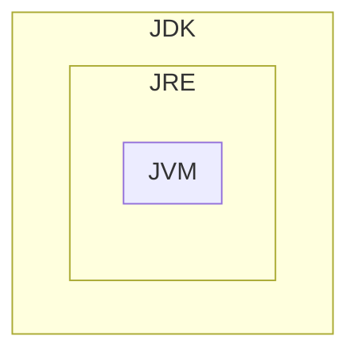

The installation process consists of the following steps:
1. Download, install and configure the JDK.
2. Download and install a web or application server.
3. Download, install and configure the IDE (Netbeans or Eclipse).
4. Configure JDK with IDE.
5. Configure the web or application server with the IDE installed.
6. If necessary, installation of connectors.
7. If necessary, install new software.

## Download and install the JDK

We can differentiate between:

- Java SE (Java Standard Edition): this is the standard version of the platform, this platform being the basis for all Java development environments in terms of client, desktop or web applications.

- Java EE (Java Enterprise Edition): This is the largest version of Java and is generally used for creating large client/server applications and for WebServices development.

In this course, the functionalities of Java SE will be used.
The file is different depending on the operating system where it has to be installed. So:

- For Windows and Mac OS operating systems there is an installable file.
- For GNU/Linux operating systems that support .rpm or .deb packages, packages of this type are also available.
- For the rest of the GNU/Linux operating systems there is a compressed file (ending in .tar.gz).

In the first two cases, you just have to follow the usual installation procedure for the operating system you are working with.
In the latter case, however, you have to unzip the file and copy it to the folder where you want to install. Normally, all users will have read and execute permission to this folder.

> ### Starting with JDK version 11, Oracle distributes the software with a significantly more restrictive license than previous versions. In particular, it can only be used to "develop, test, prototype and demonstrate your applications." Any use "for internal commercial, production or business purposes" other than that mentioned above is explicitly excluded.
>
> If you need it for any of these uses not allowed in the new license, in addition to the previous versions of the JDK, there are reference versions of these versions licensed "GNU General Public License version 2, with the Classpath Exception", which allows most of the usual uses. These versions are linked to the same download page and also to the address jdk.java.net.

An alternative is to use https://adoptium.net/ formerly known as adoptOpenJDK, which has now been integrated into the Eclipse foundation. From there we can download the binaries of the openJDK version for our platform without restrictions. [Full story] (https://es.wikipedia.org/wiki/OpenJDK).

> #### In GNU/Linux we can use the commands:
>
> - `sudo apt install default-jdk` to install the default jdk.
> - `java --version` to see the versions available on our system.
> - `sudo update-alternatives --config java` to choose which of the installed versions we want to use by default or even see the path of the different versions that we have installed.

## Configure environment variables "JAVA_HOME" and "PATH"

Once the JDK is downloaded and installed, you need to set some environment variables:

- The `JAVA_HOME` variable: indicates the folder where the JDK has been installed. It is not mandatory to define it, but it is very convenient to do so, since many programs look for the location of the JDK in it. Also, it makes it easy to define the following two variables.

- The `PATH` variable. It should point to the directory that contains the executable of the virtual machine. It is usually the `bin` subfolder of the directory where we have installed the JDK.

**CLASSPATH variable**
Another variable that the JDK takes into account is the `CLASSPATH` variable. It points to the folders where the libraries of the application that you want to run are located with the java order. It is preferable, however, to indicate the location of these folders with the `-cp` option of the same java command, since each application can have different libraries and environment variables affect the entire system.
Setting the `PATH` variable is essential for the operating system to find the JDK commands and be able to execute them.

# Eclipse

Eclipse is an open source application currently developed by the Eclipse Foundation, an independent, non-profit organization, which fosters an open source community and the use of a set of products, services, capabilities and plug-ins for the disclosure of the use open source in the development of computer applications. Eclipse was originally developed by IBM as the successor to VisualAge.
As Eclipse is developed in Java, it is necessary, for its execution, to have a JRE (Java Runtime Environment) previously installed on the system. To find out if you have this JRE installed, you can do the test on the official Java website, in the Do I have Java? Section.
If we will develop with Java, as is our case, we must have the JDK installed (remember that it is a superset of the JRE).

## Installation

Current versions of the Eclipse environment are installed with an installer. This, basically, is in charge of decompressing, solving some dependencies and creating the shortcuts.
This installer can be obtained by downloading it directly from the official website of the Eclipse Project [www.eclipse.org](www.eclipse.org). You can find the versions for the different operating systems and instructions for using it. They are not complex at all.
In the case of GNU/Linux and MAC OS, the file is a compressed file. So you have to unzip it and then run the installer. This is the *eclipse-inst* file, inside the eclipse folder, which is a subfolder of the result of unzipping the previous file.
If only the current user will use the IDE, the installation can be carried out without using administrator or root privileges and selecting, for the installation, a folder belonging to this user. If you want to share the installation between different users, you should indicate to the installer a folder on which all these users have read and execute permission.

When we start the installer we will see a screen similar to this:


The installer will ask which version we want to install. The version we will use is "Eclipse IDE for Java EE Developers".

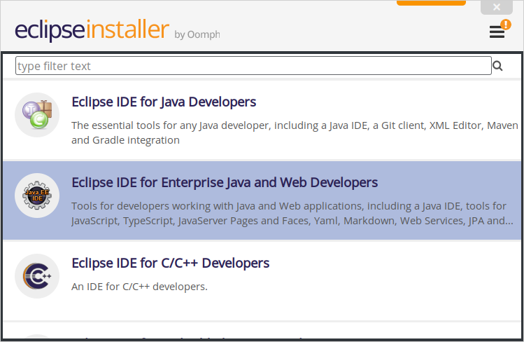

Then it will ask for the version of JDK/JRE that we are going to use (in the screenshot it appears with white letters). It also asks us for the folder where we will install. And two check boxes to indicate if we want it to create for us the shortcut to the application menu already on the desktop.

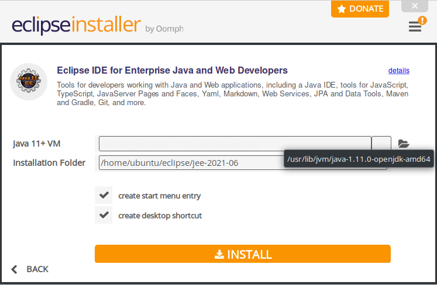

To select the correct folder, you must take into account which users will use the environment. All of them must have read and execute permission on the folder in question. Once the folder is entered, we can press the INSTALL button to start the installation.

We will also be asked to accept the licenses for the software to be installed, as the screenshot shows:

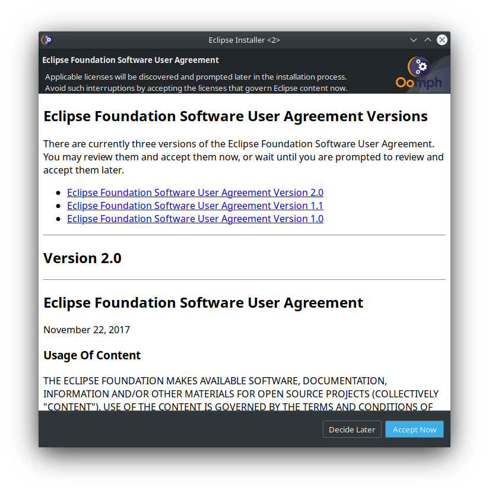

During the installation we will see a progress screen like the one shown below:

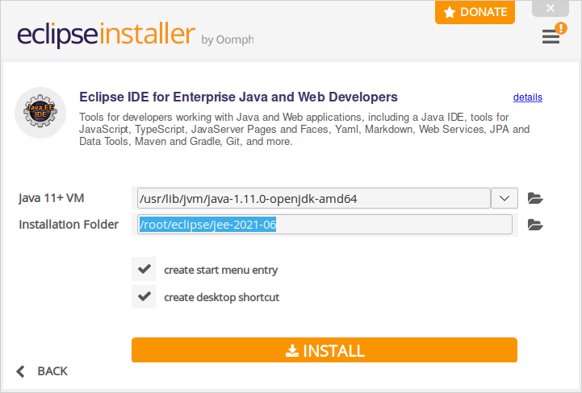

Once the installation is finished, we are shown a screen that invites us to run the environment directly.

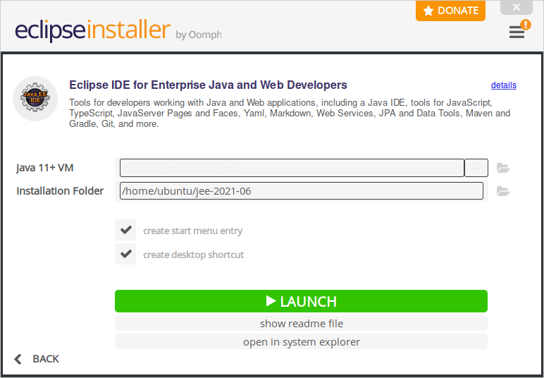

This first time we can run the Eclipse environment by clicking the LAUNCH button. The rest of the time, it will be necessary to invoke it from the shortcuts or launchers, if they have been created or, otherwise, directly invoking the executable. This is called eclipse and you will find it in a subfolder of the installation folder also called eclipse. The exact path may vary from version to version.
If in the future it is necessary to uninstall it, only the folder where it has been installed should be deleted since the Eclipse installation does not appear in the GNU/Linux repository or in the control panel in Windows.
When we run the environment, a screen like the following will appear:


Immediately, we will be asked in which folder the workspace will be located. We can ask it to remember it for the rest of the executions by activating the option "* Use this as the default and do not ask again *".

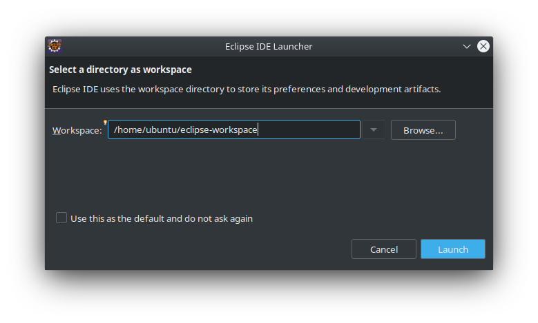

The first time we run it, the welcome tab will be displayed. We can ask you not to show it to us any more by deactivating the option "Always show Welcome at start up".

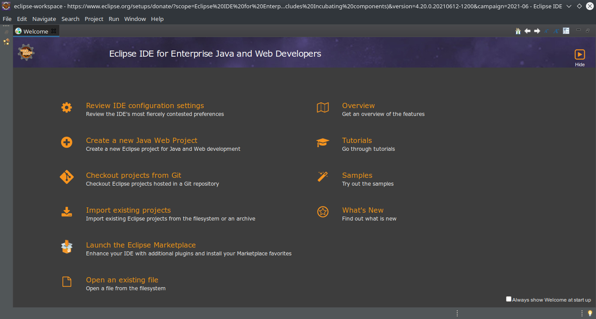

Once this tab is closed, the work environment will be similar to this:

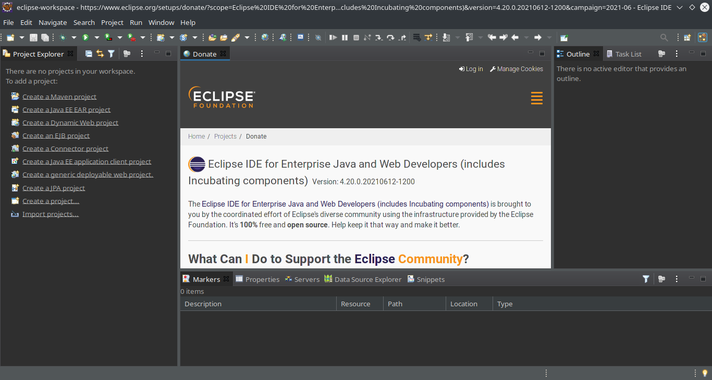

> ### By default Eclipse offers us the download of the lightest installer that will download from the Internet the necessary packages to complete the installation according to our choices. If this installation gives us problems, we can download the "package" version in which we must previously choose the installation package we want, it will take up a lot more, but it will download all the necessary packages. Then we just have to unzip the downloaded file in a folder of our choice and we will have eclipse installed. We will have to create our own start menu and desktop icons (you can follow this [guide] (https://www.donovanbrown.com/post/Adding-Eclipse-to-Launcher-on-Ubuntu-1604) changing the path where you have unzipped your version of eclipse).

## Setting

**Java version**

By default, Eclipse tries to use the new features of JDK 16, but in our case, for example, we have version 11. We can customize these options in the `Window/Preferences/Java/Compiler` section and choose the version for the` Compiler compliance level` field. correct, in our case 11.

Also, if we need it, we can configure the JDKs that are available, add or remove them from the `Window/Preferences/Java/Installed JREs` option.

**Outlook**

Eclipse calls the distribution of the panels in the Perspective window, there are a few predefined ones, and we can configure ours, to our liking in the `Window/Perspective` section.

**Appearance**

Eclipse allows us to customize any aspect of the appearance of our environment, change both the IDE theme and the font size and colors for the source code coloring. All these options are available in `Window/Appearance`.

## Modules

Eclipse's options and functionality can be expanded by adding modules from its plugin "store". In `Help/Eclipse Marketplace ...` we can for example search by text, or search in the popular tab. That will show us all the add-ons that contain the searched word, or the most downloaded add-ons from the marketplace. We can install, for example, `SonarLint 6.0` that helps us to keep our code clean of common errors, for this we simply have to press the` INSTALL` button that appears next to it in the list, accept the use license and it will automatically ask us to restart the `IDE`.

## Basic usage ("Hello world!")

Eclipse provides information about its use in the `Help` section, and we can learn to create our first project in Java (the typical" Hello World! "). To do this we must open the` Welcome `window, which is the one that appears when we open eclipse by first time, or we can open it from `Help/Welcome`, from this window we can choose the` Tutorials` section, and within the Java Development section, choose the first item "Create a Hello World application", and Eclipse itself will guide us step by step to create and run our first Java project in Eclipse.

## Update and maintenance

In the same section `Help` Eclipse provides us with the options to update Eclipse itself or the add-ons that we have installed` Help/Check for Updates`.

We can customize the behavior regarding updates in the `Window/Preferences/Install/Update/Automatic Updates` section.

# Netbeans

NetBeans is a very powerful Integrated Development Environment (IDE) tool used primarily for Java and C/C ++ development. It allows you to easily develop web, desktop and mobile applications from its modular framework. You can add support for other programming languages ​​like PHP, HTML, JavaScript, C, C ++, Ajax, JSP, Ruby on Rails, etc. using extensions.

NetBeans IDE 12 has been released with support for Java JDK 11. It also comes with the following features:

- Support for PHP 7.0 to 7.3, PHPStan and Twig.
- Include modules in the "webcommon" cluster. That is, all JavaScript functions in Apache NetBeans GitHub are part of Apache NetBeans 10.
- The "groovy" cluster modules are included in Apache NetBeans 10.
- OpenJDK can automatically detect JTReg from the OpenJDK configuration and register the expanded JDK as a Java platform.
- Support for JUnit 5.3.1

## Installation

We can install NetBeans in three ways:

### Install from binaries

**Step 1: Download the NetBeans file**

Download the NetBeans 12 binary file `netbeans-12.4-bin.zip`. 

**Step 2: Extract the file**

Wait for the download to finish and then extract it.

``` sh
$ unzip netbeans-12.4-bin.zip
```

Confirm the content of the created directory file:

``` bash
$ ls netbeans
apisupport    enterprise  groovy   javafx    netbeans.css  profiler
bin           ergonomics  harness  LICENSE   NOTICE        README.html
cpplite       etc         ide      licenses  php           webcommon
DEPENDENCIES  extide      java     nb        platform      websvccommon
```
**Step 3: Move the `netbeans` folder to `/opt`**

Now let's move the `netbeans/` folder to `/opt`

```sh
$ sudo mv netbeans/ /opt/
```
**Step 4: Configuration path**

The Netbeans executable binary is located in `/opt/netbeans/bin/netbeans`. We need to add its parent directory to our `$PATH` so that we can start the program without specifying the absolute path to the binary file.
Open your `~/.bashrc` or `~/.zshrc` file.

```sh
$ nano ~/.bashrc
```
Add the following line to the end of
```sh
export PATH = "$PATH:/opt/netbeans/bin/"
```
Get the file to start Netbeans without restarting the shell.
```sh
$ source ~/.bashrc
```
**Step 5: Create the NetBeans IDE Desktop Launcher** (optional)

Create a new file in `/usr/share/applications/netbeans.desktop`.

``` sh
$ sudo nano /usr/share/applications/netbeans.desktop
```

Add the following data.

```sh
[Desktop Entry]
Name=Netbeans IDE
Comment=Netbeans IDE
Type=Application
Encoding=UTF-8
Exec=/opt/netbeans/bin/netbeans
Icon=/opt/netbeans/nb/netbeans.png
Categories=GNOME;Application;Development;
Terminal=false
StartupNotify=true
```

To uninstall NetBeans we must delete the `netbeans/` folder that is inside the /opt/ folder, we can use the command:

```bash
$ sudo rm /opt/netbeans -rf
```

**Step 6: Correctly configure the JDK** (optional)

In the file `/opt/netbeans/etc/netbeans.conf` we must correctly specify the path of our JDK in the variable` netbeans_jdkhome`. In GNU/Linux we can know the available JDKs with the command `sudo update-alternatives --config java` which will show a result similar to this:

```bash
Hi ha 3 possibilitats per a l'alternativa java (que proveeix /usr/bin/java).

  Selecció    Camí                                           Prioritat  Estat
------------------------------------------------------------
* 0            /usr/lib/jvm/java-14-openjdk-amd64/bin/java      1411      mode automàtic
  1            /usr/lib/jvm/java-11-openjdk-amd64/bin/java      1111      mode manual
  2            /usr/lib/jvm/java-14-openjdk-amd64/bin/java      1411      mode manual
  3            /usr/lib/jvm/java-8-openjdk-amd64/jre/bin/java   1081      mode manual

Premeu retorn per a mantenir l'opció per defecte[*], o introduïu un número de selecció:
```

In the netbeans configuration you do not have to specify the end of the path `bin/java`

```bash
netbeans_jdkhome="/usr/lib/jvm/java-11-openjdk-amd64/"
```

### Install from script

**Step 1: Download the NetBeans file**

You can also install Netbeans 12.4 on GNU/Linux from a script provided to download `Apache-NetBeans-12.4-bin-linux-x64.sh`.

**Step 2: Run the script**

You must run the installation script

```sh
$  sudo sh ./Apache-NetBeans-12.4-bin-linux-x64.sh
```
> ### If you run the script as `root` (` sudo`) Netbeans will be available to all users. By contrast, if you run the user without `sudo` it will only be available to your user.

A progress bar will appear like this:

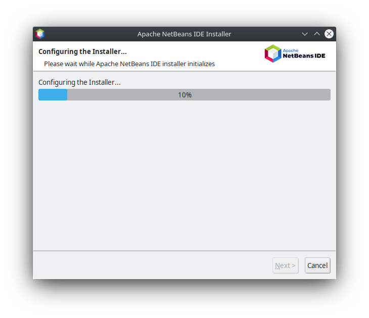

Now we can choose the components we want to install with the Netbeans IDE, we will leave it by default and click on the next button.

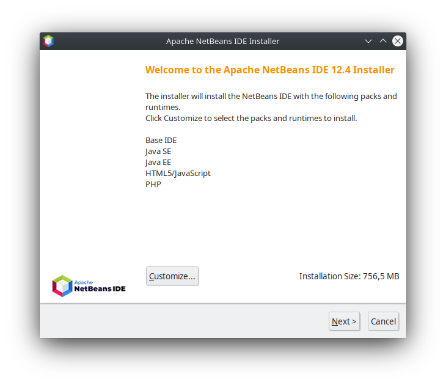

**Step 3: Accept the license**

Then we must accept the use license agreement by checking the box and pressing the next button.

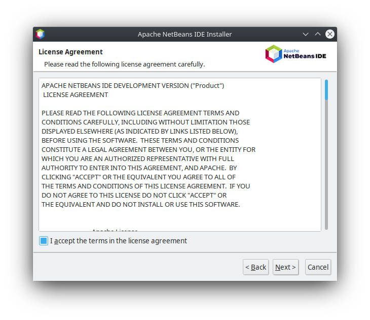

**Step 4: Choose the installation path and JDK**

Now we must choose the path where Netbeans 12.4 will be installed. And we must choose the path where the JDK is located (by default it indicates `/usr`, but we must specify the location as for example ` /usr/lib/jvm/java-11-openjdk-amd64`).

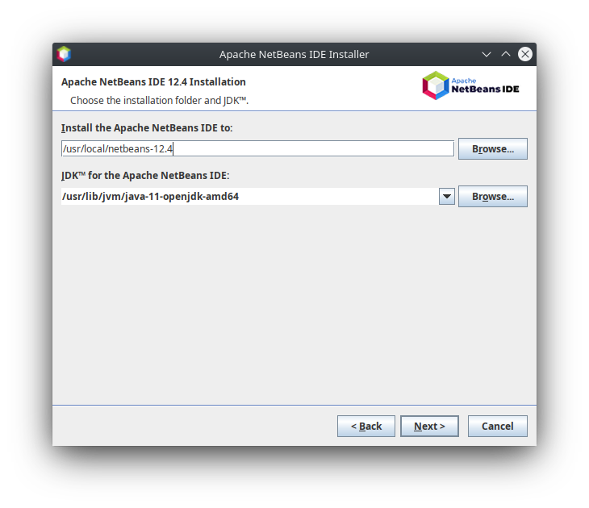

**Paso 5: Actualizaciones automáticas**

At this point a summary of the installation is shown, and we can choose if we want NetBeans to search for and install updates from the Internet, and click the install button.

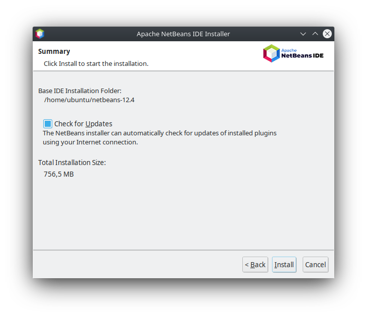

**Step 6: Installation**

A progress bar will appear.

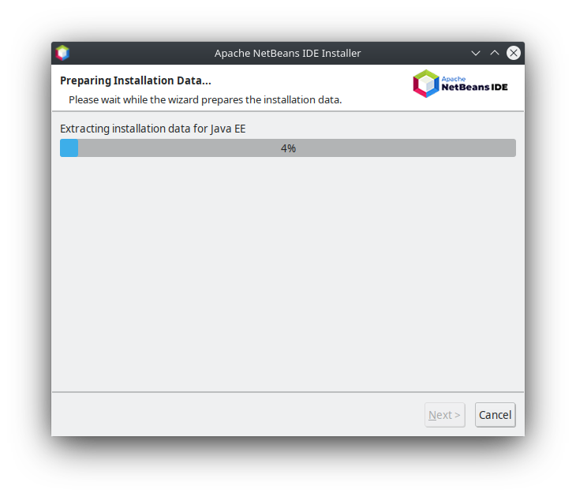

**Step 7: Final step**

When finished, a screen will appear with the actions carried out by the installer, and we will have the launchers created in the applications menu.

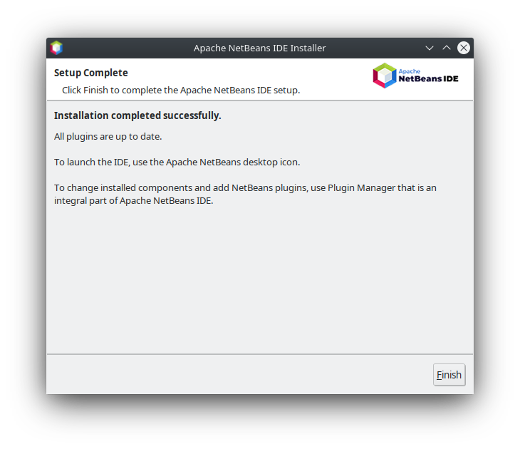

### Install via snap

Perhaps an easier way to install the latest version of Netbeans on our GNU/Linux system is through `snap`:

```sh
$ sudo snap install netbeans --classic
```

### First run

When we run the environment, a screen like the following will appear:

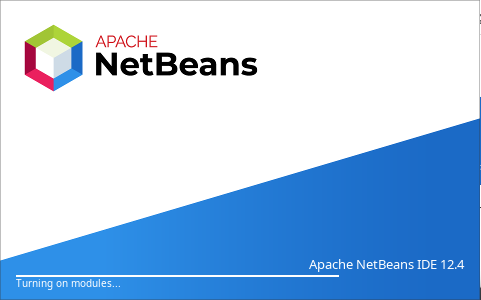

The first time we run it, the welcome tab will be displayed. We can ask that it no longer be shown to us by deactivating the "Show on Startup" option.

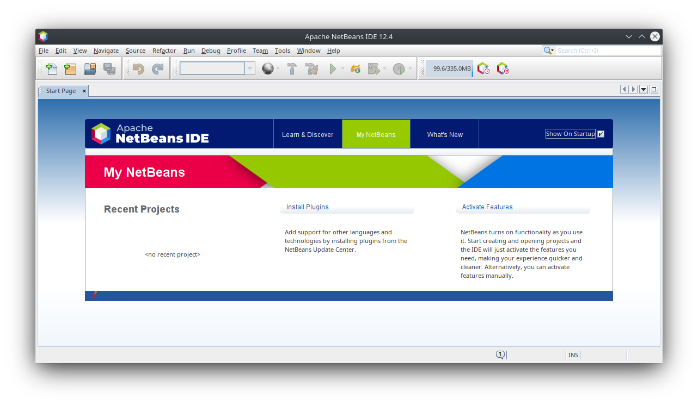

Once this tab is closed, the work environment will be similar to this:


NetBeans may ask us for permission to use our information on a statistical level, we choose the desired behavior and we agree.


To uninstall NetBeans in this case we must execute the `uninstall.sh` file found in the installation folder.

## Setting

**Activate Modules**

By default Netbeans has the modules deactivated and it will be the first time we need them when they become active and available. For example, if we create a new project and choose `Java Application` within the` Java with Ant` category, we will see at the bottom that Netbeans warns us that the necessary module is not active and that we must press `Next` to make it available. . We do it, and then it will ask us to activate the `nb-javac Impl` module, we leave the check marked and press the` Activate` button, and the wizard for creating our first Java project will appear.

**Java version**

Within the `Tools/Java Platforms` menu we can change or view the location of our JDK installation.

**Outlook**

In Netbeans perspectives are not necessary, the Netbeans environment, although it is customizable, automatically adapts to the tasks you are doing at any given time.

**Appearance**

Netbeans allows us to customize any aspect of the appearance of our environment, change the IDE theme as well as the font size and colors for the source code coloring. All these options are available in `Tools/Options`, and within this window choose the third tab` Font & Colors` and the penultimate tab `Appearance`.

**Export/Import configuration**

A very interesting option of Netbeans is that it allows us to export or import configurations and share them with other colleagues or even between our computers or different installations. The option is available in `Tools/Options`, at the bottom left we find the` Export ... `and` Import ... `buttons.

## Modules

The options and functionalities of Netbeans can be expanded by adding modules from its plugins section. In `Tools/Plugins` we can for example search by text, or search in the available plugins tab. That will show us all the plugins that contain the searched word, or the plugins available. We can install for example `sonarlint4netbeans` that helps us to keep our code clean of common errors, for this we simply have to check the box in front of the name of the plugin, and press the` INSTALL` button that appears below, click next, accept the license of use and install. When the installation is finished it will ask us to restart the `IDE`.

## Basic usage ("Hello world!")

To create our first application in Netbeans, we must create a Java application, from the `File/New Project ...` menu we must choose `Java Application` within the` Java with Ant` category. Next we must specify the name of the project, for example "App Hello World", and we make sure to leave the option `Create main class app.hello.world.AppHolaWorld` checked and we should see something like this:

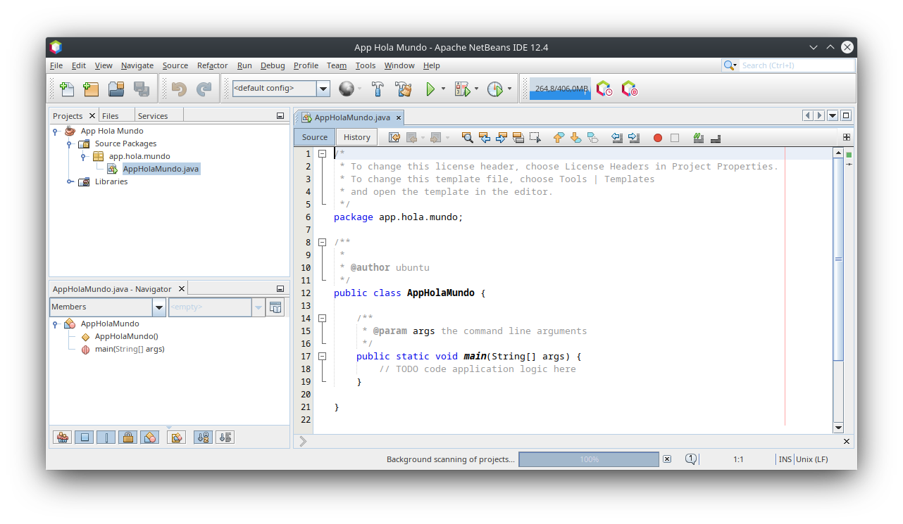

At this point, we can only include the line of code necessary to print the text message on the screen. To do this, we will go to the end of the line `// TODO code application logic here` and press the` ENTER` key to create a new line.

Once located in the right place we will use one of the most interesting features of Netbeans, which is the code templates. We type the word "sout" and then we press the `TAB` key and Netbeans will replace it with the correct code:` System.out.println (""); `.

Now we must write between the two double quotes the text message that should appear on the screen, and it should look like this:

```java
System.out.println("Hola Mundo!");
```

Then we can press the upper button with a green triangle (`Run project`) or press the` F6` key on the keyboard:

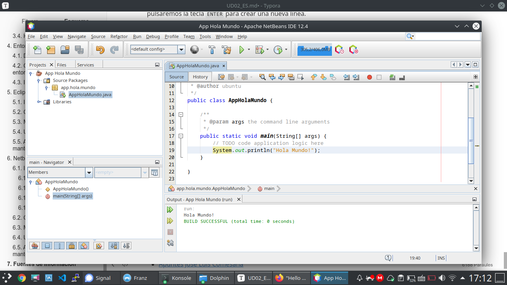

A new section will appear in the window (at the bottom) called `Output` in which we can view the result of the execution of our first program.

## Update and maintenance

In the `Help` section, Netbeans provides us with the options to update Netbeans itself with the` Help/Check for Updates` option.

# IntelliJ (recommended)

**IntelliJ IDEA** is an integrated development environment (IDE) written in Java for developing computer software written in Java, Kotlin, Groovy, and other JVM-based languages. It is developed by JetBrains (formerly known as IntelliJ) and is available as an Apache 2 Licensed community edition, and in a proprietary commercial edition. Both can be used for commercial development.

Our institution has licenses for our students while you are having @ieseduardoprimo.es email.

## Installation

Download from https://www.jetbrains.com/idea/ the toolbox tool version corresponding to your Operating System.

Follow instructions for your Operating System from https://www.jetbrains.com/help/idea/installation-guide.html#toolbox

Once installed the toolbox, you can choose to install every product from JetBrains.

Once installed the Idea (IDE) you can create a desktop entry from the initial screen:


And in Manage Licenses option you have to follow this instructions: https://www.jetbrains.com/help/license_server/Activating_license.html

The server address is: https://iesepm.fls.jetbrains.com/

## Settings

Docs for setting up your IDE: https://www.jetbrains.com/help/idea/configuring-project-and-ide-settings.html

## Modules

You can add plugins following this instructions:

https://www.jetbrains.com/help/idea/managing-plugins.html

## Basic usage ("Hello world!")

The docs help you with your first program in java: https://www.jetbrains.com/help/idea/creating-and-running-your-first-java-application.html

A lot of more information:

- If you came from Eclipse: https://www.jetbrains.com/help/idea/migrating-from-eclipse-to-intellij-idea.html
- If you were in NetBeans: https://www.jetbrains.com/help/idea/netbeans.html
- If you want to learn on your own: https://www.jetbrains.com/help/idea/product-educational-tools.html

# Why you should choose IntelliJ over VsCode for Java coding

## **IntelliJ IDEA:**

**Pros:**

1. **Comprehensive Integrated Environment:** IntelliJ IDEA is specifically designed for Java development and offers a complete set of tools and features optimized for this task.

2. **Advanced Static Analysis:** It provides in-depth code analysis that detects errors and potential issues before compilation.

3. **Advanced Debugging:** Offers a powerful set of debugging tools that help identify and resolve issues in the code.

4. **Guided Refactoring:** Provides tools for safely reorganizing and optimizing code, promoting good programming practices.

5. **Support for Java Frameworks and Technologies:** Native integration with many frameworks and technologies used in Java development, making it easy to create full-fledged applications.

6. **Automatic Code Generation:** Assists programmers in automatically generating repetitive code snippets, such as getters and setters.

7. **Integration with Build Tools:** Facilitates integration with build tools like Maven and Gradle.

8. **Support for Unit Testing:** Offers integration with testing frameworks like JUnit for test-driven development.

9. **Ease of Configuration:** Provides guided wizards to efficiently set up Java projects.

**Cons:**

1. **Higher Resource Consumption:** Due to its comprehensive and feature-rich nature, IntelliJ IDEA can consume more system resources compared to lighter-weight IDEs.

2. **Learning Curve:** Since it offers a wide range of features, beginners might take time to become familiar with all the available tools.

## **Visual Studio Code (VSCode):**

**Pros:**

1. **Lightweight and Fast:** VSCode is a lightweight and fast code editor, making it ideal for smaller projects or for those who prefer a more agile experience.

2. **Wide Range of Extensions:** It has a vast community developing extensions for various technologies and languages, including Java.

3. **Versatility:** While not specifically designed for Java, it can be customized to work with Java through extensions.

4. **Version Control Integration:** Offers native integration with version control systems like Git.

5. **Quick Learning Curve:** Due to its lighter focus, it might be easier for beginners to start working with it.

**Cons:**

1. **Limited Java Functionality:** Although there are Java extensions, VSCode doesn't offer the same comprehensive set of tools optimized for Java as IntelliJ IDEA does.

2. **Less In-Depth Analysis:** Static analysis and code correction capabilities might not be as advanced as those in IntelliJ IDEA.

3. **Limited Debugging:** While it offers debugging, it might not be as advanced or comprehensive as IntelliJ IDEA's.

4. **Manual Project Configuration:** Setting up Java projects might require more steps and manual configuration compared to IntelliJ IDEA.

# Sources of Information

- [Wikipedia](https://es.wikipedia.org)
- [Code&Coke (Fernando Valdeón)](http://entornos.codeandcoke.com/doku.php?id=start)
- Apuntes IES El Grao (Mª Isabel Barquilla?)
- [Apuntes IOC (Marcel García)](https://ioc.xtec.cat/materials/FP/Recursos/fp_dam_m05_/web/fp_dam_m05_htmlindex/index.html)
- [Apuntes José Luis Comesaña](https://www.sitiolibre.com/)
- [Apuntes IES Luis Vélez de Guevara 17-18 (José Antonio Muñoz Jiménez)](http://jamj2000.github.io/slides/2017/09/05/entornosdesarrollo/)
- https://www.jetbrains.com
- ChatGPT

