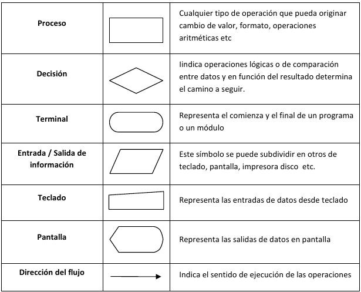
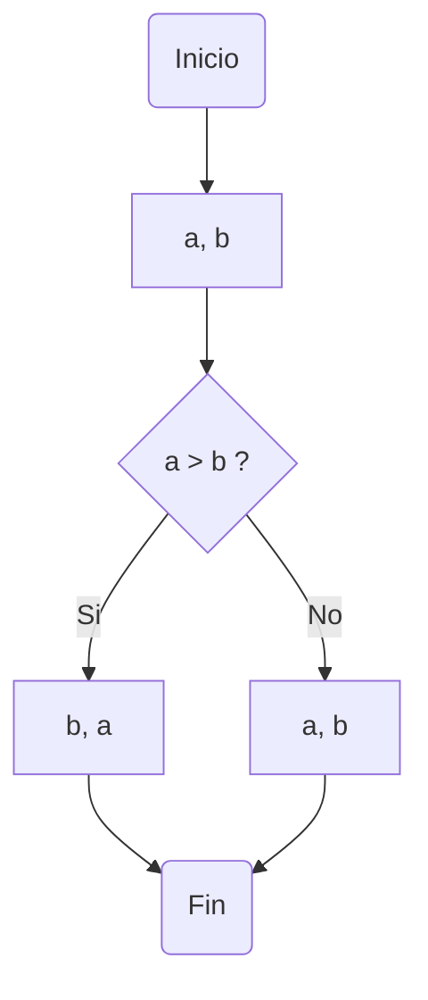
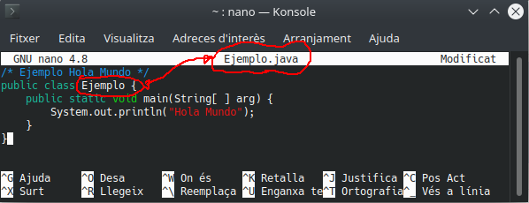

[toc]

# Piensa como un programador

Una de las acepciones que trae el Diccionario de Real Academia de la Lengua Española (RAE) respecto a la palabra Problema es **“Planteamiento de una situación cuya respuesta desconocida debe obtenerse a través de métodos científicos”**. Con miras a lograr esa respuesta, un problema se puede definir como una situación en la cual se trata de alcanzar una meta y para lograrlo se deben hallar y utilizar unos medios y unas estrategias.

La mayoría de problemas tienen algunos elementos en común: un estado inicial; una meta, lo que se pretende lograr; un conjunto de recursos, lo que está permitido hacer y/o utilizar; y un dominio, el estado actual de conocimientos, habilidades y energía de quien va a resolverlo (Moursund, 1999).

Casi todos los problemas requieren, que quien los resuelve, los divida en submetas que, cuando son dominadas (por lo regular en orden), llevan a alcanzar el objetivo. La solución de problemas también requiere que se realicen operaciones durante el estado inicial y las submetas, actividades (conductuales, cognoscitivas) que alteran la naturaleza de tales estados (Schunk, 1997).

Cada disciplina dispone de estrategias específicas para resolver problemas de su ámbito; por ejemplo, resolver problemas matemáticos implica utilizar estrategias propias de las matemáticas. Sin embargo, algunos psicólogos opinan que es posible utilizar con éxito estrategias generales, útiles para resolver problemas en muchas áreas. A través del tiempo, la humanidad ha utilizado diversas estrategias generales para resolver problemas. Schunk (1997), Woolfolk (1999) y otros, destacan los siguientes métodos o estrategias de tipo general:

- **Ensayo y error** : Consiste en actuar hasta que algo funcione. Puede tomar mucho tiempo y no es seguro que se llegue a una solución. Es una estrategia apropiada cuando las soluciones posibles son pocas y se pueden probar todas, empezando por la que ofrece mayor probabilidad de resolver el problema.

  Por ejemplo, una bombilla que no prende: revisar la bombilla, verificar la corriente eléctrica, verificar el interruptor.

- **Iluminación** : Implica la súbita conciencia de una solución que sea viable. Es muy utilizado el modelo de cuatro pasos formulado por Wallas (1921): preparación, incubación, iluminación y verificación.

  Estos cuatro momentos también se conocen como proceso creativo. **Algunas investigaciones han determinado que cuando en el periodo de incubación se incluye una interrupción en el trabajo sobre un problema se logran mejores resultados desde el punto de vista de la creatividad**. La incubación ayuda a "olvidar" falsas pistas, mientras que no hacer interrupciones o descansos puede hacer que la persona que trata de encontrar una solución creativa se estanque en estrategias inapropiadas.

  Ejemplos: 

  - Dispones de 6 lapices/palillos/cerillas igual de largos, ¿como puedes formar 4 triángulos iguales  y equiláteros?

  - Mueve 2 cerillas para seguir teniendo una copa pero con la cereza fuera:

    

- **Heurística** : Se basa en la utilización de reglas empíricas para llegar a una solución. El método heurístico conocido como “IDEAL”, formulado por Bransford y Stein (1984), incluye cinco pasos:
  Identificar el problema; definir y presentar el problema; explorar las estrategias viables; avanzar en las estrategias; y lograr la solución y volver para evaluar los efectos de las actividades (Bransford & Stein, 1984). 
  
  El matemático Polya (1957) también formuló un método heurístico para resolver problemas que se aproxima mucho al ciclo utilizado para programar computadores. A lo largo de esta Guía se utilizará este método propuesto por Polya.
  
- **Algoritmos** : Consiste en aplicar adecuadamente una serie de pasos detallados que aseguran una solución correcta. Por lo general, cada algoritmo es específico de un dominio del conocimiento. La programación de computadores se apoya en este método.
  
- **Modelo de procesamiento de información** : El modelo propuesto por Newell y Simon (1972) se basa en plantear varios momentos para un problema (estado inicial, estado final y vías de solución). Las posibles soluciones avanzan por subtemas y requieren que se realicen operaciones en cada uno de ellos.

- **Análisis de medios y fines** : Se funda en la comparación del estado inicial con la meta que se pretende alcanzar para identificar las diferencias. 

  Luego se establecen submetas y se aplican las operaciones necesarias para alcanzar cada submeta hasta que se alcance la meta global. Con este método se puede proceder en retrospectiva (desde la meta hacia el estado inicial) o en prospectiva (desde el estado inicial hacia la meta).
  
- **Razonamiento analógico** : Se apoya en el establecimiento de una analogía entre una situación que resulte familiar y la situación problema. Requiere conocimientos suficientes de ambas situaciones.

- **Lluvia de ideas** : Consiste en formular soluciones viables a un problema. El modelo propuesto por Mayer (1992) plantea: definir el problema; generar muchas soluciones (sin evaluarlas); decidir los criterios para estimar las soluciones generadas; y emplear esos criterios para seleccionar la mejor solución. Requiere que los estudiantes no emitan juicios con respecto a las posibles soluciones hasta que terminen de formularlas.
  
- **Sistemas de producción** : Se basa en la aplicación de una red de secuencias de condición y acción (Anderson, 1990). 
  
- **Pensamiento lateral** : Se apoya en el pensamiento creativo, formulado por Edwar de Bono (1970), el cual difiere completamente del pensamiento lineal (lógico). El pensamiento lateral requiere que se exploren y consideren la mayor cantidad posible de alternativas para solucionar un problema. Su importancia para la educación radica en permitir que el estudiante: explore (escuche y acepte puntos de vista diferentes, busque alternativas); avive (promueva el uso de la fantasía y del humor); libere (use la discontinuidad y escape de ideas preestablecidas); y contrarreste la rigidez (vea las cosas desde diferentes ángulos y evite dogmatismos). Este es un método adecuado cuando el problema que se desea resolver no requiere información adicional, sino un reordenamiento de la información disponible; cuando hay ausencia del problema y es necesario apercibirse de que hay un problema; o cuando se debe reconocer la posibilidad de perfeccionamiento y redefinir esa posibilidad como un problema (De Bono, 1970).

  Ejemplos:

  - **El dilema del náufrago.** Un náufrago necesita  trasladar a su isla de residencia algunos restos del naufragio de su  barco, que afloraron en la orilla de la isla de enfrente. Allí tiene un  zorro, un conejo y un racimo de zanahorias, que en su bote puede llevar a razón de uno por viaje. ¿Cómo puede llevarlo todo a su isla, sin que el zorro se coma al conejo, ni éste a las zanahorias?

    **Respuesta**: Deberá llevar primero al conejo y dejar  al zorro con las zanahorias. Luego volver y llevarse al zorro, que  dejará a solas en su isla, tomar al conejo y llevarlo de vuelta a la de  enfrente. Después llevará las zanahorias, dejando al conejo solo y  depositándolas junto al zorro. Finalmente regresará para hacer un último viaje con el conejo.
  
  - **El dilema del ascensor.** Un hombre que vive en el  décimo piso de un edificio, toma todos los días el ascensor hasta la  planta baja, para ir a trabajar. En la tarde, sin embargo, toma de nuevo el mismo ascensor, pero si no hay nadie con él, baja en el séptimo piso y sube el resto de los pisos por la escalera. ¿Por qué?
  
    **Respuesta**: El hombre es enano y no logra presionar el botón del décimo piso.
  
  - **La paradoja del globo.** ¿De qué manera podemos pinchar un globo con una aguja, sin que se fugue el aire y sin que el globo estalle?

    **Respuesta**: Debemos pinchar el globo estando desinflado.
  
  - **El dilema del bar.** Un hombre entra a un bar y le pide al barman un vaso de agua. El barman busca debajo de la barra y de golpe apunta al hombre con un  arma. Este último da las gracias y se marcha. ¿Qué acaba de ocurrir?
  
    **Respuesta**: El barman se percató de que el hombre tenía hipo, y decide curárselo dándole un buen susto.

Como se puede apreciar, hay muchas estrategias para solucionar problemas; sin embargo, esta Guía se enfoca principalmente en dos de estas estrategias: Heurística y Algorítmica.

Según Polya (1957), cuando se resuelven problemas, intervienen cuatro operaciones mentales:

1. Entender el problema
2. Trazar un plan
3. Ejecutar el plan (resolver)
4. Revisar

Es importante notar que estas son flexibles y no una simple lista de pasos como a menudo se plantea en muchos de esos textos (Wilson, Fernández & Hadaway, 1993). Cuando estas etapas se siguen como un modelo lineal, resulta contraproducente para cualquier actividad encaminada a resolver problemas.

Es necesario hacer énfasis en la naturaleza dinámica y cíclica de la solución de problemas. En el intento de trazar un plan, los estudiantes pueden concluir que necesitan entender mejor el problema y deben regresar a la etapa anterior; o cuando han trazado un plan y tratan de ejecutarlo, no encuentran cómo hacerlo; entonces, la actividad siguiente puede ser intentar con un nuevo plan o regresar y desarrollar una nueva comprensión del problema (Wilson, Fernández & Hadaway, 1993; Guzdial, 2000).

> ## La mayoría de los textos escolares de matemáticas abordan la Solución de Problemas bajo el enfoque planteado por Polya. Por ejemplo, en “Recreo Matemático 5” (Díaz, 1993) y en “Dominios 5” (Melo, 2001) se pueden identificar las siguientes sugerencias propuestas a los estudiantes para llegar a la solución de un problema matemático:
>
>  1. **COMPRENDER EL PROBLEMA.**
>     - Leer el problema varias veces
>     - Establecer los datos del problema (¿marcarlos de alguna manera?)
>     - Aclarar lo que se va a resolver (¿Cuál es la pregunta?)
>     - Precisar el resultado que se desea lograr
>     - Determinar la incógnita del problema
>     - Organizar la información
>     - Agrupar los datos en categorías
>     - Trazar una figura o diagrama.
>
> 1. **HACER EL PLAN.**
>      - Escoger y decidir las operaciones a efectuar.
>      - Eliminar los datos inútiles.
>      - **Descomponer el problema en otros más pequeños.**
>
> 1. **EJECUTAR EL PLAN (Resolver).**
>      - Ejecutar en detalle cada operación.
>      - Simplificar antes de calcular.
>      - Realizar un dibujo o diagrama
>
> 1. **ANALIZAR LA SOLUCIÓN (Revisar).**
>      - Dar una respuesta completa
>      - Hallar el mismo resultado de otra manera.
>      - Verificar por apreciación que la respuesta es adecuada.

Numerosos autores de libros sobre programación, plantean cuatro fases para elaborar un procedimiento que realice una tarea específica. Estas fases concuerdan con las operaciones mentales descritas por Polya para resolver problemas:

1. Analizar el problema (Entender el problema)
2. Diseñar un algoritmo (Trazar un plan)
3. Traducir el algoritmo a un lenguaje de programación (Ejecutar el plan)
4. Depurar el programa (Revisar)

Como se puede apreciar, hay una similitud entre las metodologías propuestas para solucionar problemas matemáticos (Clements & Meredith, 1992; Díaz, 1993; Melo, 2001; NAP, 2004) y las cuatro fases para solucionar problemas específicos de áreas diversas, mediante la programación de computadores.

> #### **Problema de la Jirafa**
>
> **Primera pregunta:** ¿Cómo podríamos meter una jirafa dentro de una nevera? Piensa que es un problema para niños y a ellos no se les pasaría por la cabeza trocear al bello animal para resolver un problema.
>
> **Segunda pregunta:** Repetimos la jugada con distinto protagonista. ¿Cómo metemos un elefante dentro de la nevera?
>
> **Tercera pregunta:** Imaginemos que el Rey León está celebrando su cumpleaños y ha invitado a todos los animales del reino. Acuden todos excepto uno. ¿Quién falta?
>
> **Cuarta pregunta:** Estamos frente a un río que debemos cruzar como sea para  continuar nuestro camino. El único problema es que esa zona es el hogar de unos cocodrilos muy agresivos y no disponemos de ningún tipo de  embarcación para ir al otro lado. ¿Cómo harías para cruzar el río sin  morir en el intento?

# Problemas, algoritmos y programas

## Problemas

Podríamos decir que la **programación** es una forma de resolución de **problemas**.

Para que un problema pueda resolverse utilizando un programa informático, éste tiene que poder resolverse de forma mecánica, es decir, mediante una secuencia de instrucciones u operaciones que se puedan llevar a cabo de manera **automática** por un ordenador.

Ejemplos de problemas resolubles mediante un ordenador:

- Determinar el producto de dos números a y b.
- Determinar la raíz cuadrada positiva del número 2.
- Determinar la raíz cuadrada positiva de un número n cualquiera.
- Determinar si el número n, entero mayor que uno, es primo.
- Dada la lista de palabras, determinar las palabras repetidas.
- Determinar si la palabra p es del idioma castellano.
- Ordenar y listar alfabéticamente todas las palabras del castellano.
- Dibujar en pantalla un círculo de radio r.
- Separar las silabas de una palabra p.
- A partir de la fotografía de un vehículo, reconocer y leer su matrícula.
- Traducir un texto de castellano a inglés.
- Detectar posibles tumores a partir de imágenes radiográficas.

Por otra parte, el científico Alan Turing, demostró que existen problemas irresolubles, de los que ningún ordenador será capaz de obtener nunca su solución.

Los problemas deben definirse de forma general y precisa, **evitando ambigüedades**.

Ejemplo: Raíz cuadrada.

- Determinar la raíz cuadrada de un número n
- Determinar la raíz cuadrada de un número n, entero no negativo, cualquiera.

Ejemplo: Dividir

- Calcular la división de dos números de dos números a y b
- Calcular el cociente entero de la división a/b, donde a y b son números enteros y b es
  distinto de cero. (5/2 = 2)
- Calcular el cociente real de la división a/b, donde a y b son números reales y b es
  distinto de cero (5/2 = 2.5)

## Algoritmos

Dado un problema P, un **algoritmo** es un conjunto de reglas o pasos que indican cómo resolver P en un tiempo finito.

Ejemplo: Secuencias de reglas básicas que utilizamos para realizar operaciones aritméticas: sumas, restas, productos y divisiones.

> #### Algoritmo para desayunar
>
>```pseudocode
>Begin20/9/2022)
>	Sentarse
>	Servirse café con leche
>	Servirse azucar
>	If tengo tiempo
>		While tenga apetito
>			Untar mantequilla en una tostada
>			Añadir mermelada
>			Comer la tostada
>		End While
>	End If
>	Beberse el café con leche
>	Levantarse
>End
>```

Un algoritmo, por tanto, no es más que la secuencia de pasos que se deben seguir para solucionar un problema específico. La descripción o nivel de detalle de la solución de un problema en términos algorítmicos depende de qué o quién debe entenderlo, interpretarlo y resolverlo.

Los algoritmos son independientes de los lenguajes de programación y de las computadoras donde se ejecutan. Un mismo algoritmo puede ser expresado en diferentes lenguajes de programación y podría ser ejecutado en diferentes dispositivos. Piensa en una receta de cocina, ésta puede ser expresada en castellano, inglés o francés, podría ser cocinada en fogón o vitrocerámica, por un cocinero o más, etc. Pero independientemente de todas estas circunstancias, el plato se preparará siguiendo los mismos pasos.

> # La **diferencia** fundamental entre **algoritmo** y **programa** es que, en el segundo, los pasos que permiten resolver el problema, deben escribirse en un determinado lenguaje de programación para que puedan ser ejecutados en el ordenador y así obtener la solución.

### Características de los algoritmos

Un algoritmo, para que sea válido, tiene que tener ciertas características fundamentales:

- **Generalidad**: han de definirse de forma general, utilizando identificadores o parámetros. Un algoritmo debe resolver toda una clase de problemas y no un problema aislado particular.
- **Finitud**: han de llevarse a cabo en un tiempo finito, es decir, el algoritmo ha de acabar necesariamente tras un número finito de pasos.
- **Definibilidad**: han de estar definidos de forma exacta y precisa, sin ambigüedades.
- **Eficiencia**: han de resolver el problema de forma rápida y eficiente.

> ## Juego de las monedas (Eduardo Sáenz Cabezón) 
>
> [](https://youtu.be/BbA5dpS4CcI?si=5vftn3igSxoPCzqb&t=1610)
>
> *Desde el comienzo del enlace hasta 7 minutos después.*

### Representación de algoritmos

Los métodos más usuales para representar algoritmos son los diagramas de flujo y el pseudocódigo. Ambos son sistemas de representación independientes de cualquier lenguaje de programación. Hay que tener en cuenta que el diseño de un algoritmo constituye un paso previo a la codificación de un programa en un lenguaje de programación determinado (C, C++, Java, Pascal). La independencia del algoritmo del lenguaje de programación facilita, precisamente, la posterior codificación en el lenguaje elegido.

Un **Diagrama de flujo** (Flowchart) es una de las técnicas de representación de algoritmos más antiguas y más utilizadas, aunque su empleo disminuyó considerablemente con los lenguajes de programación estructurados. Un diagrama de flujo utiliza símbolos estándar que contienen los pasos del algoritmo escritos en esos símbolos, unidos por flechas denominadas líneas de flujo que indican la secuencia en que deben ejecutarse.

Los símbolos más utilizados son:



Ejemplo: Mostrar dos números ordenados de menor a mayor


O también en otra representación:

```flow
st=>start: Inicio
e=>end: Fin
op=>operation: a, b
cond=>condition: a>b?
opSi=>operation: b, a
opNo=>operation: a, b

st->op->cond
cond(yes)->opSi
cond(no)->opNo
opSi->e
opNo->e
```
El **pseudocódigo** es un lenguaje de descripción de algoritmos que está muy próximo a la sintaxis que utilizan los lenguajes de programación. Nace como medio para representar las estructuras de control de programación estructurada.

El pseudocódigo no se puede ejecutar nunca en el ordenador, sino que tiene que traducirse a un lenguaje de programación (codificación). La ventaja del pseudocódigo, frente a los diagramas de flujo, es que se puede modificar más fácilmente si detecta un error en la lógica del algoritmo, y puede ser traducido fácilmente a los lenguajes estructurados como Pascal, C, fortran, Java, etc.

El Pseudocódigo utiliza palabras reservadas (en sus orígenes se escribían en inglés) para representar las sucesivas acciones. Para mayor legibilidad utiliza la **identación** (sangría en el margen izquierdo) de sus líneas.

Ejemplo: Mostrar dos números ordenados de menor a mayor

```pseudocode
Begin
	Leer (A, B)
	If (A>B) then
		Escribir (B, A)
	Else
		Escribir (A, B)
	End If
End
```

## Programas

> # La **diferencia** fundamental entre **algoritmo** y **programa** es que, en el segundo, los pasos que permiten resolver el problema, deben escribirse en un determinado lenguaje de programación para que puedan ser ejecutados en el ordenador y así obtener la solución.

Los lenguajes de programación son sólo un medio para expresar el algoritmo y el ordenador un procesador para ejecutarlo. El diseño de los algoritmos será una tarea que necesitará de la creatividad y conocimientos de las técnicas de programación. Estilos distintos, de distintos programadores a la hora de obtener la solución del problema, darán lugar a programas diferentes, igualmente válidos.

Pero cuando los problemas son complejos, es necesario descomponer éstos en subproblemas más simples y, a su vez, en otros más pequeños. Estas estrategias reciben el nombre de diseño descendente (Metodología de diseño de programas, consistente en la descomposición del problema en problemas más sencillos de resolver) o diseño modular (top‐down design) (Metodología de diseño de programas, que consiste en dividir la solución a un problema en módulos más pequeños o subprogramas. Las soluciones de los módulos se unirán para obtener la solución general del problema). Este sistema se basa en el lema **divide y vencerás**.

# Java

## ¿Qué y cómo es Java?

Java es un lenguaje sencillo de aprender, con una sintaxis parecida a la de C++, pero en la que se han eliminado elementos complicados y que pueden originar errores. Java es orientado a objetos, con lo que elimina muchas preocupaciones al programador y permite la utilización de gran cantidad de bibliotecas ya definidas, evitando reescribir código que ya existe. Es un lenguaje de programación creado para satisfacer nuevas necesidades que los lenguajes existentes hasta el momento no eran capaces de solventar.

Una de las principales virtudes de Java es su independencia del hardware, ya que el código que se genera es válido para cualquier plataforma. Este código será ejecutado sobre una máquina virtual denominada Maquina Virtual Java (MVJ o JVM – Java Virtual Machine), que interpretará el código convirtiéndolo a código específico de la plataforma que lo soporta. De este modo el programa se escribe una única vez y puede hacerse funcionar en cualquier lugar. Lema del lenguaje: "*Write once, run everywhere*".

Antes de que apareciera Java, el lenguaje C era uno de los más extendidos por su versatilidad. Pero cuando los programas escritos en C aumentaban de volumen, su manejo comenzaba a complicarse.
Mediante las técnicas de programación estructurada y programación modular se conseguían reducir estas complicaciones, pero no era suficiente.

Fue entonces cuando la Programación Orientada a Objetos (POO) entra en escena, aproximando notablemente la construcción de programas al pensamiento humano y haciendo más sencillo todo el proceso. Los problemas se dividen en objetos que tienen propiedades e interactúan con otros objetos, de este modo, el programador puede centrarse en cada objeto para programar internamente los elementos y funciones que lo componen.

Las características principales de lenguaje Java se resumen a continuación:

- El código generado por el compilador Java es independiente de la arquitectura.
- Está totalmente orientado a objetos.
- Su sintaxis es similar a C y C++.
- Es distribuido, preparado para aplicaciones TCP/IP.
- Dispone de un amplio conjunto de bibliotecas.
- Es robusto, realizando comprobaciones del código en tiempo de compilación y de ejecución.
- La seguridad está garantizada, ya que las aplicaciones Java no acceden a zonas delicadas de
  memoria o de sistema. (*ejem, ejem!*)

## Breve historia.

Java surgió en 1991 cuando un grupo de ingenieros de Sun Microsystems trataron de diseñar un nuevo lenguaje de programación destinado a programar pequeños dispositivos electrónicos. La dificultad de estos dispositivos es que cambian continuamente y para que un programa funcione en el siguiente dispositivo aparecido, hay que reescribir el código. Por eso la empresa Sun quería crear un lenguaje independiente del dispositivo.

Pero no fue hasta 1995 cuando pasó a llamarse Java, dándose a conocer al público como lenguaje de programación para computadores. Java pasa a ser un lenguaje totalmente independiente de la plataforma y a la vez potente y orientado a objetos. Esa filosofía y su facilidad para crear aplicaciones para redes TCP/IP ha hecho que sea uno de los lenguajes más utilizados en la actualidad.

El factor determinante para su expansión fue la incorporación de un intérprete Java en la versión 2.0 del navegador Web Netscape Navigator, lo que supuso una gran revuelo en Internet. A principios de 1997 apareció Java 1.1 que proporcionó sustanciales mejoras al lenguaje. Java 1.2, más tarde rebautizado como Java 2, nació a finales de 1998.

El principal objetivo del lenguaje Java es llegar a ser el nexo universal que conecte a los usuarios con la información, esté ésta situada en el ordenador local, en un servidor Web, en una base de datos o en cualquier otro lugar.

Para el desarrollo de programas en lenguaje Java es necesario utilizar un entorno de desarrollo denominado JDK (Java Development Kit), que provee de un compilador y un entorno de ejecución (JRE – Java RunEnvironment) para los bytecodes generados a partir del código fuente. Al igual que las diferentes versiones del lenguaje han incorporado mejoras, el entorno de desarrollo y ejecución también ha sido mejorado sucesivamente.

Java 2 es la tercera versión del lenguaje, pero es algo más que un lenguaje de programación, incluye los siguientes elementos:

- Un lenguaje de programación: Java.
- Un conjunto de bibliotecas estándar que vienen incluidas en la plataforma y que son necesarias en todo entorno Java. Es el Java Core.
- Un conjunto de herramientas para el desarrollo de programas, como es el compilador de bytecodes, el generador de documentación, un depurador, etc.
- Un entorno de ejecución que en definitiva es una máquina virtual que ejecuta los programas traducidos a bytecodes.

## Compilar y ejecutar un programa `Java`. Uso de la consola.

Veamos los pasos para compilar e interpretar nuestro primer programa escrito en lenguaje Java.

### Estructura y Bloques Fundamentales de un programa.

```java
public class Holamundo {
    // programa Hola Mundo
    public static void main(String[] args) {
        /* lo único que hace este programa es mostrar
           la cadena "Hola Mundo!" por pantalla */
        System.out.println("Hola Mundo!");
    }
}
```

En Java generalmente una clase lleva el identificador public y corresponde con un fichero. El nombre de la clase coincide con el del fichero `.java` respetando mayúsculas y minúsculas.

```java
public class Holamundo {
	[...]
}
```

El código java en las clases se agrupa en funciones o métodos. Cuando java ejecuta el código de una clase busca la función o método `main()` para ejecutarla. Es público (`public`) estático (`static`) para llamarlo sin instanciar la clase. No devuelve ningún valor (`void`) y admite parámetros (`Strings [] args`) que en este caso no se han utilizado.

```java
[...]
	public static void main (Strings [] args)
	{
		[...]
	}
[...]
```

El código de la función `main` se escribe entre las llaves. Por ejemplo:

```java
[...]
		System.out.println("Hola Mundo");
[...]
```

Muestra por pantalla el mensaje `Hola Mundo`, ya que la clase `System` tiene un atributo `out` con dos métodos: `print()` y `println()`. La diferencia es que `println` muestra mensaje e introduce un retorno de carro.

Todas las instrucciones menos las llaves `{` `}` terminan con punto y coma ( `;` ) .

### Sangrado o Indentación

El sangrado (también conocido como indentación) deberá aplicarse a toda estructura que esté lógicamente  contenida dentro de otra. El sangrado será de un tabulador. **Es suficiente entre 2 y 4 espacios**. Para alguien que empieza a programar suele ser preferible unos 4 espacios, ya que se ve todo más claro.

Las líneas no tendrán en ningún caso demasiados caracteres que impidan que se pueda leer en una pantalla. **Un número máximo recomendable suele estar entre unos 70 y 90 caracteres, incluyendo los espacios de sangrado**. Si una línea debe ocupar más caracteres, tiene que dividirse en dos o  más líneas,  para ello utiliza los siguientes  principios para realizar la división:

- Tras una coma.
- Antes de un operador, que pasará a la línea siguiente.
- Una construcción de alto nivel (por ejemplo, una expresión con paréntesis).
- La nueva línea deberá alinearse con un sangrado lógico, respecto al punto de ruptura

Unos pocos ejemplos, para comprender mejor:

Dividir tras una coma:

```java
funcion(expresionMuuuuyLarga1,
         expresionMuuuyyyyLarga2, 
         expresionMuuuyyyLarga3);
```

Mantener la expresión entre paréntesis en la misma línea:

```java
nombreLargo = nombreLargo2*
              (nombreLargo3 + nombreLArgo4)+
              4*nombreLargo5;
```

Siempre hay excepciones. Puede resultar que al aplicar estas reglas, en operaciones muy largas, o expresiones lógicas enormes, el sangrado sea ilegible. En estos casos, el convenio  se puede relajar.

### PASO 1: Creación del código fuente

Abrimos un editor de texto (da igual cual sea, siempre que sea capaz de almacenar "texto sin formato" en código  ASCII). Una vez abierto escribiremos  nuestro primer programa, que mostrará un texto "Hola Mundo" en la consola. De momento no te preocupes si no entiendes lo que escribes, más adelante le daremos sentido. Ahora solo queremos ver si podemos ejecutar java en nuestro equipo.

El código de nuestro programa en Java será el siguiente:

```java
/* Ejemplo Hola Mundo */
public class Ejemplo {
    public static void main(String[ ] args) {
        System.out.println("Hola Mundo");
    }
}
```

A continuación guardamos nuestro archivo y le ponemos  como nombre `Ejemplo.java`. Debemos seguir una norma dictada por Java, hemos de hacer coincidir nombre del archivo y nombre del programa, tanto en  mayúsculas como en minúsculas, y la extensión del archivo habrá de ser  siempre `.java`.



Debemos recordar exactamente la ruta donde guardamos el archivo de ejemplo `Ejemplo.java`.

### PASO 2: Compilación del programa

Vamos a proceder a compilar e interpretar este pequeño programa Java (no te preocupes si todavía no entiendes el significado de las palabras compilar e interpretar, lo veras en la asignatura de `Entornos de Desarrollo`). Para ello usaremos la consola. Una vez en la consola debemos colocarnos en la ruta donde previamente guardamos el archivo `Ejemplo.java`.

A continuación daremos la instrucción para que se  realice **el proceso de compilación del programa**, para lo que escribiremos `javac Ejemplo.java`, donde `javac` es el nombre del  compilador (**java c**ompiler) que transformará el programa que hemos escrito  nosotros en lenguaje Java al lenguaje de la máquina virtual Java (`bytecode`), dando como resultado un nuevo archivo `Ejemplo.class` que se creará en este mismo directorio. Comprueba que no aparezca ningún error y que `javac` esté instalado en tu sistema (desde la consola lo puedes comprobar con el comando `javac --version` y debería aparece el número de versión que tienes instalada). Si aparecen los dos archivos tanto `Ejemplo.java` (código fuente) como `Ejemplo.class` (bytecode creado por el  compilador) puedes continuar.

```sh
$ javac Ejemplo.java
```

### PASO 3: Ejecución del programa

Finalmente, vamos a pedirle al  intérprete (JVM) que ejecute el programa, es decir, que transforme el código  de la máquina virtual Java en código máquina interpretable por nuestro ordenador y lo ejecute. Para ello escribiremos en la ventana consola:  `java Ejemplo`.

El resultado será que se nos muestra la  cadena `Hola Mundo`. Si logramos visualizar este texto en pantalla, ya  hemos desarrollado nuestro primer programa en Java.

```sh
$ java Ejemplo
Hola Mundo
```

> ##### Porqué no necesito compilar mi archivo `.java` antes de ejecutarlo y funciona directamente si me salto ese paso?
>
> https://stackoverflow.com/questions/54493058/running-a-java-program-without-compiling

# Variables, identificadores, convenciones.

## Variables

Una **variable** es una zona en la memoria del computador con un valor que puede ser almacenado para ser usado más tarde en el programa. Las variables vienen determinadas por:

- un **nombre**, que permite al programa acceder al valor que contiene en memoria. Debe ser un identificador válido.
- un **tipo de dato**, que especifica qué clase de información guarda la variable en esa zona de memoria
  
- un **rango de valores** que puede admitir dicha variable.

Las variables declaradas dentro de un bloque `{ }` son accesibles solo dentro de ese bloque. Una variable local no puede ser declarada como `static`. Una variable no puede declararse fuera de la clase.

Visibilidad, ámbito o scope de una variable es la parte de código del programa donde la variable es accesible y utilizable. Las variables de un bloque son visibles y existen dentro de dicho bloque. Las funciones miembro de clase podrán acceder a todas las variables miembro de dicha clase pero no a las variables locales de otra función miembro.

Al nombre que le damos a la variable se le llama identificador. Los identificadores permiten nombrar los elementos que se están manejando en un programa. Vamos a ver con más detalle ciertos aspectos sobre los identificadores que debemos tener en cuenta.

## Identificadores

Un **identificador** en Java es una secuencia ilimitada sin espacios de letras y dígitos Unicode , de forma que el primer símbolo de la secuencia debe ser una letra, un símbolo de subrayado (`_`) o el símbolo dólar (`$`). Por ejemplo, son válidos los siguientes identificadores:

- x5
- ατη
- NUM_MAX
- numCuenta

Unicode es un código de caracteres o sistema de codificación, un alfabeto que recoge los caracteres de prácticamente todos los idiomas importantes del mundo. Además, el código Unicode es “compatible” con el código ASCII, ya que para los caracteres del código ASCII, Unicode asigna como código los mismos 8 bits, a los que les añade a la izquierda otros 8 bits todos a cero. La conversión de un carácter ASCII a Unicode es inmediata.

## Convenciones

**Normas de estilo para nombra variables**

A la hora de nombrar un identificador existen una serie de normas de estilo de uso generalizado que, no siendo obligatorias, se usan en la mayor parte del código Java. Estas reglas para la nomenclatura de variables son las siguientes:

- Java distingue las mayúsculas de las minúsculas. Por ejemplo, `Alumno` y `alumno` son variables diferentes.
- No se suelen utilizar identificadores que comiencen con `$` o `_`, además el símbolo del dólar, por convenio, no se utiliza nunca.
- No se puede utilizar el valor booleano (`true` o `false`) ni el valor nulo (`null`).
- Los identificadores deben ser lo más descriptivos posibles. Es mejor usar palabras completas en vez de abreviaturas crípticas. Así nuestro código será más fácil de leer y comprender. En muchos casos también hará que nuestro código se auto-documente. Por ejemplo, si tenemos que darle el nombre a una variable que almacena los datos de un cliente sería recomendable que la misma se llamara algo así como `FicheroClientes` o `ManejadorCliente`, y no algo poco descriptivo como `Cl33`.

Además de estas restricciones, en la siguiente tabla puedes ver otras convenciones, que no siendo obligatorias, sí son recomendables a la hora de crear identificadores en Java.

| Identificador       | Convención                                                   | Ejemplo                     |
| ------------------- | ------------------------------------------------------------ | --------------------------- |
| nombre de variable  | Comienza por letra minúscula, y si tienen más de una palabra se colocan juntas y el resto comenzando por mayúsculas. A esto se le llama *lowerCamelCase*. | numAlumnos, suma            |
| nombre de constante | En letras mayúsculas, separando las palabras con el guión bajo, por convenio el  guión bajo no se utiliza en ningún otro sitio | TAM_MAX, PI                 |
| nombre de una clase | Comienza por letra mayúscula, y si tienen más de una palabra se colocan juntas y el resto comenzando por mayúsculas. A esto se le llama *UpperCamelCase*. | String, MiTipo              |
| nombre de función   | Comienza por letra minúscula, y si tienen más de una palabra se colocan juntas y el resto comenzando por mayúsculas. A esto se le llama *lowerCamelCase*. | modificaValor, obtieneValor |

Puedes consultar estas y otras convenciones sobre código Java en este [enlace](https://www.um.es/docencia/vjimenez/ficheros/practicas/ConvencionesCodigoJava.pdf).

**Palabras reservadas**
Las palabras reservadas, a veces también llamadas palabras clave o keywords, son secuencias de caracteres formadas con letras ASCII cuyo uso se reserva al lenguaje y, por tanto, no pueden utilizarse para crear identificadores.

Las palabras reservadas en Java son:

```
abstract, continue, for, new, switch, assert, default, goto, package, synchronized, boolean, do, if, private, this, break, double, implements, protected, throw, byte, else, import, public, throws, case, enum, instanceof, return, transient, catch, extends, int, short, try, char, final, interface, static, void, class, finally, long, strictfp, volatile, const, float, native, super, while
```

# Tipos de datos.

Los tipos de datos se utilizan para declarar variables y el compilador sepa de antemano que tipo de información contendrá la variable.

Java dispone de los siguientes tipos de datos simples:

| **Tipo de dato** | **Representación**                                           | **Tamaño (Bytes)** |                        **Rango de Valores** | **Valor por defecto** | **Clase Asociada** |
| ---------------- | ------------------------------------------------------------ | -----------------: | ------------------------------------------: | --------------------: | ------------------ |
| **byte**         | Numérico  Entero con signo                                   |                  1 |                                  -128 a 127 |                     0 | Byte               |
| **short**        | Numérico  Entero con signo                                   |                  2 |                             -32768 a  32767 |                     0 | Short              |
| **int**          | Numérico  Entero con signo                                   |                  4 |                    -2147483648 a 2147483647 |                     0 | Integer            |
| **long**         | Numérico  Entero con signo                                   |                  8 | -9223372036854775808 a  9223372036854775807 |                     0 | Long               |
| **float**        | Numérico  en Coma flotante de precisión  simple Norma IEEE 754 |                  4 |                   -3.4x10^-38^ a 3.4x10^38^ |                   0.0 | Float              |
| **double**       | Numérico  en Coma flotante de precisión  doble Norma IEEE 754 |                  8 |                -1.8x10^-308^ a 1.8x10 ^308^ |                   0.0 | Double             |
| **char**         | Carácter  Unicode                                            |                  2 |                            \u0000  a \uFFFF |                \u0000 | Character          |
| **boolean**      | Dato  lógico                                                 |                  - |                                true ó false |                 false | Boolean            |
| **void**         | -                                                            |                  - |                                           - |                     - | Void               |

> ### Sobre valores por defecto y inicialización de variables: https://stackoverflow.com/questions/19131336/default-values-and-initialization-in-java

Ejemplo de declaración y asignación de valores a variables:

| Tipo de datos | código                                                       |
| ------------: | :----------------------------------------------------------- |
|          byte | `byte a;`                                                    |
|         short | `short b, c=3;`                                              |
|           int | `int d=-30;`<br />`int e=0xC125; //la 0x significa Hexadecimal` |
|          long | `long b=46240;`<br />`long b=5L; // La L en este caso indica Long` |
|          char | `char car1='c'`<br />`char car2=99; //car1 y car2 son iguales, la c equivale al ascii 99`<br />`char letra = '\u0061'; //código unicode del carácter "a"` |
|         float | `float pi=3.1416;`<br />`float pi=3.1416F; //La F significa float`<br />`float medio=1/2; //0.5` |
|        double | `double millon=1e6; // 1x10^6`<br />`double medio=1/2D; //0.5, la D significa double`<br />`double z=.123; //si la parte entera es 0 se puede omitir` |
|       boolean | `boolean esPrimero;`<br />`boolean par=false;`               |
> ##### Ojo con los tipo float: https://jvns.ca/blog/2023/01/13/examples-of-floating-point-problems/

# Tipos referenciados

A partir de los ocho tipos datos primitivos, se pueden construir otros tipos de datos. Estos tipos de datos se llaman tipos referenciados o referencias, porque se utilizan para almacenar la dirección de los datos en la memoria del ordenador.

```java
int[] arrayDeEnteros;
Cuenta cuentaCliente;
```

En la primera instrucción declaramos una lista de números del mismo tipo, en este caso, enteros. En la segunda instrucción estamos declarando la variable u objeto `cuentaCliente` como una referencia de tipo `Cuenta`.

Cualquier aplicación de hoy en día necesita no perder de vista una cierta cantidad de datos. Cuando el conjunto de datos utilizado tiene características similares se suelen agrupar en estructuras para facilitar el acceso a los mismos, son los llamados datos estructurados.

Son datos estructurados los `arrays`, `listas`, `árboles`, etc. Pueden estar en la memoria del programa en ejecución, guardados en el disco como ficheros, o almacenados en una base de datos.

Además de los ocho tipos de datos primitivos que ya hemos descrito, Java proporciona un tratamiento especial a los textos o cadenas de caracteres mediante el tipo de dato `String`. Java crea automáticamente un nuevo objeto de tipo `String` cuando se encuentra una cadena de caracteres encerrada entre comillas dobles. En realidad se trata de objetos, y por tanto son tipos referenciados, pero se pueden utilizar de forma sencilla como si fueran variables de tipos primitivos:

```java
String mensaje;
mensaje= "El primer programa";
```

Hemos visto qué son las variables, cómo se declaran y los tipos de datos que pueden adoptar. Anteriormente hemos visto un ejemplo de creación de variables, en esta ocasión vamos a crear más variables, pero de distintos tipos primitivos y los vamos a mostrar por pantalla. Los tipos referenciados los veremos en la siguiente unidad.

Para mostrar por pantalla un mensaje utilizamos `System.out`, conocido como la salida estándar del programa. Este método lo que hace es escribir un conjunto de caracteres a través de la línea de comandos. Podemos utilizar `System.out.print` o `System.out.println`. En el segundo caso lo que hace el método es que justo después de escribir el mensaje, sitúa el cursor al principio de la línea siguiente.

El texto en color gris que aparece entre caracteres // son comentarios que permiten documentar el código, pero no son tenidos en cuenta por el compilador y, por tanto, no afectan a la ejecución del programa.

# Tipos enumerados

Los tipos de datos enumerados son una forma de declarar una variable con un conjunto restringido de valores. Por ejemplo, los días de la semana, las estaciones del año, los meses, etc. Es como si definiéramos nuestro propio tipo de datos.

La forma de declararlos es con la palabra reservada `enum`, seguida del nombre de la variable y la lista de valores que puede tomar entre llaves. A los valores que se colocan dentro de las llaves se les considera como constantes, van separados por comas y deben ser valores únicos.

La lista de valores se coloca entre llaves, porque un tipo de datos `enum` no es otra cosa que una especie de clase en Java, y todas las clases llevan su contenido entre llaves.

Al considerar Java este tipo de datos como si de una clase se tratara, no sólo podemos definir los valores de un tipo enumerado, sino que también podemos definir operaciones a realizar con él y otro tipo de elementos, lo que hace que este tipo de dato sea más versátil y potente que en otros lenguajes de programación.

En el siguiente ejemplo puedes comprobar el uso que se hace de los tipos de datos enumerados.

```java
public class tiposEnumerados {
    public enum dias {Lunes, Martes, Miercoles, Jueves, Viernes, Sábado, Domingo};
    
    public static void main(String[] args) {
        dias diaActual = dias.Martes;
        dias diaSiguiente = dias.Miercoles;
        
        System.out.print("Hoy es:");
        System.out.println(diaActual);
        System.out.println("Mañana\nes\n"+diaSiguiente);
    }
}
```

El resultado después de la ejecución será:

```sh
Hoy es:Martes
Mañana
es
Miercoles
```

Tenemos una variable `Dias` que almacena los días de la semana. Para acceder a cada elemento del tipo enumerado se utiliza el nombre de la variable seguido de un punto y el valor en la lista. Más tarde veremos que podemos añadir métodos y campos o variables en la declaración del tipo enumerado, ya que como hemos comentado un tipo enumerado en Java tiene el mismo tratamiento que las clases.

En este ejemplo hemos utilizado el método `System.out.print`. Como podrás comprobar si lo ejecutas, la instrucción `print` escribe el texto que tiene entre comillas pero no salta a la siguiente línea, por lo que la instrucción `println` escribe justo a continuación.

Sin embargo, también podemos escribir varias líneas usando una única sentencia. Así lo hacemos en la instrucción `println`, la cual imprime como resultado tres líneas de texto. Para ello hemos utilizado un carácter especial, llamado carácter escape (`\`). Este carácter sirve para darle ciertas órdenes al compilador, en lugar de que salga impreso en pantalla. Después del carácter de escape viene otro carácter que indica la orden a realizar, juntos reciben el nombre de secuencia de escape. La secuencia de escape `\n` recibe el nombre de carácter de nueva línea. Cada vez que el compilador se encuentra en un texto ese carácter, el resultado es que mueve el cursor al principio de la línea siguiente. En el próximo apartado vamos a ver algunas de las secuencias de escape más utilizadas.

# Constantes y literales.

Las **constantes** se utilizan para almacenar datos que no varían nunca, asegurándonos que el valor no va a poder ser modificado.

Podemos declarar una constante utilizando:

```java
final <tipo de datos> <nombre de la constante> = <valor>;
```

El calificador final indica que es constante. A continuación indicaremos el tipo de dato, el nombre de la constante y el valor que se le asigna.

```java
final double IVA= 0.21;
```

Los **literales** pueden ser de tipo simple, null o string, como por ejemplo 230, null o "Java".

Respecto a los literales existen unos caracteres especiales que se representan utilizando secuencias de escape:

| Secuencia de escape | Significado     | Secuencia de escape | Significado               |
| ------------------- | --------------- | ------------------- | ------------------------- |
| \b                  | Retroceso       | \r                  | Retorno de carro          |
| \t                  | Tabulador       | \’’                 | Carácter comillas dobles  |
| \n                  | Salto de línea  | \’                  | Carácter comillas simples |
| \f                  | Salto de página | \\\                 | Barra diagonal            |

# Operadores y expresiones.

## Operadores Aritméticos

Los **Operadores Aritméticos** permiten realizar operaciones matemáticas:

| Operador | Uso   | Operación                             |
| -------- | ----- | ------------------------------------- |
| +        | A + B | Suma                                  |
| -        | A - B | Resta                                 |
| *        | A * B | Multiplicación                        |
| /        | A / B | División                              |
| %        | A % B | Módulo o resto de una división entera |

Ejemplo:

```java
double num1, num2, suma, resta, producto, division, resto;
num1 =8;
num2 =5;
suma = num1 + num2;      // 13
resta = num1 - num2;     // 3
producto = num1 * num2;  // 40
division = num1 / num2;  // 1.6
resto = num1 % num2;     // 3
```

## Operadores Relacionales

Los **Operadores Relacionales** permiten evaluar (la respuesta es un booleano: si o no) la igualdad de los operandos:

| Operador | Uso      | Operación             |
| -------- | -------- | --------------------- |
| `<`      | `a < b`  | a menor que b         |
| `>`      | `a > b`  | a mayor que b         |
| `<=`     | `a <= b` | a menor o igual que b |
| `>=`     | `a >= b` | a mayor o igual que b |
| `!=`     | `a != b` | a distinto de b       |
| `==`     | `a == b` | a igual a b           |

Por ejemplo:

```java
int valor1 = 10;
int valor2 = 3;
boolean compara;
compara = valor1 > valor2;  // true
compara = valor1 < valor2;  // false
compara = valor1 >= valor2; // true
compara = valor1 <= valor2; // false
compara = valor1 == valor2; // false
compara = valor1 != valor2; // true
```

## Operadores Lógicos

Los **Operadores Lógicos** permiten realizar operaciones lógicas:

| Operador   | Uso                 | Operación                                                    |
| ---------- | ------------------- | ------------------------------------------------------------ |
| `&&` o `&` | `a&&b` o<br />`a&b` | a AND b. El resultado será *true* si ambos operadores son *true* y *false* en caso contrario. |
| `||` o `|` | `a||b` o<br />`a|b` | a OR b. El resultado será *false* si ambos operandos son *false* y *true* en caso contrario |
| `!`        | `!a`                | NOT a. Si el operando es *true* el resultado es *false* y si el operando es *false* el resultado es *true*. |
| `^`        | `a^b`               | a XOR b. El resultado será *true* si un operando es *true* y el otro *false*, y *false* en caso contrario. |

Ejemplo:

```java
double sueldo = 1400;
int edad = 34;
boolean logica;
logica = (sueldo>1000 & edad<40);   //true
logica = (sueldo>1000 && edad >40); //false
logica = (sueldo>1000 | edad>40);   //true
logica = (sueldo<1000 || edad >40); //false
logica = !(edad <40);               //false
logica = (sueldo>1000 ^ edad>40);   //true
logica = (sueldo<1000 ^ edad>40);   //false
```

Para representar resultados de operadores Lógicos también se pueden usar tablas de verdad a las que conviene acostumbrarse:

|   `a`   |   `b`   | `a && b` | `a || b` |  `!a`   |  `a^b`  |
| :-----: | :-----: | :------: | :------: | :-----: | :-----: |
| `false` | `false` | `false`  | `false`  | `true`  | `false` |
| `true`  | `false` | `false`  |  `true`  | `false` | `true`  |
| `false` | `true`  | `false`  |  `true`  | `true`  | `true`  |
| `true`  | `true`  |  `true`  |  `true`  | `false` | `false` |

## Operadores Unarios o Unitarios

Los **Operadores Unarios** o **Unitarios** permiten realizar incrementos y decrementos:

| Operador | Uso           | Operación       |
| -------- | ------------- | --------------- |
| `++`     | `a++` o `++a` | Incremento de a |
| `--`     | `a--` o `--a` | Decremento de a |

Ejemplo:

```java
int m = 5, n = 3;
m++; // 6
n--; // 2
```

En el caso de utilizarlo como prefijo el valor de asignación será el  valor del operando más el incremento de la unidad. Y si lo utilizamos como sufijo se asignará el valor del operador y luego se incrementará la unidad sobre el operando.

```java
int a = 1, b;
b = ++a; // a vale 2 y b vale 2 //coge lo que vale a, le suma 1 y lo guarda en b
b = a++; // a vale 3 y b vale 2 //coge lo que vale a, lo guarda en b, y suma 1 a lo que vale a
```

## Operadores de Asignación

Los **Operadores de Asignación** permiten asignar valores:

| Operador | Uso      | Operación                                                    |
| -------- | -------- | ------------------------------------------------------------ |
| `=`      | `a = b`  | Asignación (como ya hemos visto)                             |
| `*=`     | `a *= b` | Multiplicación y asignación. La operación `a*=b` equivale a `a=a*b` |
| `/=`     | `a /= b` | División y asignación. La operación `a/=b` equivale a `a=a/b` |
| `%=`     | `a %= b` | Módulo y asignación. La operación `a%=b` equivale a `a=a%b`  |
| `+=`     | `a += b` | Suma y asignación. La operación `a+=b` equivale a `a=a+b`    |
| `-=`     | `a -= b` | Resta y asignación. La operación `a-=b` equivale a `a=a-b`   |

Ejemplo:

```java
int dato1 = 10, dato2 = 2, dato;
dato=dato1;   // dato vale 10
dato2*=dato1; // dato2 vale 20
dato2/=dato1; // datos2 vale 2
dato2+=dato1; // dato2 vale 12
dato2-=dato1; // dato2 vale 2
dato1%=dato2; // dato1 vale0
```

## Operadores de desplazamiento

Los **Operadores de desplazamiento** permiten desplazar los bits de los valores:

| Operador | Utilización | Resultado                                                    |
| -------- | ----------- | ------------------------------------------------------------ |
| `<<`     | `a << b`    | Desplazamiento de `a` a la izquierda en `b` posiciones. Multiplica por 2 el número b de veces. |
| `>>`     | `a >> b`    | Desplazamiento de `a` a la derecha en `b` posiciones, tiene en cuenta el signo. Divide por 2 el número `b` de veces. |
| `>>>`    | `a >>> b`   | Desplazamiento de a a la derecha en b posiciones, no tiene en cuenta el signo. (simplemente agrega ceros por la izquierda) |
| `&`      | `a & b`     | Operación AND a nivel de bits                                |
| `|`      | `a | b`     | Operación OR a nivel de bits                                 |
| `^`      | `a^b`       | Operación XOR a nivel de bits                                |
| `~`      | `~a`        | Complemento de A a nivel de bits                             |

Por ejemplo:

```java
int j = 33;
int k = j << 2;
// 00000000000000000000000000100001 : j = 33
// 00000000000000000000000010000100 : k = 33 << 2 ; k = 132

int o = 132;
int p = o >> 2;
// 00000000000000000000000010000100 : o = 132    
// 00000000000000000000000000100001 : p = 132 >> 2 ; p = 33

int x = -1;
int y = x >>> 2;
// 11111111111111111111111111111111 : x = -1
// 00111111111111111111111111111111 : y = x >>> 2; y = 1073741823

int q = 132;   // q: 00000000000000000000000010000100
int r = 144;   // r: 00000000000000000000000010010000

int s = q & r; // s: 00000000000000000000000010000000 
// El resultado da 128 

int t = q | r; // t: 00000000000000000000000010010100 
// El resultado da 148

int u = q ^ r; // u: 00000000000000000000000000010100 
// El resultado da 20 

int v = ~q;    // v: 11111111111111111111111101111011 
// El resultado da -133 
```
## Operador condicional o ternario `?:`

El **operador condicional** `?:` sirve para evaluar una condición y devolver un resultado en función de si es verdadera o falsa dicha condición. Es el único operador ternario de Java, y como tal, necesita tres operandos para formar una expresión.

El primer operando se sitúa a la izquierda del símbolo de interrogación, y siempre será una expresión booleana, también llamada **condición**. El siguiente operando se sitúa a la derecha del símbolo de interrogación y antes de los dos puntos, y es el **valor** que devolverá el operador condicional **si la condición es verdadera**. El último operando, que aparece después de los dos puntos, es la expresión cuyo **resultado se devolverá si la condición evaluada es falsa**.

```java
condición ? exp1 : exp2
```

Por ejemplo, en la expresión:

```java
(x>y)?x:y;
```

Se evalúa la condición de si **x es mayor que y**, en caso **afirmativo** se devuelve el valor de la variable **x**, y **en caso contrario** se devuelve el valor de **y**.

Ejemplo para calcular qué número es mayor:

```java
int mayor, exp1 = 15, exp2 = 25;
mayor=(exp1>exp2)?exp1:exp2;
// mayor valdrá 25
```

El operador condicional se puede sustituir por la sentencia `if...then...else` que veremos más adelante.

## Prevalencia de operadores

Los operadores tienen diferente **Prioridad** por lo que es interesante utilizar paréntesis para controlar las operaciones sin necesidad de depender de la prioridad de los operadores.

Prevalencia de operadores, ordenados de arriba a abajo de más a menos prioridad:

| Descripción               | Operadores                                |
| ------------------------- | ----------------------------------------- |
| operadores posfijos       | `op++` `op--`                             |
| operadores unarios        | `++op --op +op -op ~ !`                   |
| multiplicación y división | `* / %`                                   |
| suma y resta              | `+ -`                                     |
| desplazamiento            | `<< >> >>>`                               |
| operadores relacionales   | `< > <= =>`                               |
| equivalencia              | `== !=`                                   |
| operador AND              | `&`                                       |
| operador XOR              | `^`                                       |
| operador OR               | `|`                                       |
| AND booleano              | `&&`                                      |
| OR  booleano              | `||`                                      |
| condicional               | `?:`                                      |
| operadores de asignación  | `= += -= *= /= %= &= ^= \|= <<= >>= >>>=` |

Por ejemplo:

```java
int x, y1 = 6, y2 = 2, y3 =8;
x = y1 + y2 * y3;   // 22
x = (y1 + y2) * y3; // 64
```

> ### "**Los paréntesis son como las patatas fritas, cuantas más, mejor!**" (Ana de mates)

# Conversiones de tipo.

Existen dos tipos de conversiones: **Implícitas** y **Explicitas**. Debemos evitar las conversiones de tipos ya que pueden suponer perdidas de información.

## Conversiones Implícitas

Las **Conversiones Implícitas** se realizan de forma automática y requiere que la variable destino tenga más precisión que la variable origen para poder almacenar el valor.

Ejemplo:
```java
// Conversión Implícita
byte origen = 5;
short destino;
destino=origen;  // 5
```

## Conversión Explícita

En la **Conversión Explícita** el programador fuerza la conversión con la operación llamada "**cast**":

Ejemplo:
```java
// Conversión Explícita
short origen2 = 3;
byte destino2;
destino2=(byte)origen2; // 3
```

# Comentarios.

Los comentarios son muy importantes a la hora de describir qué hace un determinado programa. A lo largo de la unidad los hemos utilizado para documentar los ejemplos y mejorar la comprensión del código. Para lograr ese objetivo, es normal que cada programa comience con unas líneas de comentario que indiquen, al menos, una breve descripción del programa, el autor del mismo y la última fecha en que se ha modificado.

Todos los lenguajes de programación disponen de alguna forma de introducir comentarios en el código. En el caso de Java, nos podemos encontrar los siguientes tipos de comentarios:

- Comentarios de **una sola línea**. Utilizaremos el delimitador // para introducir comentarios de sólo una línea.

    ```java
    // comentario de una sola línea 
    byte estoEsUnByte=1; 
    ```

- Comentarios de **múltiples líneas**. Para introducir este tipo de comentarios, utilizaremos una barra inclinada y un asterisco (`/*`), al principio del párrafo y un asterisco seguido de una barra inclinada (`*/`) al final del mismo.

    ```java
    /* Esto es un
    comentario
    de varias líneas */
    ```

- Comentarios **Javadoc**. Utilizaremos los delimitadores `/**` y `*/`. Al igual que con los comentarios tradicionales, el texto entre estos delimitadores será ignorado por el compilador. Este tipo de comentarios se emplean para generar documentación automática del programa. A través del programa javadoc, incluido en JavaSE, se recogen todos estos comentarios y se llevan a un documento en formato .html.

    ```java
    /** Comentario de documentación.
    Javadoc extrae los comentarios del código y
    genera un archivo html a partir de este tipo de comentarios
    */
    ```

# Herramientas útiles para empezar

## Generar números aleatorios.

Podemos generar números aleatorios entre 0 y 1 utilizando el método random de la clase `Math`.

```java
Math.random()
```

Ejemplo:

```java
double numero;
int entero;
numero = Math.random();
System.out.println("El número es: "+numero); //entre 0 y 0.99999999999999999999999999999999999999...
numero = Math.random()*100;
System.out.println("El número es: "+numero); //entre 0 y 99.9999999999999999999999999999999999999...
entero = (int)(Math.random()*100);
System.out.println("El número sin decimales es: "+entero); //entre 0 y 99

int lado = ((int)(Math.random()*6))+1   
char letra = (int)((Math.random()*26)+65) //65..90
System.out.println(letra); //A..Z
```

## Introducir un texto desde el teclado.

> ### Este método de leer texto y números desde consola no nos servirá cuando comencemos a usar IDE's.

Podemos introducir texto desde el teclado utilizando `System.console().readLine();` 

Ejemplo 1: Introducción de texto.

```java 
String texto;
System.out.print("Introduce un texto: ");
texto = System.console().readLine();
System.out.println("El texto introducido es: "+ texto);
```

Ejemplo 2: Introducción de un número entero.

```java
String texto2;
int entero2;
System.out.print("Introduce un número: ");
texto2 = System.console().readLine();
entero2 = Integer.parseInt(texto2); //convertimos texto a Integer
System.out.println("El número introducido es:"+entero2);
```

Ejemplo 3: Introducción de un número decimal.

```java
String texto3;
double doble3;
System.out.print("Introduce un número decimal: ");
texto3 = System.console().readLine();
doble3 = Double.parseDouble(texto3); // convertimos texto a Double
System.out.println("Número decimal introducido es: "+doble3);
```

# Ejemplo UD01

```java
public class EjemploUD01 {

    // variable de clase precisa static para poder usarse dentro de la funcion main()
    static double dto = 0.25;

    public static void main(String[] args) {

        // Declaración y asignación de valores a variables
        byte a;
        a = 127;
        short c = 3;
        int d = -30;
        int e = 0xC125;
        long l = 5L;
        char car1 = 99; //car1 es la letra "c" equivale al ascii 99
        char letra = '\u0061'; //código unicode del carácter "a"
        double b = 5F;
        double f = 1e6;
        float g = 1 / 2F;
        boolean par = false;

        // Declaración y asignación constantes y literales
        final double IVA = 0.21;
        System.out.println("1a linea\n2a linea\n3a \"linea\"");

        //Muestra por pantalla literales y contenidos de variables.
        System.out.println("Hola Mundo");
        System.out.println("a vale " + a);
        System.out.println("b vale " + b);
        System.out.println("c vale " + c);
        System.out.println("d vale " + d);
        System.out.println("e vale " + e);
        System.out.println("f vale " + f);
        System.out.println("g vale " + g);
        System.out.println("g vale " + l);
        System.out.println("g vale " + car1);
        System.out.println("g vale " + letra);
        System.out.println("g vale " + par);

        // uso de la constante
        double precio = 430;
		double preciofinal = precio - (precio * dto) + ((precio - (precio * dto)) * IVA) ;
        System.out.println(IVA);
        System.out.println(preciofinal);

        // Operadores aritméticos
        double num1, num2, suma, resta, producto, division, resto;
        num1 = 8;
        num2 = 5;
        suma = num1 + num2;     // 13
        resta = num1 - num2;    // 3
        producto = num1 * num2; // 40
        division = num1 / num2; // 1.6
        resto = num1 % num2;    // 3
        System.out.println("Suma: " + suma);
        System.out.println("Resta: " + resta);
        System.out.println("Producto: " + producto);
        System.out.println("División: " + division);
        System.out.println("Resto: " + resto);

        // Operadores Relacionales
        int valor1 = 10;
        int valor2 = 3;
        boolean compara;
        compara = valor1 > valor2; // true
        System.out.println("Mayor:" + compara);
        compara = valor1 < valor2; // false
        System.out.println("Menor:" + compara);
        compara = valor1 >= valor2; // true
        System.out.println("Mayor o igual: " + compara);
        compara = valor1 <= valor2; // false
        System.out.println("Menor o igual: " + compara);
        compara = valor1 == valor2; // false
        System.out.println("Igual: " + compara);
        compara = valor1 != valor2; // true
        System.out.println("Distinto: " + compara);

        //Operadores Lógicos
        double sueldo = 1400;
        int edad = 34;
        boolean logica;
        logica = (sueldo > 1000 & edad < 40);  //true
        System.out.println("AND: " + logica);
        logica = (sueldo > 1000 && edad > 40); //false
        System.out.println("AND: " + logica);
        logica = (sueldo > 1000 | edad > 40);  //true
        System.out.println("OR: " + logica);
        logica = (sueldo < 1000 || edad > 40); //false
        System.out.println("OR: " + logica);
        logica = !(edad < 40);                 //false
        System.out.println("NOT: " + logica);
        logica = (sueldo > 1000 ^ edad > 40);  //true
        System.out.println("XOR: " + logica);
        logica = (sueldo < 1000 ^ edad > 40);  //false
        System.out.println("XOR: " + logica);

        //Operadores Unarios o Unitarios
        int m = 5, n = 3;
        m++; // 6
        n--; // 2
        System.out.println("Incremento: " + m);
        System.out.println("Decremento: " + n);

        int A = 1, B;
        B = ++A; // A vale 2 y B vale 2
        System.out.println("A vale: " + A + " B vale: " + B);
        B = A++; // A vale 3 y B vale 2
        System.out.println("A vale: " + A + " B vale: " + B);

        //Operadores de Asignación
        int dato1 = 10, dato2 = 2, dato;
        dato = dato1;   // dato vale 10
        System.out.println("= : " + dato);
        dato2 *= dato1; // dato2 vale20
        System.out.println("*= : " + dato2);
        dato2 /= dato1; // datos2 vale 2
        System.out.println("/= : " + dato2);
        dato2 += dato1; // dato2 vale 12
        System.out.println("+= : " + dato2);
        dato2 -= dato1; // dato2 vale 2
        System.out.println("-= : " + dato2);
        dato1 %= dato2; // dato1 vale 0
        System.out.println("%= : " + dato1);

        // Operadores de desplazamiento
        int j = 33;
        int k = j << 2;
        // 00000000000000000000000000100001 : j = 33
        // 00000000000000000000000010000100 : k = 33 << 2 ; k = 132
        System.out.println("k= : " + k);
        int o = 132;
        int p = o >> 2;
        // 00000000000000000000000010000100 : o = 132    
        // 00000000000000000000000000100001 : p = 132 >> 2 ; p = 33
        System.out.println("p= : " + p);
        int x = -1;
        int y = x >>> 2;
        // 11111111111111111111111111111111 : x = -1
        // 00111111111111111111111111111111 : y = x >>> 2; y = 1073741823
        System.out.println("y= : " + y);
        int q = 132;   // q: 00000000000000000000000010000100
        int r = 144;   // r: 00000000000000000000000010010000
        int s = q & r; // s: 00000000000000000000000010000000 
        // El resultado da 128
        System.out.println("s= : " + s);
        int t = q | r; // t: 00000000000000000000000010010100 
        // El resultado da 148
        System.out.println("t= : " + t);
        int u = q ^ r; // u: 00000000000000000000000000010100 
        // El resultado da 20 
        System.out.println("u= : " + u);
        int v = ~q;    // v: 11111111111111111111111101111011 
        // El resultado da -133 
        System.out.println("v= : " + v);
        
        // Operador condicional
        int mayor, exp1 = 15, exp2 = 25;
        mayor=(exp1>exp2)?exp1:exp2;
        // mayor valdrá 25
        System.out.println("mayor= : " + mayor);

        // Prioridad de los operadores
        int x1, y1 = 6, y2 = 2, y3 = 8;
        x1 = y1 + y2 * y3; //22
        System.out.println("Sin paréntesis: " + x);
        x1 = (y1 + y2) * y3; // 64
        System.out.println("Con paréntesis: " + x);

        // Conversión Implícita
        byte origen = 5;
        short destino;
        destino = origen; // 5
        System.out.println("Implícita: " + destino);

        // Conversión Explícita
        byte destino2;
        short origen2 = 3;
        destino2 = (byte) origen2; // 3
        System.out.println("Explícito: " + destino2);
        
        // comentario de una sola línea
        
        /* Esto es un comentario
        de varias líneas */
        
        /** Comentario de documentación.
        Javadoc extrae los comentarios del código y
        genera un archivo html a partir de este tipo de comentarios
        */
        
        //Generar número aleatorios
        double numero;
        int entero;
        numero = Math.random();
        System.out.println("El número es: "+numero);
        numero = Math.random()*100;
        System.out.println("El número es: "+numero);
        entero = (int)(Math.random()*100);
        System.out.println("El número sin decimales es: "+entero);
        
        //Introducir texto desde teclado
        String texto;
        System.out.print("Introduce un texto: ");
        texto = System.console().readLine();
        System.out.println("El texto introducido es: "+ texto);
        
        //Introducir un número entero desde teclado
        String texto2;
        int entero2;
        System.out.print("Introduce un número: ");
        texto2 = System.console().readLine();
        entero2 = Integer.parseInt(texto2);
        System.out.println("El número introducido es:"+entero2);

        //Introducir un número decimal desde teclado
        String texto3;
        double doble3;
        System.out.print("Introduce un número decimal: ");
        texto3 = System.console().readLine();
        doble3 = Double.parseDouble(texto3); // convertimos texto a doble
        System.out.println("Número decimal introducido es: "+doble3);
    }
}
```

# Píldoras informáticas relacionadas

- [Curso Java. Estructuras principales I. Vídeo 4](https://youtu.be/Lj97ujkeUXc)
- [Curso Java. Estructuras principales II. Vídeo 5](https://youtu.be/OS1F6VNA6hs)
- [Curso Java. Estructuras principales III. Declaración variables Eclipse  Vídeo 6](https://youtu.be/bq6nJRJq27A)
- [Curso Java. Estructuras principales IV. Constantes y Operadores. Vídeo 7](https://youtu.be/qdxwWkTxcmc)
- [Curso Java. Estructuras principales V. Constantes y Operadores II. Vídeo 8](https://youtu.be/MoJxxPgCBcg)

# Fuentes de información

- [Wikipedia](https://es.wikipedia.org)
- [Programación (Grado Superior) - Juan Carlos Moreno Pérez (Ed. Ra-ma)](https://www.ra-ma.es/libro/programacion-grado-superior_48302/)
- Apuntes IES Henri Matisse (Javi García Jimenez?)
- Apuntes AulaCampus
- [Apuntes José Luis Comesaña](https://www.sitiolibre.com/)
- [Apuntes IOC Programació bàsica (Joan Arnedo Moreno)](https://ioc.xtec.cat/materials/FP/Recursos/fp_asx_m03_/web/fp_asx_m03_htmlindex/index.html)
- [Apuntes IOC Programació Orientada a Objectes (Joan Arnedo Moreno)](https://ioc.xtec.cat/materials/FP/Recursos/fp_dam_m03_/web/fp_dam_m03_htmlindex/index.html)
