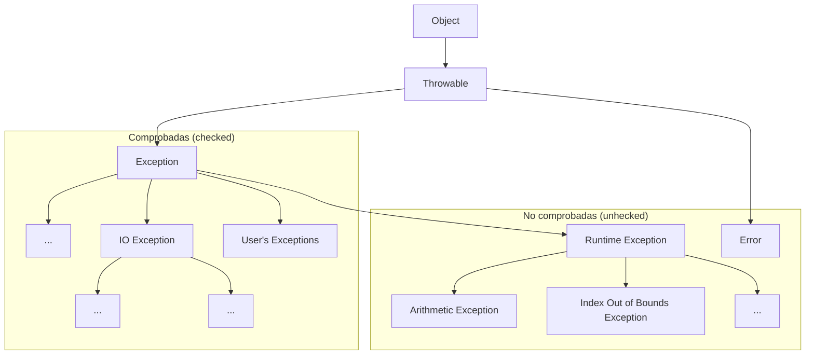

[toc]

# Introducción

En unidades anteriores has podido aprender cuestiones básicas sobre el lenguaje JAVA: definición de variables, tipos de datos, asignación de valores, uso de literales, diferentes operadores que se pueden aplicar, conversiones de tipos, inserción de comentarios, etc. Posteriormente, nos sumergimos de lleno en el mundo de los objetos. Primero hemos conocido su filosofía, para más tarde ir recorriendo los conceptos y técnicas más importantes relacionadas con ellos: Propiedades, métodos, clases, declaración y uso de objetos, librerías, etc.

Vale, parece ser que tenemos los elementos suficientes para comenzar a generar programas escritos en JAVA, ¿Seguro?

Como habrás deducido, con lo que sabemos hasta ahora no es suficiente. Existen múltiples situaciones que nuestros programas deben representar y que requieren tomar ciertas decisiones, ofrecer diferentes alternativas o llevar a cabo determinadas operaciones repetitivamente para conseguir sus objetivos.

Si has programado alguna vez o tienes ciertos conocimientos básicos sobre lenguajes de programación, sabes que la gran mayoría de lenguajes poseen estructuras que permiten a los programadores controlar el flujo de la información de sus programas. Esto realmente es una ventaja para la persona que está aprendiendo un nuevo lenguaje, o tiene previsto aprender más de uno, ya que estas estructuras suelen ser comunes a todos (con algunos cambios de sintaxis o conjunto de reglas que definen las secuencias correctas de los elementos de un lenguaje de programación.). Es decir, si conocías sentencias de control de flujo en otros lenguajes, lo que vamos a ver a lo largo de esta unidad te va a sonar bastante.

Para alguien que no ha programado nunca, un ejemplo sencillo le va a permitir entender qué es eso de las sentencias de control de flujo. Piensa en un fontanero (programador), principalmente trabaja con agua (datos) y se encarga de hacer que ésta fluya por donde él quiere (programa) a través de un conjunto de tuberías, codos, latiguillos, llaves de paso, etc. (sentencias de control de flujo).

Pues esas estructuras de control de flujo son las que estudiaremos, conoceremos su estructura, funcionamiento, cómo utilizarlas y dónde. A través de ellas, al construir nuestros programas podremos hacer que los datos (agua) fluyan por los caminos adecuados para representar la realidad del problema y obtener un resultado adecuado.

Los tipos de estructuras de programación que se emplean para el control del flujo de los datos son los siguientes:

- **Secuencia**: compuestas por 0, 1 o N sentencias que se ejecutan en el orden en que han sido escritas. Es la estructura más sencilla y sobre la que se construirán el resto de estructuras. 
- **Selección**: es un tipo de sentencia especial de decisión y de un conjunto de secuencias de instrucciones asociadas a ella. Según la evaluación de la sentencia de decisión se generará un resultado (que suele ser verdadero o falso) y en función de éste, se ejecutarán una secuencia de instrucciones u otra. Las estructuras de selección podrán ser simples, compuestas y múltiples.
- **Iteración**: es un tipo de sentencia especial de decisión y una secuencia de instrucciones que pueden ser repetidas según el resultado de la evaluación de la sentencia de decisión. Es decir, la secuencia de instrucciones se ejecutará repetidamente si la sentencia de decisión arroja un valor correcto, en otro la estructura de repetición se detendrá.

Además de las sentencias típicas de control de flujo, en esta unidad haremos una revisión de las sentencias de salto, que aunque no son demasiado recomendables, es necesario conocerlas. Como nuestros programas podrán generar errores y situaciones especiales, echaremos un vistazo al manejo de excepciones en JAVA. Posteriormente, analizaremos la mejor manera de llevar a cabo las pruebas de nuestros programas y la depuración de los mismos. Y finalmente, aprenderemos a valorar y utilizar las herramientas de documentación de programas.

# Sentencias y bloques

Este epígrafe lo utilizaremos para reafirmar cuestiones que son obvias y que en el transcurso de anteriores unidades se han dado por sabidas. Aunque, a veces, es conveniente recordar. Lo haremos como un conjunto de FAQs:

- **¿Cómo se escribe un programa sencillo?** Si queremos que un programa sencillo realice instrucciones o sentencias para obtener un determinado resultado, es necesario colocar éstas una detrás de la otra, exactamente en el orden en que deben ejecutarse.

- **¿Podrían colocarse todas las sentencias una detrás de otra, separadas por puntos y comas en una misma línea?**, claro que sí, pero no es muy recomendable. Cada sentencia debe estar escrita en una línea, de esta manera tu código será mucho más legible y la localización de errores en tus programas será más sencilla y rápida. De hecho, cuando se utilizan herramientas de programación, los errores suelen asociarse a un número o números de línea.

- **¿Puede una misma sentencia ocupar varias líneas en el programa?**, sí. Existen sentencias que, por su tamaño, pueden generar varias líneas. Pero siempre finalizarán con un punto y coma.

- **¿En Java todas las sentencias se terminan con punto y coma?**, Efectivamente. Si detrás de una sentencia ha de venir otra, pondremos un punto y coma. Escribiendo la siguiente sentencia en una nueva línea. Pero en algunas ocasiones, sobre todo cuando utilizamos estructuras de control de flujo, detrás de la cabecera de una estructura de este tipo no debe colocarse punto y coma. No te preocupes, lo entenderás cuando analicemos cada una de ellas.

- **¿Qué es la sentencia nula en Java?** La sentencia nula es una línea que no contiene ninguna instrucción y en la que sólo existe un punto y coma. Como su nombre indica, esta sentencia no hace nada.

- **¿Qué es un bloque de sentencias?** Es un conjunto de sentencias que se encierra entre llaves y que se ejecutaría como si fuera una única orden. Sirve para agrupar sentencias y para clarificar el código. Los bloques de sentencias son utilizados en Java en la práctica totalidad de estructuras de control de flujo, clases, métodos, etc. La siguiente tabla muestra dos formas de construir un bloque de sentencias.

  | Bloque de sentencias 1                           | Bloque de sentencias 2                                       |
  | ------------------------------------------------ | ------------------------------------------------------------ |
  | ```{sentencia1; sentencia2; ...; sentenciaN;}``` | `{`<br />    `sentencia1;`<br />    `sentencia2;`<br />    `...;`<br />    `sentenciaN;`<br />`}` |

- ¿En un bloque de sentencias, éstas deben estar colocadas con un orden exacto? En ciertos casos sí, aunque si al final de su ejecución se obtiene el mismo resultado, podrían ocupar diferentes posiciones en nuestro programa.

**DEBES CONOCER**
Observa los tres archivos que te ofrecemos a continuación y compara su código fuente. Verás que los tres obtienen el mismo resultado, pero la organización de las sentencias que los componen es diferente entre ellos.

Ejemplo 1:

```java
package organizacion_sentencias1;
/**
*
* Organización de sentencias secuencial
*/
public class Organizacion_sentencias_1 {
    public static void main(String[] args) {
        System.out.println ("Organización secuencial de sentencias");
        int dia=12;
        System.out.println ("El día es: " + dia);
        int mes=11;
        System.out.println ("El mes es: " + mes);
        int anio=2011;
        System.out.println ("El anio es: " + anio);
    }
}
```

En este primer archivo, las sentencias están colocadas en orden secuencial.

Ejemplo 2:

```java
package organizacion_sentencias2;
/**
*
* Organización de sentencias con declaración previa de variables
*/
public class Organizacion_sentencias_2 {
    public static void main(String[] args) {
        // Zona de declaración de variables
        int dia=10;
        int mes=11;
        int anio=2011;
        System.out.println ("Organización con declaración previa de variables");
        System.out.println ("El día es: " + dia);
        System.out.println ("El mes es: " + mes);
        System.out.println ("El anio es: " + anio);
    }
}
```

En este segundo archivo, se declaran al principio las variables necesarias. En Java no es imprescindible hacerlo así, pero sí que antes de utilizar cualquier variable ésta debe estar previamente declarada. Aunque la declaración de dicha variable puede hacerse en cualquier lugar de nuestro programa.

Ejemplo 3:

```java
package organizacion_sentencias3;
/**
*
* Organización de sentencias en zonas diferenciadas
* según las operaciones que se realicen en el código
*/
public class Organizacion_sentencias_3 {
    public static void main(String[] args) {
        // Zona de declaración de variables
        int dia;
        int mes;
        int anio;
        String fecha;
        //Zona de inicialización o entrada de datos
        dia=10;
        mes=11;
        anio=2011;
        fecha="";
        //Zona de procesamiento
        fecha=dia+"/"+mes+"/"+anio;
        //Zona de salida
        System.out.println ("Organización con zonas diferenciadas en el código");
        System.out.println ("La fecha es: " + fecha);
    }
}
```

En este tercer archivo, podrás apreciar que se ha organizado el código en las siguientes partes: declaración de variables, petición de datos de entrada, procesamiento de dichos datos y obtención de la salida. Este tipo de organización está más estandarizada y hace que nuestros programas ganen en legibilidad.

> Construyas de una forma o de otra tus programas, debes tener en cuenta siempre en Java las siguientes premisas:
>
> - Declara cada variable antes de utilizarla.
> - Inicializa con un valor cada variable la primera vez que la utilices.
> - No es recomendable usar variables no inicializadas en nuestros programas, pueden provocar errores o resultados imprevistos.

# Estructuras de selección

¿Cómo conseguimos que nuestros programas puedan tomar decisiones? Para comenzar, lo haremos a través de las estructuras de selección. Estas estructuras constan de una sentencia especial de decisión y de un conjunto de secuencias de instrucciones.

El funcionamiento es sencillo, la sentencia de decisión será evaluada y ésta devolverá un valor (verdadero o falso), en función del valor devuelto se ejecutará una secuencia de instrucciones u otra.

Por ejemplo, si el valor de una variable es mayor o igual que 5 se imprime por pantalla la palabra APROBADO y si es menor, se imprime SUSPENSO. Para este ejemplo, la comprobación del valor de la variable será la sentencia especial de decisión. La impresión de la palabra APROBADO será una secuencia de instrucciones y la impresión de la palabra SUSPENSO será otra. Cada secuencia estará asociada a cada uno de los resultados que puede arrojar la evaluación de la sentencia especial de decisión.
Las estructuras de selección se dividen en:

1. Estructuras de selección simples o estructura if.
2. Estructuras de selección compuesta o estructura if­else.
3. Estructuras de selección basadas en el operador condicional.
4. Estructuras de selección múltiples o estructura switch.

A continuación, detallaremos las características y funcionamiento de cada una de ellas. Es importante que a través de los ejemplos que vamos a ver, puedas determinar en qué circunstancias utilizar cada una de estas estructuras. Aunque un mismo problema puede ser resuelto con diferentes estructuras e incluso, con diferentes combinaciones de éstas.

## Estructura `if`, `if ­else`, `if else if`

La estructura `if` es una estructura de selección o estructura condicional, en la que se evalúa una expresión lógica o sentencia de decisión y en función del resultado, se ejecuta una sentencia o un bloque de éstas.
La estructura `if` puede presentarse de las siguientes formas:

**Estructura `if` simple:**

```java
if (expresión-lógica)
    sentencia1;
```
```java
if (expresión-lógica)
{
    sentencia1;
    sentencia2;
    ...;
    sentenciaN;
}
```

Si la evaluación de la expresión‐lógica ofrece un resultado verdadero, se ejecuta la sentencia1 o bien el bloque de sentencias asociado. Si el resultado de dicha evaluación es falso, no se ejecutará ninguna instrucción asociada a la estructura condicional.

**Estructura `if` de doble alternativa.**

```java
if (expresión-lógica)
	sentencia1;
else
	sentencia2;
sentencia3;
```

```java
if (expresión-lógica){
    sentencia1;
    ...;
    sentenciaN;
} else {
    sentencia1;
    ...;
    sentenciaN;
}
```

Si la evaluación de la expresión‐lógica ofrece un resultado  verdadero, se ejecutará la primera sentencia o el primer bloque de sentencias. Si, por el contrario, la evaluación de la expresión‐lógica ofrece un resultado falso, no se ejecutará la primera sentencia o el  primer bloque y sí se ejecutará la segunda sentencia o el segundo bloque.

> ### Haciendo una interpretación cercana al pseudocódigo tendríamos que si se cumple la condición (expresión lógica), se ejecutará un conjunto de instrucciones y si no se cumple, se ejecutará otro conjunto de instrucciones. 

Hay que tener en cuenta que la cláusula `else` de la sentencia `if` no es obligatoria. En algunos casos no necesitaremos utilizarla, pero sí se recomienda cuando es necesario llevar a cabo alguna acción en el caso de que la expresión lógica no se cumpla.

En aquellos casos en los que no existe cláusula `else`, si la expresión lógica es falsa, simplemente se continuarán ejecutando las siguientes sentencias que aparezcan bajo la estructura condicional `if`.

Los condicionales `if` e `if-else` pueden anidarse, de tal forma que dentro de un bloque de sentencias puede incluirse otro `if` o `if-else`. El nivel de anidamiento queda a criterio del programador, pero si éste es demasiado profundo podría provocar problemas de eficiencia y legibilidad en el código. En otras ocasiones, un nivel de anidamiento excesivo puede denotar la necesidad de utilización de otras estructuras de selección más adecuadas.

Cuando se utiliza anidamiento de este tipo de estructuras, es necesario poner especial atención en saber a qué `if` está asociada una cláusula `else`. Normalmente, un `else` estará asociado con el `if` inmediatamente superior o más cercano que exista dentro del mismo bloque y que no se encuentre ya asociado a otro `else`.

**Estructura `if else if`.**

Esta estructura es una alternativa a la anidación de sentencias `if else` funciona de modo que si se cumple una condición ejecuta unas sentencias y el caso contrario comprueba otra condición ejecutando unas sentencias si se cumple y así sucesivamente. Veamos un ejemplo con `if` anidados:

```java
if (condicion1) {
    sentencias1;
} else {
    if (condicion2) {
        sentencias2;
    } else {
        if (condicion3) {
            sentencias3;
        } else {
            sentencias4;
        }
    }
}
```

El mismo ejemplo usando `if else if` quedaría de este modo:

```java
if (condicion1) {
    sentencias1;
} else if (condicion2) {
    sentencias2;
} else if (condicion3) {
    sentencias3;
} else {
    sentencias4;
}
```

## Estructura `switch`

¿Qué podemos hacer cuando nuestro programa debe elegir entre más de dos alternativas?, una posible solución podría ser emplear estructuras if anidadas, aunque no siempre esta solución es la más eficiente. Cuando estamos ante estas situaciones podemos utilizar la estructura de selección múltiple switch. En la siguiente tabla se muestra tanto la sintaxis, como el funcionamiento de esta estructura.

**Sintaxis:**

```java
switch (expresion) {
    case valor1:
        sentencia1_1;
        sentencia1_2;
        ....
        break;
    case valor2:
        ....
    case valorN:
        sentenciaN_1;
        sentenciaN_2;
        ....
        break;
    default:
    	sentencias-default;
}
```

**Condiciones:**

- Donde expresión debe ser del tipo `char`, `byte`, `short` o `int`, y las constantes de cada `case` deben ser de este tipo o de un tipo compatible.
- La `expresion` debe ir entre paréntesis.
- Cada `case` llevará asociado un `valor` y se finalizará con dos puntos (`:`).
- El bloque de sentencias asociado a la cláusula `default` puede finalizar con una sentencia de ruptura `break` o no.

**Funcionamiento:**

- Las diferentes alternativas de esta estructura estarán precedidas de la cláusula case que se ejecutará cuando el valor asociado al case coincida con el valor obtenido al evaluar la expresión del switch.
- En las cláusulas case, no pueden indicarse expresiones condicionales, rangos de valores o listas de valores. (otros lenguajes de programación sí lo permiten). Habrá que asociar una cláusula case a cada uno de los valores que deban ser tenidos en cuenta.
- La cláusula default será utilizada para indicar un caso por defecto, las sentencias asociadas a la cláusula default se ejecutarán si ninguno de los valores indicados en las cláusulas case coincide con el resultado de la evaluación de la expresión de la estructura switch.
- La cláusula default puede no existir, y por tanto, si ningún case ha sido activado finalizaría el switch.
- Cada cláusula case puede llevar asociadas una o varias sentencias, sin necesidad de delimitar dichos bloques por medio de llaves.
- En el momento en el que el resultado de la evaluación de la expresión coincide con alguno de los valores asociados a las cláusulas case, se ejecutarán todas las instrucciones asociadas hasta la aparición de una sentencia break de ruptura. (la sentencia break se analizará en epígrafes posteriores)

### Expresiones switch mejoradas

En las [novedades de Java 12](https://picodotdev.github.io/blog-bitix/2019/03/novedades-de-java-12/) se añadió la posibilidad de los switch fueran expresiones que retornan un valor en vez de sentencias y se evita el uso de la palabra reservada break.

```java
int entero = 5;

String numericString = switch (entero) {
    case 0 -> "cero";
    case 1, 3, 5, 7, 9 -> "impar";
    case 2, 4, 6, 8, 10 -> "par";
    default -> "error";
};
System.out.println(numericString); //impar
```

En Java 13 en vez de únicamente el valor a retornar se permite crear bloques de sentencias para cada rama case y retornar el valor con la palabra reservada `yield`. En los bloques de sentencias puede haber algún cálculo más complejo que directamente retornar el valor deseado.

```java
int entero2 = 4;

String numericString2 = switch (entero2) {
    case 0 -> {
        String value = calculaCero();
        yield value;
    }
    case 1, 3, 5, 7, 9 -> {
        String value = calculaImpar();
        yield value;
    }

    case 2, 4, 6, 8, 10 -> {
        String value = calculaPar();
        yield value;
    }

    default -> {
        String value = calculaDefecto();
        yield value;
    }
};
System.out.println(numericString); //calculaPar()
```

En resumen, se ha de comparar el valor de una expresión con un conjunto de constantes, si el valor de la expresión coincide con algún valor de dichas constantes, se ejecutarán los bloques de instrucciones asociados a cada una de ellas. Si no existiese coincidencia, se ejecutarían una serie de instrucciones por defecto.

# Estructuras de repetición

Nuestros programas ya son capaces de controlar su ejecución teniendo en cuenta determinadas condiciones, pero aún hemos de aprender un conjunto de estructuras que nos permita repetir una secuencia de instrucciones determinada. La función de estas estructuras es repetir la ejecución de una serie de instrucciones teniendo en cuenta una condición.

A este tipo de estructuras se las denomina estructuras de repetición, estructuras repetitivas, bucles o estructuras iterativas. En Java existen cuatro clases de bucles:

- Bucle `for` (repite para)
- Bucle `for/in` (repite para cada)
- Bucle `while` (repite mientras)
- Bucle `do while` (repite hasta)

Los bucles `for` y `for/in` se consideran bucles controlados por contador. Por el contrario, los bucles `while` y `do...while` se consideran bucles controlados por sucesos.

La utilización de unos bucles u otros para solucionar un problema dependerá en gran medida de las siguientes preguntas:

- ¿Sabemos a priori cuántas veces necesitamos repetir un conjunto de instrucciones?
- ¿Sabemos si hemos de repetir un conjunto de instrucciones si una condición satisface un conjunto de valores?
- ¿Sabemos hasta cuándo debemos estar repitiendo un conjunto de instrucciones?
- ¿Sabemos si hemos de estar repitiendo un conjunto de instrucciones mientras se cumpla una condición?

Estas y otras preguntas tendrán su respuesta en cuanto analicemos cada una de estructuras repetitivas en detalle.

> ### Estudia cada tipo de estructura repetitiva, conoce su funcionamiento y podrás llegar a la conclusión de que algunos de estos bucles son equivalentes entre sí. Un mismo problema, podrá ser resuelto empleando diferentes tipos de bucles y obtener los mismos resultados. 

## Estructura `for`

Hemos indicado anteriormente que el bucle `for` es un bucle controlado por contador. Este tipo de bucle tiene las siguientes características:

- Se ejecuta un número determinado de veces.
- Utiliza una variable contadora que controla las iteraciones del bucle.

En general, existen tres operaciones que se llevan a cabo en este tipo de bucles:

- Se inicializa la variable contadora.
- Se evalúa el valor de la variable contador, por medio de una comparación de su valor con el número de iteraciones especificado.
- Se modifica o actualiza el valor del contador a través de incrementos o decrementos de éste, en cada una de las iteraciones.

> ### La inicialización de la variable contadora debe realizase correctamente para garantizar que el bucle lleve a cabo, al menos, la primera repetición de su código interno.
>
> La condición de terminación del bucle debe variar en el interior del mismo, de no ser así, podemos caer en la creación de un bucle infinito. Cuestión que se debe evitar por todos los medios.
> Es necesario estudiar el número de veces que se repite el bucle, pues debe ajustarse al número de veces estipulado.

Sintaxis estructura `for` con una única sentencia:

```java
for (inicialización; condición; iteración)
	sentencia;
```

Sintaxis estructura `for` con un bloque de sentencias:

```java
for (inicialización; condición; iteración) {
	sentencia1;
 	sentencia2;
 	...
	sentenciaN;
}
```

Donde...:

- `inicialización` es una expresión en la que se inicializa una variable de control, que será la encargada de controlar el final del bucle.
- `condición` es una expresión que evaluará la variable de control. Mientras la  condición sea falsa, el cuerpo del bucle estará repitiéndose. Cuando la condición se  cumpla, terminará la ejecución del bucle.
- `iteración` indica la manera en la que la variable de control va cambiando en cada iteración del bucle.  Podrá ser mediante incremento o decremento, y no solo de uno en uno.

## Estructura `for`/`in`

Junto a la estructura `for`, `for`/`in` también se considera un bucle controlado por contador. Este bucle es una mejora incorporada en la versión 5.0 de Java. 

Este tipo de bucles permite realizar recorridos sobre arrays y colecciones de objetos. Los arrays son colecciones de variables que tienen el mismo tipo y se referencian por un nombre común. Así mismo, las colecciones de objetos son objetos que se dice son iterables, o que se puede iterar sobre ellos.

Este bucle es nombrado también como bucle `for` mejorado, o bucle `foreach`. En otros lenguajes de programación existen bucles muy parecidos a este.

La sintaxis es la siguiente:

```java
for (declaración: expresión) {
    sentencia1;
    ...
    sentenciaN;
}
```

Donde...:

- `expresion` es un array o una colección de objetos.
- `declaración` es la declaración de una variable cuyo tipo sea compatible con expresión. Normalmente, será el tipo y el nombre de la variable a declarar.

El funcionamiento consiste en que para cada elemento de la expresión, guarda el elemento en la variable declarada y haz las instrucciones contenidas en el bucle. Después, en cada una de las iteraciones del bucle tendremos en la variable declarada el elemento actual de la expresión. Por tanto, para el caso de los arrays y de las colecciones de objetos, se recorrerá desde el primer elemento que los forma hasta el último.

Observa el contenido del código representado en la siguiente imagen, puedes apreciar cómo se construye un bucle de este tipo y su utilización sobre un array.

Los bucles `for`/`in` permitirán al programador despreocuparse del número de veces que se ha de iterar, pero no sabremos en qué iteración nos encontramos salvo que se añada artificialmente alguna variable contadora que nos pueda ofrecer esta información.

> ### Esta estructura tomará sentido cuando avancemos en el curso y veamos los Arrays y las colecciones de Objetos.

## Estructura `while`

El bucle `while` es la primera de las estructuras de repetición controladas por sucesos que vamos a estudiar. La utilización de este bucle responde al planteamiento de la siguiente pregunta: ¿Qué podemos hacer si lo único que sabemos es que se han de repetir un conjunto de instrucciones mientras se cumpla una determinada condición?.

La característica fundamental de este tipo de estructura repetitiva estriba en ser útil en aquellos casos en los que las instrucciones que forman el cuerpo del bucle podría ser necesario ejecutarlas o no. Es decir, en el bucle `while` siempre se evaluará la condición que lo controla, y si dicha condición es cierta, el cuerpo del bucle se ejecutará una vez, y se seguirá ejecutando mientras la condición sea cierta. Pero si en la evaluación inicial de la condición ésta no es verdadera, el cuerpo del bucle no se ejecutará.

> ### Es imprescindible que en el interior del bucle `while` se realice alguna acción que modifique la condición que controla la ejecución del mismo, en caso contrario estaríamos ante un bucle infinito.

Sintaxis estructura `while` con una única sentencia:

```java
while (condición)
	sentencia;
```

Sintaxis estructura `while` con un bloque de sentencias:

```java
while (condición) {
    sentencia1;
    ...
    sentenciaN;
}
```

**Funcionamiento:**
Mientras la condición sea cierta, el bucle se repetirá, ejecutando la/s instrucción/es de su interior.

En el momento en el que la condición no se cumpla, el control del flujo del programa pasará a la siguiente instrucción que exista justo detrás del bucle `while`.

La condición se evaluará siempre al principio, y podrá darse el caso de que las instrucciones contenidas en él no lleguen a ejecutarse nunca si no se satisface la condición de partida.

## Estructura `do­ while`

La segunda de las estructuras repetitivas controladas por sucesos es `do­ while`. En este caso, la pregunta que nos planteamos es la siguiente: ¿Qué podemos hacer si lo único que sabemos es que se han de ejecutar, al menos una vez, un conjunto de instrucciones y seguir repitiéndose hasta que se cumpla una determinada condición?.

La característica fundamental de este tipo de estructura repetitiva estriba en ser útil en aquellos casos en los que las instrucciones que forman el cuerpo del bucle necesitan ser ejecutadas, al menos, una vez y repetir su ejecución hasta que la condición sea verdadera. Por tanto, en esta estructura repetitiva siempre se ejecuta el cuerpo del bucle una primera vez.

Es imprescindible que en el interior del bucle se realice alguna acción que modifique la condición que controla la ejecución del mismo, en caso contrario estaríamos ante un bucle infinito.

Sintaxis estructura `while` con una única sentencia:

```java
do
	sentencia;
while (condición);
```

Sintaxis estructura `while` con un bloque de sentencias:

```java
do {
	sentencia1;
	...
	sentenciaN;
} while (condición);
```

**Funcionamiento:**

El cuerpo del bucle se ejecuta la primera vez, a continuación se evaluará la condición y, si ésta es falsa, el cuerpo el bucle volverá a repetirse. El bucle finalizará cuando la evaluación de la condición sea verdadera. 

En ese momento el control del flujo del programa pasará a la siguiente instrucción que exista justo detrás del bucle do‐while. La condición se evaluará siempre después de una primera ejecución del cuerpo del bucle, por lo que no se dará el caso de que las instrucciones contenidas en él no lleguen a ejecutarse nunca.


## Bucle infinito

Uno de los errores más comunes al implementar cualquier tipo de bucle es que nunca pueda salir, es decir, el bucle se ejecuta durante un número infinito de veces.

Podemos provocarlo intencionadamente como en estos dos ejemplos equivalentes (**NO RECOMENDABLE**):

```java
for(;;){
    //sentencias
}
```

```java
while(true){
    //sentencias
}
```

O sucede cuando la condición falla por alguna razón, como en el siguiente ejemplo:

```java
//Programa Java para ilustrar varias trampas de bucles.
public class BucleInfinito{
    
    public static void main(String[] args)
    {
        // bucle infinito porque la condición no es apta
        // la condición; debería haber sido i>0.
        for (int i = 5; i != 0; i -= 2)
        {
            System.out.println(i);
        }

        int x = 5; 
        // bucle infinito porque la actualización
        // no se proporciona
        while (x == 5)
        {
            System.out.println("En el bucle");
        }
    }
}
```

Otro inconveniente es que puede estar agregando algo en su objeto de colección a través de un bucle y puede **quedarse sin memoria**. Si intenta ejecutar el siguiente programa, después de un tiempo, se producirá una excepción de falta de memoria. En este ejemplo se hace uso de la colección ArrayList, pero de momento solo necesitamos saber que se comporta como un casillero al que vamos asignando elementos (que evidentemente ocupan memoria)

```java
//Programa Java para la excepción de falta de memoria.
import java.util.ArrayList;
public class HeapSpace
{
    public static void main(String[] args)
    {
        ArrayList<Integer> ar = new ArrayList<>();
        for (int i = 0; i < Integer.MAX_VALUE; i++)
        {
            ar.add(i);
        }
    }
}
```

Salida:

```sh
Exception in thread "main" java.lang.OutOfMemoryError: Java heap space
at java.util.Arrays.copyOf(Unknown Source)
at java.util.Arrays.copyOf(Unknown Source)
at java.util.ArrayList.grow(Unknown Source)
at java.util.ArrayList.ensureCapacityInternal(Unknown Source)
at java.util.ArrayList.add(Unknown Source)
at article.Integer1.main(Integer1.java:9)
```

# Estructuras de salto

¿Saltar o no saltar? he ahí la cuestión. En la gran mayoría de libros de programación y publicaciones de Internet, siempre se nos recomienda que prescindamos de sentencias de salto incondicional, es más, se desaconseja su uso por provocar una mala estructuración del código y un incremento en la dificultad para el mantenimiento de los mismos. Pero Java incorpora ciertas sentencias o estructuras de salto que es necesario conocer y que pueden sernos útiles en algunas partes de nuestros programas.

Estas estructuras de salto corresponden a las sentencias `break`, `continue`, las etiquetas de salto y la sentencia `return`. Pasamos ahora a analizar su sintaxis y funcionamiento.

## Sentencias `break` y `continue`

Se trata de dos instrucciones que permiten modificar el comportamiento de otras estructuras o sentencias de control, simplemente por el hecho de estar incluidas en algún punto de su secuencia de instrucciones.

La sentencia `break` incidirá sobre las estructuras de control `switch`, `while`, `for` y `do­ while` del siguiente modo:

- Si aparece una sentencia `break` dentro de la secuencia de instrucciones de cualquiera de las estructuras mencionadas anteriormente, dicha estructura terminará inmediatamente. 
- Si aparece una sentencia `break` dentro de un bucle anidado sólo finalizará la sentencia de iteración más interna, el resto se ejecuta de forma normal.

Es decir, que `break` sirve para romper el flujo de control de un bucle, aunque no se haya cumplido la condición del bucle. Si colocamos un `break` dentro del código de un bucle, cuando se alcance el `break`, automáticamente se saldrá del bucle pasando a ejecutarse la siguiente instrucción inmediatamente después de él.

La sentencia `continue` incidirá sobre las sentencias o estructuras de control `while`, `for` y `do while` del siguiente modo:

- Si aparece una sentencia `continue` dentro de la secuencia de instrucciones de cualquiera de las sentencias anteriormente indicadas, dicha sentencia dará por terminada la iteración actual y se ejecuta una nueva iteración, evaluando de nuevo la expresión condicional del bucle.
- Si aparece en el interior de un bucle anidado solo afectará a la sentencia de iteración más interna, el resto se ejecutaría de forma normal.

Es decir, la sentencia `continue` forzará a que se ejecute la siguiente iteración del bucle, sin tener en cuenta las instrucciones que pudiera haber después del `continue`, y hasta el final del código del bucle.

## Etiquetas de salto

> ### Los saltos incondicionales y en especial, saltos a una etiqueta son totalmente **desaconsejables**.

Java permite asociar etiquetas cuando se va a realizar un salto. De este modo puede conseguirse algo más de legibilidad en el código.

Las estructuras de salto `break` y `continue`, pueden tener asociadas etiquetas. Es a lo que se llama un `break` etiquetado o un `continue` etiquetado. Pero sólo se recomienda su uso cuando se hace necesario salir de bucles anidados hacia diferentes niveles.
¿Y cómo se crea un salto a una etiqueta? En primer lugar, crearemos la etiqueta mediante un identificador seguido de dos puntos (`:`). A continuación, se escriben las sentencias Java asociadas a dicha etiqueta encerradas entre llaves. Por así decirlo, la creación de una etiqueta es como fijar un punto de salto en el programa para poder saltar a él desde otro lugar de dicho programa.

¿Cómo se lleva a cabo el salto? Es sencillo, en el lugar donde vayamos a colocar la sentencia `break` o `continue`, añadiremos detrás el identificador de la etiqueta. Con ello, conseguiremos que el salto se realice a un lugar determinado.

La sintaxis será:

```java
break <etiqueta>;
```

> ## Quizá a aquellos/as que han programado en HTML les suene esta herramienta, ya que tiene cierta similitud con las anclas que pueden crearse en el interior de una página web, a las que nos llevará el hiperenlace o link que hayamos asociado.
>
> También para aquellos/as que han creado alguna vez archivos por lotes o archivos batch bajo MSDOS es probable que también les resulte familiar el uso de etiquetas, pues la sentencia GOTO que se utilizaba en este tipo de archivos, hacía saltar el flujo del programa al lugar donde se ubicaba la etiqueta que se indicara en dicha sentencia.

## `return`

Ya sabemos cómo modificar la ejecución de bucles y estructuras condicionales múltiples, pero ¿Podríamos modificar la ejecución de un método? ¿Es posible hacer que éstos detengan su ejecución antes de que finalice el código asociado a ellos?. Sí es posible, a través de la sentencia return podremos conseguirlo.
La sentencia `return` puede utilizarse de dos formas:

- Para terminar la ejecución del método donde esté escrita, con lo que transferirá el control al punto desde el que se hizo la llamada al método, continuando el programa por la sentencia inmediatamente posterior.
- Para devolver o retornar un valor, siempre que junto a `return` se incluya una expresión de un tipo determinado. Por tanto, en el lugar donde se invocó al método se obtendrá el valor resultante de la evaluación de la expresión que acompañaba al método.

En general, una sentencia `return` suele aparecer al final de un método, de este modo el método tendrá una entrada y una salida. También es posible utilizar una sentencia `return` en cualquier punto de un método, con lo que éste finalizará en el lugar donde se encuentre dicho `return`. No será recomendable incluir más de un `return` en un método y por regla general, deberá ir al final del método como hemos comentado.

El valor de retorno es opcional, si lo hubiera debería de ser del mismo tipo o de un tipo compatible al tipo del valor de retorno definido en la cabecera del método, pudiendo ser desde un entero a un objeto creado por nosotros. Si no lo tuviera, el tipo de retorno sería `void`, y `return` serviría para salir del método sin necesidad de llegar a ejecutar todas las instrucciones que se encuentran después del `return`.

# Excepciones

A lo largo de nuestro aprendizaje de Java nos hemos topado en alguna ocasión con errores, pero éstos suelen ser los que nos ha indicado el compilador. Un punto y coma por aquí, un nombre de variable incorrecto por allá, pueden hacer que nuestro compilador nos avise de estos descuidos.

Cuando los vemos, se corrigen y obtenemos nuestra clase compilada correctamente. 

Pero, ¿Sólo existen este tipo de errores? ¿Podrían existir errores no sintácticos en nuestros programas?. Está claro que sí, un programa perfectamente compilado en el que no existen errores de sintaxis, puede generar otros tipos de errores que quizá aparezcan en tiempo de ejecución. A estos errores se les conoce como **excepciones**.

Aprenderemos a gestionar de manera adecuada estas excepciones y tendremos la oportunidad de utilizar el potente sistema de manejo de errores que Java incorpora. La potencia de este sistema de manejo de errores radica en:

1. Que el código que se encarga de manejar los errores, es perfectamente identificable en los programas. Este código puede estar separado del código que maneja la aplicación.
2. Que Java tiene una gran cantidad de errores estándar asociados a multitud de fallos comunes, como por ejemplo divisiones por cero, fallos de entrada de datos, etc. Al tener tantas excepciones localizadas, podemos gestionar de manera específica cada uno de los errores que se produzcan.

En Java se pueden preparar los fragmentos de código que pueden provocar errores de ejecución para que si se produce una excepción, el flujo del programa es lanzado (`throw`) hacia ciertas zonas o rutinas que han sido creadas previamente por el programador y cuya finalidad será el tratamiento efectivo de dichas excepciones. Si no se captura la excepción, el programa se detendrá con toda probabilidad.

En Java, las excepciones están representadas por clases. El paquete `java.lang.Exception` y sus subpaquetes contienen todos los tipos de excepciones. Todas las excepciones derivarán de la clase `Throwable`, existiendo clases más específicas. Por debajo de la clase `Throwable` existen las clases `Error` y `Exception`. Error es una clase que se encargará de los errores que se produzcan en la máquina virtual, no en nuestros programas. Y la clase `Exception` será la que a nosotros nos interese conocer, pues gestiona los errores provocados en los programas.

Java lanzará una excepción en respuesta a una situación poco usual. Cuando se produce un error se genera un objeto asociado a esa excepción. Este objeto es de la clase `Exception` o de alguna de sus herederas. Este objeto se pasa al código que se ha definido para manejar la excepción. Dicho código puede manipular las propiedades del objeto `Exception`.

El programador también puede lanzar sus propias excepciones. Las excepciones en Java serán objetos de clases derivadas de la clase base `Exception`. Existe toda una jerarquía de clases derivada de la clase base `Exception`. Estas clases derivadas se ubican en dos grupos principales:

- Las excepciones en tiempo de ejecución, que ocurren cuando el programador no ha tenido cuidado al escribir su código.
- Las excepciones que indican que ha sucedido algo inesperado o fuera de control.

En la siguiente imagen te ofrecemos una aproximación a la jerarquía de las excepciones en Java.



Y aquí tenemos una lista de las más habituales con su explicación:

| **NOMBRE**                         | DESCRIPCIÓN                                   |
| ---------------------------------- | ------------------------------------------------------------ |
| **FileNotFoundException**| Lanza una excepción cuando el fichero no se encuentra. |
| **ClassNotFoundException**| Lanza una excepción cuando no existe la clase.|
| **EOFException**| Lanza una excepción cuando llega al final del fichero. |
| **ArrayIndexOutOfBoundsException**| Lanza una excepción cuando se accede a una posición de un array que no exista. |
| **NumberFormatException**| Lanza una excepción cuando se procesa un numero pero este es un dato alfanumérico. |
| **NullPointerException**| Lanza una excepción cuando intentando acceder a un miembro de un objeto para el que todavía no hemos reservado memoria. |
| **IOException**| Generaliza muchas excepciones anteriores. La ventaja es que no necesitamos controlar cada una de las excepciones. |
| **Excepcion**| Es la clase padre de IOException y de otras clases. Tiene la misma ventaja que IOException. |
| **ArithmeticException** | Se lanza por ejemplo, cuando intentamos dividir un número entre cero. |

## Capturar una excepción

Para poder capturar excepciones, emplearemos la estructura de captura de excepciones `try‐catch‐finally`.
Básicamente, para capturar una excepción lo que haremos será declarar bloques de código donde es posible que ocurra una excepción. Esto lo haremos mediante un bloque try (intentar). Si ocurre una excepción dentro de estos bloques, se lanza una excepción. Estas excepciones lanzadas se pueden capturar por medio de bloques catch. Será dentro de este tipo de bloques donde se hará el manejo de las excepciones.

Su sintaxis es:

```java
try {
	código que puede generar excepciones;
} catch (Tipo_excepcion_1 objeto_excepcion) {
	Manejo de excepción de Tipo_excepcion_1;
} catch (Tipo_excepcion_2 objeto_excepcion) {
	Manejo de excepción de Tipo_excepcion_2;
}
...
finally {
	instrucciones que se ejecutan siempre
}
```

En esta estructura, la parte `catch` puede repetirse tantas veces como excepciones diferentes se deseen capturar. La parte `finally` es opcional y, si aparece, solo podrá hacerlo una sola vez.

Cada `catch` maneja un tipo de excepción. Cuando se produce una excepción, se busca el `catch` que posea el manejador de excepción adecuado, será el que utilice el mismo tipo de excepción que se ha producido. Esto puede causar problemas si no se tiene cuidado, ya que la clase `Exception` es la superclase de todas las demás. Por lo que si se produjo, por ejemplo, una excepción de tipo `Aritmethic Exception` y el primer `catch` captura el tipo genérico `Exception`, será ese `catch` el que se ejecute y no los demás.

Por eso el último `catch` debe ser el que capture excepciones genéricas y los primeros deben ser los más específicos. Lógicamente si vamos a tratar a todas las excepciones (sean del tipo que sean) igual, entonces basta con un solo `catch` que capture objetos `Exception`.

## El manejo de excepciones

Como hemos comentado, siempre debemos controlar las excepciones que se puedan producir o de lo contrario nuestro software quedará expuesto a fallos. Las excepciones pueden tratarse de dos formas:

- **Interrupción**. En este caso se asume que el programa ha encontrado un error irrecuperable. La operación que dio lugar a la excepción se anula y se entiende que no hay manera de regresar al código que provocó la excepción. Es decir, la operación que dio originó el error, se anula.
- **Reanudación**. Se puede manejar el error y regresar de nuevo al código que provocó el error.

Java emplea la primera forma, pero puede simularse la segunda mediante la utilización de un bloque `try` en el interior de un `while`, que se repetirá hasta que el error deje de existir. En la sección de ejemplos de puedes ver como poner el `try-catch` dentro de un `do while`.

## Delegación de excepciones con `throws`

¿Puede haber problemas con las excepciones al usar llamadas a métodos en nuestros programas? Efectivamente, si se produjese una excepción es necesario saber quién será el encargado de solucionarla. Puede ser que sea el propio método llamado o el código que hizo la llamada a dicho método.

Quizá pudiéramos pensar que debería ser el propio método el que se encargue de sus excepciones, aunque es posible hacer que la excepción sea resuelta por el código que hizo la llamada. Cuando un método utiliza una sentencia que puede generar una excepción, pero dicha excepción no es capturada y tratada por él, sino que se encarga su gestión a quién llamó al método, decimos que se ha producido delegación de excepciones.

Para establecer esta delegación, en la cabecera del método se declara el tipo de excepciones que puede generar y que deberán ser gestionadas por quien invoque a dicho método. Utilizaremos para ello la sentencia `throws` y tras esa palabra se indica qué excepciones puede provocar el código del método. Si ocurre una excepción en el método, el código abandona ese método y regresa al código desde el que se llamó al método. Allí se buscará el `catch` apropiado para esa excepción. Su sintaxis es la siguiente:

```java
public class Delegacion_Excepciones {
	...
	public int leeAnio(BufferedReader lector) throws IOException, NumberFormatException{
		String linea = teclado.readLine();
        return Integer.parseInt(linea);
	}
	...
}
```

Donde `IOException` y `NumberFormatException`, serían dos posibles excepciones que el método `leeAnio` podría generar, pero que no gestiona. Por tanto, un método puede incluir en su cabecera un listado de excepciones que puede lanzar, separadas por comas.

## Excepciones comprobadas y no comprobadas

Existen dos grupos de excepciones: **comprobadas** y **no comprobadas** (Observa la figura del apartado “Jerarquía de excepciones”

- Excepciones **comprobadas**, verificadas (o checked):

  - Su tratamiento es obligatorio y el compilador comprueba que se haga. Es necesario capturarlas (con `try-catch`) o propagarlas (con `throws`), de lo contrario se produce error de compilación.
  - Son excepciones que un programa bien escrito debería prever, tratar y recuperarse de ellas.
  - Supongamos por ejemplo que nuestro programa va a leer y mostrar por pantalla el contenido de un fichero cuyo nombre indica el usuario. En la mayoría de ocasiones el usuario indicará el nombre de un fichero existente y válido y el programa lo mostrará, pero es posible que en alguna ocasión el usuario se equivoque e indique el nombre de un fichero que no existe. En tal caso se producirá una excepción `FileNotFoundException`. El programa debería ser capaz de manejar la situación, informar al usuario y permitirle, si se estima oportuno, que introduzca un nombre de fichero válido.
  - Son comprobadas las derivadas de `java.lang.IOException` y las excepciones de usuario (que trataremos más adelante)

- Excepciones **no** **comprobadas**, no verificadas (o `unchecked`):

  - Su tratamiento no es obligatorio y el compilador obliga a que se utilice un bloque `try-catch` o a que se anuncie su propagación usando `throws`. Aunque no es obligatorio, puede hacerse si se estima conveniente.

  - Son excepciones que suelen producirse porque nuestro programa contiene algún error. Es por eso que no se comprueban, pues el objetivo no es recuperarse de ellas, sino avisarnos de que estamos tratando de realizar alguna operación no posible. La solución no pasa por capturarlas, sino por modificar el programa.

  - Siguiendo con el ejemplo anterior, supongamos que el usuario introduce un nombre de fichero correcto pero, por algún error en nuestro programa, al método encargado de leer el fichero en lugar de llegarle el nombre le llega el valor `null`. En ese caso se producirá un `NullPointerException`.

    No tiene demasiado sentido capturar la excepción, puesto que se produce porque el programa contiene algún error que hay que subsanar.

  - Son no comprobadas las clases derivadas de `java.lang.Error` y de `java.lang.RuntimeException`  	

## Crear y lanzar excepciones de usuario

Las excepciones de usuario son subclases de la clase `Exception` que podemos crear y lanzar en nuestros programas para avisar sobre determinadas situaciones.

### Crear una nueva excepción

Para crear una nueva excepción tenemos que crear una clase derivada (subclase) de la clase `Exception`. 

La clase `Exception` tiene dos constructores, uno sin parámetros y otro que acepta un `String` con un texto descriptivo de la excepción. Todas las excepciones de usuario las crearemos de la siguiente forma:

```java
class NombreExcepcion extends Exception {
	public NombreExcepcion(){
        super();
    }
	public NombreExcepcion(String msg){
        super(msg);
    }
}
```

### Lanzar una excepción

Las excepciones se lanzan mediante la instrucción `throw`. La sintaxis es:

```java
throw new NombreExcepcion("Mensaje descriptivo de la situación inesperada");
```

Ya que se tratará de una excepción comprobada, en la cabecera del método que lanza la excepción habrá que propagarla. 

# Ejemplos UD03

## `if` e `if-else`

Para completar la información que debes saber sobre las estructuras `if` e `if‐else`, observa el siguiente código. En él podrás analizar el programa que realiza el cálculo de la nota de un examen de tipo test. Además de calcular el valor de la nota, se ofrece como salida la calificación no numérica de dicho examen. Para obtenerla, se combinarán las diferentes estructuras condicionales aprendidas hasta ahora.

Presta especial atención a los comentarios incorporados en el código fuente, así como a la forma de combinar las estructuras condicionales y a las expresiones lógicas utilizadas en ellas.

```java
package UD03;
public class Sentencias_Condicionales {
    /*Vamos a realizar el cálculo de la nota de un examen
     * de tipo test. Para ello, tendremos en cuenta el número
     * total de pregunta, los aciertos y los errores. Dos errores
     * anulan una respuesta correcta.
     *
     * Finalmente, se muestra por pantalla la nota obtenida, así
     * como su calificación no numérica.
     *
     * La obtención de la calificación no numérica se ha realizado
     * combinando varias estructuras condicionales, mostrando expresiones
     * lógicas compuestas, así como anidamiento.
     */
    public static void main(String[] args) {
        // Declaración e inicialización de variables
        int num_aciertos = 12;
        int num_errores = 3;
        int num_preguntas = 20;
        float nota = 0;
        String calificacion = "";
        //Procesamiento de datos
        nota = ((num_aciertos - (num_errores / 2)) * 10) / num_preguntas;

        if (nota < 5) {
            calificacion = "INSUFICIENTE";
        } else {
            /* Cada expresión lógica de estos if está compuesta por dos
             * expresiones lógicas combinadas a través del operador Y o AND
             * que se representa con el símbolo &&. De tal manera, que para
             * que la expresión lógica se cumpla (sea verdadera) la variable
             * nota debe satisfacer ambas condiciones simultáneamente
             */
            if (nota >= 5 && nota < 6) {
                calificacion = "SUFICIENTE";
            } else if (nota >= 6 && nota < 7) {
                calificacion = "BIEN";
            } else if (nota >= 7 && nota < 9) {
                calificacion = "NOTABLE";
            } else if (nota >= 9 && nota <= 10) {
                calificacion = "SOBRESALIENTE";
            }
        }
        //Salida de información
        System.out.println("La nota obtenida es: " + nota);
        System.out.println("y la calificación obtenida es: " + calificacion);
    }
}
```

## `switch`

Comprueba el siguiente fragmento de código en el que se resuelve el cálculo de un examen de tipo test, utilizando la estructura `switch`.

```java
package UD03;

public class P3_2_condicional_switch {

    /*
     * Vamos a realizar el cálculo de la nota de un examen de tipo test. Para
     * ello, tendremos en cuenta el número total de preguntas, los aciertos y
     * los errores. Dos errores anulan una respuesta correcta.
     *
     * La nota que vamos a obtener será un número entero.
     *
     * Finalmente, se muestra por pantalla la nota obtenida, así como su
     * calificación no numérica.
     *
     * La obtención de la calificación no numérica se ha realizado utilizando la
     * estructura condicional múltiple o switch.
     *
     */
    public static void main(String[] args) {
        // Declaración e inicialización de variables
        int num_aciertos = 17;
        int num_errores = 3;
        int num_preguntas = 20;
        int nota = 0;
        String calificacion = "";
        //Procesamiento de datos
        nota = ((num_aciertos - (num_errores / 2)) * 10) / num_preguntas;
        switch (nota) {
            case 5:
                calificacion = "SUFICIENTE";
                break;
            case 6:
                calificacion = "BIEN";
                break;
            case 7:
                calificacion = "NOTABLE";
                break;
            case 8:
                calificacion = "NOTABLE";
                break;
            case 9:
                calificacion = "SOBRESALIENTE";
                break;
            case 10:
                calificacion = "SOBRESALIENTE";
                break;
            default:
                calificacion = "INSUFICIENTE";
        }
        //Salida de información
        System.out.println("La nota obtenida es: " + nota);
        System.out.println("y la calificación obtenida es: " + calificacion);

        //Expresiones switch mejoradas JAVA 12
        int entero = 5;

        String numericString = switch (entero) {
            case 0 -> "cero";
            case 1, 3, 5, 7, 9 -> "impar";
            case 2, 4, 6, 8, 10 -> "par";
            default -> "error";
        };
        System.out.println(numericString); //impar
        
        //Expresiones switch mejoradas JAVA 13
        
        int entero2 = 4;

        String numericString2 = switch (entero2) {
            case 0 -> {
                String value = calculaCero();
                yield value;
            }
            case 1, 3, 5, 7, 9 -> {
                String value = calculaImpar();
                yield value;
            }

            case 2, 4, 6, 8, 10 -> {
                String value = calculaPar();
                yield value;
            }

            default -> {
                String value = calculaDefecto();
                yield value;
            }
        };
        System.out.println(numericString); //calculaPar()
    }
    static String calculaCero() {return "";};
    static String calculaImpar() {return "";};
    static String calculaPar() {return "";};
    static String calculaDefecto() {return "";};
}
```

## `for`

Observa el siguiente archivo Java y podrás analizar un ejemplo de utilización del bucle for para la impresión por pantalla de la tabla de multiplicar del siete. Lee atentamente los comentarios incluidos en el código, pues aclaran algunas cuestiones interesantes sobre este bucle.

```java
package UD03;

public class Repetitiva_For {
    /* En este ejemplo se utiliza la estructura repetitiva for
     * para representar en pantalla la tabla de multiplicar del siete
     */
    public static void main(String[] args) {
        // Declaración e inicialización de variables
        int numero = 7;
        int contador;
        int resultado = 0;
        //Salida de información
        System.out.println("Tabla de multiplicar del " + numero);
        System.out.println(".............................. ");
        //Utilizamos ahora el bucle for
        for (contador = 1; contador <= 10; contador++) {
            /* La cabecera del bucle incorpora la inicialización de la variable
             * de control, la condición de multiplicación hasta el 10 y el
             * incremento de dicha variable de uno en uno en cada iteración del
             * bucle.
             * En este caso contador++ incrementará en una unidad el valor de
             * dicha variable.
             */
            resultado = contador * numero;
            System.out.println(numero + " x " + contador + " = " + resultado);
            /* A través del operador + aplicado a cadenas de caracteres,
             * concatenamos los valores de las variables con las cadenas de
             * caracteres que necesitamos para representar correctamente la
             * salida de cada multiplicación.
             */
        }
    }
}
```

## `while`

Observa el siguiente código java y podrás analizar un ejemplo de utilización del bucle `while` para la impresión por pantalla de la tabla de multiplicar del siete. Lee atentamente los comentarios incluidos en el código, pues aclaran algunas cuestiones interesantes sobre este bucle. Como podrás comprobar, el resultado de este bucle es totalmente equivalente al obtenido utilizando el bucle for.

```java
package UD03;

public class Repetitiva_While {

    public static void main(String[] args) {
        // Declaración e inicialización de variables
        int numero = 7;
        int contador;
        int resultado = 0;
        //Salida de información
        System.out.println("Tabla de multiplicar del " + numero);
        System.out.println(".............................. ");
        //Utilizamos ahora el bucle while
        contador = 1; //inicializamos la variable contadora
        while (contador <= 10) //Establecemos la condición del bucle
        {
            resultado = contador * numero;
            System.out.println(numero + " x " + contador + " = " + resultado);
            //Modificamos el valor de la variable contadora, para hacer que el
            //bucle pueda seguir iterando hasta llegar a finalizar
            contador++;
        }
    }
}
```

## `do while`

Ahora podrás analizar un ejemplo de utilización del bucle `do ­while` para la impresión por pantalla de la tabla de multiplicar del siete. Lee atentamente los comentarios incluidos en el código, pues aclaran algunas
cuestiones interesantes sobre este bucle. Como podrás comprobar, el resultado de este bucle es totalmente equivalente al obtenido utilizando el bucle `for` y el bucle `while`.

```java
package UD03;

public class Repetitiva_DoWhile {

    public static void main(String[] args) {
        // Declaración e inicialización de variables
        int numero = 7;
        int contador;
        int resultado = 0;

        //Salida de información
        System.out.println("Tabla de multiplicar del " + numero);
        System.out.println(".............................. ");
        //Utilizamos ahora el bucle do-while
        contador = 1; //inicializamos la variable contadora
        do {
            resultado = contador * numero;
            System.out.println(numero + " x " + contador + " = " + resultado);
            //Modificamos el valor de la variable contadora, para hacer que el
            //bucle pueda seguir iterando hasta llegar a finalizar
            contador++;
        } while (contador <= 10); //Establecemos la condición del bucle
    }
}
```

## `break`

Aunque no es recomendable su uso aquí tienes un ejemplo de la estructura `break`

```java
package UD03;

public class Sentencia_Break {
 
    public static void main(String[] args) {
        int contador;
        for (contador=1;contador<=10;contador++){
            if (contador==7)
                break;
            System.out.println("Valor: " + contador);
        }
        System.out.println("Fin del programa");
        /*
         * El bucle solo se ejecutará en 6 ocasiones, ya que cuando
         * la variable contador sea igual a 7 encontraremos un break que
         * romperá el flujo del bucle, transfiriéndonos a la sentencia que
         * imprime el mensaje de Fin del programa.
         */
    }
}
```

## `continue`

Aunque no es recomendable su uso aquí tienes un ejemplo de la estructura `continue`

```java
package UD03;

public class Sentencia_Continue {

    public static void main(String[] args) {
        int contador;
        System.out.println("Imprimiendo los números pares que hay del 1 al 10...");
        for (contador = 1; contador <= 10; contador++) {
            if (contador % 2 != 0) {
                continue;
            }
            System.out.println(contador + " ");
        }
        System.out.println("\nFin del programa");
        /*
         * Las iteraciones del bucle que generarán la impresión de cada uno de
         * los números pares, serán aquellas en las que el resultado de calcular
         * el resto de la división entre 2 de cada valor de la variable
         * contador, sea igual a 0.
         */
    }
}
```

## Etiquetas de salto

A continuación, te ofrecemos un ejemplo de declaración y uso de etiquetas en un bucle. Como podrás apreciar, las sentencias asociadas a cada etiqueta están encerradas entre llaves para delimitar así su ámbito de acción.

```java
package UD03;

public class EtiquetasSalto {

    public static void main(String[] args) {
        for (int i = 1; i < 3; i++) {
            bloque_uno:
            {
                bloque_dos:
                {
                    System.out.println("Iteración: " + i);
                    if (i == 1) {
                        break bloque_uno;
                    }
                    if (i == 2) {
                        break bloque_dos;
                    }
                }
                System.out.println("después del bloque dos");
            }
            System.out.println("después del bloque uno");
        }
        System.out.println("Fin del bucle");
    }
}
```

## Sentencia `return`

En el siguiente archivo java encontrarás el código de un programa que obtiene la suma de dos números, empleando para ello un método sencillo que retorna el valor de la suma de los números que se le han pasado como parámetros.
Presta atención a los comentarios y fíjate en las conversiones a entero de la entrada de los operandos por consola.

```java
package UD03;

import java.io.*;

public class Sentencia_Return {

    private static BufferedReader stdin = new BufferedReader(
            new InputStreamReader(System.in));

    public static int suma(int numero1, int numero2) {
        int resultado;
        resultado = numero1 + numero2;
        return resultado; //Mediante return devolvemos el resultado de la suma
    }

    public static void main(String[] args) throws IOException {
        //Declaración de variables
        String input; //Esta variable recibirá la entrada de teclado
        int primer_numero, segundo_numero; //Estas variables almacenarán los operandos
        // Solicitamos que el usuario introduzca dos números por consola
        System.out.print("Introduce el primer operando:");
        input = stdin.readLine(); //Leemos la entrada como cadena de caracteres
        primer_numero = Integer.parseInt(input); //Transformamos a entero lo introducido
        System.out.print("Introduce el segundo operando: ");
        input = stdin.readLine(); //Leemos la entrada como cadena de caracteres
        segundo_numero = Integer.parseInt(input); //Transformamos a entero lo introducido
        //Imprimimos los números introducidos
        System.out.println("Los operandos son: " + primer_numero + " y " + segundo_numero);
        System.out.println("obteniendo su suma... ");
        //Invocamos al método que realiza la suma, pasándole los parámetros adecuados
        System.out.println("La suma de ambos operandos es: " + 
                suma(primer_numero, segundo_numero));
    }
}
```

## Excepciones

Vamos a realizar un programa en Java en el que se solicite al usuario la introducción de un número por teclado comprendido entre el 0 y el 100. Utilizando manejo de excepciones, controlaremos la entrada de dicho número y volver a solicitarlo en caso de que ésta sea incorrecta.

```java
package UD03;

import java.io.*;
import java.util.Scanner;

public class P6_Excepciones {

    public static void main(String[] args) {
        int numero = -1;
        int intentos = 0;
        String linea;
        Scanner teclado = new Scanner(System.in);
        do {
            try {
                System.out.print("Introduzca un número entre 0 y 100: ");
                linea = teclado.nextLine();
                numero = Integer.parseInt(linea);
            } catch (NumberFormatException e) {
                System.out.println("Debe introducir un número entre 0 y 100.");
            } catch (Exception e) {
                System.out.println("Error al leer del teclado.");
            } finally {
                intentos++;
            }
        } while (numero < 0 || numero > 100);
        System.out.println("El número introducido es: " + numero);
        System.out.println("Número de intentos: " + intentos);
    }
}
```

En este programa se solicita repetidamente un número utilizando una estructura `do­ while`, mientras el número introducido sea menor que 0 y mayor que 100. Como al solicitar el número pueden producirse los errores siguientes:

- De entrada de información a través de la excepción `Exception` generada por el método `nextLine()` de la clase `Scanner`.
- De conversión de tipos a través de la excepción `NumberFormatException` generada por el método `parseInt()`.

Entonces se hace necesaria la utilización de bloques `catch` que gestionen cada una de las excepciones que puedan producirse. Cuando se produce una excepción, se compara si coincide con la excepción del primer `catch`. Si no coincide, se compara con la del segundo `catch` y así sucesivamente. Si se encuentra un `catch` que coincide con la excepción a gestionar, se ejecutará el bloque de sentencias asociado a éste.

Si ningún bloque `catch` coincide con la excepción lanzada, dicha excepción se lanzará fuera de la estructura `try‐catch‐finally`.

El bloque `finally`, se ejecutará tanto si `try` terminó correctamente, como si se capturó una excepción en algún bloque `catch`. Por tanto, si existe bloque `finally` éste se ejecutará siempre.

# Píldoras informáticas relacionadas

- [Java course. Conditionals I. Video 16](https://youtu.be/b2ZtZndiT1Y)
- [Java course. Conditional II. Video 17](https://youtu.be/8t5-D5dZu5Y)
- [Course Java Loops I Video 18](https://youtu.be/HQz8xwAjCsI)
- [Java course. Loops II. Video 19](https://youtu.be/TMIoxn4nMtA)
- [Java Course Loops III. Video 20](https://youtu.be/gzJn5MTSL5U)
- [Curso Java Bucles IV. Vídeo 21](https://youtu.be/EUCmFmtX26I)
- [Curso Java Bucles V. Vídeo 22](https://youtu.be/V1Wgi_FsehM)
- [Curso Java. Excepciones I. Vídeo 142](https://youtu.be/QSohwTY04Go)
- [Curso Java. Excepciones II. throws try catch. Vídeo 143](https://youtu.be/dD-ntlW5Tlc)

# Fuentes de información

- [Wikipedia](https://es.wikipedia.org)
- [Programación (Grado Superior) - Juan Carlos Moreno Pérez (Ed. Ra-ma)](https://www.ra-ma.es/libro/programacion-grado-superior_48302/)
- Apuntes IES Henri Matisse (Javi García Jimenez?)
- Apuntes AulaCampus
- [Apuntes José Luis Comesaña](https://www.sitiolibre.com/)
- [Apuntes IOC Programació bàsica (Joan Arnedo Moreno)](https://ioc.xtec.cat/materials/FP/Recursos/fp_asx_m03_/web/fp_asx_m03_htmlindex/index.html)
- [Apuntes IOC Programació Orientada a Objectes (Joan Arnedo Moreno)](https://ioc.xtec.cat/materials/FP/Recursos/fp_dam_m03_/web/fp_dam_m03_htmlindex/index.html)
