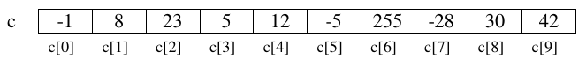
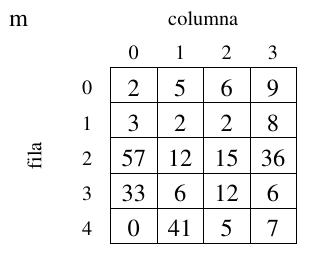
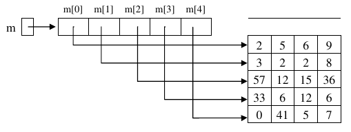
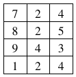

[toc]

# Introducción

A menudo, para resolver problemas de programación, no basta con disponer de sentencias condicionales o iterativas como las que hemos visto (`if`, `switch`, `while`, `for`, ...).

También es necesario disponer de herramientas para organizar la información de forma adecuada: **las estructuras de datos**.

Los arrays son una estructura de datos fundamental, que está disponible en la mayoría de lenguajes de programación y que nos permitirá resolver problemas que, sin ellos, resultarían difíciles o tediosos de solucionar.

Imaginemos, por ejemplo, que queremos leer los datos de pluviosidad de cada uno de los 31 días de un mes. Posteriormente se desea mostrar la pluviosidad media del mes y en cuántos días las lluvias superaron la media.

Con las herramientas de que disponemos hasta ahora, nos veríamos obligados a declarar **31 variables `double`**, una para cada día, y a elaborar un largo programa que leyera los datos y contara cuales superan la media. Con el uso de arrays, problemas como este tienen una solución fácil y corta.

# Arrays

Un array es una colección de elementos del mismo tipo, que tienen un nombre o identificador común.

Se puede acceder a cada componente del array de forma individual para consultar o modificar su valor. El acceso a los componentes se realiza mediante un subíndice, que viene dado por la posición que ocupa el elemento dentro del array.

En la siguiente figura se muestra un array `c` de enteros:



> ### El primer subíndice de un array es el cero. El último subíndice es la longitud del array menos uno.

El número de componentes de un array se establece inicialmente al crearlo y no es posible cambiarlo de tamaño. Es por esto que reciben el nombre de estructuras de datos estáticas.

## Declaración y creación

Para poder utilizar un array hay que declararlo:

```java
tipo nombreVariable[];
```

o

```java
tipo[] nombreVariable;
```

En la declaración se establece el nombre de la variable y el tipo de los componentes. Por ejemplo:

```java
double lluvia1[]; // lluvia1 es un array de double
double[] lluvia2;  // lluvia2 es un array de double <== Esta es la declaración recomendada, el [] siempre acompañando al tipo.
```

En la declaración anterior no se ha establecido el número de componentes. El número de componentes se indica en la creación, que se hace utilizando el operador `new`:

```java
lluvia1 = new double[31];
```

Con esta instrucción se establece que el número de elementos del array `lluvia` son 31, reservando con ello el compilador espacio consecutivo para 31 componentes individuales de tipo `double`.

Las dos instrucciones anteriores se pueden unir en una sola:

```java
// tipo[] nombreVariable = new tipo[numElementos];
double[] lluvia2 = new double[31];
```

El valor mediante el cual se define el número de elementos del array tiene que ser una expresión entera, pero no tiene por qué ser un literal como en el ejemplo anterior. El tamaño de un array se puede establecer durante la ejecución, como en el siguiente ejemplo:

```java
// usamos un array para almacenar las edades de un grupo de personas
// la variable numPersonas contiene el número de personas del grupo
// y se asigna en tiempo de ejecución
Scanner teclado = new Scanner(System.in);
System.out.print("Introduce cuantos elementos debe tener el array edad[]:");
int numPersonas = teclado.nextInt();
int[] edad = new int[numPersonas];
```

## Acceso a los componentes

Como ya hemos dicho, el acceso a los componentes del array se realiza mediante subíndices. La sintaxis para referirse a un componente del array es la siguiente:

```java
nombreVariable[subíndice]
```

Tras declarar el array `lluvia`, se dispone de 31 componentes de tipo `double` numeradas desde la 0 a la 30 y accesibles mediante la notación: `lluvia[0]` (componente primera), `lluvia[1]` (componente segunda) y así sucesivamente hasta la última componente: `lluvia[30]`.

Con cada una de las componentes del array de `double` lluvia es posible efectuar todas las operaciones que podrían realizarse con variables individuales de tipo `double`, por ejemplo, dadas las declaraciones anteriores, las siguientes instrucciones serían válidas:

```java
System.out.print("Introduce el dato para el componente 0: ");
edad[0] = teclado.nextInt(); //25
System.out.println("El componente [0] vale " + edad[0]);
edad[1] = edad[0] + 1;
edad[2] = edad[0] + edad[1];
edad[2]++;
System.out.println("El componente [1] vale " + edad[1]); //26
System.out.println("El componente [2] vale " + edad[2]); //52
```

Además, hay que tener en cuenta que el subíndice ha de ser una expresión entera, por lo que también son válidas expresiones como las siguientes:

```java
int i;
...
edad[i] = edad[i + 1];
edad[i + 2] = edad[i];
```

## Inicialización

Cuando creamos un array, Java inicializa automáticamente sus componentes:

- Con 0 cuando los componentes son de tipo numérico.
- Con false cuando los componentes son `boolean`.
- Con el carácter de ASCII 0, cuando los componentes son `char`.
- Con `null` cuando son objetos (`Strings`, etc)

Aun así, es probable que estos no sean los valores con los que queremos inicializar el array. Tenemos entonces dos posibilidades:

- Acceder individualmente a los componentes del array para darles valor:

  ```java
  int edad2[] = new int[10];
  edad2[0] = 25;
  edad2[1] = 10;
  ...
  edad2[9] = 12;
  ```

- O inicializar el array en la declaración de la siguiente forma:

  ```java
  int edad3[] = {25,10,23,34,65,23,1,67,54,12};
  ```

>#### Es decir, enumerando los valores con los que se quiere inicializar cada componente, encerrados entre llaves. De hacerlo así, no hay que crear el array con el operador `new`. Java crea el array con tantos componentes como valores hemos puesto entre llaves. Además no es necesario indicar el número de elementos del mismo.

## Un ejemplo práctico

Ya hemos resuelto en temas anteriores el problema de devolver el nombre de un mes dado su número. 

Vamos a resolverlo ahora ayudándonos de arrays:

```java
public static String nombreMes(int mes){
    String[] nombre = {"enero", "febrero", "marzo", "abril",
                       "mayo", "junio", "julio","agosto",
                       "septiembre", "octubre", "noviembre", "diciembre"};
    return nombre[mes-1];
}
```

El método define un array de `String` que se inicializa con los nombres de los doce meses. La primera componente del array (`nombre[0]`) se deja vacía, de forma que enero quede almacenado en `nombre[1]`.
Devolver el nombre del mes indicado se reduce a devolver el componente del array cuyo número indica el parámetro mes: `nombre[mes]`

## Arrays como parámetros. Paso de parámetros por referencia.

Hasta el momento sólo se ha considerado el paso de parámetros por valor; de manera que cualquier cambio que el método realice sobre los parámetros formales no modifica el valor que tiene el parámetro real con el que se llama al método. En java, todos los parámetros de tipo simple (`byte`, `short`, `int`, ...) se pasan por valor.

> ### Por el contrario, los arrays no son variables de tipo primitivo, y como cualquier otro objeto, se pasa siempre por referencia.

En el paso de parámetros por referencia lo que se pasa en realidad al método es la dirección de la variable u objeto. Es por esto que el papel del parámetro formal es el de ser una referencia al parámetro real; la llamada al método no provoca la creación de una nueva variable. De esta forma, las modificaciones que el método pueda realizar sobre estos parámetros se realizan efectivamente sobre los parámetros reales. En este caso, ambos parámetros (formal y real) se pueden considerar como la misma variable con dos nombres, uno en el método llamante y otro en el llamado o invocado, pero hacen referencia a la misma posición de memoria.

En el siguiente ejemplo, la variable `a`, de tipo primitivo, no cambia de valor tras la llamada al método. Sin embargo la variable `v`, array de enteros, si se ve afectada por los cambios que se han realizado sobre ella en el método:

```java
public static void main(String[] args){
    int a = 1;
    int[] v = {1,1,1};
    metodo(v,a); //Pasar un array como parámetro
    System.out.println(a); // Muesta 1
    System.out.println(v[0]); // Muestra 2
}

public static void metodo(int[] x, int y){ //recibir un array como parámetro
    x[0]++;
    y++;
}
```

> ### Como podemos observar, para pasar un array a un método, simplemente usamos el nombre de la variable en la llamada. En la cabecera del método, sin embargo, tenemos que utilizar los corchetes `[]` para indicar que el parámetro es un array.

## El atributo `length`

Todas las variables de tipo array tienen un atributo `length` que permite consultar el número de componentes del array. Su uso se realiza posponiendo `.length` al nombre de la variable:

```java
double[] estatura = new double[25];
...
System.out.println(estatura.length); // Mostrará por pantalla: 25
```

## `String[] args` en el `main`

El método `main` puede recibir argumentos desde la línea de comandos. Para ello, el método `main` recibe un parámetro (`String args[]`). Vemos que se trata de un array de `Strings`. El uso del atributo `length` nos permite comprobar si se ha llamado al programa de forma correcta o no. Veamos un ejemplo para saber si es Navidad. Se habrá llamado correctamente si el array `args` contiene dos componentes (día, mes):

```java
public class EsNavidad {
    public static void main(String[] args) {
        if (args.length != 2) {
            System.out.println("ERROR:");
            System.out.println("Llame al programa de la siguiente forma:");
            System.out.println("java EsNavidad dia mes");
        } else {
            // args[0] es el día
            // args[1] es el mes
            if ((Integer.valueOf(args[0]) == 25) && (Integer.valueOf(args[1]) == 12)) {
                    System.out.println("ES NAVIDAD!");
            } else {
                System.out.println("No es navidad.");
            }
        }
    }
}
```

# Problemas de recorrido, búsqueda y ordenación

Muchos de los problemas que se plantean cuando se utilizan arrays pueden clasificarse en tres grandes grupos de problemas genéricos: los que conllevan el recorrido de un array, los que suponen la búsqueda de un elemento que cumpla cierta característica dentro del array, y los que implican la ordenación de los elementos del array.

La importancia de este tipo de problemas proviene de que surgen, no sólo en el ámbito de los arrays, sino también en muchas otras organizaciones de datos de uso frecuente (como las listas, los ficheros, etc.). Las estrategias básicas de resolución que se verán a continuación son también extrapolables a esos otros ámbitos.

## Problemas de recorrido

Se clasifican como problemas de recorrido aquellos que para su resolución exigen algún tratamiento de todos elementos del array. El orden para el tratamiento de estos elementos puede organizarse de muchas maneras: ascendentemente, descendentemente, ascendente y descendente de forma simultánea, etc.

En el siguiente ejemplo se muestra un método en java para devolver, a partir de un array que contiene la pluviosidad de cada uno de los días de un mes, la pluviosidad media de dicho mes. Para ello se recorren ascendente los componentes del array para ir sumándolos:

```java
public static double pluviosidadMediaAscendente(double[] lluvia){
    double suma = 0;
    //Recorremos el array ascendentemente
    for (int i = 0; i<lluvia.length; i++){
        suma += lluvia[i];
    }
    double media = suma / lluvia.length;
    return media;
}
```

La forma de recorrer el array ascendentemente es, como vemos, utilizar una variable entera (`i` en nuestro caso) que actúa como subíndice del array. Éste subíndice va tomando los valores `0`, `1`, ..., `lluvia.length-1` en el seno de un bucle, de manera que se accede a todos los componentes del array para sumarlos.

El mismo problema resuelto con un recorrido descendente sería como sigue:

```java
public static double pluviosidadMediaDescendente(double[] lluvia){
    double suma = 0;
    //Recorremos el array descendentemente
    for (int i = lluvia.length-1; i>=0; i--){
    	suma += lluvia[i];
    }
    double media = suma / lluvia.length;
    return media;
}
```

También realizamos un recorrido para obtener la pluviosidad máxima del mes (la cantidad de lluvia más grande caída en un día), es decir, el elemento más grande del array:

```java
public static double pluviosidadMaxima(double[] lluvia){
    // Suponemos que la pluviosidad máxima se produjo el primer día
    double max = lluvia[0];
    //Recorremos el array desde la posición 1, comprobando si hay una pluviosidad mayor
    for (int i = 1; i<lluvia.length; i++)
        if(lluvia[i] > max){
        	max = lluvia[i];    
        } 
    return max;
}
```

### Bucle for each (for-loop)

En el tema anterior vimos algún tipo de bucles que explicariamos cuandos los pudiesemos utilizar, en este grupo estan los bucles for each o for-loops. Aquí tenemos un ejemplo de recorrido de un array con la sintaxis que ya conocemos:

```java
int[] array = { 1, 2, 3, 4, 5, 6, 7, 8 };
for (int i = 0; i < array.length; i++) {
    System.out.print(array[i] + " ");
}
```

el anterior fragmento genera la siguiente salida:

```
1 2 3 4 5 6 7 8
```

Este mismo código se puede escribir de la siguiente manera:

```java
int[] array = { 1, 2, 3, 4, 5, 6, 7, 8 };
for (int i : array) { //mentalmente podemos traducir por:
    //"para cada entero "i" que encontremos en el array"
    System.out.print(i + " ");
}
```

la salida seguirá siendo la misma:

```
1 2 3 4 5 6 7 8
```

> ### Ojo! con el segundo método no tenemos acceso a la posición o índice del array, este método no serviría para métodos en los que necesitamos conocer la posición o utilizarla de alguna manera.

## Problemas de búsqueda

Se denominan problemas de búsqueda a aquellos que, de alguna manera, implican determinar si existe algún elemento del array que cumpla una propiedad dada. Con respecto a los problemas de recorrido presentan la diferencia de que no es siempre necesario tratar todos los elementos del array: el elemento buscado puede encontrarse inmediatamente, encontrarse tras haber recorrido todo el array, o incluso no encontrarse.

### Búsqueda ascendente

Consideremos, por ejemplo, el problema de encontrar cual fue el primer día del mes en que no llovió nada, es decir, el primer elemento del array con valor cero:

```java
//Devolveremos el subíndice del primer componente del array cuyo valor es cero.
// Si no hay ningún día sin lluvias devolveremos -1
public static int primerDiaSinLluvia1(double[] lluvia){
    int i=0 ;
    boolean encontrado = false ;
    while (i<lluvia.length && !encontrado){
        if (lluvia[i] == 0) encontrado = true ;
        else i++ ;
    }
    if (encontrado) return i ;
    else return -1 ;
}
```


Hemos utilizado el esquema de búsqueda: Definimos una variable `boolean` que indica si hemos encontrado o no lo que buscamos. El bucle se repite mientras no lleguemos al final del array y no hayamos encontrado un día sin lluvias.

También es posible una solución sin utilizar la variable `boolean`:

```java
public static int primerDiaSinLluvia2(double[] lluvia){
    int i=0 ;
    while (i<lluvia.length && lluvia[i] != 0)
        i++;
    if (i == lluvia.length) return -1 ;
    else return i;
}
```

En este caso el subíndice `i` se incrementa mientras estemos dentro de los límites del array y no encontremos un día con lluvia `0`. Al finalizar el bucle hay que comprobar por cual de las dos razones finalizó: ¿Se encontró un día sin lluvias o se recorrió todo el array sin encontrar ninguno? En esta comprobación es importante no acceder al array si existe la posibilidad de que el subíndice esté fuera de los límites del array. La siguiente comprobación sería incorrecta:

```java
if (lluvia[i] == 0) return i;
else return -1;
```

ya que, si se ha finalizado el bucle sin encontrar ningún día sin lluvia, `i` valdrá `lluvia.length`, que no es una posición válida del array, y al acceder a `lluvia[i]` se producirá la excepción `ArrayIndexOutOfBoundsException` (índice del array fuera de los límites) 

Por otra parte, el mismo problema se puede resolver utilizando la sentencia `for`, como hemos hecho otras veces. Sin embargo la solución parece menos intuitiva porque el cuerpo del `for` quedaría vacío:

```java
public static int primerDiaSinLluvia3(double[] lluvia){
    int i;
    for (i=0; i<lluvia.length && lluvia[i] != 0; i++) /*Nada*/ ;
    if (i == lluvia.length) return -1 ;
    else return i;
}
```

### Búsqueda descendente

En los ejemplos de búsqueda anteriores hemos iniciado la búsqueda en el elemento cero y hemos ido ascendiendo hasta la última posición del array. A esto se le llama búsqueda ascendente.

Si queremos encontrar el último día del mes en que no llovió podemos realizar una búsqueda descendente, es decir, partiendo del último componente del array y decrementando progresivamente el subíndice hasta llegar a la posición cero o hasta encontrar lo buscado:

```java
public static int ultimoDiaSinLluvia(double[] lluvia){
    int i=lluvia.length-1;
    boolean encontrado = false ;
    while (i>=0 && !encontrado){
        if (lluvia[i] == 0) encontrado = true ;
        else i-- ;
    }
    if (encontrado) return i ;
    else return -1 ;
}
```

### Búsqueda en un array ordenado: búsqueda binaria

Suponga que una amiga apunta un número entre el 0 y el 99 en una hoja de papel y vosotros debéis adivinarlo. Cada vez que conteste, le dirá si el valor que ha dicho es mayor o menor que el que ha de adivinar. ¿Qué estrategia seguiría para lograrlo? Hay que pensar un algoritmo a seguir para resolver este problema.

Una aproximación muy ingenua podría ser ir diciendo todos los valores uno por uno, empezando por 0. Está claro que cuando llegue al 99 lo habréis adivinado. En el mejor caso, si había escrito el 0, acertará en la primera, mientras que en el peor caso, si había escrito el 99, necesitareis 100 intentos. Si estaba por medio, tal vez con 40-70 basta. Este sería un algoritmo eficaz (hace lo que tiene que hacer), pero no muy eficiente (lo hace de la mejor manera posible). Ir probando valores al azar en lugar de hacer esto tampoco mejora gran cosa el proceso, y viene a ser lo mismo.

Si alguna vez habeis jugado a este juego, lo que habreis hecho es ser un poco más astutos y empezar por algún valor del medio. En este caso, por ejemplo, podría ser el 50. Entonces, en caso de fallar, una vez está seguro de si el valor secreto es mayor o menor que su respuesta, en el intento siguiente probar un valor más alto o más bajo , e ir haciendo esto repetidas veces.

Generalmente, la mejor estrategia para adivinar un número secreto entre 0 y N sería primer probar N/2. Si no se ha acertado, entonces si el número secreto es más alto se intenta adivinar entre (N/2 + 1) y N. Si era más bajo, se intenta adivinar el valor entre 0 y N-1. Para cada caso, se vuelve a probar el valor que hay en el medio del nuevo intervalo. Y así sucesivamente, haciendo cada vez más pequeño el intervalo de búsqueda, hasta adivinarlo. En el caso de 100 valores, esto garantiza que, en el peor de los casos, en 7 intentos seguro que se adivina. Esto es una mejora muy grande respecto al primer algoritmo, donde hacían falta 100 intentos, y por tanto, este sería un algoritmo más eficiente. Concretamente, siempre se adivinará en log~2~ (N) intentos como máximo.

Si os fijáis, el ejemplo que se acaba de explicar, en realidad, no es más que un esquema de búsqueda en una secuencia de valores, como puede ser dentro de un array, partiendo de la condición que todos los elementos estén ordenados de menor a mayor. De hecho, hasta ahora, para hacer una búsqueda de un valor dentro de un array se ha usado el sistema "ingenuo", mirando una por una todas las posiciones. Pero si los elementos están ordenados previamente, se podría usar el sistema "astuto" para diseñar un algoritmo mucho más eficiente, y hasta cierto punto, más "inteligente".

El algoritmo basado en esta estrategia se conoce como **búsqueda binaria o dicotómica**.

Para ello iniciaremos la búsqueda en la posición central del array.

- Si el elemento central es el buscado habremos finalizado la búsqueda.
- Si el elemento central es mayor que el buscado, tendremos que continuar la búsqueda en la mitad izquierda del array ya que, al estar éste ordenado todos los elementos de la mitad derecha serán también mayores que el buscado.
- Si el elemento central es menor que el buscado, tendremos que continuar la búsqueda en la mitad derecha del array ya que, al estar éste ordenado todos los elementos de la mitad izquierda serán también menores que el buscado.

En un solo paso hemos descartado la mitad de los elementos del array. Para buscar el la mitad izquierda o en la mitad derecha utilizaremos el mismo criterio, es decir, iniciaremos la búsqueda en el elemento central de dicha mitad, y así sucesivamente hasta encontrar lo buscado o hasta que descubramos que no está.

Supongamos por ejemplo que, dado un array que contiene edades de personas, ordenadas de menor a mayor queremos averiguar si hay alguna persona de 36 años o no.

El siguiente método soluciona este problema realizando una búsqueda binaria:

```java
public static boolean hayAlguienDe36(int[] edad) {
    // Las variables izq y der marcarán el fragmento del array en el que
    // realizamos la búsqueda. Inicialmente buscamos en todo el array.
    int izq = 0;
    int der = edad.length - 1;
    boolean encontrado = false;
    while (izq <= der && !encontrado) {
        // Calculamos posición central del fragmento en el que buscamos
        int m = (izq + der) / 2;
        if (edad[m] == 36) // Hemos encontrado una persona de 36
        {
            encontrado = true;
        } else if (edad[m] > 36) {
            // El elemento central tiene más de 36.
            // Continuamos la búsqueda en la mitad izquierda. Es decir,
            // entre las posiciónes izq y m-1
            der = m - 1;
        } else {
            // El elemento central tiene menos de 36.
            // Continuamos la búsqueda en la mitad derecha. Es decir,
            // entre las posiciones m+1 y der
            izq = m + 1;
        } // del if
    } // del while
    return encontrado; // if (encontrado) return true; else return false;
}
```

La búsqueda finaliza cuando encontramos una persona con 36 años (`encontrado==true`) o cuando ya no es posible encontrarla, circunstancia que se produce cuando `izq` y `der` se cruzan (`izq>der`).

## Problemas de ordenación

Con frecuencia necesitamos que los elementos de un array estén ordenados (por ejemplo para usar la búsqueda binaria).

Existen multitud de algoritmos que permiten ordenar los elementos de un array, entre los que hay soluciones **iterativas** y soluciones **recursivas**.

Entre los algoritmos **iterativos** tenemos, por ejemplo, el **método de la burbuja**, el **método de selección directa** y el **método de inserción directa**.

Entre los **recursivos**, son conocidos el algoritmo **mergesort** y el **quickSort**, que realizan la ordenación más rápidamente que los algoritmos iterativos que hemos nombrado.

Como ejemplo vamos a ver como se realiza la ordenación de un array de enteros utilizando el método de **selección directa**:

```java
public static void seleccionDirecta(int[] v) {
    for (int i = 0; i < v.length-1; i++) {
        //Localizamos elemento que tiene que ir en la posición i
        int posMin = i;
        //buscar el menor a la derecha
        for (int j = i + 1; j < v.length; j++) {
            if (v[j] < v[posMin]) {
                posMin = j;
            }
        }
        //al llegar aquí posMin tendrá la posición del elemento menor
        //Intercambiamos los elementos de las posiciones i y posMin
        //v[i]<=>v[posMin];
        int aux = v[posMin];
        v[posMin] = v[i];
        v[i] = aux;
    }
}
```

El método consiste en recorrer el array ascendentemente a partir de la posición cero.

En cada posición (`i`) localizamos el elemento que tiene que ocupar dicha posición cuando el array esté ordenado, es decir, el menor de los elementos que quedan a su derecha.

Cuando se ha determinado el menor se coloca en su posición realizando un intercambio con el elemento de la posición `i`. Con ello, el array queda ordenado hasta la posición `i`.

> ### Ejemplos visuales de distintos métodos de ordenación, con distintos tipos de entradas: https://www.toptal.com/developers/sorting-algorithms

# Arrays bidimensionales: matrices

Los arrays bidimensionales, también llamados matrices, son muy similares a los arrays que hemos visto hasta ahora: También son una colección de elementos del mismo tipo que se agrupan bajo un mismo nombre de variable. Sin embargo:

- Sus elementos están organizados en filas y columnas. Tienen, por tanto una altura y una anchura, y por ello se les llama bidimensionales.

- A cada componente de una matriz se accede mediante dos subíndices: el primero se refiere al número de fila y el segundo al número de columna. En la siguiente figura, `m[0][0]` es `2`, `m[0][3]` es `9`, `m[2][0]` es `57`

  

- Como vemos, filas y columnas se numeran a partir del `0`.

Si se quisiera extender el tratamiento el estudio de la pluviosidad, para abarcar no solo los días de un mes sino los de todo un año, se podría definir, por ejemplo, un array de 366 elementos, que mantuviera de forma correlativa los datos de pluviosidad de una zona día a día. Con ello, por ejemplo, el dato correspondiente al día 3 de febrero ocuparía la posición 34 del array, mientras que el correspondiente al 2 de julio ocuparía el 184.

Una aproximación más conveniente para la representación de estos datos consistiría en utilizar una matriz con 12 filas (una por mes) y 31 columnas (una por cada día del mes). Esto permitiría una descripción más ajustada a la realidad y, sobre todo, simplificaría los cálculos de la posición real de cada día en la estructura de datos. El elemento `[0][3]` correspondería, por ejemplo, a las lluvias del 4 de enero.

## Matrices en Java

> # En Java, una matriz es, en realidad un array en el que cada componente es, a su vez, un array. Dicho de otra manera, una matriz de enteros es un array de arrays de enteros.

Esto, que no es igual en otros lenguajes de programación, tiene ciertas consecuencias en la declaración, creación y uso de las matrices en Java:

- Una matriz, en Java, puede tener distinto número de elementos en cada fila.

- La creación de la matriz se puede hacer en un solo paso o fila por fila.

-  Si `m` es una matriz de enteros...

  - `m[i][j]` es el entero de la fila `i`, columna `j`
  - `m[i]` es un array de enteros.
  - `m.length` es el número de filas de `m`.
  - `m[i].length` es el número de columnas de la fila `i`

- Podríamos dibujar la matriz `m` del ejemplo anterior de una forma más cercana a cómo Java las representa internamente:

  

## Declaración de matrices.

El código siguiente declara una matriz (array bidimensional) de elementos de tipo `double`, y la crea para que tenga `5` filas y `4` columnas (matriz de 5x4):

```java
double[][] m1 = new double[5][4];
```

La siguiente declaración es equivalente a la anterior aunque en la práctica es menos utilizada a no ser que queramos que cada fila tenga un número distinto de elementos:

```java
double[][] m2 = new double [5][];
m2[0] = new double[4];
m2[1] = new double[4];
m2[2] = new double[4];
m2[3] = new double[4];
m2[4] = new double[4];
```

Es posible inicializar cada uno de los subarrays con un tamaño diferente (aunque el tipo base elemental debe ser siempre el mismo para todos los componentes). Por ejemplo:

```java
double[][] m3 = new double [5][];
m3[0] = new double[3];
m3[1] = new double[4];
m3[2] = new double[14];
m3[3] = new double[10];
m3[4] = new double[9];
```

## Inicialización.

La forma de inicializar una matriz de enteros de por ejemplo \[4][3] seria:

```java
int[][] m4 = {{7,2,4},{8,2,5},{9,4,3},{1,2,4}};

//aunque se entiende mejor de este modo:
int[][] m4 = {
               {7,2,4},
               {8,2,5},
               {9,4,3},
               {1,2,4}
             };
```



## Recorrido

El recorrido se hace de forma similar al de un array aunque, dado que hay dos subíndices, será necesario utilizar dos bucles anidados: uno que se ocupe de recorrer las filas y otro que se ocupe de recorrer las columnas.

El siguiente fragmento de código recorre una matriz `m4` para imprimir sus elementos uno a uno.

```java
//recorrido por filas
System.out.println("\nRecorrido por filas: ");
for (int f = 0; f < m4.length; f++) {
    for (int c = 0; c < m4[f].length; c++) {
        System.out.print(m4[f][c] + " ");
    }
    System.out.println("");
}
//Recorrido por filas:
//7 2 4 
//8 2 5 
//9 4 3 
//1 2 4 
```

El recorrido se ha hecho por filas, es decir, se imprimen todos los elementos de una fila y luego se pasa a la siguiente. Como habíamos indicado anteriormente, `m.length` representa el número de filas de `m`, mientras que `m[i].length` el número de columnas de la fila `i`.

También es posible hacer el recorrido por columnas: imprimir la columna 0, luego la 1, etc:

```java
System.out.println("\nRecorrido por columnas: ");
int numFilas = m4.length;
int numColumnas = m4[0].length;
for (int c = 0; c < numColumnas; c++) {
    for (int f = 0; f < numFilas; f++) {
        System.out.print(m4[f][c] + " ");
    }
    System.out.println("");
}
//Recorrido por columnas: 
//7 8 9 1 
//2 2 4 2 
//4 5 3 4
```
o, directamente ...
```java
System.out.println("\nRecorrido por columnas versión 2: ");
for (int c = 0; c < m4[0].length; c++) {
    for (int f = 0; f < m4.length; f++) {
        System.out.print(m4[f][c] + " ");
    }
    System.out.println("");
}
//Recorrido por columnas versión 2: 
//7 8 9 1 
//2 2 4 2 
//4 5 3 4
```

En este caso, para un funcionamiento correcto del recorrido sería necesario que todas las columnas tuvieran igual número de elementos, pues en el bucle externo, se toma como referencia para el número de columnas la longitud de `m[0]`, es decir el número de elementos de la primera fila.

# Arrays multidimensionales

En el punto anterior hemos visto que podemos definir arrays cuyos elementos son a la vez arrays, obteniendo una estructura de datos a la que se accede mediante dos subíndices, que hemos llamado arrays bidimensionales o matrices.

Este *anidamiento* de estructuras se puede generalizar, de forma que podríamos construir arrays de más de dos dimensiones. En realidad Java no pone límite al número de subíndices de un array. Podríamos hacer declaraciones como las siguientes:

```java
int[][][] notas = new int[10][5][3]; //Notas de 10 alum. en 5 asign. en 3 eval.
notas[2][3][1]=5;//El alumno 2, para la asignatura 3 de la primera evaluación ha sacado un 5
double[][][][][] w = new double [2][7][10][4][10];
```

> #### Sin embargo, encontrar ejemplos en los que sean necesarios arrays de más de tres dimensiones es bastante raro, y aún cuando los encontramos solemos utilizar arrays de uno o dos subíndices porque nos resulta menos complejo manejarlos.

# Recursividad

A la hora de crear programas complejos, uno de los aspectos que diferencia el buen programador del aficionado es su capacidad de hacer algoritmos eficientes. O sea, que sean capaces de resolver el problema planteado en el mínimo de pasos. En el caso de un programa, esto significa la necesidad de ejecutar el mínimo número de instrucciones posible. Ciertamente, si el resultado tiene que ser exactamente el mismo, siempre será mejor hacer una tarea en 10 pasos que en 20, intentando evitar pasos que en realidad son innecesarios. Por lo tanto, la etapa de diseño de un algoritmo es bastante importante y hay que pensar bien una estrategia eficiente. Ahora bien, normalmente, los algoritmos más eficientes también son más difíciles de pensar y codificar, ya que no siempre son evidentes.

## Aplicación de la recursividad

A menudo encontrareis que explicar de palabra la idea general de una estrategia puede ser sencillo, pero traducirla instrucciones de Java ya no lo es tanto. Retomamos ahora el caso de la búsqueda dicotómica o binaria, dado que hay que ir repitiendo unos pasos en sucesivas iteraciones, está más o menos claro que el problema planteado para realizar búsquedas eficientes se basa en una estructura de repetición. Pero no se recorren todos los elementos y el índice no se incrementa uno a uno, sino que se va cambiando a valores muy diferentes para cada iteración. No es un caso evidente. Precisamente, este ejemplo no se ha elegido al azar, ya que es un caso en el que os puede ir bien aplicar un nuevo concepto que permite facilitar la definición de algoritmos complejos donde hay repeticiones.

> # La **recursividad** es una forma de describir un proceso para resolver un problema de manera que, a lo largo de esta descripción, se usa el proceso mismo que se está describiendo, pero aplicado a un caso más simple.

De hecho, tal vez sin darse cuenta de ello en, ya se ha usado recursividad para describir cómo resolver un problema. Para ver qué significa exactamente la definición formal apenas descrita, se repetirá el texto en cuestión, pero remarcando el aspecto recursivo de la descripción:

"*Generalmente, la mejor estrategia para adivinar un número secreto entre 0 y N sería primero probar N/2. Si no se ha acertado, entonces si el número secreto es más alto se intenta adivinar entre (N/2 + 1) y N. Si era más bajo, se intenta adivinar el valor entre 0 y N-1. Para cada caso, se vuelve a probar el valor que hay en el centro del nuevo intervalo. Y así sucesivamente, hasta adivinarlo.*"

O sea, **el proceso de adivinar un número se basa en el proceso de intentar adivinar un número!** Esto parece hacer trampas, ya es como usar la misma palabra que se quiere definir a su propia definición. Pero fíjese en un detalle muy importante. Los nuevos usos del proceso de "adivinar" son casos más simples, ya que primero se adivina entre N valores posibles, luego entre N/2 valores, después entre N/4, etc. Este hecho no es casual y de él depende poder definir un proceso recursivo de manera correcta.

> # Otro ejemplo de recursividad es la definición de las iniciales del sistema operativo GNU quieren decir "*GNU is Not Unix*"

## Implementación de la recursividad

La implementación de la recursividad dentro del código fuente de un programa se hace a nivel de método.

> # Un **método recursivo** es aquel que, dentro de su bloque de instrucciones, tiene alguna invocación a él mismo.

El bloque de código de un método recursivo siempre se basa en una estructura de selección múltiple, donde cada rama es de alguno de los dos casos posibles descritos a continuación.

- Por un lado, en el **caso base**, que contiene un bloque instrucciones dentro de las cuales no hay ninguna llamada al método mismo. Se ejecuta cuando se considera que, a partir de los parámetros de entrada, el problema ya es suficientemente simple como para ser resuelto directamente. En el caso de la búsqueda, sería cuando la posición intermedia es exactamente el valor que se está buscando, o bien cuando ya se puede decidir que el elemento a buscar no existe.

- Por otra parte, existe el **caso recursivo**, que contiene un bloque de instrucciones dentro de las cuales hay una llamada al método mismo, dado que se considera que aún no se puede resolver el problema fácilmente. Ahora bien, los valores usados como parámetros de esta nueva llamada deben ser diferentes a los originales. Concretamente, serán unos valores que tiendan a acercarse al caso base. En el caso de la búsqueda, se corresponde a la búsqueda sobre la mitad de los valores originales, ya sea hacia la mitad inferior o superior.

  Este es un caso en el que el intervalo de posiciones donde se hará la nueva búsqueda se va acercando al caso base, ya que tarde o temprano, llamada tras llamada, el espacio de búsqueda se irá reduciendo hasta que, o bien se encuentra el elemento, o queda claro que no está.

Dentro de la estructura de selección siempre debe haber al menos un caso base y uno recursivo. Normalmente, los algoritmos recursivos más sencillos tienen uno de cada. Es imprescindible que los casos recursivos siempre garanticen que sucesivas llamadas van aproximando los valores de los parámetros de entrada a algún caso base, ya que, de lo contrario, el programa nunca termina y se produce el mismo efecto que en un bucle infinito.

### Cálculo recursivo de la operación factorial

Como ejemplo del funcionamiento de un método recursivo, se empezará con un caso sencillo. Se trata del cálculo de la llamada operación **factorial** de un valor entero positivo. Esta es unaria y se expresa con el operador exclamación (por ejemplo, 4!, 20!, 3!). El resultado de esta operación es la multiplicación de todos los valores desde el 1 hasta el indicado (7! = 1 * 2 * 3 * 4 * 5 * 6 * 7). Normalmente, la definición matemática de esta operación se hace de manera recursiva:

- `0! = 1` **:arrow_left:  caso base**
- `n! = n * (n - 1)!` **:arrow_left: caso recursivo**

Así pues, tened en cuenta que el caso recursivo realiza un cálculo que depende de usar la propia definición de la operación, pero cuando lo hace es con un nuevo valor inferior al original, por lo que se garantiza que, en algún momento, se hará una llamada recursiva que desembocará en el caso base. Cuando esto ocurra, la cadena de llamadas recursivas acabará. Una manera de ver esto es desarrollando paso a paso esta definición:

```
4! = 4 * (4 - 1)! = 4 * (3)!
4 * 3! = 4 * (3 * (3-1)!) = 4 * 3 * (2)!
4 * 3 * 2! = 4 * 3 * (2 * (2-1)!) = 4 * 3 * 2 * (1)!
4 * 3 * 2 * 1! = 4 * 3 * 2 * (1 * (1 - 1)!) = 4 * 3 * 2 * 1 * (0)!
4 * 3 * 2 * 1 * 0! = 4 * 3 * 2 * 1 * (1) = 24
```

Su implementación en Java sería la que ves más abajo. Ahora bien, en este código se han añadido algunas sentencias para escribir información por pantalla, de forma que se vea con más detalle cómo funciona un método recursivo. Veréis que, inicialmente, se llevan a cabo una serie de invocaciones del caso recursivo, uno tras otro, hasta que se llega a una llamada que ejecuta el caso base. Es a partir de entonces cuando, a medida que se van ejecutando las sentencias `return` del caso recursivo, realmente se va acumulando el cálculo. Otra forma de verlo es depurando el programa.

``` java
package UD04;

public class Recursividad {

    public static void main(String[] args) {
        //factorial
        System.out.println(factorial(4));
        
        [...]      
    }

    /**
     * Método recursivo que calcula el factorial
     */
    public static int factorial(int n) {
        if (n == 0) {
            //Caso base: Se sabe el resultado directamente
            System.out.println("Caso base: n es igual a 0");
            return 1;
        } else {
            //Caso recursivo: Para calcularlo hay que invocar al método recursivo
            //El valor del nuevo parámetro de entradad se ha de modificar, de
            //manera que se vaya acercando al caso base
            System.out.println("Caso recursivo " + (n - 1)
                    + ": Se invoca al factorial(" + (n - 1) + ")");
            int res = n * factorial(n - 1);
            System.out.println("  cuyo resultado es: " + res);
            return res;
        }
    }
[...]
```

La ejecución resultante es:

```
Caso recursivo 3: Se invoca al factorial(3)
Caso recursivo 2: Se invoca al factorial(2)
Caso recursivo 1: Se invoca al factorial(1)
Caso recursivo 0: Se invoca al factorial(0)
Caso base: n es igual a 0
  cuyo resultado es: 1
  cuyo resultado es: 2
  cuyo resultado es: 6
  cuyo resultado es: 24
24
```

### Cálculo recursivo de la búsqueda dicotómica

A continuación se muestra el código del algoritmo recursivo de búsqueda dicotómica o binaria sobre un array. Observad atentamente los comentarios, los cuales identifican los casos base y recursivos. En este caso, hay más de un caso base y recursivo.

```java
package UD04;

public class Recursividad {

    public static void main(String[] args) {
        [...]
        //busqueda binaria recursiva
        int[] array = {2, 4, 6, 8, 10, 12, 14, 16, 18, 20};
        int buscaDieciocho = BusquedaBinaria(array, 0, array.length - 1, 18);
        int buscaCinco = BusquedaBinaria(array, 0, array.length - 1, 5);
        System.out.println("Busqueda del 18: " + buscaDieciocho);
        System.out.println("Busqueda del 5: " + buscaCinco);
        [...]
    }

	[...]
    public static int BusquedaBinaria(int[] array, int inicio, int fin, int valor) {
        if (inicio > fin) {
            //Caso base: No se ha encontrado el valor
            return -1;
        }
        //Se calcula la posición central entre los dos índices de búsqueda
        int pos = inicio + (fin - inicio) / 2;
        if (array[pos] > valor) {
            //Caso recursivo: Si el valor es menor que la posición que se ha 
            //consultado, entonces hay que seguir buscando por la parte 
            //"derecha" del array
            return BusquedaBinaria(array, inicio, pos - 1, valor);
        } else if (array[pos] < valor) {
            //Caso recursivo: Si el valor es mayor que la posición que se ha
            //consultado, entonces hay que seguir buscando por la parte 
            //"izquierda" del array
            return BusquedaBinaria(array, pos + 1, fin, valor);
        } else {
            //caso base: Es igual, por tanto, se ha encontrado
            return pos;
        }
    }
    [...]
}
```

El resultado de la ejecución es:

```
Busqueda del 18: 8
Busqueda del 5: -1
```

Prácticamente cualquier problema que se puede resolver con un algoritmo recursivo también se puede resolver con sentencias de estructuras de repetición (de manera iterativa). Pero muy a menudo su implementación será mucho menos evidente y las interacciones entre instrucciones bastante más complejas que la opción recursiva (una vez se entiende este concepto, claro).

## Desbordamiento de pila (stack overflow)

Las versiones recursivas de muchas rutinas pueden ejecutarse un poco más lentamente que sus equivalentes iterativos debido a la sobrecarga adicional de las llamadas a métodos adicionales. Demasiadas llamadas recursivas a un método podrían causar un **desbordamiento de la pila**.

Como el almacenamiento para los parámetros y las variables locales está en la pila y cada llamada nueva crea una nueva copia de estas variables, es posible que la pila se haya agotado. Si esto ocurre, el sistema de tiempo de ejecución (run-time) de Java causará una excepción. Sin embargo, probablemente no tendrás que preocuparte por esto a menos que una rutina recursiva se vuelva loca.

La principal ventaja de la recursividad es que algunos tipos de algoritmos se pueden implementar de forma más clara y más recursiva de lo que pueden ser iterativamente. Por ejemplo, el algoritmo de clasificación [Quicksort](https://es.wikipedia.org/wiki/Quicksort) es bastante difícil de implementar de forma iterativa. Además, algunos problemas, especialmente los relacionados con la **IA**, parecen prestarse a **soluciones recursivas**.

```java
package UD04;

public class Recursividad {

    public static void main(String[] args) {
		[...]        
        //desbordamiento de pila
        desbordamientoPila(10);
    }
    
    [...]

    public static int desbordamientoPila(int n) {
        // condición base incorrecta (esto provoca un desbordamiento de la pila).
        if (n == 100) {
            return 1;
        } else {
            return n * desbordamientoPila(n - 1);
        }
    }
}
```

En el ejemplo anterior si se llama a `desbordamientoPila(10)`, llamará a `desbordamientoPila (9)`, `desbordamientoPila(8)`, `desbordamientoPila(7)`, etc., pero el número nunca llegará a 100. Por lo tanto, no se alcanza la condición base. Si la memoria se agota con estos métodos en la pila, provocará un error de desbordamiento de pila (`java.lang.StackOverflowError`).

> ### Al escribir métodos recursivos, debe tener una instrucción condicional, como un `if`, en algún lugar para forzar el retorno del método sin que se ejecute la llamada recursiva. Si no lo hace, una vez que llame al método, nunca retornará. Este tipo de error es muy común cuando se trabaja con recursividad.

# Ejemplo UD04

## EjemploUD04

```java
package UD04;

import java.util.Scanner;

public class EjemploUD04 {

    public static void main(String[] args) {
        //declaración
        double lluvia1[]; // lluvia1 es un array de double
        double[] lluvia2;  // lluvia2 es un array de double

        //instanciación
        lluvia1 = new double[31];

        //declaración + instanciación
        double lluvia3[] = new double[31];

        // usamos un array para almacenar las edades de un grupo de personas
        // la variable numPersonas contiene el número de personas del grupo
        // y se asigna en tiempo de ejecución
        Scanner teclado = new Scanner(System.in);
        System.out.print("Introduce cuantos elementos debe tener el array edad[]:");
        int numPersonas = teclado.nextInt();
        int edad[] = new int[numPersonas];

        //acceso a componentes
        System.out.print("Introduce el dato para el componente 0: ");
        edad[0] = teclado.nextInt();
        System.out.println("El componente [0] vale " + edad[0]);
        edad[1] = edad[0] + 1;
        edad[2] = edad[0] + edad[1];
        edad[2]++;
        System.out.println("El componente [1] vale " + edad[1]);
        System.out.println("El componente [2] vale " + edad[2]);

        //el índice también admite calculos/variables:
        int i = 3;
        edad[i] = edad[i + 1];
        edad[i + 2] = edad[i];

        //Inicialización
        int edad2[] = new int[10];
        edad2[0] = 25;
        edad2[1] = 10;
        edad2[9] = 12;
        //...

        int edad3[] = {25, 10, 23, 34, 65, 23, 1, 67, 54, 12};

        //Ejemplo práctico
        System.out.println(nombreMes(3)); //marzo

        //Paso de arrays como parámetros:
        int a = 1;
        int v[] = {1, 1, 1};
        metodo(v, a); //Pasar un array como parámetro
        System.out.println(a); // Muesta 1
        System.out.println(v[0]); // Muestra 2

        //atributo lenght
        double estatura[] = new double[25];
        System.out.println(estatura.length); // Mostrará por pantalla: 25

        //Array args[] del método main contiene los parámetros de entrada
        System.out.println(args[0]);//parámetro 1 de la línea de comandos
        System.out.println(args[1]);//parámetro 2 de la línea de comandos

        //busquedas y recorridos de arrays
        double pluviosidad[] = {5, 4, 0, 0, 0, 10, 0, 0, 0, 0, 2, 2, 3, 4, 0,
            0, 0, 0, 0, 0, 0, 0, 0, 0, 0, 0, 0, 0, 3, 6, 0, 0};

        //recorrido ascendente
        System.out.println(pluviosidadMediaAscendente(pluviosidad)); //1.3
        //recorrido descendente
        System.out.println(pluviosidadMediaDescendente(pluviosidad)); //1.3
        //recorrido para máximo
        System.out.println(pluviosidadMaxima(pluviosidad)); //10.0
        //busqueda con while y boolean
        System.out.println(primerDiaSinLluvia1(pluviosidad)); //2
        //busqueda con while sin boolean
        System.out.println(primerDiaSinLluvia2(pluviosidad)); //2
        //busqueda con for
        System.out.println(primerDiaSinLluvia3(pluviosidad)); //2
        //busqueda descendente
        System.out.println(ultimoDiaSinLluvia(pluviosidad)); //31

        //busqueda en arrays ordenados (busqueda binaria)
        int buscarEdad[] = {15, 22, 33, 36, 41, 56, 71, 92};
        System.out.println(hayAlguienDe36(buscarEdad)); //true

        //ordenar arrays
        int desordenado[] = {62, 4, 25, 27, 32, 1, 80, 43, 22};
        seleccionDirecta(desordenado);
        //con el siguiente bucle recorremos el array ascendentemente y al
        //imprimirlo resulta en: 1 4 22 25 27 32 43 62 80
        for (int j = 0; j <= desordenado.length - 1; j++) {
            System.out.print(desordenado[j] + " ");
        }

        //arrays bidimensionales
        double m1[][] = new double[5][4];

        //con el mismo número de columnas
        double m2[][] = new double[5][];
        m2[0] = new double[4];
        m2[1] = new double[4];
        m2[2] = new double[4];
        m2[3] = new double[4];
        m2[4] = new double[4];

        //diferentes números de columnas
        double m3[][] = new double[5][];
        m3[0] = new double[3];
        m3[1] = new double[4];
        m3[2] = new double[14];
        m3[3] = new double[10];
        m3[4] = new double[9];

        int m4[][] = {
            {7, 2, 4},
            {8, 2, 5},
            {9, 4, 3},
            {1, 2, 4}
        };

        //recorrido por filas
        System.out.println("\nRecorrido por filas: ");
        for (int r = 0; r < m4.length; r++) {
            for (int s = 0; s < m4[r].length; s++) {
                System.out.print(m4[r][s] + " ");
            }
            System.out.println("");
        }
        //Recorrido por filas:
        //7 2 4 
        //8 2 5 
        //9 4 3 
        //1 2 4 

        System.out.println("\nRecorrido por columnas: ");
        int numFilas = m4.length;
        int numColumnas = m4[0].length;
        for (int j = 0; j < numColumnas; j++) {
            for (int k = 0; k < numFilas; k++) {
                System.out.print(m4[k][j] + " ");
            }
            System.out.println("");
        }
        //Recorrido por columnas: 
        //7 8 9 1 
        //2 2 4 2 
        //4 5 3 4         

        System.out.println("\nRecorrido por columnas versión 2: ");
        for (int j = 0; j < m4[0].length; j++) {
            for (int k = 0; k < m4.length; k++) {
                System.out.print(m4[k][j] + " ");
            }
            System.out.println("");
        }
        //Recorrido por columnas versión 2: 
        //7 8 9 1 
        //2 2 4 2 
        //4 5 3 4
        
        //arrays multidimensionales:
        int notas[][][] = new int[10][5][3]; //Notas de 10 alum. en 5 asign. en 3 eval.
        double w[][][][][] = new double [2][7][10][4][10];
    }

    public static String nombreMes(int mes) {
        String nombre[] = {" ", "enero", "febrero", "marzo", "abril",
            "mayo", "junio", "julio", "agosto", "septiembre", "octubre",
            "noviembre", "diciembre"};
        return nombre[mes];
    }

    public static void metodo(int x[], int y) { //recibir un array como parámetro
        x[0]++;
        y++;
    }

    //recorremos ascendentemente el array para obtener la media
    public static double pluviosidadMediaAscendente(double lluvia[]) {
        double suma = 0;
        //Recorremos el array
        for (int i = 0; i < lluvia.length; i++) {
            suma += lluvia[i];
        }
        double media = suma / lluvia.length;
        return media;
    }

    //recorremos descendentemente el array para obtener la media
    public static double pluviosidadMediaDescendente(double lluvia[]) {
        double suma = 0;
        //Recorremos el array
        for (int i = lluvia.length - 1; i >= 0; i--) {
            suma += lluvia[i];
        }
        double media = suma / lluvia.length;
        return media;
    }

    //recorremos el array para encontrar el dia con más pluviosidad
    public static double pluviosidadMaxima(double lluvia[]) {
        // Suponemos el la pluviosidad máxima se produjo el primer día
        double max = lluvia[0];
        //Recorremos el array desde la posición 1, comprobando si hay una pluviosidad mayor
        for (int i = 1; i < lluvia.length; i++) {
            if (lluvia[i] > max) {
                max = lluvia[i];
            }
        }
        return max;
    }
    //Devolveremos el subíndice del primer componente del array cuyo valor es cero.
// Si no hay ningún día sin lluvias devolveremos -1

    public static int primerDiaSinLluvia1(double lluvia[]) {
        int i = 0;
        boolean encontrado = false;
        while (i < lluvia.length && !encontrado) {
            if (lluvia[i] == 0) {
                encontrado = true;
            } else {
                i++;
            }
        }
        if (encontrado) {
            return i;
        } else {
            return -1;
        }
    }

    public static int primerDiaSinLluvia2(double lluvia[]) {
        int i = 0;
        while (i < lluvia.length && lluvia[i] != 0) {
            i++;
        }
        if (i == lluvia.length) {
            return -1;
        } else {
            return i;
        }
    }

    public static int primerDiaSinLluvia3(double lluvia[]) {
        int i;
        for (i = 0; i < lluvia.length && lluvia[i] != 0; i++) /*Nada*/ ;
        if (i == lluvia.length) {
            return -1;
        } else {
            return i;
        }
    }

    public static int ultimoDiaSinLluvia(double lluvia[]) {
        int i = lluvia.length - 1;
        boolean encontrado = false;
        while (i >= 0 && !encontrado) {
            if (lluvia[i] == 0) {
                encontrado = true;
            } else {
                i--;
            }
        }
        if (encontrado) {
            return i;
        } else {
            return -1;
        }
    }

    public static boolean hayAlguienDe36(int edad[]) {
        // Las variables izq y der marcarán el fragmento del array en el que
        // realizamos la búsqueda. Inicialmente buscamos en todo el array.
        int izq = 0;
        int der = edad.length - 1;
        boolean encontrado = false;
        while (izq <= der && !encontrado) {
            // Calculamos posición central del fragmento en el que buscamos
            int m = (izq + der) / 2;
            if (edad[m] == 36) // Hemos encontrado una persona de 36
            {
                encontrado = true;
            } else if (edad[m] > 36) {
                // El elemento central tiene más de 36.
                // Continuamos la búsqueda en la mitad izquierda. Es decir,
                // entre las posiciónes izq y m-1
                der = m - 1;
            } else {
                // El elemento central tiene menos de 36.
                //Continuamos la búsqueda en la mitad derecha. Es decir,
                // entre las posiciones m+1 y der
                izq = m + 1;
            } // del if
        } // del while
        return encontrado; // if (encontrado) return true; else return false;
    }

    public static void seleccionDirecta(int v[]) {
        for (int i = 0; i < v.length - 1; i++) {
            //Localizamos elemento que tiene que ir en la posición i
            int posMin = i;
            for (int j = i + 1; j < v.length; j++) {
                if (v[j] < v[posMin]) {
                    posMin = j;
                }
            }
            //Intercambiamos los elementos de las posiciones i y posMin
            int aux = v[posMin];
            v[posMin] = v[i];
            v[i] = aux;
        }
    }
}
```

## Recursividad

```java
package UD04;

public class Recursividad {

    public static void main(String[] args) {
        //factorial
        System.out.println(factorial(4));

        //busqueda binaria recursiva
        int[] array = {2, 4, 6, 8, 10, 12, 14, 16, 18, 20};
        int buscaDieciocho = BusquedaBinaria(array, 0, array.length - 1, 18);
        int buscaCinco = BusquedaBinaria(array, 0, array.length - 1, 5);
        System.out.println("Busqueda del 18: " + buscaDieciocho);
        System.out.println("Busqueda del 5: " + buscaCinco);
        
        //desbordamiento de pila
        desbordamientoPila(9);
    }

    /**
     * Método recursivo que calcula el factorial
     */
    public static int factorial(int n) {
        if (n == 0) {
            //Caso base: Se sabe el resultat directamente
            System.out.println("Caso base: n es igual a 0");
            return 1;
        } else {
            //Caso recursivo: Para calcularlo hay que invocar al método recursivo
            //El valor del nuevo parámetro de entradad se ha de modificar, de
            //manera que se vaya acercando al caso base
            System.out.println("Caso recursivo " + (n - 1)
                    + ": Se invoca al factorial(" + (n - 1) + ")");
            int res = n * factorial(n - 1);
            System.out.println("  cuyo resultado es: " + res);
            return res;
        }
    }

    public static int BusquedaBinaria(int[] array, int inicio, int fin, int valor) {
        if (inicio > fin) {
            //Caso base: No se ha encontrado el valor
            return - 1;
        }
        //Es calcula la posició central entre els dos índexs de cerca
        int pos = inicio + (fin - inicio) / 2;
        if (array[pos] > valor) {
            //Caso recursivo: Si el valor es menor que la posición que se ha 
            //consultado, entonces hay que seguir buscando por la parte 
            //"derecha" del array
            return BusquedaBinaria(array, inicio, pos - 1, valor);
        } else if (array[pos] < valor) {
            //Caso recursivo: Si el valor es mayor que la posición que se ha
            //consultado, entonces hay que seguir buscando por la parte 
            //"izquierda" del array
            return BusquedaBinaria(array, pos + 1, fin, valor);
        } else {
            //caso base: Es igual, por tanto, se ha encontrado
            return pos;
        }
    }

    public static int desbordamientoPila(int n) {
        // condición base incorrecta (esto provoca un desbordamiento de la pila).
        if (n == 100) {
            return 1;
        } else {
            return n * desbordamientoPila(n - 1);
        }
    }
}
```

# Píldoras informáticas relacionadas

- [Curso Java Arrays I. Vídeo 23](https://youtu.be/UID_EKKfpcE)
- [Curso Java Arrays II. Vídeo 24](https://youtu.be/NwztwM_xGgU)
- [Curso Java Arrays III. Arrays bidimensionales. Vídeo 25](https://youtu.be/_tUncS0AsNE)

# Fuentes de información

- [Wikipedia](https://es.wikipedia.org)
- [Programación (Grado Superior) - Juan Carlos Moreno Pérez (Ed. Ra-ma)](https://www.ra-ma.es/libro/programacion-grado-superior_48302/)
- Apuntes IES Henri Matisse (Javi García Jimenez?)
- Apuntes AulaCampus
- [Apuntes José Luis Comesaña](https://www.sitiolibre.com/)
- [Apuntes IOC Programació bàsica (Joan Arnedo Moreno)](https://ioc.xtec.cat/materials/FP/Recursos/fp_asx_m03_/web/fp_asx_m03_htmlindex/index.html)
- [Apuntes IOC Programació Orientada a Objectes (Joan Arnedo Moreno)](https://ioc.xtec.cat/materials/FP/Recursos/fp_dam_m03_/web/fp_dam_m03_htmlindex/index.html)
