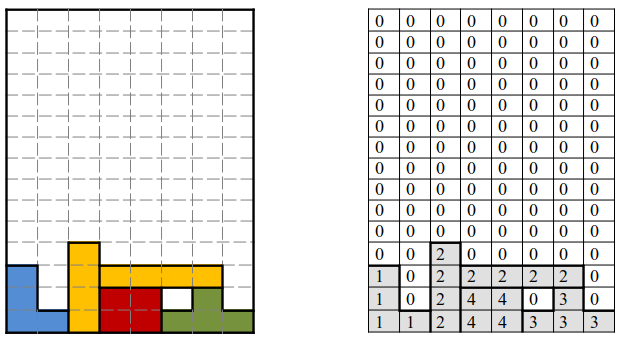

---
title: Ejercicios de la UD04
language: ES
author: David Martínez Peña [www.martinezpenya.es]
subject: Programación
keywords: [PRG, 2023, Programacion, Java]
IES: IES Eduardo Primo Marqués (Carlet) [www.ieseduardoprimo.es]
header: ${title} - ${subject} (ver. ${today}) 
footer:${currentFileName}.pdf - ${author} - ${IES} - ${pageNo}/${pageCount}
typora-root-url:${filename}/../
typora-copy-images-to:${filename}/../assets
---

[toc]

# Ejercicios

## Arrays. Ejercicios de recorrido

1. (Estaturas*)* Escribir un programa que lea de teclado la estatura de 10 personas y las almacene en un array. Al finalizar la introducción de datos, se mostrarán al usuario los datos introducidos con el siguiente formato:

   ```
   Persona 1: 1.85 m.
   Persona 2: 1.53 m.
   ...
   Persona 10: 1.23 m.
   ```

2. (Lluvias) Se dispone de un fichero, de nombre *lluviasEnero.txt,* que contiene 31 datos correspondientes a las lluvias caídas en el mes de enero del pasado año. Se desea analizar los datos del fichero para averiguar:

   - La lluvia total caída en el mes.
   - La cantidad media de lluvias del mes.
   - La cantidad más grande de lluvia caída en un solo día.
   - Cual fue el día que más llovió.
   - La cantidad más pequeña de lluvia caída en un solo día.
   - Cual fue el día que menos llovió.
   - En cuantos días no llovió nada.
   - En cuantos días la lluvia superó la media.
   - Si en la primera quincena del mes llovió más o menos que en la segunda. 
   - En cuantos días la lluvia fue menor que la del día siguiente.

   Para resolver el problema se desarrollarán los siguientes métodos:

   1. `public static void leerArray (double v[], String nombreFichero)`, que rellena el array v con datos que se encuentran en el fichero especificado. El número de datos a leer vendrá determinado por el tamaño del array y no por la cantidad de datos que hay en el fichero.
   2. `public static double suma(double[] v)`, que devuelve la suma de los elementos del array v
   3. `public static double media(double v[])`, que devuelve la media de los elementos del array v. Se puede hacer uso del método del apartado anterior.
   3. `public static int contarMayorQueMedia(double v[])`, que devuelve la cantidad de elementos del array v que son mayores que la media. Se puede hacer uso del método del apartado anterior.
   5. `public static double maximo(double v[])`, que devuelve el valor más grande almacenado en el array v.
   5. `public static double minimo(double v[])`, que devuelve el valor más pequeño almacenado en el array v.
   6. `public static int posMaximo(double v[])`, que devuelve la posición del elemento más grande de v. Si éste se repite en el array es suficiente devolver la posición en que aparece por primera vez.
   7. `public static int posMinimo(double v[])`, que devuelve la posición del elemento más pequeño de v. Si éste se repite en el array es suficiente devolver la posición en que aparece por primera vez.
   8. `public static int contarApariciones(double v[], double x)`, que devuelve el número de veces que el valor *x* aparece en el array v.
   8. `public static double sumaParcial(double v[], int izq, int der)`, que devuelve la suma de los elementos del array v que están entre las posiciones *izq* y *der.*
   10.  `public static int menoresQueElSiguiente(double v[])`, que devuelve el número de elementos de v que son menores que el elemento que tienen a continuación. 
   
4. (Dados) El lanzamiento de un dado es un experimento aleatorio en el que cada número tiene las mismas probabilidades de salir. Según esto, cuantas más veces lancemos el dado, más se igualarán las veces que aparece cada uno de los 6 números. Vamos a hacer un programa para comprobarlo.

   - Generaremos un número aleatorio entre 1 y 6 un número determinado de veces (por ejemplo 100.000). Para ello puedes usar el método `random` de la clase `Math`.

   - Tras cada lanzamiento incrementaremos un contador correspondiente a la cifra que ha salido. Para ello crearemos un array `veces` de 7 componentes, en el que el `veces[1]` servirá para contar las veces que sale un 1, `veces[2]` para contar las veces que sale un 2, etc. `veces[0]` no se usará.

   - Cada, por ejemplo, 1.000 lanzamientos mostraremos por pantalla las estadísticas que indican que porcentaje de veces ha aparecido cada número en los lanzamientos hechos hasta ese momento. Por ejemplo:

     ```
     Número de lanzamientos: 1000
     1: 18 %
     2: 14 %
     3: 21 %
     4: 10 %
     5: 18 %
     6: 19 %
     
     Número de lanzamientos: 2000
     ...
     ```

   - Para el número de lanzamientos (100.000 en el ejemplo) y para la frecuencia con que se muestran las estadísticas (1.000 en el ejemplo) utilizaremos dos **constantes** enteras, de nombre `LANZAMIENTOS` y `FRECUENCIA`, de esta forma podremos variar de forma cómoda el modo en que probamos el programa.

4. (Invertir) Diseñar un método `public static int[] invertirArray(int[] v)`, que dado un array `v` devuelva otro con los elementos en orden inverso. Es decir, el último en primera posición, el penúltimo en segunda, etc.

   Desde el método `main` crearemos e inicializaremos un array, llamaremos a `invertirArray` y mostraremos el array invertido.

   NOTA: Puede ser útil un método que imprima por pantalla un Array `public static void imprimirArray(int[] v)`, y así poder imprimir el Array v

5. (SumasParciales) Se quiere diseñar un método `public static int[] sumaParcial(int[] v)`, que dado un array de enteros `v`, devuelva otro array de enteros t de forma que `t[i] = v[0] + v[1] + ...+ v[i]`. Es decir:

   ```sh
   t[0] = v[0]
   t[1] = v[0] + v[1]
   t[2] = v[0] + v[1] + v[2]
   ...
   t[10] = v[0] + v[1] + v[2] + ... + v[10]
   ```

   Desde el método main crearemos e inicializaremos un array, llamaremos a `sumaParcial` y mostraremos el array resultante.

   Ejemplo de salida, suponiendo que `v = {2,4,1,0,6}`:

   ```
   El valor del array con sumas parciales es:
   2 6 7 7 13
   ```

6. (Rotaciones) Rotar una posición a la derecha los elementos de un array consiste en mover cada elemento del array una posición a la derecha. El último elemento pasa a la posición 0 del array. Por ejemplo si rotamos a la derecha el array `{1,2,3,4}` obtendríamos `{4,1,2,3}`. 

   - Diseñar un método `public static void rotarDerecha(int[] v)`, que dado un array de enteros rote sus elementos un posición a la derecha.

   - En el método `main` crearemos e inicializaremos un array y rotaremos sus elementos tantas veces como elementos tenga el array (mostrando cada vez su contenido), de forma que al final el array quedará en su estado original. Por ejemplo, si inicialmente el array contiene `{7,3,4,2}`, el programa mostrará

     ```sh
     Rotación 1: 2 7 3 4
     Rotación 2: 4 2 7 3 
     Rotación 3: 3 4 2 7
     Rotación 4: 7 3 4 2
     ```

   - Diseña también un método para rotar a la izquierda y pruébalo de la misma forma.

7. (DosArrays) Desarrolla los siguientes métodos en los que intervienen dos arrays y pruébalos desde el método `main`
   - `public static double[] sumaArraysIguales (double[] a, double[] b)` que dados dos arrays de `double` `a` y `b`, del mismo tamaño devuelva un array con la suma de los elementos de `a` y `b`, es decir, devolverá el array `{a[0]+b[0], a[1]+b[1], ....}`
   - `public static double[] sumaArrays(double[] a, double[] b)`. Repite el ejercicio anterior pero teniendo en cuenta que `a` y `b` podrían tener longitudes distintas. En tal caso el número de elementos del array resultante coincidirá con la longitud del array de mayor tamaño.

## Arrays. Ejercicios de búsqueda

1. (Lluvias – continuación). Queremos incorporar al programa la siguiente información:

   - Cual fue el **primer** día del mes en que llovió exactamente 19 litros (si no hubo ninguno mostrar un mensaje por pantalla indicándolo)
   - Cual fue el **último** día del mes en que llovió exáctamente 8 litros (si no hubo ninguno mostrar un mensaje por pantalla indicándolo)

   Para ello desarrollarán los siguientes métodos:

   - `public static int posPrimero(double[] v, double x)`, que devuelve la posición de la primera aparición de `x` en el array `v`. Si `x` no está en `v` el método devolverá -1. El método realizará una búsqueda ascendente para proporcionar el resultado.
   - `public static int posUltimo(double[] v, double x)`, que devuelve la posición de la última aparición de `x` en el array `v`. Si `x` no está en `v` el método devolverá -1. El método realizará una búsqueda descendente para proporcionar el resultado.

2. (Tocayos) Disponemos de los nombres de dos grupos de personas (dos arrays de `String`). Dentro de cada grupo todas las personas tienen nombres distintos, pero queremos saber cuántas personas del primer grupo tienen algún tocayo en el segundo grupo, es decir, el mismo nombre que alguna persona del segundo grupo. Escribir un programa que resuelva el problema (inicializa los dos arrays con los valores que quieras y diseña los métodos que consideres necesarios).

   Por ejemplo, si los nombres son {"miguel","**josé**","**ana**","maría"} y {"**Ana**", "luján", "juan", "**josé**", "pepa", "ángela", "sofía", "andrés", "bartolo"} , el programa mostraría:

   ```sh
   josé tiene tocayo en el segundo grupo.
   ana tiene tocayo en el segundo grupo.
   TOTAL: 2 personas del primer grupo tienen tocayo.
   ```

   Optimiza el algoritmo para que no tenga en cuenta si se escribe el nombre en mayúsculas, minúsculas o cualquier combinación de mayúsculas y minúsculas.

3. (SumaDespuesImpar) Escribir un método que, dado un array de enteros, devuelva la suma de los elementos que aparecen tras el primer valor impar. Usar `main` para probar el método.

3. (HayPares) Para determinar si existe algún valor par en un array se proponen varias soluciones. Indica cual/cuales son válidas para resolver el problema.

   ```java
   public static boolean haypares1(int[] v) {
   
       int i = 0;
   
       while (i < v.length && v[i] % 2 != 0) {
           i++;
       }
   
       if (v[i] % 2 == 0) {
           return true;
       } else {
           return false;
       }
   
   }
   
   public static boolean haypares2(int v[]) {
   
       int i = 0;
   
       while (i < v.length && v[i] % 2 != 0) {
           i++;
       }
   
       if (i < v.length) {
           return true;
       } else {
           return false;
       }
   
   }
   
   public static boolean haypares3(int v[]) {
   
       int i = 0;
   
       while (v[i] % 2 != 0 && i < v.length) {
           i++;
       }
   
       if (i < v.length) {
           return true;
       } else {
           return false;
       }
   
   }
   
   public static boolean haypares4(int v[]) {
   
       int i = 0;
   
       boolean encontrado = false;
   
       while (i <= v.length && !encontrado) {
   
           if (v[i] % 2 == 0) {
               encontrado = true;
           } else {
               i++;
           }
   
       }
   
       return encontrado;
   
   }
   
   public static boolean haypares5(int v[]) {
   
       int i = 0;
   
       boolean encontrado = false;
   
       while (i < v.length && !encontrado) {
   
           if (v[i] % 2 == 0) {
               encontrado = true;
           }
   
           i++;
   
       }
   
       return encontrado;
   
   }
   
   public static boolean haypares6(int v[]) {
   
       int i = 0;
   
       while (i < v.length) {
   
           if (v[i] % 2 == 0) {
               return true;
           } else {
               return false;
           }
   
       }
   
   }
   
   public static boolean haypares7(int v[]) {
   
       int i = 0;
   
       while (i < v.length) {
   
           if (v[i] % 2 == 0) {
               return true;
           }
   
           i++;
   
       }
   
       return false;
   
   }
   
4. (Capicúa) Escribir un método para determinar si un array de palabras (`String`) es capicúa, esto es, si la primera y última palabra del array son la misma, la segunda y la penúltima palabras también lo son, y así sucesivamente. Escribir el método main para probar el método anterior.

5. (Subsecuencia) Escribir un método que, dado un array, determine la posición de la primera subsecuencia del array que comprenda al menos tres números enteros consecutivos en posiciones consecutivas del array. De no existir dicha secuencia devolverá -1. 

   Por ejemplo: en el array {23, 8, 12, 6, 7, **9, 10, 11**, 2} hay 3 números consecutivos en tres posiciones consecutivas, a partir de la posición 5: {9,10,11}

6. (MismosValores) Se desea comprobar si dos arrays de `double` contienen los mismos valores, aunque sea en orden distinto. Para ello se ha escrito el siguiente método, que aparece incompleto:

   ```java
   public static boolean mismosValores(double[] v1, double[] v2) {
       boolean encontrado = false;
       int i = 0;
       while (i < v1.length && !encontrado) {
           boolean encontrado2 = false;
           int j = 0;
           while (j < v2.length && !encontrado2) {
               if (v1[i] == v2[j]) {
                   encontrado2 = true;
                   i++;
               } else {
                   j++;
               }
           }
           if (encontrado2 == false) {
               encontrado = true;
           }
       }
       return !encontrado;
   }
   ```
   
   Completa el programa en los lugares donde aparece el símbolo :question:

## Matrices

1. (Notas). Se dispone de una matriz que contiene las notas de una serie de alumnos en una serie de asignaturas. Cada fila corresponde a un alumno, mientras que cada columna corresponde a una asignatura. Desarrollar métodos para:

   1. Imprimir las notas alumno por alumno. 
   2. Imprimir las notas asignatura por asignatura.
   3. Imprimir la media de cada alumno.
   4. Imprimir la media de cada asignatura.
   5. Indicar cual es la asignatura más fácil, es decir la de mayor nota media.
   6. ¿Hay algún alumno que suspenda todas las asignaturas? ¿Quién?
   7. ¿Hay alguna asignatura en la que suspendan todos los alumnos? ¿Cual es?

   Generar la matriz (al menos 5x5) en el método main, rellenarla, y comprobar los métodos anteriores.

2. (Ventas). Una empresa comercializa 10 productos para lo cual tiene 5 distribuidores.

   Los datos de ventas los tenemos almacenados en una matriz de 5 filas x 10 columnas, `ventas`, con el número de unidades de cada producto que ha vendido cada distribuidor. Cada fila corresponde a las ventas de un distribuidor (la primera fila, del primer distribuidor, etc.), mientras que cada columna corresponde a un producto :

   | 100  | 25   | 33   | 89   | 23   | 90   | 87   | 6    | 5    | 233  |
   | ---- | ---- | ---- | ---- | ---- | ---- | ---- | ---- | ---- | ---- |
   | 28   | 765  | 65   | 77   | 987  | 55   | 4    | 66   | 4    | 8    |
   | ...  |      |      |      |      |      |      |      |      |      |
   |      |      |      |      |      |      |      |      |      |      |
   |      |      |      |      |      |      |      |      |      |      |

   El array `precio`, de 10 elementos*,* contiene el precio en € de cada uno de los 10 productos.

   | 125.2 | 234.4 | 453.9 | ...  |      |      |      |      |      |      |
   | ----- | ----- | ----- | ---- | ---- | ---- | ---- | ---- | ---- | ---- |

   Escribe el programa y los métodos necesarios para averiguar:

   1. Distribuidor que más artículos ha vendido.
   2. El artículo que más se vende.
   3. Sabiendo que los distribuidores que realizan ventas superiores a 30.000€ cobran una comisión del 5% de las ventas y los que superan los 70.000€ una comisión del 8%, emite un informe de los distribuidores que cobran comisión, indicando nº de distribuidor, importe de las ventas, porcentaje de comisión e importe de la comisión en €.

3. (Utiles) Dada una matríz con el mismo número de filas y de columnas, diseñar los siguientes métodos:

   - `public static void mostrarDiagonal(int[][] m)` que muestre por pantalla los elementos de la diagonal principal.

   - `public static int filaDelMayor (int[][] m)`, que devuelva la fila en que se encuentra el mayor elemento de la matriz.

   - `public static void intercambiarFilas(int[][] m, int f1, int f2)`, que intercambie los elementos de las filas indicadas.

   - Escribir un método `public static boolean esSimetrica (int[][] m)` que devuelva true si la matriz m es simétrica. Una matriz es simétrica si tiene el mismo número de filas que de columnas y además `m[i][j] = m[j][i]` para todo par de índices `i,j`.

     Por ejemplo, es simétrica:

     ```sh
     1 5 3
     5 4 7
     3 7 5
     ```

4. (Tetris) Supongamos que estamos desarrollando un Tetris en Java y para representar la partida utilizamos una matriz bidimensional de enteros 15 filas por 8 columnas. Se utiliza el valor 0 para indicar que la celda está vacía y un valor distinto de cero para las celdas que contienen parte de una pieza (distintos valores para distintos colores):

   

   Escribir un método que reciba la matriz y elimine las filas completas, haciendo caer las piezas que hay por encima de las celdas eliminadas tal y como se hace en el juego.
   
   > ## Puede ser útil para ver resultados crear un método `public static void imprimePartida(int[][] partida)` que imprima el estado actual de la matriz `partida`

# Recursividad

1. Implemente, tanto de forma recursiva como de forma iterativa, una función que nos diga si una cadena de caracteres es simétrica (un palíndromo). Por ejemplo, "DABALEARROZALAZORRAELABAD" es un palíndromo.

    "La ruta nos aporto otro paso natural"

    "Nada, yo soy Adan"

    "A mama Roma le aviva el amor a papa y a papa Roma le aviva el amor a mama"

    "Ana, la tacaña catalana"

    "Yo hago yoga hoy"

    > ##### ¿Te atreves a implementar una solución que permita la entrada con espacios? ¿Y permitiendo espacios y signos de puntuación?"

2. Implemente, tanto de forma recursiva como de forma iterativa, una función que le dé la vuelta a una cadena de caracteres. 

   > ## Obviamente, si la cadena es un palíndromo, la cadena y su inversa coincidirán.

3. Implemente, tanto de forma recursiva como de forma iterativa, una función que permitan calcular el número de combinaciones de `n` elementos tomados de `m` en `m`. 

   Realice dos versiones de la implementación iterativa, una aplicando la fórmula y otra utilizando una matriz auxiliar (en la que se vaya construyendo el triángulo de Pascal).

4. Implemente, tanto de forma recursiva como de forma iterativa, una función que nos devuelva el máximo común divisor de dos números enteros utilizando el algoritmo de Euclides. 

   ```
   ALGORITMO DE EUCLIDES
   Dados dos números enteros positivos m y n, tal que m > n, para encontrar su máximo común divisor (es decir, el mayor entero positivo que divide a ambos): 
   - Dividir m por n para obtener el resto r (0 ≤ r < n) 
   - Si r = 0, el MCD es n. 
   - Si no, el máximo común divisor es MCD(n,r). 
   ```
   
5. La ordenación por mezcla (mergesort) es un método de ordenación que se basa en un principio muy simple: se ordenan las dos mitades de un vector y, una vez ordenadas, se mezclan. Escriba un programa que implemente este método de ordenación. 

6. Diseñe e implemente un algoritmo que imprima todas las posibles descomposiciones de un número natural como suma de números menores que él (sumas con más de un sumando). 

7. Diseñe e implemente un método recursivo que nos permita obtener el determinante de una matriz cuadrada de dimensión `n`.

8. Diseñe e implemente un programa que juegue al juego de cifras de  "Cifras y Letras ". El juego consiste en obtener, a partir de 6 números, un número lo más cercano posible a un número de tres cifras realizando operaciones aritméticas con los 6 números.

9. Problema de las 8 reinas: Se trata de buscar la forma de colocar 8 reinas en un tablero de ajedrez de forma que ninguna de ellas amenace ni se vea amenazada por otra reina.

    ```
    Algoritmo: 
    - Colocar la reina i en la primera casilla válida de la fila i 
    - Si una reina no puede llegar a colocarse en ninguna casilla, se vuelve atrás y se cambia la posición de la reina de la fila i-1
    - Intentar colocar las reinas restantes en las filas que quedan 
    ```

10. Salida de un laberinto: Se trata de encontrar un camino que nos permita salir de un laberinto definido en una matriz NxN. Para movernos por el laberinto, sólo podemos pasar de una casilla a otra que sea adyacente a la primera y no esté marcada como una casilla prohibida (esto es, las casillas prohibidas determinan las paredes que forman el laberinto). 

    ```
    Algoritmo:
    - Se comienza en la casilla (0,0) y se termina en la casilla (N-1, N-1) 
    - Nos movemos a una celda adyacente si esto es posible. 
    - Cuando llegamos a una situación en la que no podemos realizar ningún movimiento que nos lleve a una celda que no hayamos visitado ya, retrocedemos sobre nuestros pasos y buscamos un camino alternativo. 
    ```

# Fuentes de información

- [Wikipedia](https://es.wikipedia.org)
- [Programación (Grado Superior) - Juan Carlos Moreno Pérez (Ed. Ra-ma)](https://www.ra-ma.es/libro/programacion-grado-superior_48302/)
- Apuntes IES Henri Matisse (Javi García Jimenez?)
- Apuntes AulaCampus
- [Apuntes José Luis Comesaña](https://www.sitiolibre.com/)
- [Apuntes IOC Programació bàsica (Joan Arnedo Moreno)](https://ioc.xtec.cat/materials/FP/Recursos/fp_asx_m03_/web/fp_asx_m03_htmlindex/index.html)
- [Apuntes IOC Programació Orientada a Objectes (Joan Arnedo Moreno)](https://ioc.xtec.cat/materials/FP/Recursos/fp_dam_m03_/web/fp_dam_m03_htmlindex/index.html)