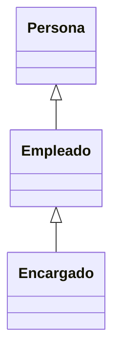

[toc]

# Introducción

Como ya has visto en anteriores unidades, las clases están compuestas por atributos y métodos. Una clase especifica las características comunes de un conjunto de objetos. 

De esta forma los programas que escribas estarán formados por un conjunto de clases a partir de las cuales irás creando objetos que se interrelacionarán unos con otros.

> ### En esta unidad se va a utilizar el concepto de objeto así como algunas de las diversas estructuras de control básicas que ofrece cualquier lenguaje de programación. Todos esos conceptos han sido explicados y utilizados en las unidades anteriores. Si consideras que es necesario hacer un repaso del concepto de objeto o del uso de las estructuras de control elementales, éste es el momento de hacerlo.

## Repaso del concepto de objeto

Desde el comienzo del módulo llevas utilizando el concepto de objeto para desarrollar tus programas de ejemplo. En las unidades anteriores se ha descrito un objeto como una entidad que contiene información y que es capaz de realizar ciertas operaciones con esa información. Según los valores que tenga esa información el objeto tendrá un estado determinado y según las operaciones que pueda llevar a cabo con esos datos serán responsables de un comportamiento concreto.

> # Recuerda que entre las características fundamentales de un objeto se encontraban la **identidad** (los objetos son únicos y por tanto distinguibles entre sí, aunque pueda haber objetos exactamente iguales), un **estado** (los atributos que describen al objeto y los valores que tienen en cada momento ) y un determinado **comportamiento** (acciones que se pueden realizar sobre el objeto).

Algunos ejemplos de objetos que podríamos imaginar podrían ser:

- Un coche de color rojo, marca SEAT, modelo Toledo, del año 2003. En este ejemplo tenemos una serie de atributos, como el color (en este caso rojo), la marca, el modelo, el año, etc. Así mismo también podríamos imaginar determinadas características como la cantidad de combustible que le queda, o el número de kilómetros recorridos hasta el momento.
- Un coche de color amarillo, marca Opel, modelo Astra, del año 2002.
- Otro coche de color amarillo, marca Opel, modelo Astra y también del año 2002. Se trataría de otro objeto con las mismas propiedades que el anterior, pero sería un segundo objeto.
- Un cocodrilo de cuatro metros de longitud y de veinte años de edad. 
- Un círculo de radio 2 centímetros, con centro en las coordenadas (0,0) y relleno de color amarillo.
- Un círculo de radio 3 centímetros, con centro en las coordenadas (1,2) y relleno de color verde.

Si observas los ejemplos anteriores podrás distinguir sin demasiada dificultad al menos tres familias de objetos diferentes, que no tienen nada que ver una con otra:

- Los coches.
- Los círculos.
- Los cocodrilos.

Es de suponer entonces que cada objeto tendrá determinadas posibilidades de comportamiento (acciones) dependiendo de la familia a la que pertenezcan. Por ejemplo, en el caso de los coches podríamos imaginar acciones como: arrancar, frenar, acelerar, cambiar de marcha, etc. En el caso de los cocodrilos podrías imaginar otras acciones como: desplazarse, comer, dormir, cazar, etc. Para el caso del círculo se podrían plantear acciones como: cálculo de la superficie del círculo, cálculo de la longitud de la circunferencia que lo rodea, etc.

Por otro lado, también podrías imaginar algunos atributos cuyos valores podrían ir cambiando en función de las acciones que se realizaran sobre el objeto: ubicación del coche (coordenadas), velocidad instantánea, kilómetros recorridos, velocidad media, cantidad de combustible en el depósito, etc. En el caso de los cocodrilos podrías imaginar otros atributos como: peso actual, el número de dientes actuales (irá perdiendo algunos a lo largo de su vida), el número de presas que ha cazado hasta el momento, etc.

Como puedes ver, un objeto puede ser cualquier cosa que puedas describir en términos de atributos y acciones. 

> # Un objeto no es más que la representación de cualquier entidad concreta o abstracta que puedas percibir o imaginar y que pueda resultar de utilidad para modelar los elementos el entorno del problema que deseas resolver.

## El concepto de clase

Está claro que dentro de un mismo programa tendrás la oportunidad de encontrar decenas, cientos o incluso miles de objetos. En algunos casos no se parecerán en nada unos a otros, pero también podrás observar que habrá muchos que tengan un gran parecido, compartiendo un mismo comportamiento y unos mismos atributos. Habrá muchos objetos que sólo se diferenciaran por los valores que toman algunos de esos atributos.

Es aquí donde entra en escena el concepto de clase. Está claro que no podemos definir la estructura y el comportamiento de cada objeto cada vez que va a ser utilizado dentro de un programa, pues la escritura del código sería una tarea interminable y redundante. La idea es poder disponer de una plantilla o modelo para cada conjunto de objetos que sean del mismo tipo, es decir, que tengan los mismos atributos y un comportamiento similar.

> # Una clase consiste en la definición de un tipo de objeto. Se trata de una descripción detallada de cómo van a ser los objetos que pertenezcan a esa clase indicando qué tipo de información contendrán (atributos) y cómo se podrá interactuar con ellos (comportamiento).

Como ya has visto en unidades anteriores, una clase consiste en un plantilla en la que se especifican:

- Los atributos que van a ser comunes a todos los objetos que pertenezcan a esa clase (información).
- Los métodos que permiten interactuar con esos objetos (comportamiento).

A partir de este momento podrás hablar ya sin confusión de objetos y de clases,sabiendo que los primeros son instancias concretas de las segundas, que no son más que una abstracción o definición.

Si nos volvemos a fijar en los ejemplos de objetos del apartado anterior podríamos observar que las clases serían lo que clasificamos como "familias" de objetos (coches, cocodrilos y círculos). 

> # En el lenguaje cotidiano de muchos programadores puede ser habitual la confusión entre los términos clase y objeto. Aunque normalmente el contexto nos permite distinguir si nos estamos refiriendo realmente a una clase (definición abstracta) o a un objeto (instancia concreta), hay que tener cuidado con su uso para no dar lugar a interpretaciones erróneas, especialmente durante el proceso de aprendizaje.

# Estructura y miembros de una clase

En unidades anteriores ya se indicó que para declarar una clase en Java se usa la palabra reservada `class`. En la declaración de una clase vas a encontrar:

- **Cabecera de la clase**. Compuesta por una serie de modificadores de acceso, la palabra reservada `class` y el nombre de la clase.
- **Cuerpo de la clase**. En él se especifican los distintos miembros de la clase: atributos y métodos. Es decir, el contenido de la clase.

```java
public class NombreDeLaClase [herencia] [interfaces]
{
	// Atributos de la clase
	...
	...
	...
	// Métodos de la clase
	...
	...
	...
}
```

Como puedes observar, el cuerpo de la clase es donde se declaran los atributos que caracterizan a los objetos de la clase y donde se define e implementa el comportamiento de dichos objetos; es decir, donde se declaran e implementan los métodos.

## Declaración de una clase.

La declaración de una clase en Java tiene la siguiente estructura general:

```java
// Cabecera de la clase
[modificadores] class <NombreClase> [herencia] [interfaces] {
	// Cuerpo de la clase
	Declaración de los atributos
	Declaración de los métodos
}
```

Un ejemplo básico pero completo podría ser:

```java
class Punto{
    // Atributos
    private int x,y;
    
    // Métodos
    int obtenerX () {
        return x;
    }
    int obtenerY() {
        return y;
    }
    void establecerX (int nuevoX) {
        x = nuevoX;
    }
    void establecerY (int nuevoY) {
        y= nuevoY;
    }
}
```

En este caso se trata de una clase muy sencilla en la que el cuerpo de la clase (el área entre las llaves) contiene el código y las declaraciones necesarias para que los objetos que se construyan (basándose en esta clase) puedan funcionar apropiadamente en un programa (declaraciones de atributos para contener el estado del objeto y métodos que implementen el comportamiento de la clase y los objetos creados a partir de ella).

Si te fijas en los distintos programas que se han desarrollado en los ejemplos de las unidades anteriores, podrás observar que cada uno de esos programas era en sí mismo una clase Java: se declaraban con la palabra reservada `class` y contenían algunos atributos (variables) así como algunos métodos (como mínimo el método `main`).

En el ejemplo anterior hemos visto lo mínimo que se tiene que indicar en la cabecera de una clase (el nombre de la clase y la palabra reservada `class`). Se puede proporcionar bastante más información mediante modificadores y otros indicadores como por ejemplo el nombre de su superclase (si es que esa clase hereda de otra), si implementa algún interfaz y algunas cosas más que irás aprendiendo poco a poco.

A la hora de implementar una clase Java (escribirla en un archivo con un editor de textos o con alguna herramienta integrada como por ejemplo Netbeans o Eclipse) debes tener en cuenta: 

- Por convenio, se ha decidido que en lenguaje Java los nombres de las clases deben de empezar por una letra mayúscula. Así, cada vez que observes en el código una palabra con la primera letra en mayúscula sabrás que se trata de una clase sin necesidad de tener que buscar su declaración. Además, si el nombre de la clase está formado por varias palabras, cada una de ellas también tendrá su primera letra en mayúscula. Siguiendo esta recomendación, algunos ejemplos de nombres de clases podrían ser: `Recta`, `Circulo`, `Coche`, `CocheDeportivo`, `Jugador`, `JugadorFutbol`, `AnimalMarino`, `AnimalAcuatico`, etc.
- El archivo en el que se encuentra una clase Java debe tener el mismo nombre que esa clase si queremos poder utilizarla desde otras clases que se encuentren fuera de ese archivo (clase principal del archivo).
- Tanto la definición como la implementación de una clase se incluye en el mismo archivo (archivo `.java`). En otros lenguajes como por ejemplo C++, definición e implementación podrían ir en archivos separados (por ejemplo en C++, serían sendos archivos con extensiones `.h` y `.cpp`).

## Cabecera de una clase.

En general, la declaración de una clase puede incluir los siguientes elementos y en el siguiente orden:

1. Modificadores tales como `public`, `abstract` o `final`.
2. El nombre de la clase (con la primera letra de cada palabra en mayúsculas, por convenio).
3. El nombre de su clase padre (superclase), si es que se especifica, precedido por la palabra reservada `extends` ("extiende" o "hereda de").
4. Una lista separada por comas de interfaces que son implementadas por la clase, precedida por la palabra reservada `implements` ("implementa").
5. El cuerpo de la clase, encerrado entre llaves `{...}`.

La sintaxis completa de una cabecera (los cuatro primeros puntos) queda de la forma:

```java
[modificadores] class <NombreClase> [extends <NombreSuperClase>][implements <NombreInterface1>][[implements<NombreInterface2>] ...] {
```

En el ejemplo anterior de la clase Punto teníamos la siguiente cabecera:

```java
class Punto {
```

En este caso no hay modificadores, ni indicadores de herencia, ni implementación de interfaces. Tan solo la palabra reservada `class` y el nombre de la clase. Es lo mínimo que puede haber en la cabecera de una clase.

La herencia y las interfaces las verás más adelante. Vamos a ver ahora cuáles son los modificadores que se pueden indicar al crear la clase y qué efectos tienen. Los modificadores de clase son:

```java
[public] [final | abstract]
```

Veamos qué significado tiene cada uno de ellos:

- Modificador `public`. Indica que la clase es visible (se pueden crear objetos de esa clase) desde cualquier otra clase. Es decir, desde cualquier otra parte del programa. Si no se especifica este modificador, la clase sólo podrá ser utilizada desde clases que estén en el mismo paquete. El concepto de paquete lo veremos más adelante. **Sólo puede haber una clase public (clase principal) en un archivo `.java`**. El resto de clases que se definan en ese archivo no serán públicas.
- Modificador `abstract`. Indica que la clase es abstracta. **Una clase abstracta no es instanciable**. Es decir, no es posible crear objetos de esa clase (habrá que utilizar clases que hereden de ella). En este momento es posible que te parezca que no tenga sentido que esto pueda suceder (si no puedes crear objetos de esa clase, ¿para qué la quieres?), pero puede resultar útil a la hora de crear una jerarquía de clases. Esto lo verás también más adelante al estudiar el concepto de herencia.
- Modificador `final`. Indica que no podrás crear clases que hereden de ella. También volverás a este modificador cuando estudies el concepto de herencia. **Los modificadores final y abstract son excluyentes (sólo se puede utilizar uno de ellos)**.

Todos estos modificadores y palabras reservadas las iremos viendo poco a poco, así que no te preocupes demasiado por intentar entender todas ellas en este momento.

En el ejemplo anterior de la clase Punto tendríamos una clase que sería sólo visible (utilizable) desde el mismo paquete en el que se encuentra la clase (modificador de acceso por omisión o de paquete, o `package`). Desde fuera de ese paquete no sería visible o accesible. Para poder utilizarla desde cualquier parte del código del programa bastaría con añadir el atributo `public`: 

```java
public class Punto{
    ...
}
```

## Cuerpo de una clase.

Como ya has visto anteriormente, el cuerpo de una clase se encuentra encerrado entre llaves y contiene la declaración e implementación de sus miembros. Los miembros de una clase pueden ser:

- **Atributos**, que especifican los datos que podrá contener un objeto de la clase.
- **Métodos**, que implementan las acciones que se podrán realizar con un objeto de la clase.

Una clase puede no contener en su declaración atributos o métodos, pero debe de contener al menos uno de los dos (**la clase no puede ser vacía**).

En el ejemplo anterior donde se definía una clase `Punto`, tendríamos los siguientes atributos:

- Atributo `x`, de tipo `int`.
- Atributo `y`, de tipo `int`.

Es decir, dos valores de tipo entero. Cualquier objeto de la clase `Punto` que sea creado almacenará en su interior dos números enteros (`x` e `y`). Cada objeto diferente de la clase `Punto` contendrá sendos valores `x` e `y`, que podráncoincidir o no con el contenido de otros objetos de esa misma clase `Punto`.

Por ejemplo, si se han declarado varios objetos de tipo `Punto`:

```java
Punto p1, p2, p3;
```

Sabremos que cada uno de esos objetos `p1`, `p2` y `p3` contendrán un par de coordenadas (`x`, `y`) que definen el estado de ese objeto. Puede que esos valores coincidan con los de otros objetos de tipo `Punto`, o puede que no, pero en cualquier caso serán objetos diferentes creados a partir del mismo molde (de la misma clase).

Por otro lado, la clase `Punto` también definía una serie de métodos:

- ```java
  int obtenerX () {
      return x;
  }
  ```
  
- ```java
  int a;int obtenerY() {
      return y;
  }
  ```
  
- ```java
  void establecerX (int nuevoX) {
      x= nuevoX; 
  }
  ```
  
- ```java
  void establecerY (int nuevoY) {
      y= nuevoY; 
  }
  ```

Cada uno de esos métodos puede ser llamado desde cualquier objeto que sea una instancia de la clase `Punto`. Se trata de operaciones que permiten manipular los datos (atributos) contenidos en el objeto bien para calcular otros datos o bien para modificar los propios atributos.

## Miembros estáticos o de clase.

Cada vez que se produce una instancia de una clase (es decir, se crea un objeto de esa clase), se desencadenan una serie de procesos (construcción del objeto) que dan lugar a la creación en memoria de un espacio físico que constituirá el objeto creado. De esta manera cada objeto tendrá sus propios miembros a imagen y semejanza de la plantilla propuesta por la clase.

Por otro lado, podrás encontrarte con ocasiones en las que determinados miembros de la clase (atributos o métodos) no tienen demasiado sentido como partes del objeto,sino más bien como partes de la clase en sí (partes de la plantilla, pero no de cada instancia de esa plantilla). Por ejemplo, si creamos una clase `Coche` y quisiéramos disponer de un atributo con el nombre de la clase (un atributo de tipo `String` con la cadena "Coche"), no tiene mucho sentido replicar ese atributo para todos los objetos de la clase `Coche`, pues para todos va a tener siempre el mismo valor (la cadena "Coche"). Es más, ese atributo puede tener sentido y existencia al margen de la existencia de cualquier objeto de tipo `Coche`. Podría no haberse creado ningún objeto de la clase `Coche` y sin embargo seguiría teniendo sentido poder acceder a ese atributo de nombre de la clase, pues se trata en efecto de un atributo de la propia clase más que de un atributo de cada objeto instancia de la clase.

Para poder definir miembros estáticos en Java se utiliza el modificador `static`. Los miembros (tanto atributos como métodos) declarados utilizando este modificador son conocidos como **miembros estáticos** o **miembros de clase**. A continuación vas a estudiar la creación y utilización de atributos y métodos. En cada caso verás cómo declarar y usar **atributos estáticos** y **métodos estáticos**.

# Atributos

Los **atributos** constituyen la estructura interna de los objetos de una clase. Se trata del conjunto de datos que los objetos de una determinada clase almacenan cuando son creados. Es decir es como si fueran variables cuyo ámbito de existencia es el objeto dentro del cual han sido creadas. Fuera del objeto esas variables no tienen sentido y si el objeto deja de existir, esas variables también deberían hacerlo (proceso de destrucción del objeto). Los atributos a veces también son conocidos con el nombre de **variables miembro** o **variables de objeto**.

Los atributos pueden ser de cualquier tipo de los que pueda ser cualquier otra variable en un programa en
Java: desde tipos elementales como `int`, `boolean` o `float` hasta tipos referenciados como `arrays`, `Strings` u `objetos`.

Además del tipo y del nombre, la declaración de un atributo puede contener también algunos modificadores (como por ejemplo `public`, `private`, `protected` o `static`). Por ejemplo, en el caso de la clase `Punto` que habíamos definido en el aparado anterior podrías haber declarado sus atributos como:

```java
public int x;
public int y;
```

De esta manera estarías indicando que ambos atributos son públicos, es decir, accesibles por cualquier parte del código programa que tenga acceso a un objeto de esa clase.

> Como ya verás más adelante al estudiar el concepto de encapsulación, lo normal es declarar todos los atributos (o al menos la mayoría) como privados (`private`) de manera que si se desea acceder o manipular algún atributo se tenga que hacer a través de los métodos proporcionados por la clase.

## Declaración de atributos.

La sintaxis general para la declaración de un atributo en el interior de una clase es:

```java
[modificadores] <tipo> <nombreAtributo>;
```

Ejemplos:

```java
int x;
public int elementoX, elementoY;
private int x1, y1, z1;
static double descuentoGeneral;
final boolean CASADO;
private Punto p1;
```

Te suena bastante, ¿verdad? La declaración de los atributos en una clase es exactamente igual a la declaración de cualquier variable tal y como has estudiado en las unidades anteriores y similar a como se hace en cualquier lenguaje de programación. Es decir mediante la indicación del tipo y a continuación el nombre del atributo, pudiéndose declarar varios atributos del mismo tipo mediante una lista de nombres de atributos separada por comas (exactamente como ya has estudiado al declarar variables).

La declaración de un atributo (o variable miembro o variable de objeto) consiste en la declaración de una variable que únicamente existe en el interior del objeto y por tanto su vida comenzará cuando el objeto comience a existir (el objeto sea creado). Esto significa que cada vez que se cree un objeto se crearán tantas variables como atributos contenga ese objeto en su interior (definidas en la clase, que es la plantilla o "molde" del objeto). Todas esas variables estarán encapsuladas dentro del objeto y sólo tendrán sentido dentro de él.

En el ejemplo que estamos utilizando de objetos de tipo `Punto` (instancias de la clase `Punto`), cada vez que se cree un nuevo `Punto` `p1`, se crearán sendos atributos `x`, `y` de tipo int que estarán en el interior de ese punto `p1`.

Si a continuación se crea un nuevo objeto `Punto` `p2`, se crearán otros dos nuevos atributos `x`, `y` de tipo `int` que estarán esta vez alojados en el interior de `p2`. Y así sucesivamente...

Dentro de la declaración de un atributo puedes encontrar tres partes:

- **Modificadores**. Son palabras reservadas que permiten modificar la utilización del atributo (indicar el control de acceso, si el atributo es constante, si se trata de un atributo de clase, etc.). Los iremos viendo uno a uno.
- **Tipo**. Indica el tipo del atributo. Puede tratarse de un tipo primitivo (`int`, `char`, `boolean`, `double`...) o bien de uno referenciado (`objeto`, `array`, etc.).
- **Nombre**. Identificador único para el nombre del atributo. Por convenio se suelen utilizar las minúsculas. En caso de que se trate de un identificador que contenga varias palabras, a partir de la segunda palabra se suele poner la letra de cada palabra en mayúsculas. Por ejemplo: `primerValor`,  `valor`, `puertaIzquierda`, `cuartoTrasero`, `equipoVecendor`, `sumaTotal`, `nombreCandidatoFinal`, etc.  Cualquier identificador válido de Java será admitido como nombre de atributo válido, pero es importante seguir este convenio para facilitar la legibilidad del código (todos los programadores de Java lo utilizan).

Como puedes observar, los atributos de una clase también pueden contener modificadores en su declaración (como sucedía al declarar la propia clase). Estos modificadores permiten indicar cierto comportamiento de una tributo a la hora de utilizarlo. Entre los modificadores de un atributo podemos distinguir:

- **Modificadores de acceso**. Indican la forma de acceso al atributo desde otra clase. Son modificadores excluyentes entre sí. Sólo se puede poner uno.
- **Modificadores de contenido**. No son excluyentes. Pueden aparecer varios a la vez. 
- **Otros modificadores**: `transient` y `volatile`. El primero se utiliza para indicar que un atributo es transitorio (no persistente) y el segundo es para indicar al compilador que no debe realizar optimizaciones sobre esa variable. Es más que probable que no necesites utilizarlos en este módulo.

Aquí tienes la sintaxis completa de la declaración de un atributo teniendo en cuenta la lista de todos los modificadores e indicando cuáles son incompatibles unos con otros:

```java
[private | protected | public] [static] [final] [transient] [volatile] <tipo><nombreAtributo>;
```

Vamos a estudiar con detalle cada uno de ellos.

## Modificadores de acceso.

Los modificadores de acceso disponibles en Java para un atributo son:

- **Modificador de acceso `public`**. Indica que cualquier clase (por muy ajena o lejana que sea) tiene acceso a ese atributo. No es muy habitual declarar atributos públicos (`public`).
- **Modificador de acceso `protected`**. En este caso se permitirá acceder al atributo desde cualquier subclase (lo verás más adelante al estudiar la herencia) de la clase en la que se encuentre declarado el atributo, y también desde las clases del mismo paquete.
- **Modificador de acceso por omisión** (o **de paquete**). Si no se indica ningún modificador de acceso en la declaración del atributo, se utilizará este tipo de acceso. Se permitirá el acceso a este atributo desde todas las clases que estén dentro del mismo paquete (`package`) que esta clase (la que contiene el atributo que se está declarando). No es necesario escribir ninguna palabra reservada. Si no se pone nada se supone se desea indicar este modo de acceso.
- **Modificador de acceso `private`**. Indica que sólo se puede acceder al atributo desde dentro de la propia clase. El atributo estará "oculto" para cualquier otra zona de código fuera de la clase en la que está declarado el atributo. Es lo opuesto a lo que permite `public`.

A continuación puedes observar un resumen de los distintos niveles accesibilidad que permite cada modificador:

|                 modificador | Misma clase | Mismo paquete | Subclase | Otro paquete |
| --------------------------: | :---------: | :-----------: | :------: | :----------: |
|                    `public` |      ✔      |       ✔       |    ✔     |      ✔       |
|                 `protected` |      ✔      |       ✔       |    ✔     |      ❌       |
| Sin modificador (`package`) |      ✔      |       ✔       |    ❌     |      ❌       |
|                   `private` |      ✔      |       ❌       |    ❌     |      ❌       |

> ¡Recuerda que **los modificadores de acceso son excluyentes**! Sólo se puede utilizar uno de ellos en la declaración de un atributo.

## Modificadores de contenido.

Los modificadores de contenido no son excluyentes (pueden aparecer varios para un mismo atributo). Son los siguientes:

- **Modificador `static`**. Hace que el atributo sea común para todos los objetos de una misma clase. Es decir, todos los objetos de la clase compartirán ese mismo atributo con el mismo valor. Es un caso de **miembro estático** o **miembro de clase**: un **atributo estático** o **atributo de clase** o **variable de clase**.
- **Modificador `final`**. Indica que el atributo es una constante. Su valor no podrá ser modificado a lo largo de la vida del objeto. Por convenio, el nombre de los atributos constantes (`final`) se escribe con todas las letras en mayúsculas.

En el siguiente apartado sobre atributos estáticos verás un ejemplo completo de un atributo estático (`static`). Veamos ahora un ejemplo de atributo constante (`final`).

Imagina que estás diseñando un conjunto de clases para trabajar con expresiones geométricas (figuras, superficies, volúmenes, etc.) y necesitas utilizar muy a menudo la constante pi con abundantes cifras significativas, por ejemplo, 3.14159265. Utilizar esa constante literal muy a menudo puede resultar tedioso además de poco operativo (imagina que el futuro hubiera que cambiar la cantidad de cifras significativas). La idea es declararla una sola vez, asociarle un nombre simbólico (un identificador) y utilizar ese identificador cada vez que se necesite la constante. En tal caso puede resultar muy útil declarar un atributo final con el valor 3.14159265 dentro de la clase en la que se considere oportuno utilizarla. El mejor identificador que podrías utilizar para ella será probablemente el propio nombre de la constante (y en mayúsculas, para seguir el convenio de nombres), es decir, `PI`.

Así podría quedar la declaración del atributo:

```java
class claseGeometria {
    // Declaración de constantes
    public final float PI = 3.14159265;
	...
```

## Atributos estáticos.

Como ya has visto, el modificador `static` hace que el atributo sea común (el mismo) para todos los objetos de una misma clase. En este caso sí podría decirse que la existencia del atributo no depende de la existencia del objeto, sino de la propia clase y por tanto sólo habrá uno, independientemente del número de objetos que se creen. El atributo será siempre el mismo para todos los objetos y tendrá un valor único independientemente de cada objeto. Es más, aunque no exista ningún objeto de esa clase, el atributo sí existirá y podrá contener un valor (pues se trata de un atributo de la clase más que del objeto).

Uno de los ejemplos más habituales (y sencillos) de atributos estáticos o de clase es el de un contador que indica el número de objetos de esa clase que se han ido creando. Por ejemplo, en la clase de ejemplo `Punto` podrías incluir un atributo que fuera ese contador para llevar un registro del número de objetos de la clase `Punto` que se van construyendo durante la ejecución del programa.

Otro ejemplo de atributo estático (y en este caso también constante) que también se ha mencionado anteriormente al hablar de miembros estáticos era disponer de un atributo `nombre`, que contuviera un `String` con el nombre de la clase. Nuevamente ese atributo sólo tiene sentido para la clase, pues habrá de ser compartido por todos los objetos que sean de esa clase (es el nombre de la clase a la que pertenecen los objetos y por tanto siempre será la misma e igual para todos, no tiene sentido que cada objeto de tipo `Punto` almacene en su interior el nombre de la clase, eso lo debería hacer la propia clase).

```java
class Punto {
	// Coordenadas del punto
    private int x, y;
    // Atributos de clase: cantidad de puntos creados hasta el momento
    public static cantidadPuntos;
```

Obviamente, para que esto funcione como estás pensando, también habrá que escribir el código necesario para que cada vez que se cree un objeto de la clase `Punto` se incremente el valor del atributo `cantidadPuntos`.

Volverás a este ejemplo para implementar esa otra parte cuando estudies los constructores.

# Métodos

Como ya has visto anteriormente, los métodos son las herramientas que nos sirven para definir el comportamiento de un objeto en sus interacciones con otros objetos. Forman parte de la estructura interna del objeto junto con los atributos.

En el proceso de declaración de una clase que estás estudiando ya has visto cómo escribir la cabecera de la clase y cómo especificar sus atributos dentro del cuerpo de la clase. Tan solo falta ya declarar los métodos, que estarán también en el interior del cuerpo de la clase junto con los atributos.

> ### Los métodos suelen declararse después de los atributos. Aunque atributos y métodos pueden aparecer mezclados por todo el interior del cuerpo de la clase es aconsejable no hacerlo para mejorar la claridad y la legibilidad del código. De ese modo, cuando echemos un vistazo rápido al contenido de una clase, podremos ver rápidamente los atributos al principio (normalmente ocuparán menos líneas de código y serán fáciles de reconocer) y cada uno de los métodos inmediatamente después.

Cada método puede ocupar un número de líneas de código más o menos grande en función de la complejidad del proceso que pretenda implementar.

Los métodos representan la interfaz de una clase. Son la forma que tienen otros objetos de comunicarse con un objeto determinado solicitándole cierta información o pidiéndole que lleve a cabo una determinada acción. Este modo de programar, como ya has visto en unidades anteriores, facilita mucho la tarea al desarrollador de aplicaciones, pues le permite abstraerse del contenido de las clases haciendo uso únicamente del interfaz (métodos).

## Declaración de un método.

La definición de un método se compone de dos partes:

- **Cabecera** del método, que contiene el nombre del método junto con el tipo devuelto, un conjunto de posibles modificadores y una lista de parámetros.
- **Cuerpo** del método, que contiene las sentencias que implementan el comportamiento del método (incluidas posibles sentencias de declaración de variables locales).

Los elementos mínimos que deben aparecer en la declaración de un método son:

- El **tipo** devuelto por el método.
- El **nombre** del método.
- Los **paréntesis**.
- El **cuerpo** del método entre llaves: `{ }`.

Por ejemplo, en la clase `Punto` que se ha estado utilizando en los apartados anteriores podrías encontrar el siguiente método:

```java
int obtenerX(){
    // Cuerpo del método
    ...
}
```

Donde:

- El **tipo** devuelto por el método es `int`.
- El **nombre** del método es `obtenerX`.
- **No recibe ningún parámetro**: aparece una lista vacía entre paréntesis: `( )`.
- El **cuerpo** del método es todo el código que habría encerado entre llaves: `{ }`.

Dentro del cuerpo del método podrás encontrar declaraciones de variables, sentencias y todo tipo de estructuras de control (bucles, condiciones, etc.) que has estudiado en los apartados anteriores.

Ahora bien, la declaración de un método puede incluir algunos elementos más. Vamos a estudiar con detalle cada uno de ellos.

## Cabecera de método.

La declaración de un método puede incluir los siguientes elementos:

1. **Modificadores** (como por ejemplo los ya vistos `public` o `private`, más algunos otros que irás conociendo poco a poco). No es obligatorio incluir modificadores en la declaración.
2. El **tipo devuelto** (o tipo de retorno), que consiste en el tipo de dato (primitivo o referencia) que el método devuelve tras ser ejecutado. Si eliges `void` como tipo devuelto, el método no devolverá ningún valor.
3. El **nombre** del método, aplicándose para los nombres el mismo convenio que para los atributos.
4. Una **lista de parámetros** separados por comas y entre paréntesis donde cada parámetro debe ir precedido por su tipo. Si el método no tiene parámetros la lista estará vacía y únicamente aparecerán los paréntesis.
5. Una **lista de excepciones** que el método puede lanzar. Se utiliza la palabra reservada `throws` seguida de una lista de nombres de excepciones separadas por comas. No es obligatorio que un método incluya una lista de excepciones, aunque muchas veces será conveniente. En unidades anteriores ya has trabajado con el concepto de excepción y más adelante volverás a hacer uso de ellas.
6. El **cuerpo** del método, encerrado entre llaves. El cuerpo contendrá el código del método (una lista sentencias y estructuras de control en lenguaje Java) así como la posible declaración de variables locales.

La sintaxis general de la cabecera de un método podría entonces quedar así:

```java
[private | protected | public] [static] [abstract] [final] [native] [synchronized] <tipo><nombreMétodo> ( [<lista_parametros>] ) [throws<lista_excepciones>]
```

Como sucede con todos los identificadores en Java (variables, clases, objetos, métodos, etc.), puede usarse cualquier identificador que cumpla las normas. Ahora bien, para mejorar la legibilidad del código, se ha establecido el siguiente convenio para nombrar los métodos: utilizar un verbo en minúscula o bien un nombre formado por varias palabras que comience por un verbo en minúscula, seguido por adjetivos, nombres, etc. los cuales sí aparecerán en mayúsculas.

Algunos ejemplos de métodos que siguen este convenio podrían ser: `ejecutar`, `romper`, `mover`, `subir`, `responder`, `obtenerX`, `establecerValor`, `estaVacio`, `estaLleno`, `moverFicha`, `subirPalanca`, `responderRapido`, `girarRuedaIzquierda`, `abrirPuertaDelantera`, `cambiarMarcha`, etc.

En el ejemplo de la clase `Punto`, puedes observar cómo los métodos `obtenerX` y `obtenerY` siguen el convenio de nombres para los métodos, devuelven en ambos casos un tipo `int`, su lista de parámetros es vacía (no tienen parámetros) y no lanzan ningún tipo de excepción:

- ```java
  abstract int obtenerX()
  ```

- ```java
  int obtenerY()
  ```

## Modificadores en la declaración de un método.

En la declaración de un método también pueden aparecer modificadores (como en la declaración de la clase o delos atributos). Un método puede tener los siguientes tipos de modificadores:

- **Modificadores de acceso**. Son los mismos que en el caso de los atributos (por omisión o de paquete (`package`), `public`, `private` y `protected`) y tienen el mismo cometido (acceso al método sólo por parte de clases del mismo paquete, o por cualquier parte del programa, o sólo para la propia clase, o también para las subclases).
- **Modificadores de contenido**. Son también los mismos que en el caso de los atributos (`static` y `final`) aunque su significado no es el mismo.
- **Otros modificadores** (no son aplicables a los atributos, sólo a los métodos): `abstract`, `native`, `synchronized`.

Un método `static` es un método cuya implementación es igual para todos los objetos de la clase y sólo tendrá acceso a los atributos estáticos de la clase (dado que se trata de un método de clase y no de objeto, sólo podrá acceder a la información de clase y no la de un objeto en particular). Este tipo de métodos pueden ser llamados sin necesidad de tener un objeto de la clase instanciado.

En Java un ejemplo típico de métodos estáticos se encuentra en la clase `Math`, cuyos métodos son todos estáticos (`Math.abs`, `Math.sin`, `Math.cos`, etc.). Como habrás podido comprobar en este ejemplo, la llamada a métodos estáticos se hace normalmente usando el nombre de la propia clase y no el de una instancia (objeto), pues se trata realmente de un método de clase. En cualquier caso, los objetos también admiten la invocación de los métodos estáticos de su clase y funcionaría correctamente.

Un método `final` es un método que no permite ser sobrescrito por las clases descendientes de la clase a la quepertenece el método. Volverás a ver este modificador cuando estudies en detalle la herencia.

El modificador `native` es utilizado para señalar que un método ha sido implementado en código nativo (en un lenguaje que ha sido compilado a lenguaje máquina, como por ejemplo C o C++). En estos casos simplemente se indica la cabecera del método, pues no tiene cuerpo escrito en Java.

Un método `abstract` (método abstracto) es un método que no tiene implementación (el cuerpo está vacío). La implementación será realizada en las clases descendientes. Un método sólo puede ser declarado como `abstract` si se encuentra dentro de una clase `abstract`. También volverás a este modificador en unidades posteriores cuando trabajes con la herencia.

Por último, si un método ha sido declarado como `synchronized`, el entorno de ejecución obligará a que cuando un proceso esté ejecutando ese método, el resto de procesos que tengan que llamar a ese mismo método deberán esperar a que el otro proceso termine. Puede resultar útil si sabes que un determinado método va a poder ser llamado concurrentemente por varios procesos a la vez. Por ahora no lo vas a necesitar.

Dada la cantidad de modificadores que has visto hasta el momento y su posible aplicación en la declaración de clases, atributos o métodos, veamos un resumen de todos los que has visto y en qué casos pueden aplicarse:

|               modificador | Clase | Atributo | Método |
| ------------------------: | :---: | :------: | :----: |
| Sin modificador (package) |   ✔   |    ✔     |   ✔    |
|                  `public` |   ✔   |    ✔     |   ✔    |
|                 `private` |   ❌   |    ✔     |   ✔    |
|               `protected` |   ✔   |    ✔     |   ✔    |
|                  `static` |   ❌   |    ✔     |   ✔    |
|                   `final` |   ✔   |    ✔     |   ✔    |
|            `synchronized` |   ❌   |    ❌     |   ✔    |
|                  `native` |   ❌   |    ❌     |   ✔    |
|                `abstract` |   ✔   |    ❌     |   ✔    |

## Parámetros en un método.

La lista de parámetros de un método se coloca tras el nombre del método. Esta lista estará constituida por  pares de la forma `<tipoParametro> <nombreParametro>`. Cada uno de esos pares estará separado por comas y la lista completa estará encerrada entre paréntesis:

```java
<tipo> nombreMetodo ( <tipo_1> <nombreParametro_1>, <tipo_2> <nombreParametro_2>, ..., <tipo_n><nombreParametro_n> )
```

Si la lista de parámetros es vacía, tan solo aparecerán los paréntesis:

```java
<tipo> <nombreMetodo> ( )
```

A la hora de declarar un método, debes tener en cuenta:

- Puedes incluir cualquier cantidad de parámetros. Se trata de una decisión del programador, pudiendo ser incluso una lista vacía.
- Los parámetros podrán ser de cualquier tipo (tipos primitivos, referencias, objetos, arrays, etc.).
- No está permitido que el nombre de una variable local del método coincida con el nombre de un parámetro.
- No puede haber dos parámetros con el mismo nombre. Se produciría ambigüedad.
- Si el nombre de algún parámetro coincide con el nombre de un atributo de la clase, éste será ocultado por el parámetro. Es decir, al indicar ese nombre en el código del método estarás haciendo referencia al parámetro y no al atributo. Para poder acceder al atributo tendrás que hacer uso del operador de autorreferencia `this`, que verás un poco más adelante.
- En Java el paso de parámetros es siempre por valor, excepto en el caso de los tipos referenciados (por ejemplo los objetos) en cuyo caso se está pasando efectivamente una referencia. La referencia (el objeto en sí mismo) no podrá ser cambiada pero sí elementos de su interior (atributos) a través de sus métodos o por acceso directo si se trata de un miembro público.

Es posible utilizar una construcción especial llamada `varargs` (argumentos variables) que permite que un método pueda tener un número variable de parámetros. Para utilizar este mecanismo se colocan unos puntos suspensivos (tres puntos: `...`) después del tipo del cual se puede tener una lista variable de argumentos, un espacio en blanco y a continuación el nombre del parámetro que aglutinará la lista de argumentos variables.

```java
<tipo><nombreMetodo> (<tipo> ... <nombre>)
```

Es posible además mezclar el uso de `varargs` con parámetros fijos. En tal caso, la lista de parámetros variables debe aparecer al final (y sólo puede aparecer una).
En realidad se trata una manera transparente de pasar un `array` con un número variable de elementos para no tener que hacerlo manualmente. Dentro del método habrá que ir recorriendo el `array` para ir obteniendo cada uno de los elementos de la lista de argumentos variables.

## Cuerpo de un método.

El interior de un método (cuerpo) está compuesto por una serie de sentencias en lenguaje Java:

- Sentencias de declaración de variables locales al método.
- Sentencias que implementan la lógica del método (estructuras de control como bucles o condiciones; utilización de métodos de otros objetos; cálculo de expresiones matemáticas, lógicas o de cadenas; creación de nuevos objetos, etc.). Es decir, todo lo que has visto en las unidades anteriores. 
- Sentencia de devolución del valor de retorno (`return`). Aparecerá al final del método y es la que permite devolver la información que se le ha pedido al método. Es la última parte del proceso y la forma de comunicarse con la parte de código que llamó al método (paso de mensaje de vuelta). Esta sentencia de devolución siempre tiene que aparecer al final del método. Tan solo si el tipo devuelto por el método es `void` (vacío) no debe aparecer (pues no hay que devolver nada al código llamante).

En el ejemplo de la clase `Punto`, tenías los métodos `obtenerX` y `obtenerY`. Veamos uno de ellos:

```java
int obtenerX(){
	return x;
}
```

En ambos casos lo único que hace el método es precisamente devolver un valor (utilización de la sentencia `return`). No recibe parámetros (mensajes o información de entrada) ni hace cálculos, ni obtiene resultados intermedios o finales. Tan solo devuelve el contenido de un atributo. Se trata de uno de los métodos más sencillos que se pueden implementar: un método que devuelve el valor de un atributo. En inglés se les suele llamar métodos de tipo `get`, que en inglés significa `obtener`.

Además de esos dos métodos, la clase también disponía de otros dos que sirven para la función opuesta (`establecerX` y `establecerX`). Veamos uno de ellos:

```java
void establecerX (int nuevoX){
	x= nuevoX;
}
```

En este caso se trata de pasar un valor al método (parámetro `vx` de tipo `int`) el cual será utilizado para modificar el contenido del atributo `x` del objeto. Como habrás podido comprobar, ahora no se devuelve ningún valor (el tipo devuelto es `void` y no hay sentencia `return`). En inglés se suele hablar de métodos de tipo `set`, que en inglés significa poner o fijar (establecer un valor). El método `establecerY` es prácticamente igual pero para establecer el valor del atributo `y`.

Normalmente el código en el interior de un método será algo más complejo y estará formado un conjunto de sentencias en las que se realizarán cálculos, se tomarán decisiones, se repetirán acciones, etc. Puedes ver un ejemplo más completo en el siguiente ejercicio.

## Sobrecarga de métodos

En principio podrías pensar que un método puede aparecer una sola vez en la declaración de una clase (no se debería repetir el mismo nombre para varios métodos). Pero no tiene porqué siempre suceder así. Es posible tener varias versiones de un mismo método (varios métodos con el mismo nombre) gracias a la sobrecarga de métodos.

El lenguaje Java soporta la característica conocida como sobrecarga de métodos. Ésta permite declarar en una misma clase varias versiones del mismo método con el mismo nombre. La forma que tendrá el compilador de distinguir entre varios métodos que tengan el mismo nombre será mediante la lista de parámetros del método: si el método tiene una lista de parámetros diferente, será considerado como un método diferente (aunque tenga el mismo nombre) y el analizador léxico no producirá un error de compilación al encontrar dos nombres de método iguales en la misma clase.

Imagínate que estás desarrollando una clase para escribir sobre un lienzo que permite utilizar diferentes tipografías en función del tipo de información que se va a escribir. Es probable que necesitemos un método diferente según se vaya a pintar un número entero (`int`), un número real (`double`) o una cadena de caracteres (`String`). Una primera opción podría ser definir un nombre de método diferente dependiendo de lo que se vaya a escribir en el lienzo. Por ejemplo:

- Método `pintarEntero (int entero)`.
- Método `pintarReal (double real)`.
- Método `pintarCadena (double String)`.
- Método `pintarEnteroCadena (int entero, String cadena)`.

Y así sucesivamente para todos los casos que desees contemplar...

La posibilidad que te ofrece la sobrecarga es utilizar un mismo nombre para todos esos métodos (dado que en el fondo hacen lo mismo: pintar). Pero para poder distinguir unos de otros será necesario que siempre exista alguna diferencia entre ellos en las listas de parámetros (bien en el número de parámetros, bien en el tipo de los parámetros). Volviendo al ejemplo anterior, podríamos utilizar un mismo nombre, por ejemplo `pintar`, para todos los métodos anteriores:

- Método `pintar (int entero)`.
- Método `pintar (double real)`.
- Método `pintar (double String)`.
- Método `pintar (int entero, String cadena)`.

En este caso el compilador no va a generar ningún error pues se cumplen las normas ya que unos métodos son perfectamente distinguibles de otros (a pesar de tener el mismo nombre) gracias a que tienen listas de parámetros diferentes.

Lo que sí habría producido un error de compilación habría sido por ejemplo incluir otro método pintar (`int` entero), pues es imposible distinguirlo de otro método con el mismo nombre y con la misma lista de parámetros (ya existe un método `pintar` con un único parámetro de tipo `int`).

También debes tener en cuenta que el tipo devuelto por el método no es considerado a la hora de identificar un método, así que un tipo devuelto diferente no es suficiente para distinguir un método de otro. Es decir, no podrías definir dos métodos exactamente iguales en nombre y lista de parámetros e intentar distinguirlos indicando un tipo devuelto diferente. El compilador producirá un error de duplicidad en el nombre del método y no te lo permitirá. 

> ### Es conveniente no abusar de sobrecarga de métodos y utilizarla con cierta moderación (cuando realmente puede beneficiar su uso), dado que podría hacer el código menos legible.

## Sobrecarga de operadores.

Del mismo modo que hemos visto la posibilidad de sobrecargar métodos (disponer de varias versiones de un método con el mismo nombre cambiando su lista de parámetros), podría plantearse también la opción de sobrecargar operadores del lenguaje tales como `+`, `‐`, `*`, `( )`, `<`, `>`, etc. para darles otro significado dependiendo del tipo de objetos con los que vaya a operar.

En algunos casos puede resultar útil para ayudar a mejorar la legibilidad del código, pues esos operadores resultan muy intuitivos y pueden dar una idea rápida de cuál es su funcionamiento.

Un típico ejemplo podría ser el de la sobrecarga de operadores aritméticos como la suma (+) o el producto (\*) para operar con fracciones. Si se definen objetos de una clase `Fracción` (que contendrá los atributos `numerador` y `denominador`) podrían sobrecargarse los operadores aritméticos (habría que redefinir el operador suma (`+`) para la suma, el operador asterisco (`*`) para el producto, etc.) para esta clase y así podrían utilizarse para sumar o multiplicar objetos de tipo `Fraccion` mediante el algoritmo específico de suma o de producto del objeto `Fraccion` (pues esos operadores no están preparados en el lenguaje para operar con esos objetos).

En algunos lenguajes de programación como por ejemplo C++ o C# se permite la sobrecarga, pero no es algo soportado en todos los lenguajes. ¿Qué sucede en el caso concreto de Java?

> ### El lenguaje Java **NO** soporta la sobrecarga de operadores.

En el ejemplo anterior de los objetos de tipo Fracción, habrá que declarar métodos en la clase `Fraccion` que se encarguen de realizar esas operaciones, pero no lo podremos hacer sobrecargando los operadores del lenguaje (los símbolos de la suma, resta, producto, etc.). Por ejemplo:

```java
public Fraccion sumar (Fraccion sumando)
public Fraccion multiplicar (Fraccion multiplicando)
```

Y así sucesivamente...

Dado que en este módulo se está utilizando el lenguaje Java para aprender a programar, no podremos hacer uso de esta funcionalidad. Más adelante, cuando aprendas a programar en otros lenguajes, es posible que sí tengas la posibilidad de utilizar este recurso.

## La referencia `this`.

La palabra reservada `this` consiste en una referencia al objeto actual. El uso de este operador puede resultar muy útil a la hora de evitar la ambigüedad que puede producirse entre el nombre de un parámetro de un método y el nombre de un atributo cuando ambos tienen el mismo identificador (mismo nombre). En tales casos el parámetro "oculta" al atributo y no tendríamos acceso directo a él (al escribir el identificador estaríamos haciendo referencia al parámetro y no al atributo). En estos casos la referencia `this` nos permite acceder a estos atributos ocultados por los parámetros.

Dado que `this` es una referencia a la propia clase en la que te encuentras en ese momento, puedes acceder a sus atributos mediante el operador punto (`.`) como sucede con cualquier otra clase u objeto. Por tanto, en lugar deponer el nombre del atributo (que estos casos haría referencia al parámetro), podrías escribir `this.nombreAtributo`, de manera que el compilador sabrá que te estás refiriendo al atributo y se eliminará la ambigüedad.

En el ejemplo de la clase `Punto`, podríamos utilizar la referencia `this` si el nombre del parámetro del método coincidiera con el del atributo que se desea modificar. Por ejemplo:

```java
class Punto{
    private int x,y;
	
    void establecerX (int nuevaX){
		int x = 1; //<<<--- metodo
        this.x = 1; //<<<--- clase
        this.x=x;
        this.x=nuevaX;
	}
}
```

En este caso ha sido indispensable el uso de `this`, pues si no sería imposible saber en qué casos te estás refiriendo al parámetro `x` y en cuáles al atributo `x`. Para el compilador el identificador `x` será siempre el parámetro, pues ha "ocultado" al atributo.

> ### En algunos casos puede resultar útil hacer uso de la referencia `this` aunque no sea necesario, pues puede ayudara mejorar la legibilidad del código.

## Métodos estáticos.

Como ya has visto en ocasiones anteriores, un método estático es un método que puede ser usado directamente desde la clase, sin necesidad de tener que crear una instancia para poder utilizar al método. También son conocidos como **métodos de clase** (como sucedía con los atributos de clase), frente a los métodos de objeto (es necesario un objeto para poder disponer de ellos).

Los métodos estáticos no pueden manipular atributos de instancias (objetos) sino atributos estáticos (de clase) y suelen ser utilizados para realizar operaciones comunes a todos los objetos de la clase, más que para una instancia concreta.

Algunos ejemplos de operaciones que suelen realizarse desde métodos estáticos:

- **Acceso a atributos específicos de clase**: incremento o decremento de contadores internos de la clase (`node instancias`), acceso a un posible atributo de nombre de la clase, etc.
- **Operaciones genéricas relacionadas con la clase pero que no utilizan atributos de instancia**. Por ejemplo una clase `NIF` (o `DNI`) que permite trabajar con el `DNI` y la letra del `NIF` y que proporciona funciones adicionales para calcular la letra `NIF` de un número de `DNI` que se le pase como parámetro. Ese método puede ser interesante para ser usado desde fuera de la clase de manera independiente a la existencia de objetos de tipo `NIF`.

En la biblioteca de Java es muy habitual encontrarse con clases que proporcionan métodos estáticos que pueden resultar muy útiles para cálculos auxiliares, conversiones de tipos, etc. Por ejemplo, la mayoría de las clases del paquete `java.lang` que representan tipos (`Integer`, `String`, `Float`, `Double`, `Boolean`, etc.) ofrecen métodos estáticos para hacer conversiones. Aquí tienes algunos ejemplos:

- ```java
  static String valueOf(int i)
  ```

  Devuelve la representación en formato `String` (cadena) de un valor `int`. Se trata de un método que no tiene que ver nada en absoluto con instancias de concretas de `String`, sino de un método auxiliar que puede servir como herramienta para ser usada desde otras clases. Se utilizaría directamente con el nombre de la clase. Por ejemplo: 

  - ```java
    String enteroCadena = String.valueOf(23).
    ```

- ```java
  static String valueOf(float f)
  ```

  Algo similar para un valor de tipo `float`. Ejemplo de uso:

  - ```java
    String floatCadena = String.valueOf(24.341)
    ```

- ```java
  static int parseInt(String s)
  ```

  En este caso se trata de un método estático de la clase `Integer`. Analiza la cadena pasada como parámetro y la transforma en un `int`. Ejemplo de uso: 

  - ```java
    int cadenaEntero=Integer.parseInt ("‐12")
    ```

Todos los ejemplos anteriores son casos en los que se utiliza directamente la clase como una especie de caja de herramientas que contiene métodos que pueden ser utilizados desde cualquier parte, por eso suelen ser métodos públicos.

# Encapsulación, control de acceso y visibilidad.

Dentro de la Programación Orientada a Objetos ya has visto que es muy importante el concepto de ocultación, la cual ha sido lograda gracias a la encapsulación de la información dentro de las clases. De esta manera una clase puede ocultar parte de su contenido o restringir el acceso a él para evitar que sea manipulado de manera inadecuada. Los modificadores de acceso en Java permiten especificar el ámbito de visibilidad de los miembros de una clase, proporcionando así un mecanismo de accesibilidad a varios niveles.

Acabas de estudiar que cuando se definen los miembros de una clase (atributos o métodos), e incluso la propia clase, se indica (aunque sea por omisión) un modificador de acceso. En función de la visibilidad que se desee que tengan los objetos o los miembros de esos objetos se elegirá alguno de los modificadores de acceso que has estudiado. Ahora que ya sabes cómo escribir una clase completa (declaración de la clase, declaración de sus atributos y declaración de sus métodos), vamos a hacer un repaso general de las opciones de visibilidad (control de acceso) que has estudiado.

Los modificadores de acceso determinan si una clase puede utilizar determinados miembros (acceder a atributos o invocar miembros) de otra clase. Existen dos niveles de control de acceso:

1. A nivel general (**nivel de clase**): visibilidad de la propia clase.
2. A **nivel de miembros**: especificación, miembro por miembro, de su nivel de visibilidad.

En el caso de la clase, ya estudiaste que los niveles de visibilidad podían ser:

- Público (modificador `public`), en cuyo caso la clase era visible a cualquier otra clase (cualquier otro fragmento de código del programa).
- Privada al paquete (`package`)(sin modificador o modificador "por omisión"). En este caso, la clase sólo será visible a las demás clases del mismo paquete, pero no al resto del código del programa (otros paquetes).
- Protegido (`protected`), lo podrán ver las clases del mismo paquete y también las clases herederas.

En el caso de los miembros, disponías de otras dos posibilidades más de niveles de accesibilidad, teniendo un total de cuatro opciones a la hora de definir el control de acceso al miembro:

- Público (modificador `public`), igual que en el caso global de la clase y con el mismo significado (miembro visible desde cualquier parte del código).
- Del paquete (sin modificador), también con el mismo significado que en el caso de la clase (miembro visible sólo desde clases del mismo paquete, ni siquiera será visible desde una subclase salvo si ésta está en el mismo paquete).
- Privado (modificador `private`), donde sólo la propia clase tiene acceso al miembro.
- Protegido (modificador `protected`), lo podrán ver las clases del mismo paquete y también las clases herederas.

## Ocultación de atributos. Métodos de acceso.

Los atributos de una clase suelen ser declarados como privados a la clase o, como mucho, `protected` (accesibles también por clases heredadas), pero no como `public`. De esta manera puedes evitar que sean manipulados inadecuadamente (por ejemplo modificarlos sin ningún tipo de control) desde el exterior del objeto.

En estos casos lo que se suele hacer es declarar esos atributos como privados o protegidos y crear métodos públicos que permitan acceder a esos atributos. Si se trata de un atributo cuyo contenido puede ser observado pero no modificado directamente, puede implementarse un método de "obtención" del atributo (en inglés se les suele llamar método de tipo `get`) y si el atributo puede ser modificado, puedes también implementar otro método para la modificación o "establecimiento" del valor del atributo (en inglés se le suele llamar método de tipo `set`). Esto ya lo has visto en apartados anteriores.

Si recuerdas la clase `Punto` que hemos utilizado como ejemplo, ya hiciste algo así con los métodos de obtención y establecimiento de las coordenadas:

```java
private int x, y;

// Métodos get
public int obtenerX() {
    return x;
}
public int obtenerY() {
    return y;
}
// Métodos set
public void establecerX(int x) {
    this.x= x;
}
public void establecerY(int y) {
    this.y= y;
}
```

Así, para poder obtener el valor del atributo `x` de un objeto de tipo `Punto` será necesario utilizar el `métodoobtenerX()` y no se podrá acceder directamente al atributo `x` del objeto.
En algunos casos los programadores directamente utilizan nombres en inglés para nombrar a estos métodos:

```java
getX(), getY(), setX(), setY(), getNombre, setNombre, getColor, etc.
```

También pueden darse casos en los que no interesa que pueda observarse directamente el valor de un atributo, sino un determinado procesamiento o cálculo que se haga con el atributo (pero no el valor original). Por ejemplo podrías tener un atributo `DNI` que almacene los 8 dígitos del `DNI` pero no la letra del `NIF` (pues se puede calcular a partir de los dígitos). El método de acceso para el `DNI` (método `getDNI`) podría proporcionar el `DNI` completo (es decir, el `NIF`, incluyendo la letra), mientras que la letra no es almacenada realmente en el atributo del objeto. Algo similar podría suceder con el dígito de control de una cuenta bancaria, que puede no ser almacenado en el objeto, pero sí calculado y devuelto cuando se nos pide el número de cuenta completo.

En otros casos puede interesar disponer de métodos de modificación de un atributo pero a través de un determinado procesamiento previo para por ejemplo poder controlar errores o valores inadecuados. Volviendo al ejemplo del `NIF`, un método para modificar un `DNI` (método `setDNI`) podría incluir la letra (`NIF` completo), de manera que así podría comprobarse si el número de `DNI` y la letra coinciden (es un `NIF` válido). En tal caso se almacenará el `DNI` y en caso contrario se producirá un error de validación (por ejemplo lanzando una excepción). En cualquier caso, el `DNI` que se almacenara sería solamente el número y no la letra (pues la letra es calculable a partir del número de `DNI`).

## Ocultación de métodos.

Normalmente los métodos de una clase pertenecen a su interfaz y por tanto parece lógico que sean declarados como públicos. Pero también es cierto que pueden darse casos en los que exista la necesidad de disponer de algunos métodos privados a la clase. Se trata de métodos que realizan operaciones intermedias o auxiliares y que son utilizados por los métodos que sí forman parte de la interfaz. Ese tipo de métodos (de comprobación, de adaptación de formatos, de cálculos intermedios, etc.) suelen declararse como privados pues no son de interés (o no es apropiado que sean visibles) fuera del contexto del interior del objeto.

En el ejemplo anterior de objetos que contienen un `DNI`, será necesario calcular la letra correspondiente a un determinado número de `DNI` o comprobar si una determinada combinación de número y letra forman un `DNI` válido. Este tipo de cálculos y comprobaciones podrían ser implementados en métodos privados de la clase (o al menos como métodos protegidos).

# Utilización de los métodos y atributos de una clase.

Una vez que ya tienes implementada una clase con todos sus atributos y métodos, ha llegado el momento de utilizarla, es decir, de instanciar objetos de esa clase e interaccionar con ellos. En unidades anteriores ya has visto cómo declarar un objeto de una clase determinada, instanciarlo con el operador `new` y utilizar sus métodos y atributos.

## Declaración de un objeto.

Como ya has visto en unidades anteriores, la declaración de un objeto se realiza exactamente igual que la declaración de una variable de cualquier tipo:

```java
<tipo> nombreVariable;
```

En este caso el tipo será alguna clase que ya hayas implementado o bien alguna de las proporcionadas por la biblioteca de Java o por alguna otra biblioteca escrita por terceros.

Por ejemplo:

```java
Punto p1;
Rectangulo r1, r2;
Coche cocheAntonio;
String palabra;
```

Esas variables (`p1`, `r1`, `r2`, `cocheAntonio`, `palabra`) en realidad son referencias (también conocidas como punteros o direcciones de memoria) que apuntan (hacen "referencia") a un objeto (una zona de memoria) de la clase indicada en la declaración.

Como ya estudiaste en la unidad dedicada a los objetos, un objeto recién declarado (referencia recién creada) no apunta a nada. Se dice que la referencia está vacía o que es una referencia nula (la variable objeto contiene el valor `null`). Es decir, la variable existe y está preparada para guardar una dirección de memoria que será la zona donde se encuentre el objeto al que hará referencia, pero el objeto aún no existe (no ha sido creado o instanciado). Por tanto se dice que apunta a un objeto nulo o inexistente.

Para que esa variable (referencia) apunte realmente a un objeto (contenga una referencia o dirección de memoria que apunte a una zona de memoria en la que se ha reservado espacio para un objeto) es necesario crear o instanciar el objeto. Para ello se utiliza el operador `new`.

## Creación de un objeto.

Para poder crear un objeto (instancia de una clase) es necesario utilizar el operador `new`, el cual tiene la siguiente sintaxis:

```java
nombreObjeto= new <ConstructorClase> ([listaParametros]);
```

El constructor de una clase (`<ConstructorClase>`) es un método especial que tiene toda clase y cuyo nombre coincide con el de la clase. Es quien se encarga de crear o construir el objeto, solicitando la reserva de memoria necesaria para los atributos e inicializándolos a algún valor si fuera necesario.

Dado que el constructor es un método más de la clase, podrá tener también su lista de parámetros como tienen todos los métodos.

De la tarea de reservar memoria para la estructura del objeto (sus atributos más alguna otra información de carácter interno para el entorno de ejecución) se encarga el propio entorno de ejecución de Java. Es decir, que por el hecho de ejecutar un método constructor, el entorno sabrá que tiene que realizar una serie de tareas (solicitud de una zona de memoria disponible, reserva de memoria para los atributos, enlace de la variable objeto a esa zona, etc.) y se pondrá rápidamente a desempeñarlas.

Cuando escribas el código de una clase no es necesario que implementes el método constructor si no quieres hacerlo. Java se encarga de dotar de un constructor por omisión (también conocido como constructor por defecto) a toda clase. Ese constructor por omisión se ocupará exclusivamente de las tareas de reserva de memoria. Si deseas que el constructor realice otras tareas adicionales, tendrás que escribirlo tú. El constructor por omisión no tiene parámetros.

> ##### El constructor por defecto no se ve en el código de una clase. Lo incluirá el compilador de Java al compilar la clase si descubre que no se ha creado ningún método constructor para esa clase. 

Algunos ejemplos de instanciación o creación de objetos podrían ser:

```java
p1 = new Punto();
r1 = new Rectangulo();
r2 = new Rectangulo;
cocheAntonio = new Coche();
palabra = new String; //palabra = new String("");
```

> ##### En el caso de los constructores, si éstos no tienen parámetros, pueden omitirse los paréntesis vacíos.

Un objeto puede ser declarado e instanciado en la misma línea. Por ejemplo:

```java
Punto p1 = new Punto();
```

## Manipulación de un objeto: utilización de métodos y atributos.

Una vez que un objeto ha sido declarado y creado (clase instanciada) ya sí se puede decir que el objeto existe en el entorno de ejecución, y por tanto que puede ser manipulado como un objeto más en el programa, haciéndose uso de sus atributos y sus métodos.

Para acceder a un miembro de un objeto se utiliza el operador punto (`.`) del siguiente modo:

```java
<nombreObjeto>.<nombreMiembro>
```

Donde `<nombreMiembro>` será el nombre de algún miembro del objeto (atributo o método) al cual se tenga acceso.

Por ejemplo, en el caso de los objetos de tipo `Punto` que has declarado e instanciado en los apartados anteriores, podrías acceder a sus miembros de la siguiente manera:

```java
Punto p1, p2, p3;

p1= new Punto();
p1.x= 5;
p1.y= 6;

System.out.printf ("p1.x: %d\np1.y: %d\n", p1.x, p1.y);
System.out.printf ("p1.x: %d\np1.y: %d\n", p1.obtenerX(), p1.obtenerY());
p1.establecerX(25);
p1.establecerX(30);
System.out.printf ("p1.x: %d\np1.y: %d\n", p1.obtenerX(), p1.obtenerY());
```

Es decir, colocando el operador punto (`.`) a continuación del nombre del objeto y seguido del nombre del miembro al que se desea acceder.

# Constructores.

Como ya has estudiado en unidades anteriores, en el ciclo de vida de un objeto se pueden distinguir las fases de:

- Construcción del objeto.
- Manipulación y utilización del objeto accediendo a sus miembros.
- Destrucción del objeto.

Como has visto en el apartado anterior, durante la fase de construcción o instanciación de un objeto es cuando se reserva espacio en memoria para sus atributos y se inicializan algunos de ellos. Un constructor es un método especial con el mismo nombre de la clase y que se encarga de realizar este proceso.

El proceso de declaración y creación de un objeto mediante el operador `new` ya ha sido estudiado en apartados anteriores. Sin embargo las clases que hasta ahora has creado no tenían constructor. Has estado utilizando los constructores por defecto que proporciona Java al compilar la clase. Ha llegado el momento de que empieces a implementar tus propios constructores.

> # Los métodos constructores se encargan de llevar a cabo el proceso de creación o construcción de un objeto.

## Concepto de constructor.

Un constructor es un método que tiene el mismo nombre que la clase a la que pertenece y que no devuelve ningún valor tras su ejecución. Su función es la de proporcionar el mecanismo de creación de instancias (objetos) de la clase.

Cuando un objeto es declarado, en realidad aún no existe. Tan solo se trata de un nombre simbólico (una variable) que en el futuro hará referencia a una zona de memoria que contendrá la información que representa realmente a un objeto. Para que esa variable de objeto aún "vacía" (se suele decir que es una referencia nula o vacía) apunte, o haga referencia a una zona de memoria que represente a una instancia de clase (objeto) existente, es necesario "construir" el objeto. Ese proceso se realizará a través del método constructor de la clase. Por tanto para crear un nuevo objeto es necesario realizar una llamada a un método constructor de la clase a la que pertenece ese objeto.

Ese proceso se realiza mediante la utilización del operador `new`.

Hasta el momento ya has utilizado en numerosas ocasiones el operador `new` para instanciar o crear objetos. En realidad lo que estabas haciendo era una llamada al constructor de la clase para que reservara memoria para ese objeto y por tanto "crear" físicamente el objeto en la memoria (dotarlo de existencia física dentro de la memoria del ordenador). Dado que en esta unidad estás ya definiendo tus propias clases, parece que ha llegado el momento de que empieces a escribir también los constructores de tus clases.

Por otro lado, si un constructor es al fin y al cabo una especie de método (aunque algo especial) y Java soporta la sobrecarga de métodos, podrías plantearte la siguiente pregunta: ¿podrá una clase disponer de más de constructor? En otras palabras, ¿será posible la sobrecarga de constructores? La respuesta es afirmativa.

> # Una misma clase puede disponer de varios constructores. **Los constructores soportan la sobrecarga.**

Es necesario que toda clase tenga al menos un constructor. Si no se define ningún constructor en una clase, el compilador creará por nosotros un constructor por defecto vacío que se encarga de inicializar todos los atributos a sus valores por defecto (0 para los numéricos, null para las referencias, false para los boolean, etc.).

Algunas analogías que podrías imaginar para representar el constructor de una clase podrían ser:

- Los moldes de cocina para flanes, galletas, pastas, etc.
- Un cubo de playa para crear castillos de arena.
- Un molde de un lingote de oro.
- Una bolsa para hacer cubitos de hielo.

Una vez que incluyas un constructor personalizado a una clase, el compilador ya no incluirá el constructor por defecto (sin parámetros) y por tanto si intentas usarlo se produciría un error de compilación. Si quieres que tu clase tenga también un constructor sin parámetros tendrás que escribir su código (ya no lo hará por ti el compilador)

## Creación de constructores.

Cuando se escribe el código de una clase normalmente se pretende que los objetos de esa clase se creen de una determinada manera. Para ello se definen uno o más constructores en la clase. En la definición de un constructor se indican:

- El tipo de acceso.
- El nombre de la clase (el nombre de un método constructor es siempre el nombre de la propia clase).
- La lista de parámetros que puede aceptar.
- Si lanza o no excepciones.
- El cuerpo del constructor (un bloque de código como el de cualquier método).

Como puedes observar, la estructura de los constructores es similar a la de cualquier método, con las excepciones de que no tiene tipo de dato devuelto (no devuelve ningún valor) y que el nombre del método constructor debe ser obligatoriamente el nombre de la clase.

> ### Si defines constructores personalizados para una clase, el constructor por defecto (sin parámetros) para esa clase deja de ser generado por el compilador, de manera que tendrás que crearlo tú si quieres poder utilizarlo.
>
> Si se ha creado un constructor con parámetros y no se ha implementado el constructor por defecto, el intento de utilización del constructor por defecto producirá un error de compilación (el compilador no lo hará por nosotros).

Un ejemplo de constructor para la clase Punto podría ser:

```java
public Punto(int x, int y) {
    this.x= x;
    this.y= y;
    cantidadPuntos++; // Suponiendo que tengamos un atributo estático cantidadPuntos
}
```

En este caso el constructor recibe dos parámetros. Además de reservar espacio para los atributos (de lo cual se encarga automáticamente Java), también asigna sendos valores iniciales a los atributos `x` e y. Por último incrementa un atributo (probablemente estático) llamado `cantidadPuntos`.

## Utilización de constructores.

Una vez que dispongas de tus propios constructores personalizados, la forma de utilizarlos es igual que con el constructor por defecto (mediante la utilización de la palabra reservada `new`) pero teniendo en cuenta que si has declarado parámetros en tu método constructor, tendrás que llamar al constructor con algún valor para esos parámetros.
Un ejemplo de utilización del constructor que has creado para la clase `Punto` en el apartado anterior podría ser:

```java
Punto p1;
p1= new Punto(10, 7);
```

En este caso no se estaría utilizando el constructor por defecto sino el constructor que acabas de implementar en el cual además de reservar memoria se asigna un valor a algunos de los atributos.

## Constructores de copia.

Una forma de iniciar un objeto podría ser mediante la copia de los valores de los atributos de otro objeto ya existente. Imagina que necesitas varios objetos iguales (con los mismos valores en sus atributos) y que ya tienes uno de ellos perfectamente configurado (sus atributos contienen los valores que tú necesitas). Estaría bien disponer de un constructor que hiciera copias idénticas de ese objeto.

Durante el proceso de creación de un objeto puedes generar objetos exactamente iguales(basados en la misma clase) que se distinguirán posteriormente porque podrán tener estados distintos (valores diferentes en los atributos). La idea es poder decirle a la clase que además de generar un objeto nuevo, que lo haga con los mismos valores que tenga otro objeto ya existente. Es decir, algo así como si pudieras clonar el objeto tantas veces como te haga falta. A este tipo de mecanismo se le suele llamar constructor copia o constructor de copia.

Un constructor copia es un método constructor como los que ya has utilizado pero con la particularidad de que recibe como parámetro una referencia al objeto cuyo contenido se desea copiar. Este método revisa cada uno de los atributos del objeto recibido como parámetro y se copian todos sus valores en los atributos del objeto que se está creando en ese momento en el método constructor.

Un ejemplo de constructor copia para la clase Punto podría ser:

```java
public Punto(Punto p){
    this.x = p.obtenerX();
    this.y = p.obtenerY();
}
```

En este caso el constructor recibe como parámetro un objeto del mismo tipo que el que va a ser creado (clase `Punto`), inspecciona el valor de sus atributos (atributos `x` e `y`), y los reproduce en los atributos del objeto en proceso de construcción (`this`).

Un ejemplo de utilización de ese constructor podría ser:

```java
Punto p1, p2;
p1 = new Punto (10, 7);
p2 = new Punto (p1);
```

En este caso el objeto `p2` se crea a partir de los valores del objeto `p1`.

## Destrucción de objetos.

Como ya has estudiado en unidades anteriores, cuando un objeto deja de ser utilizado, los recursos usados por él (memoria, acceso a archivos, conexiones con bases de datos, etc.) deberían de ser liberados para que puedan volver a ser utilizados por otros procesos (mecanismo de destrucción del objeto).

Mientras que de la construcción de los objetos se encargan los métodos constructores, de la destrucción se encarga un proceso del entorno de ejecución conocido como **recolector de basura** (**garbage collector**). Este proceso va buscando periódicamente objetos que ya no son referenciados (no hay ninguna variable que haga referencia a ellos) y los marca para ser eliminados. Posteriormente los irá eliminando de la memoria cuando lo considere oportuno (en función de la carga del sistema, los recursos disponibles, etc.).

Normalmente se suele decir que en Java no hay método destructor y que en otros lenguajes orientados a objetos como C++, sí se implementa explícitamente el destructor de una clase de la misma manera que se define el constructor. En realidad en Java también es posible implementar el método destructor de una clase, se trata del método `finalize()`.

Este método `finalize` es llamado por el recolector de basura cuando va a destruir el objeto (lo cual nunca se sabe cuándo va a suceder exactamente, pues una cosa es que el objeto sea marcado para ser borrado y otra que sea borrado efectivamente). Si ese método no existe, se ejecutará un destructor por defecto (el método `finalize` que contiene la clase `Object`, de la cual heredan todas las clases en Java) que liberará la memoria ocupada por el objeto. Se recomienda por tanto que si un objeto utiliza determinados recursos de los cuales no tienes garantía que el entorno de ejecución los vaya a liberar (cerrar archivos, cerrar conexiones de red, cerrar conexiones con bases de datos, etc.), implementes explícitamente un método `finalize` en tus clases. Si el único recurso que utiliza tu clase es la memoria necesaria para albergar sus atributos, eso sí será liberado sin problemas. Pero si se trata de algo más complejo, será mejor que te encargues tú mismo de hacerlo implementando tu destructor personalizado (`finalize`).

Por otro lado, esta forma de funcionar del entorno de ejecución de Java (destrucción de objetos no referenciados mediante el recolector de basura) implica que no puedas saber exactamente cuándo un objeto va a ser definitivamente destruido, pues si una variable deja de ser referenciada (se cierra el ámbito de ejecución donde fue creada) no implica necesariamente que sea inmediatamente borrada, sino que simplemente es marcada para que el recolector la borre cuando pueda hacerlo.

Si en un momento dado fuera necesario garantizar que el proceso de finalización (método `finalize`) sea invocado, puedes recurrir al método `runFinalization()` de la clase `System` para forzarlo:

```java
System.runFinalization ();
```

Este método se encarga de llamar a todos los métodos `finalize` de todos los objetos marcados por el recolector de basura para ser destruidos.

Si necesitas implementar un destructor (normalmente no será necesario), debes tener en cuenta que:

- El nombre del método destructor debe ser `finalize()`.
- No puede recibir parámetros.
- Sólo puede haber un destructor en una clase. No es posible la sobrecarga dado que no tiene parámetros.
- No puede devolver ningún valor. Debe ser de tipo `void`.

# Acceso a métodos de la superclase

Para acceder a los métodos de la superclase se utiliza la sentencia **`super`**. La sentencia **`this`** permite acceder a los campos y métodos de la clase. La sentencia `super` permite acceder a los campos y métodos de la superclase. El uso de `super` lo hemos visto en las clases `Empleado` y `Encargado` anteriores:

```java
public class Persona {
    private String nombre;
    
    public Persona(String nombre){
        this.nombre=nombre;
    }
}
```

```java
public class Empleado extends Persona {
[...]    
	public Empleado(String nombre, double sueldoBase) {
        super(nombre);
        this.sueldoBase = sueldoBase;
    }
[...]
```

```java
public class Encargado extends Empleado {
[...]    
	public Encargado(String nombre, double sueldoBase, String seccion) {
        super(nombre, sueldoBase);
        this.seccion = seccion;
    }
[...]
```

Podemos mostrar el nombre de la clase y el nombre de la clase de la que hereda con `getClass()` y `getSuperclass()`. Ejemplo:

```java
package UD05;

public class Anexo4SuperClase {

    public static void main(String[] args) {
        Empleado empleadoCarniceria = new Empleado("Rosa Ramos", 1200);
        // Muestra los datos del Empleado
        System.out.println(empleadoCarniceria instanceof Encargado); //false
        System.out.println(empleadoCarniceria.getClass()); //class Empleado
        System.out.println(empleadoCarniceria.getClass().getSuperclass()); //class Persona
    }
}
```

# Clases Anidadas, Clases Internas (*Inner Class*)

Una clase anidada es una clase que es miembro de otra clase. La clase anidada al ser miembro de la clase externa tienen acceso a todos sus métodos y atributos.

Permiten:

- acceder a los campos privados de la otra clase.
- ocultar la clase interna de las otras clases del paquete.
- ...

```java
class Externa{
    private String a;
    ...
    class Interna{
        //a es accesible
        ...
    }
    ...
}
class Otra{
    //a no es accesible
}
```

Para instanciar una clase interna se utilizará la sentencia:

```java
Externa.Interna objetoInterno = objetoExterno.new Interna();
```

Ejemplo:

```java
class Pc {

    double precio;

    public String toString() {
        return "El precio del PC es " + this.precio;
    }

    class Monitor {

        String marca;

        public String toString() {
            return "El monitor es de la marca " + this.marca;
        }
    }

    class Cpu {

        String marca;

        public String toString() {
            return "La CPU es de la marca " + this.marca;
        }
    }
}

public class ClaseInternaHardware {

    public static void main(String[] args) {
        Pc miPc = new Pc();
        Pc.Monitor miMonitor = miPc.new Monitor();
        Pc.Cpu miCpu = miPc.new Cpu();
        miPc.precio = 1250.75;
        miMonitor.marca = "Asus";
        miCpu.marca = "AMD";
        System.out.println(miPc); //El precio del PC es 1250.75
        System.out.println(miMonitor); //El monitor es de la marca Asus
        System.out.println(miCpu); //La CPU es de la marca AMD
    }
}
```

# Introducción a la herencia.

La herencia es uno de los conceptos fundamentales que introduce la programación orientada a objetos. La idea fundamental es permitir crear nuevas clases aprovechando las características (atributos y métodos) de otras clases ya creadas evitando así tener que volver a definir esas características (reutilización).

A una clase que hereda de otra se le llama subclase o clase hija y aquella de la que se hereda es conocida como superclase o clase padre. También se puede hablar en general de clases descendientes o clases ascendientes. Al heredar, la subclase adquiere todas las características (atributos y métodos) de su superclase, aunque algunas de ellas pueden ser sobrescritas o modificadas dentro de la subclase (a eso se le suele llamar **especialización**).

Una clase puede heredar de otra que a su vez ha podido heredar de una tercera y así sucesivamente. Esto significa que las clases van tomando todas las características de sus clases ascendientes (no sólo de su superclase o clase padre inmediata) a lo largo de toda la rama del árbol de la jerarquía de clases en la que se encuentre.

Imagina que quieres modelar el funcionamiento de algunos vehículos para trabajar con ellos en un programa de simulación. Lo primero que haces es pensar en una clase `Vehículo` que tendrá un conjunto de atributos (por ejemplo: posición actual, velocidad actual y velocidad máxima que puede alcanzar el vehículo) y de métodos (por ejemplo: detener, acelerar, frenar, establecer dirección, establecer sentido).

Dado que vas a trabajar con muchos tipos de vehículos, no tendrás suficiente con esas características, así que seguramente vas a necesitar nuevas clases que las incorporen. Pero las características básicas que has definido en la clase Vehículo van a ser compartidas por cualquier nuevo vehículo que vayas a modelar. Esto significa que si creas otra clase podrías heredar de `Vehículo` todas esos atributos y propiedades y tan solo tendrías que añadir las nuevas.

Si vas a trabajar con vehículos que se desplazan por tierra, agua y aire, tendrás que idear nuevas clases con características adicionales. Por ejemplo, podrías crear una clase `VehiculoTerrestre`, que herede las características de `Vehículo`, pero que también incorpore atributos como el número de ruedas o la altura de los bajos). A su vez, podría idearse una nueva clase que herede de `VehiculoTerrestre` y que incorpore nuevos atributos y métodos como, por ejemplo, una clase `Coche`. Y así sucesivamente con toda la jerarquía de clases heredadas que consideres oportunas para representar lo mejor posible el entorno y la información sobre la que van a trabajar tus programas.

## Creación y utilización de clases heredadas.

¿Cómo se indica en Java que una clase hereda de otra? Para indicar que una clase hereda de otra es necesario utilizar la palabra reservada `extends` junto con el nombre de la clase de la que se quieren heredar sus características:

```java
class<NombreClase> extends <nombreSuperClase> {
	...
}
```

En el ejemplo anterior de los vehículos, la clase `VehiculoTerrestre` podría quedar así al ser declarada:

```java
class VehiculoTerrestre extends Vehiculo {
	...
}
```

Y en el caso de la clase `Coche`:

```java
class Coche extends VehiculoTerrestre {
	...
}
```

En unidades posteriores estudiarás detalladamente cómo crear una jerarquía de clases y qué relación existe entre la herencia y los distintos modificadores de clases, atributos y métodos. Por ahora es suficiente con que entiendas el concepto de herencia y sepas reconocer cuándo una clase hereda de otra (uso de la palabra reservada `extends`).

Puedes comprobar que en las bibliotecas proporcionadas por Java aparecen jerarquías bastante complejas de clases heredadas en las cuales se han ido aprovechando cada uno de los miembros de una clase base para ir construyendo las distintas clases derivadas añadiendo (y a veces modificando) poco a poco nueva funcionalidad.

Eso suele suceder en cualquier proyecto de software conforme se van a analizando, descomponiendo y modelando los datos con los que hay que trabajar. La idea es poder representar de una manera eficiente toda la información que es manipulada por el sistema que se desea automatizar. Una jerarquía de clases suele ser una buena forma de hacerlo.

En el caso de Java, cualquier clase con la que trabajes tendrá un ascendiente. Si en la declaración de clase no indicas la clase de la que se hereda (no se incluye un `extends`), el compilador considerará automáticamente que se hereda de la clase `Object`, que es la clase que se encuentra en el nivel superior de toda la jerarquía de clases en Java (y que es la única que no hereda de nadie).

También irás viendo al estudiar distintos componentes de las bibliotecas de Java (por ejemplo en el caso de las interfaces gráficas) que para poder crear objetos basados en las clases proporcionadas por esas bibliotecas tendrás que crear tus propias clases que hereden de algunas de esas clases. Para ellos tendrás que hacer uso de la palabra reservada `extends`.

> # En Java todas las clases son descendientes (de manera explícita o implícita) de la clase `Object`.

# Conversión entre objetos (Casting)

La esencia de Casting permite convertir un dato de tipo primitivo en otro generalmente de más precisión.

Entre objetos es posible realizar el casting. Tenemos una clase persona con una subclase empleado y este a su vez una subclase encargado.



Si creamos una instancia de tipo persona y le asignamos un objeto de tipo empleado o encargado, al ser una subclase no existe ningún tipo de problema, ya que todo encargado o empleado es persona.

Por otro lado, si intentamos asignar valores a los atributos específicos de empleado o encargado nos encontramos con una pérdida de precisión puesto que no se pueden ejecutar todos los métodos de los que dispone un objeto de tipo empleado o encargado, ya que persona contiene menos métodos que la clase empleado o encargado. En este caso es necesario hacer un casting, sino el compilador dará error.

Ejemplo:

```java
package UD05;

// Clase Persona que solo dispone de nombre
public class Persona {

    String nombre;

    public Persona(String nombre) {
        this.nombre = nombre;
    }

    public void setNombre(String nom) {
        nombre = nom;
    }

    public String getNombre() {
        return nombre;
    }

    @Override
    public String toString() {
        return "Nombre: " + nombre;
    }
}
```

```java
package UD05;

// Clase Empleado que hereda de Persona y añade atributo sueldoBase
public class Empleado extends Persona {

    double sueldoBase;

    public Empleado(String nombre, double sueldoBase) {
        super(nombre);
        this.sueldoBase = sueldoBase;
    }

    public double getSueldo() {
        return sueldoBase;
    }

    public void setSueldoBase(double sueldoBase) {
        this.sueldoBase = sueldoBase;
    }

    @Override
    public String toString() {
        return super.toString() + "\nSueldo Base: " + sueldoBase;
    }
}
```

```java
package UD05;

// Clase Encargado que hereda de Empleado y añade atributo seccion
public class Encargado extends Empleado {

    String seccion;

    public Encargado(String nombre, double sueldoBase, String seccion) {
        super(nombre, sueldoBase);
        this.seccion = seccion;
    }

    public String getSeccion() {
        return seccion;
    }

    public void setSeccion(String seccion) {
        this.seccion = seccion;
    }

    @Override
    public String toString() {
        return super.toString() + "\nSección:" + seccion ;
    }
}
```

```java
package UD05;

public class Casting {

    public static void main(String[] args) {     
        // Casting Implicito
        Persona encargadoCarniceria = new Encargado("Rosa Ramos", 1200,
                "Carniceria");

        // No tenemos disponibles los métodos de la clase Encargado:
        //EncargadaCarniceria.setSueldoBase(1200);
        //EncargadaCarniceria.setSeccion("Carniceria");
        //Pero al imprimir se imprime con el método más específico (luego lo vemos)
        System.out.println(encargadoCarniceria);

        // Casting Explicito
        Encargado miEncargado = (Encargado) encargadoCarniceria;
        //Tenemos disponibles los métodos de la clase Encargado:       
        miEncargado.setSueldoBase(1200);
        miEncargado.setSeccion("Carniceria");
        //Al imprimir se imprime con el método más específico de nuevo.
        System.out.println(miEncargado);
    }
}
```

Las reglas a la hora de realizar casting es que:

- cuando se utiliza una clase más específicas (más abajo en la jerarquía) no hace falta casting. Es lo que llamamos **casting implícito**.
- cuando se utiliza una clase menos específica (más arriba en la jerarquía) hay que hacer un **casting explícito**.

> ## **¿Porqué a la hora de imprimir el casting implicito la clase más genérica se imprime con el método más especializado?**
>
> Debes entender que en realidad `encargadoCarniceria` es un `Encargado` que se *disfraza* de `Persona`, pero en realidad sus métodos son los especializados (el `toString()` más moderno sobrescribe al de sus padres. Recuerda que la anotación `@override` es opcional, y aunque no se indique el método sigue sobrescribiendo al de su padre)
>
> Si por ejemplo usamos este fragmento:
>
> ```java
> //Persona
> Persona David = new Persona ("David");
> System.out.println(David);
> ```
>
> Se imprimirá con el método `toString()` de la clase `Persona` (sólo el nombre).
>
> Y si hacemos un casting del objeto David a uno más genérico (Object) seguirá usando el método más especializado:
>
> ```java
> //Object
> Object oDavid = David;
> System.out.println(oDavid);
> ```

# Empaquetado de clases.

La encapsulación de la información dentro de las clases ha permitido llevar a cabo el proceso de ocultación, que es fundamental para el trabajo con clases y objetos. Es posible que conforme vaya aumentando la complejidad de tus aplicaciones necesites que algunas de tus clases puedan tener acceso a parte de la implementación de otras debido a las relaciones que se establezcan entre ellas a la hora de diseñar tu modelo de datos. En estos casos se puede hablar de un nivel superior de encapsulamiento y ocultación conocido como empaquetado.

Un paquete consiste en un conjunto de clases relacionadas entre sí y agrupadas bajo un mismo nombre. Normalmente se encuentran en un mismo paquete todas aquellas clases que forman una biblioteca o que reúnen algún tipo de característica en común. Esto la organización de las clases para luego localizar fácilmente aquellas que vayas necesitando.

## Jerarquía de paquetes.

Los paquetes en Java pueden organizarse jerárquicamente de manera similar a lo que puedes encontrar en la estructura de carpetas en un dispositivo de almacenamiento, donde:

- Las clases serían como los archivos.
- Cada paquete sería como una carpeta que contiene archivos (clases).
- Cada paquete puede además contener otros paquetes (como las carpetas que contienen carpetas).
- Para poder hacer referencia a una clase dentro de una estructura de paquetes, habrá que indicar la trayectoria completa desde el paquete raíz de la jerarquía hasta el paquete en el que se encuentra la clase, indicando por último el nombre de la clase (como el path absoluto de un archivo).

La estructura de paquetes en Java permite organizar y clasificar las clases, evitando conflictos de nombres y facilitando la ubicación de una clase dentro de una estructura jerárquica.

Por otro lado, la organización en paquetes permite también el control de acceso a miembros de las clases desde otras clases que estén en el mismo paquete gracias a los modificadores de acceso (recuerda que uno de los modificadores que viste era precisamente el de paquete).

Las clases que forman parte de la jerarquía de clases de Java se encuentran organizadas en diversos paquetes.

Todas las clases proporcionadas por Java en sus bibliotecas son miembros de distintos paquetes y se encuentran organizadas jerárquicamente. Dentro de cada paquete habrá un conjunto de clases con algún tipo de relación entre ellas. Se dice que todo ese conjunto de paquetes forman la API de Java. Por ejemplo las clases básicas del lenguaje se encuentran en el paquete `java.lang`, las clases de entrada/salida las podrás encontrar en el paquete `java.io` y en el paquete `java.math` podrás observar algunas clases para trabajar con números grandes y de gran precisión.

## Utilización de los paquetes.

Es posible acceder a cualquier clase de cualquier paquete (siempre que ese paquete esté disponible en nuestro sistema, obviamente) mediante la calificación completa de la clase dentro de la estructura jerárquica de paquete. Es decir indicando la trayectoria completa de paquetes desde el paquete raíz hasta la propia clase. Eso se puede hacer utilizando el operador punto (`.`) para especificar cada subpaquete:

```java
paquete_raiz.subpaquete1.subpaquete2. ... .subpaquete_n.NombreClase
```

Por ejemplo: 

```java
java.lang.String
```

En este caso se está haciendo referencia a la clase `String` que se encuentra dentro del paquete `java.lang`. Este paquete contiene las clases elementales para poder desarrollar una aplicación Java.

Otro ejemplo podría ser: 

```java
java.util.regex.Patern
```

En este otro caso se hace referencia a la clase `Patern` ubicada en el paquete `java.util.regex`, que contiene clases para trabajar con expresiones regulares.

Dado que puede resultar bastante tedioso tener que escribir la trayectoria completa de una clase cada vez que se quiera utilizar, existe la posibilidad de indicar que se desea trabajar con las clases de uno o varios paquetes. De esa manera cuando se vaya a utilizar una clase que pertenezca a uno de esos paquetes no será necesario indicar toda su trayectoria. Para ello se utiliza la sentencia `import` (importar):

```java
import paquete_raiz.subpaquete1.subpaquete2. ... .subpaquete_n.NombreClase;
```

De esta manera a partir de ese momento podrá utilizarse directamente `NombreClase` en lugar de toda su trayectoria completa.

Los ejemplos anteriores quedarían entonces:

```java
import java.lang.String;
import java.util.regex.Patern;
```

Si suponemos que vamos a utilizar varias clases de un mismo paquete, en lugar de hacer un `import` de cada una de ellas, podemos utilizar el comodín (símbolo asterisco: `*`) para indicar que queremos importar todas las clases de ese paquete y no sólo una determinada:

```java
import java.lang.*;
import java.util.regex.*;
```

Si un paquete contiene subpaquetes, el comodín no importará las clases de los subpaquetes, tan solo las que haya en el paquete. La importación de las clases contenidas en los subpaquetes habrá que indicarla explícitamente. Por ejemplo:

```java
import java.util.*;
import java.util.regex.*;
```

En este caso se importarán todas las clases del paquete `java.util` (clases `Date`, `Calendar`, `Timer`, etc.) y de su subpaquete `java.util.regex` (`Matcher` y `Pattern`), pero las de otros subpaquetes como `java.util.concurrent` o `java.util.jar`.
Por último tan solo indicar que en el caso del paquete java.lang, no es necesario realizar importación. El compilador, dada la importancia de este paquete, permite el uso de sus clases sin necesidad de indicar su trayectoria (es como si todo archivo Java incluyera en su primera línea la sentencia `import java.lang.*`).

## Inclusión de una clase en un paquete.

Al principio de cada archivo `.java` se puede indicar a qué paquete pertenece mediante la palabra reservada `package` seguida del nombre del paquete:

```java
package nombre_paquete;
```
Por ejemplo:
```java
package paqueteEjemplo;
class claseEjemplo {
	...
}
```

La sentencia `package` debe ser incluida en cada archivo fuente de cada clase que quieras incluir ese paquete. Si en un archivo fuente hay definidas más de una clase, todas esas clases formarán parte del paquete indicado en la sentencia `package`.

Si al comienzo de un archivo Java no se incluyen ninguna sentencia `package`, el compilador considerará que las clases de ese archivo formarán parte del paquete por omisión (un paquete sin nombre asociado al proyecto).

Para evitar la ambigüedad, dentro de un mismo paquete no puede haber dos clases con el mismo nombre, aunque sí pueden existir clases con el mismo nombre si están en paquetes diferentes. El compilador será capaz de distinguir una clase de otra gracias a que pertenecen a paquetes distintos.

Como ya has visto en unidades anteriores, el nombre de un archivo fuente en Java se construye utilizando el nombre de la clase pública que contiene junto con la extensión `.java`, pudiendo haber únicamente una clase pública por cada archivo fuente. El nombre de la clase debía coincidir (en mayúsculas y minúsculas) exactamente con el nombre del archivo en el que se encontraba definida.

Así, si por ejemplo tenías una clase `Punto` dentro de un archivo `Punto.java`, la compilación daría lugar a un archivo `Punto.class`.

En el caso de los paquetes, la correspondencia es a nivel de directorios o carpetas. Es decir, si la clase `Punto` se encuentra dentro del paquete `prog.figuras`, el archivo `Punto.java` debería encontrarse en la carpeta `prog\figuras`. Para que esto funcione correctamente el compilador ha de ser capaz de localizar todos los paquetes (tanto los estándar de Java como los definidos por otros programadores). Es decir, que el compilador debe tener conocimiento de dónde comienza la estructura de carpetas definida por los paquetes y en la cual se encuentran las clases. Para ello se utiliza el **ClassPath** cuyo funcionamiento habrás estudiado en las primeras unidades de este módulo. Se trata de una variable de entorno que contiene todas las rutas en las que comienzan las estructuras de directorios (distintas jerarquías posibles de paquetes) en las que están contenidas las clases.

## Proceso de creación de un paquete.

Para crear un paquete en Java te recomendamos seguir los siguientes pasos:

1. **Poner un nombre al paquete**. Suele ser habitual utilizar el dominio de Internet de la empresa que ha creado el paquete. Por ejemplo, para el caso de `miempresa.com`, podría utilizarse un nombre de paquete `com.miempresa`.
2. **Crear una estructura jerárquica de carpetas equivalente a la estructura de subpaquetes**. La ruta de la raíz de esa estructura jerárquica deberá estar especificada en el **ClassPath** de Java.
3. **Especificar a qué paquete pertenecen la clase (o clases) del archivo `.java`** mediante el uso de la sentencia package tal y como has visto en el apartado anterior.

Este proceso ya lo has debido de llevar a cabo en unidades anteriores al compilar y ejecutar clases con paquetes. Estos pasos simplemente son para que te sirvan como recordatorio del procedimiento que debes seguir a ala hora de clasificar, jerarquizar y utilizar tus propias clases.

# Ejercicios resueltos

## Modificadores de acceso

Imagina que quieres escribir una clase que represente un rectángulo en el plano. Para ello has pensado en los siguientes atributos:

- Atributos `x1`, `y1`, que representan la coordenadas del vértice inferior izquierdo del rectángulo. Ambos de tipo `double` (números reales).
- Atributos `x2`, `y2`, que representan las coordenadas del vértice superior derecho del rectángulo. También de tipo `double` (números reales).

Con estos dos puntos (`x1`, `y1`) y (`x2`, `y2`) se puede definir perfectamente la ubicación de un rectángulo en el plano.

Escribe una clase que contenga todos esos atributos teniendo en cuenta que queremos que sea una clase visible desde cualquier parte del programa y que sus atributos sean también accesibles desde cualquier parte del código.

**Respuesta:**
Dado que se trata de una clase que podrá usarse desde cualquier parte del programa, utilizaremos el modificador de acceso `public` para la clase:

```java
public class Rectangulo
```

Los cuatro atributos que necesitamos también han de ser visibles desde cualquier parte, así que también se utilizará el modificador de acceso `public` para los atributos:

```java
public double x1, y1; // Vértice inferior izquierdo
public double x2, y2; // Vértice superior derecho
```

De esta manera la clase completa quedaría:

```java
public class Rectangulo {
    public double x1, y1; // Vértice inferior izquierdo
    public double x2, y2; // Vértice superior derecho
}
```

## Atributos estáticos

Ampliar el ejercicio anterior del rectángulo incluyendo los siguientes atributos:

- Atributo `numRectangulos`, que almacena el número de objetos de tipo rectángulo creados hasta el momento.
- Atributo `nombre`, que almacena el nombre que se le quiera dar a cada rectángulo.
- Atributo `nombreFigura`, que almacena el nombre de la clase, es decir, "Rectángulo".
- Atributo `PI`, que contiene el nombre de la constante `PI` con una precisión de cuatro cifras decimales.

No se desea que los atributos `nombre` y `numRectangulos` puedan ser visibles desde fuera de la clase. Y además se desea que la clase sea accesible solamente desde su propio paquete.

**Respuesta**:
Los atributos `numRectangulos`, `nombreFigura` y `PI` podrían ser estáticos pues se trata de valores más asociados a la propia clase que a cada uno de los objetos que se puedan ir creando. Además, en el caso de `PI` y `nombreFigura`, también podría ser un atributo `final`, pues se trata de valores únicos y constantes (3.1416 en el caso de `PI` y "Rectángulo" en el caso de `nombreFigura`).

Dado que no se desea que se tenga accesibilidad a los atributos nombre y `numRectangulos` desde fuera de la clase podría utilizarse el atributo `private` para cada uno de ellos.

Por último hay que tener en cuenta que se desea que la clase sólo sea accesible desde el interior del paquete al que pertenece, por tanto habrá que utilizar el modificador por omisión o de paquete. Esto es, no incluir ningún modificador de acceso en la cabecera de la clase.

Teniendo en cuenta todo lo anterior la clase podría quedar finalmente así:

```java
class Rectangulo { // Sin modificador "public" para que sólo sea accesible desde el paquete
    // Atributos de clase
    private static int numRectangulos; // Número total de rectángulos creados
    public static final String NOMBREFIGURA = "Rectángulo"; // Nombre de la clase
    public static final double PI = 3.1416; // Constante PI
    
    // Atributos de objeto
    private String nombre; // Nombre del rectángulo
    public double x1, y1; // Vértice inferior izquierdo
    public double x2, y2; // Vértice superior derecho
}
```

## Cuerpo de un método

Vamos a seguir ampliando la clase en la que se representa un rectángulo en el plano (clase `Rectangulo`). Para ello has pensado en los siguientes métodos públicos:

- Métodos `getNombre` y `setNombre`, que permiten el acceso y modificación del atributo nombre del rectángulo.
- Método `calcularSuperfice`, que calcula el área encerrada por el rectángulo.
- Método `calcularPerímetro`, que calcula la longitud del perímetro del rectángulo.
- Método `desplazar`, que mueve la ubicación del rectángulo en el plano en una cantidad `X` (para el `ejeX`) y otra cantidad `Y` (para el eje `Y`). Se trata simplemente de sumar el desplazamiento `X` a las coordenadas `x1` y `x2`, y el desplazamiento `Y` a las coordenadas `y1` e `y2`. Los parámetros de entrada de este método serán por tanto `X` e `Y`, de tipo `double`.
- Método `obtenerNumRectangulos`, que devuelve el número de rectángulos creados hasta el momento.

Incluye la implementación de cada uno de esos métodos en la clase `Rectangulo`.

**Respuesta**:
En el caso del método `obtenerNombre()`, se trata simplemente de devolver el valor del atributo nombre:

```java
public String obtenerNombre () {
	return nombre;
}
```

Para el implementar el método `establecerNombre` también es muy sencillo. Se trata de modificar el contenido del atributo nombre por el valor proporcionado a través de un parámetro de entrada: 

```java
public void establecerNombre (String nom) {
	nombre = nom;
}
```

Los métodos de cálculo de `superficie` y `perímetro` no van a recibir ningún parámetro de entrada, tan solo deben realizar cálculos a partir de los atributos contenidos en el objeto para obtener los resultados perseguidos. Encada caso habrá que aplicar la expresión matemática apropiada:

- En el caso de la `superficie`, habrá que calcular la longitud de la base y la altura del rectángulo a partir de las coordenadas de las esquinas inferior izquierda (`x1`, `y1`) y superior derecha (`x2`, `y2`) de la figura. La base sería la diferencia entre `x2` y `x1`, y la altura la diferencia entre `y2` e `y1`. A continuación tan solo tendrías que utilizar la consabida fórmula de "base por altura", es decir, una multiplicación.
- En el caso del `perímetro` habrá también que calcular la longitud de la base y de la altura del rectángulo y a continuación sumar dos veces la longitud de la base y dos veces la longitud de la altura.

En ambos casos el resultado final tendrá que ser devuelto a través de la sentencia `return`. También es aconsejable en ambos casos la utilización de variables locales para almacenar los cálculos intermedios (como la base o la altura).

```java
public double calcularSuperficie () {
    double area, base, altura; // Variables locales
    // Cálculo de la base
    base = x2-x1;
    // Cálculo de la altura
    altura = y2-y1;
    // Cálculo del área
    area = base * altura;
    // Devolución del valor de retorno
    return area;
}

public double calcularPerimetro () {
    double perimetro, base, altura; // Variables locales
    // Cálculo de la base
    base = x2-x1;
    // Cálculo de la altura
    altura = y2-y1;
    // Cálculo del perímetro
    perimetro = 2*base + 2*altura;
    // Devolución del valor de retorno
    return perimetro;
}
```

En el caso del método `desplazar()`, se trata de modificar:

- Los contenidos de los atributos `x1` y `x2` sumándoles el parámetro `X`,
- Los contenidos de los atributos `y1` e `y2` sumándoles el parámetro `Y`.

```java
public void desplazar (double X, double Y) {
    // Desplazamiento en el eje X
    x1 = x1 + X;
    x2 = x2 + X;
    // Desplazamiento en el eje X
    y1 = y1 + Y;
    y2 = y2 + Y;
}
```

En este caso no se devuelve ningún valor (tipo devuelto vacío: `void`).

Por último, el método `obtenerNumRectangulos` simplemente debe devolver el valor del atributo `numRectangulos`. En este caso es razonable plantearse que este método podría ser más bien un método de clase (estático) más que un método de objeto, pues en realidad es una característica de la clase más que algún objeto en particular. Para ello tan solo tendrías que utilizar el modificador de acceso `static`:

```java
public static int obtenerNumRectangulos () {
	return numRectangulos;
}
```

## Declaración de un objeto

Utilizando la clase `Rectangulo` implementada en ejercicios anteriores, indica como declararías tres objetos (variables) de esa clase llamados `r1`, `r2`, `r3`.

**Respuesta**
Se trata simplemente de realizar una declaración de esas tres variables:

```java
Rectangulo r1;
Rectangulo r2:
Rectangulo r3:
```

También podrías haber declarado los tres objetos en la misma sentencia de declaración:

```java
Rectangulo r1, r2, r3;
```

## Creación de un objeto

Ampliar el ejercicio anterior instanciando los objetos `r1`, `r2`, `r3` mediante el constructor por defecto.

**Respuesta**
Habría que añadir simplemente una sentencia de creación o instanciación (llamada al constructor mediante el operador `new`) por cada objeto que se desee crear:

```java
Rectangulo r1, r2, r3;
r1= new Rectangulo();
r2= new Rectangulo();
r3= new Rectangulo();
```

## Manipulación de un objeto

Utilizar el ejemplo de los rectángulos para crear un rectángulo `r1`, asignarle los valores `x1`=0, `y1`=0, `x2`=10, `y2`=10, calcular su área y su perímetro y mostrarlos en pantalla.

**Respuesta**
Se trata de declarar e instanciar el objeto `r1`, rellenar sus atributos de ubicación (coordenadas de las esquinas), e invocar a los métodos `calcularSuperficie()` y `calcularPerimetro()` utilizando el operador punto (`.`). 

Por ejemplo:

```java
Rectangulo r1= new Rectangulo ();
r1.x1= 0;
r1.y1= 0;
r1.x2= 10;
r1.y2= 10;
area= r1.calcularSuperficie ();
perímetro= r1.calcularPerimetro ();
```

Por último faltaría mostrar en pantalla la información calculada, podemos añadir esta y más pruebas en un método `main` de la propia clase, o en el `main` de otra clase del mismo paquete, como prefieras.

## Utilización de constructores

Vamos a ampliar el ejemplo anterior creando una clase `RectanguloV2`, ampliando sus funcionalidades añadiéndole tres constructores:

1. **Un constructor sin parámetros** (para sustituir al constructor por defecto) que haga que los valores iniciales de las esquinas del rectángulo sean (0,0) y (1,1);
2. **Un constructor con cuatro parámetros**, `x1`, `y1`, `x2`, `y2`, que rellene los valores iniciales de los atributos del rectángulo con los valores proporcionados a través de los parámetros.
3. **Un constructor con dos parámetros**, base y altura, que cree un rectángulo donde el vértice inferior izquierdo esté ubicado en la posición (0,0) y que tenga una base y una altura tal y como indican los dos parámetros proporcionados.

**Respuesta**
En el caso del primer constructor lo único que hay que hacer es "rellenar" los atributos `x1`, `y1`, `x2`, `y2` con los valores 0, 0, 1, 1:

```java
public Rectangulov2 (){
	x1= 0.0;
    y1= 0.0;
    x2= 1.0;
    y2= 1.0;
}
```

Para el segundo constructor es suficiente con asignar a los atributos `x1`, `y1`, `x2`, `y2` los valores de los parámetros `x1`, `y1`, `x2`, `y2`. Tan solo hay que tener en cuenta que al tener los mismos nombres los parámetros del método que los atributos de la clase, estos últimos son ocultados por los primeros y para poder tener acceso a ellos tendrás que utilizar el operador de autorrerferencia `this`:

```java
public Rectangulov2 (double x1, double y1, double x2, double y2){
    this.x1= x1;
    this.y1= y1;
    this.x2= x2;
    this.y2= y2;
}
```

En el caso del tercer constructor tendrás que inicializar el vértice (`x1`, `y1`) a (0,0) y el vértice (`x2`, `y2`) a (0 + base, 0 + altura), es decir a (base, altura):

```java
public Rectangulov2 (double base, double altura) {
    this.x1= 0.0;
    this.y1= 0.0;
    this.x2= base;
    this.y2= altura;
}
```

Queda propuesto como ejercicio de ampliación la modificación de la clase `Rectangulo`, y ampliar el método `main` para usar las nuevas funcionalidades.

## Referencia `this`

Añadir un método `obtenerNombrev2` de la clase `Rectangulov2` de ejercicios anteriores utilizando la referencia `this`.

**Respuesta**:
Si utilizamos la referencia `this` en este método, entonces podremos utilizar como identificador del parámetro el mismo identificador que tiene el atributo (aunque no tiene porqué hacerse si no se desea):

```java
public void establecerNombrev2 (String nombre) {
	this.nombre = nombre;
}
```

## Constructores de copia

Añadir un constructor de copia al ejercicio de la clase `Rectangulov2` usando referencias `this`.

**Respuesta**
Se trata de añadir un nuevo constructor además de los tres que ya habíamos creado:

```java
// Constructor copia
public Rectangulov2 (Rectangulov2 r) {
    this.x1= r.x1;
    this.y1= r.y1;
    this.x2= r.x2;
    this.y2= r.y2;
}
```

Para usar este constructor basta con haber creado anteriormente otro `Rectangulo` para utilizarlo como base de la copia. Por ejemplo:

```java
Rectangulo r1, r2;
r1= new Rectangulo (0,0,2,2);
r2= new Rectangulo (r1);
```

## Ocultación de métodos

Vamos a intentar implementar una clase `DNI` que incluya todo lo que has visto hasta ahora. Se desea crear una clase que represente un DNI español y que tenga las siguientes características:

- La clase almacenará el número de `DNI` en un `int`, sin guardar la letra, pues se puede calcular a partir del número. Este atributo será privado a la clase. Formato del atributo: `private int numDNI`.

- Para acceder al `DNI` se dispondrá de dos métodos obtener (`get`), uno que proporcionará el número de `DNI` (sólo las cifras numéricas) y otro que devolverá el `NIF` completo (incluida la letra).

  El formato del método será:

  - ```java
    public int obtenerDNI()
    ```

  - ```java
    public String obtenerNIF()
    ```

- Para modificar el `DNI` se dispondrá de dos métodos establecer (`set`), que permitirán modificar el `DNI`. Uno en el que habrá que proporcionar el `NIF` completo (número y letra). Y otro en el que únicamente será necesario proporcionar el `DNI` (las siete u ocho cifras). Si el `DNI`/`NIF` es incorrecto se debería lanzar algún tipo de excepción. El formato de los métodos (sobrecargados) será:

  - ```java
    public void establecer (String nif) throws ...
    ```

  - ```java
    public void establecer (int dni) throws ...
    ```

- La clase dispondrá de algunos métodos internos privados para calcular la letra de un número de `DNI` cualquiera, para comprobar si un `DNI` con su letra es válido, para extraer la letra de un `NIF`, etc. Aquellos métodos que no utilicen ninguna variable de objeto podrían declararse como estáticos (pertenecientes a la clase). Formato de los métodos:

  - ```java
    private static char calcularLetraNIF (int dni)
    ```

  - ```java
    private boolean validarNIF (String nif)
    ```

  - ```java
    private static char extraerLetraNIF (String nif)
    ```

  - ```java
    private static int extraerNumeroNIF (String nif)
    ```

Para calcular la letra `NIF` correspondiente a un número de `DNI` puedes consultar el artículo sobre el `NIF` de la [Wikipedia](http://es.wikipedia.org/wiki/N%C3%BAmero_de_identificaci%C3%B3n_fiscal)

**Respuesta**:

Inténtalo por tu cuenta y cuando te quedes atascado tienes la solución en el apartado [Clase DNI](##clase-dni)

# Ejemplo UD05

## Clase `Rectangulo`

```java
package UD05;

class Rectangulo {

    // Atributos de clase
    private static int numRectangulos; // Número total de rectangulos creados
    public static final String NOMBREFIGURA = "Rectángulo"; // Nombre de la clase
    public static final double PI = 3.1416; // Constante PI            

    // Atributos de objeto
    private String nombre;// Nombre del rectángulo
    public double x1, y1;// Vértice inferior izquierdo
    public double x2, y2;// Vértice superior derecho

    // Método obtenerNombre
    public String obtenerNombre() {
        return nombre;
    }

    // Método establecerNombre
    public void establecerNombre(String nom) {
        nombre = nom;
    }

    // Método CalcularSuperficie
    public double CalcularSuperficie() {
        double area, base, altura;
        // Cálculo de la base
        base = x2 - x1;
        // Cálculo de la altura
        altura = y2 - y1;
        // Cálculo del área
        area = base * altura;
        // Devolución del valor de retorno
        return area;
    }

    // Método CalcularPerimetro
    public double CalcularPerimetro() {
        double perimetro, base, altura;
        // Cálculo de la base
        base = x2 - x1;
        // Cálculo de la altura
        altura = y2 - y1;
        // Cálculo del perímetro
        perimetro = 2 * base + 2 * altura;
        // Devolución del valor de retorno
        return perimetro;
    }

    // Método desplazar
    public void desplazar(double X, double Y) {
        // Desplazamiento en el eje X
        x1 = x1 + X;
        x2 = x2 + X;
        // Desplazamiento en el eje X
        y1 = y1 + Y;
        y2 = y2 + Y;
    }

    // Método obtenerNumRectangulos
    public static int obtenerNumRectangulos() {
        return numRectangulos;
    }
    
    public static void main(String[] args) {
        Rectangulo r1, r2;
        r1 = new Rectangulo();
        r2 = new Rectangulo();
        r1.x1 = 0;
        r1.y1 = 0;
        r1.x2 = 10;
        r1.y2 = 10;
        r1.establecerNombre("rectangulo1");
        System.out.printf("PRUEBA DE USO DE LA CLASE " + Rectangulo.NOMBREFIGURA + "\n");
        System.out.printf("------------------------------------\n\n");
        System.out.printf("r1.x1: %4.2f\nr1.y1: %4.2f\n", r1.x1, r1.y1);
        System.out.printf("r1.x2: %4.2f\nr1.y2: %4.2f\n", r1.x2, r1.y2);
        System.out.printf("Perimetro: %4.2f\nSuperficie: % 4.2f\n",
                r1.CalcularPerimetro(), r1.CalcularSuperficie());
        System.out.printf("Desplazamos X=3, Y=3\n");
        r1.desplazar(-3, 3);
        System.out.printf("r1.x1: %4.2f\nr1.y1: %4.2f\n", r1.x1, r1.y1);
        System.out.printf("r1.x2: %4.2f\nr1.y2: %4.2f\n", r1.x2, r1.y2);
    }
}
```

## Clase `Rectangulov2`

```java
package UD05;

class Rectangulov2 {

    // Atributos de clase
    private static int numRectangulos; // Número total de rectangulos creados
    public static final String NOMBREFIGURA = "Rectángulov2"; // Nombre de la clase
    public static final double PI = 3.1416; // Constante PI            

    // Atributos de objeto
    private String nombre;// Nombre del rectángulo
    public double x1, y1;// Vértice inferior izquierdo
    public double x2, y2;// Vértice superior derecho

    // Método obtenerNombre
    public String obtenerNombre() {
        return nombre;
    }

    // Método establecerNombre
    public void establecerNombre(String nom) {
        nombre = nom;
    }

    // Método CalcularSuperficie
    public double CalcularSuperficie() {
        double area, base, altura;
        // Cálculo de la base
        base = x2 - x1;
        // Cálculo de la altura
        altura = y2 - y1;
        // Cálculo del área
        area = base * altura;
        // Devolución del valor de retorno
        return area;
    }

    // Método CalcularPerimetro
    public double CalcularPerimetro() {
        double perimetro, base, altura;
        // Cálculo de la base
        base = x2 - x1;
        // Cálculo de la altura
        altura = y2 - y1;
        // Cálculo del perímetro
        perimetro = 2 * base + 2 * altura;
        // Devolución del valor de retorno
        return perimetro;
    }

    // Método desplazar
    public void desplazar(double X, double Y) {
        // Desplazamiento en el eje X
        x1 = x1 + X;
        x2 = x2 + X;
        // Desplazamiento en el eje X
        y1 = y1 + Y;
        y2 = y2 + Y;
    }

    // Método obtenerNumRectangulos
    public static int obtenerNumRectangulos() {
        return numRectangulos;
    }

    //Constructor por defecto
    public Rectangulov2() {
        x1 = 0.0;
        y1 = 0.0;
        x2 = 1.0;
        y2 = 1.0;
        numRectangulos++;
    }

    //constructor con los 4 vertices
    public Rectangulov2(double x1, double y1, double x2, double y2) {
        this.x1 = x1;
        this.y1 = y1;
        this.x2 = x2;
        this.y2 = y2;
        numRectangulos++;
    }

    //constructor con base y altura
    public Rectangulov2(double base, double altura) {
        this.x1 = 0.0;
        this.y1 = 0.0;
        this.x2 = base;
        this.y2 = altura;
        numRectangulos++;
    }

    //referencia this
    public void establecerNombrev2(String nombre) {
        this.nombre = nombre;
    }

    // Constructor copia
    public Rectangulov2(Rectangulov2 r) {
        this.nombre=r.nombre;//supongo que también quiero copiar el nombre
        this.x1 = r.x1;
        this.y1 = r.y1;
        this.x2 = r.x2;
        this.y2 = r.y2;
        numRectangulos++;
    }

    public static void main(String[] args) {
        Rectangulov2 r1;
        Rectangulov2 r2;
        Rectangulov2 r3;
        r1 = new Rectangulov2();
        r2 = new Rectangulov2(4, 4, 8, 8);
        r3 = new Rectangulov2(5, 5);
        r1.establecerNombrev2("defecto");
        r2.establecerNombrev2("4 vertices");
        r3.establecerNombrev2("base y altura");

        System.out.printf("PRUEBA DE USO DE LA CLASE " + Rectangulov2.NOMBREFIGURA + "\n");
        System.out.printf("------------------------------------\n\n");
        System.out.printf("r1.x1: %4.2f\nr1.y1: %4.2f\n", r1.x1, r1.y1);
        System.out.printf("r1.x2: %4.2f\nr1.y2: %4.2f\n", r1.x2, r1.y2);

        //Usamos el constructor de copia para realizar una copia del rectangulo
        Rectangulov2 r4 = new Rectangulov2(r1);
        System.out.println("r4 es una copia de r1");

        System.out.printf("r4.x1: %4.2f\nr4.y1: %4.2f\n", r4.x1, r4.y1);
        System.out.printf("r4.x2: %4.2f\nr4.y2: %4.2f\n", r4.x2, r4.y2);
    }
}
```

## Clase `DNI`

```java
public class DNI {

    // Atributos estáticos
    // Cadena con las letras posibles del DNI ordenados para el cálculo de DNI
    private static final String LETRAS_DNI = "TRWAGMYFPDXBNJZSQVHLCKE";

    // Atributos de objeto
    private int numDNI;

    // Métodos
    public String obtenerNIF() {
        // Variables locales
        String cadenaNIF;
        // NIF con letra para devolver
        char letraNIF;
        // Letra del número de NIF calculado
        // Cálculo de la letra del NIF
        letraNIF = calcularLetraNIF(numDNI);
        // Construcción de la cadena del DNI: número + letra
        cadenaNIF = Integer.toString(numDNI) + String.valueOf(letraNIF);
        // Devolución del resultado
        return cadenaNIF;
    }

    public int obtenerDNI() {
        return numDNI;
    }

    public void establecer(String nif) throws Exception {
        if (DNI.validarNIF(nif)) { // Valor válido: lo almacenamos
            this.numDNI = DNI.extraerNumeroNIF(nif);
        } else { // Valor inválido: lanzamos una excepción
            throw new Exception("NIF inválido: " + nif);
        }
    }

    public void establecer(int dni) throws Exception {
        // Comprobación de rangos
        if (dni > 999999 && dni < 99999999) {
            this.numDNI = dni; // Valor válido: lo almacenamos
        } else { // Valor inválido: lanzamos una excepción
            throw new Exception("DNI inválido: " + String.valueOf(dni));
        }
    }

    private static char calcularLetraNIF(int dni) {
        char letra;
        // Cálculo de la letra NIF
        letra = LETRAS_DNI.charAt(dni % 23);
        // Devolución de la letra NIF
        return letra;
    }

    private static char extraerLetraNIF(String nif) {
        char letra = nif.charAt(nif.length() - 1);
        return letra;
    }

    private static int extraerNumeroNIF(String nif) {
        int numero = Integer.parseInt(nif.substring(0, nif.length() - 1));
        return numero;
    }

    private static boolean validarNIF(String nif) {
        boolean valido = true;
        // Suponemos el NIF válido mientras no se encuentre algún fallo
        char letra_calculada;
        char letra_leida;
        int dni_leido;
        if (nif == null) { // El parámetro debe ser un objeto no vacío
            valido = false;
        } else if (nif.length() < 8 || nif.length() > 9) {
            // La cadena debe estar entre 8(7+1) y 9(8+1) caracteres 
            valido = false;
        } else {
            letra_leida = DNI.extraerLetraNIF(nif);
            // Extraemos la letra de NIF (letra) 
            dni_leido = DNI.extraerNumeroNIF(nif); // Extraemos el número de DNI (int)
            letra_calculada = DNI.calcularLetraNIF(dni_leido);
            // Calculamos la letra de NIF a partir del número extraído
            if (letra_leida == letra_calculada) {
                // Comparamos la letra extraída con la calculada
                // Todas las comprobaciones han resultado válidas. El NIF es válido.
                valido = true;
            } else {
                valido = false;
            }
        }
        return valido;
    }
}
```

## `Casting`

```java
package UD05;

public class Casting {

    public static void main(String[] args) {
        // Casting Implicito
        Persona encargadoCarniceria = new Encargado("Rosa Ramos", 1200,
                "Carniceria");

        // No tenemos disponibles los métodos de la clase Encargado:
        //EncargadaCarniceria.setSueldoBase(1200);
        //EncargadaCarniceria.setSeccion("Carniceria");
        //Pero al imprimir se imprime con el método más específico (luego lo vemos)
        System.out.println(encargadoCarniceria);

        // Casting Explicito
        Encargado miEncargado = (Encargado) encargadoCarniceria;
        //Tenemos disponibles los métodos de la clase Encargado:       
        miEncargado.setSueldoBase(1200);
        miEncargado.setSeccion("Carniceria");
        //Al imprimir se imprime con el método más específico de nuevo.
        System.out.println(miEncargado);
    }
}
```

### `Persona`

```java
package UD05;

// Clase Persona que solo dispone de nombre
public class Persona {

    String nombre;

    public Persona(String nombre) {
        this.nombre = nombre;
    }

    public void setNombre(String nom) {
        nombre = nom;
    }

    public String getNombre() {
        return nombre;
    }

    @Override
    public String toString() {
        return "Nombre: " + nombre;
    }
}
```

### `Empleado`

```java
package UD05;

// Clase Empleado que hereda de Persona y añade atributo sueldoBase
public class Empleado extends Persona {

    double sueldoBase;

    public Empleado(String nombre, double sueldoBase) {
        super(nombre);
        this.sueldoBase = sueldoBase;
    }

    public double getSueldo() {
        return sueldoBase;
    }

    public void setSueldoBase(double sueldoBase) {
        this.sueldoBase = sueldoBase;
    }

    @Override
    public String toString() {
        return super.toString() + "\nSueldo Base: " + sueldoBase;
    }
}
```

### `Encargado`

```java
package UD05;

// Clase Encargado que hereda de Empleado y añade atributo seccion
public class Encargado extends Empleado {

    String seccion;

    public Encargado(String nombre, double sueldoBase, String seccion) {
        super(nombre, sueldoBase);
        this.seccion = seccion;
    }

    public String getSeccion() {
        return seccion;
    }

    public void setSeccion(String seccion) {
        this.seccion = seccion;
    }

    @Override
    public String toString() {
        return super.toString() + "\nSección:" + seccion ;
    }
}
```

## `ClasesAnidadas`

```java
package UD05;

class Pc {

    double precio;

    public String toString() {
        return "El precio del PC es " + this.precio;
    }

    class Monitor {

        String marca;

        public String toString() {
            return "El monitor es de la marca " + this.marca;
        }
    }

    class Cpu {

        String marca;

        public String toString() {
            return "La CPU es de la marca " + this.marca;
        }
    }
}

public class ClasesAnidadas {

    public static void main(String[] args) {
        Pc miPc = new Pc();
        Pc.Monitor miMonitor = miPc.new Monitor();
        Pc.Cpu miCpu = miPc.new Cpu();
        miPc.precio = 1250.75;
        miMonitor.marca = "Asus";
        miCpu.marca = "Acer";
        System.out.println(miPc); //El precio del PC es 1250.75
        System.out.println(miMonitor); //El monitor es de la marca Asus
        System.out.println(miCpu); //La CPU es de la marca Acer
    }
}
```

# Píldoras informáticas relacionadas

- [Curso Java. POO I. Vídeo 27](https://youtu.be/XmUz5WJmJVU)
- [Curso Java. POO II. Vídeo 28](https://youtu.be/ZY5pwm92cWQ)
- [Curso Java. POO III. Vídeo 29](https://youtu.be/RZOSJ2zuxIs)
- [Curso Java POO VI. Construcción objetos. Vídeo 32](https://youtu.be/jht07O7_R9w)
- [Curso Java POO VII. Construcción objetos II. Vídeo 33](https://youtu.be/l8NmSp7Dz-0)
- [Curso Java POO VIII. Construcción objetos III. Vídeo 34](https://youtu.be/UfF2pqCewqo)
- [Curso Java POO IX. Construcción objetos IV. Vídeo 35](https://youtu.be/63Uhd3pUZxA)
- [Curso Java. Constantes Uso final. Vídeo 36](https://youtu.be/tZekQAcSY8o)
- [Curso Java . Uso static. Vídeo 37](https://youtu.be/QIV7FfXa-zY)
- [Curso Java. Métodos static. Vídeo 38](https://youtu.be/V0wIZ-OglsY)
- [Curso Java. Sobrecarga de constructores. Vídeo 39](https://youtu.be/_ZWcobe9afw)
- [Curso Java. Modificadores de acceso. Clase Object. Vídeo 47](https://youtu.be/eQWnegzD6ug)
- [Curso Java Excepciones V. Cláusula throw. Vídeo 146](https://youtu.be/qzrw5E3_s7s)

# Fuentes de información

- [Wikipedia](https://es.wikipedia.org)
- [Programación (Grado Superior) - Juan Carlos Moreno Pérez (Ed. Ra-ma)](https://www.ra-ma.es/libro/programacion-grado-superior_48302/)
- Apuntes IES Henri Matisse (Javi García Jimenez?)
- Apuntes AulaCampus
- [Apuntes José Luis Comesaña](https://www.sitiolibre.com/)
- [Apuntes IOC Programació bàsica (Joan Arnedo Moreno)](https://ioc.xtec.cat/materials/FP/Recursos/fp_asx_m03_/web/fp_asx_m03_htmlindex/index.html)
- [Apuntes IOC Programació Orientada a Objectes (Joan Arnedo Moreno)](https://ioc.xtec.cat/materials/FP/Recursos/fp_dam_m03_/web/fp_dam_m03_htmlindex/index.html)
