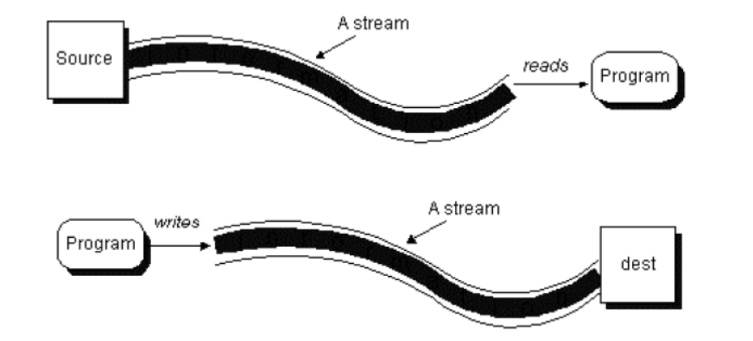

[toc]
# Streams (Flujos)

Los programas Java realizan las operaciones de entrada y salida a través de lo que se denominan Streams (traducido, flujos). 



Un stream es una abstracción de todo aquello que produzca o consuma información. Podemos ver a este stream como una entidad lógica que, por otra parte, se encontrará vinculado con un dispositivo físico. La eficacia de esta forma de implementación radica en que las operaciones de entrada y salida que el programador necesita manejar son las mismas independientemente del dispositivo con el que estemos actuando. Será Java quien se encargue de manejar el dispositivo concreto, ya se trate del teclado, el monitor, un sistema de ficheros o un socket de red, etc., liberando a nuestro código de tener que saber con quién está interactuando.

## Clasificación de los Streams

En Java los Streams se materializan en un conjunto de clases y subclases, contenidas en el paquete `java.io`. Todas las clases para manejar streams parten, de cuatro clases abstractas: 

- `InputStream`
- `OutputStream`
- `Reader`
- `Writer`

| Streams            | Orientados a **bytes** | Orientados a **carácter** |
| ------------------ | ---------------------- | ------------------------- |
| Para **lectura**   | `InputStream`          | `Reader`                  |
| Para **escritura** | `OutputStream`         | `Writer`                  |

### Streams orientados a byte (byte streams)

Proporcionan un medio adecuado para el manejo de entradas y salidas de bytes y su uso lógicamente está orientado a la lectura y escritura de datos binarios. El tratamiento del flujo de bytes viene gobernado por dos clases abstractas que son `InputStream` y `OutputStream`. 

Cada una de estas clases abstractas tiene varias subclases concretas que controlan las diferencias entre los distintos dispositivos de I/O que se pueden utilizar. Así mismo, estas dos clases son las que definen los métodos que sus subclases tendrán implementados y, de entre todas, destacan las operaciones `read()` y `write()` que leen y escriben bytes de datos respectivamente.

### Streams orientados a caracter (character streams)

Proporciona un medio conveniente para el manejo de entradas y salidas de caracteres. Dichos flujos usan codificación Unicode y, por tanto, se pueden internacionalizar. 

Una observación: Este es un modo que Java nos proporciona para manejar caracteres pero al nivel más bajo todas las operaciones de I/O son orientadas a byte. Al igual que la anterior el flujo de caracteres también viene gobernado por dos clases abstractas: `Reader` y `Writer`. Dichas clases manejan flujos de caracteres Unicode. Y también de ellas derivan subclases concretas que implementan los métodos definidos en ellas siendo los más destacados los métodos `read()` y `write()` que, en este caso, leen y escriben caracteres de datos respectivamente.

Como hemos comentado, tanto en `Reader` como en `InputStream` encontramos un método `read()`, en concreto `public int read()`. Observar la diferencia entre estos dos métodos nos ayudará a comprender la diferencia entre los flujos orientados a byte y los orientados a carácter. 

| método                   | devuelve              |
| ------------------------ | --------------------- |
| `int InputStream.read()` | valor entre 0 y 255   |
| `int Reader.read()`      | valor entre 0 y 65535 |

A pesar de llamarse igual, `InputStream.read()` devuelve el siguiente byte de datos leído del stream. El valor que devuelve está entre 0 y 255 (ó -1 si se ha llegado al final del stream). `Reader.read()`, sin embargo, devuelve un valor entre 0 y 65535 (ó -1), correspondiente al siguiente carácter simple leído del stream.

## Stream estándar

Existen una serie de streams de uso común a los cuales se denomina streams estándar. El sistema se encarga de crear estos streams automáticamente. 

- `System.in`
  - Instancia de la clase `InputStream`: flujo de bytes de entrada
  - Métodos:
    - `read()` permite leer un byte de la entrada como entero
    - `skip(n)` ignora `n` bytes de la entrada
    - `available()` número de bytes disponibles para leer en la entrada
- `System.out`
  - Instancia de la clase `PrintStream`: flujo de bytes de salida
  - Métodos
    - para impresión de datos: `print()`, `println()`
    - `flush()` vacía el buffer de salida escribiendo su contenido
- `System.err`
  - Funcionamiento similar a `System.out`
  - Se utiliza para enviar mensajes de error (por ejemplo a un fichero de log o a la consola)

> ### Por defecto, `System.in`, `System.out` y `System.err` se encuentran asociados a la consola (teclado y pantalla), pero es posible re-dirigirlos a otras fuentes o destinos, como por ejemplo a un fichero o una impresora.

## Utilización de Streams

Para utilizar un stream hay que seguir una serie de pasos:

- Lectura
  - Abrir el stream asociado a una fuente de datos (creación del objeto stream)
    - Teclado
    - Fichero
    - Socket remoto
  - Mientras existan datos disponibles
    - Leer datos
  - Cerrar el stream (método close)
- Escritura
  - Abrir el stream asociado a una fuente de datos (creación del objeto stream)
    - Pantalla
    - Fichero
    - Socket local
  - Mientras existan datos disponibles
    - Escribir datos
  - Cerrar el stream (método close)

> ### **Nota**: 
>
> - Los Stream estándar ya se encarga el sistema de abrirlos y cerrarlos
> - Un fallo en cualquier punto del proceso produce una `IOException`

Consulta los ejemplos [Ejemplo Streams](#Ejemplo Streams)

# Ficheros

En ocasiones necesitamos que los datos que introduce el usuario o que produce un programa persistan cuando éste finaliza, es decir, que se conserven cuando el programa termina su ejecución. Para ello es necesario el uso de una base de datos o de ficheros, que permitan guardar los datos en un almacenamiento secundario como un pendrive, disco duro, DVD, etc.
En esta unidad se abordan distintos aspectos relacionados con el almacenamiento en ficheros: 

- Introducción a conceptos básicos como los de registro y campo.
- Clasificación de los ficheros según el contenido y forma de acceso.
- Operaciones básicas con ficheros de distinto tipo.

## Registros y campos

Llamamos campo a un dato en particular almacenado en una base de datos o en un fichero. Un campo puede ser en nombre de un cliente, la fecha de nacimiento de un alumno, el número de teléfono de un comercio. Los campos pueden ser de distintos tipos: alfanuméricos, numéricos, fechas, etc.

La agrupación de uno o más campos forman un registro. Un registro de alumno podría consistir, por ejemplo, de los siguientes campos

  1. Número de expediente.
  2. Nombre y apellidos
  3. Domicilio
  4. Grupo al que pertenece.

Un fichero puede estar formado por registros, lo cual lo dotaría al archivo de estructura. En un fichero de alumnos tendríamos un registro por cada alumno. Los campos del registro serían cada uno de los datos que se almacena del alumno: Nº expediente, nombre, etc …

En Java no existen específicamente los conceptos de campo y registro. Lo más similar que conocemos son las clases (similares a un registro) y, dentro de las clases, los atributos (similares a campos). 

Tampoco en Java los ficheros están formados por registros. Java considera los archivos simplemente como flujos secuenciales de bytes. Cuando se abre un fichero se asocia a él un flujo (stream) a través del cual se lee o escribe en el fichero.

Fichero:

  ```txt
  65255
  José Mateo Ruiz
  C/ Paz, …
  56488
  Ángela Lopez Villa
  Av. Blas..
  24645
  Armando García Ledesma
  C/ Tuej …
  54654
  Tomás Ferrando Tamarit
  C/ Poeta …
  ```

```
65255;José Mateo Ruiz;C/ Paz, …
56488;Ángela Lopez Villa;Av. Blas..
24645;Armando García Ledesma;C/ Tuej …
54654;Tomás Ferrando Tamarit;C/ Poeta …
```

 Registro:

  ```txt
  24645
  Armando García Ledesma
  C/ Tuej …
  ```

Campo:

  ```txt
  Armando García Ledesma
  ```

## Ficheros de texto vs ficheros binarios.

Desde un punto de vista a muy bajo nivel, un fichero es un conjunto de bits almacenados en memoria secundaria, accesibles a través de una ruta y un nombre de archivo. 

Este punto de vista a bajo nivel es demasiado simple, pues cuando se recupera y trata la información que contiene el fichero, esos bits se agrupan en unidades mayores que las dotan de significado. Así, dependiendo de cuál es el contenido del fichero (de cómo se interpretan los bits que contiene el fichero), podemos distinguir dos tipos de ficheros:

- Ficheros de texto (o de caracteres)
- Ficheros binarios (o de bytes)

Un fichero de texto está formado únicamente por caracteres. Los bits que contiene se interpretan atendiendo a una tabla de caracteres, ya sea ASCII o Unicode. Este tipo de ficheros se pueden abrir con un editor de texto plano y son, en general, legibles. Por ejemplo, los ficheros .java que contienen los programas que elaboramos, son ficheros de texto.

Por otro lado, los ficheros binarios contienen secuencias de bytes que se agrupan para representar otro tipo de información: números, sonidos, imágenes, etc. Un fichero binario se puede abrir también con un editor de texto plano pero, en este caso, el contenido será ininteligible. Existen muchos ejemplos de ficheros binarios: el archivo .exe que contiene la versión ejecutable de un programa es un fichero binario.

Las operaciones de lectura/escritura que utilizamos al acceder desde un programa a un fichero de texto están orientadas al carácter: leer o escribir un carácter, una secuencia de caracteres, una línea de texto, etc. En cambio las operaciones de lectura/escritura en ficheros binarios están orientadas a byte: se leen o escriben datos binarios, como enteros, bytes, double, etc.

## Acceso secuencial vs acceso directo.

Existen dos maneras de acceder a la información que contiene un fichero:

- Acceso secuencial
- Acceso directo (o aleatorio)

Con acceso secuencial, para poder leer el byte que se encuentra en determinada posición del archivo es necesario leer, previamente, todos los bytes anteriores. Al escribir, los datos se sitúan en el archivo uno a continuación del otro, en el mismo orden en que se introducen. Es decir, la nueva información se coloca en el archivo a continuación de la que ya hay. No es posible realizar modificaciones de los datos existentes, tan solo añadir al final.

Sin embargo, con el acceso directo, es posible acceder a determinada posición (dirección) del fichero de manera directa y, posteriormente, hacer la operación de lectura o escritura deseada.

No siempre es necesario realizar un acceso directo a un archivo. En muchas ocasiones el procesamiento que realizamos de sus datos consiste en la escritura o lectura de todo el archivo siguiendo el orden en que se encuentran. Para ello basta con un acceso secuencial.

## Streams para trabajar con ficheros.

Para trabajar con ficheros disponemos de las siguientes clases:

| Streams para ficheros | Ficheros binarios  | Ficheros de texto |
| --------------------- | ------------------ | ----------------- |
| Para **lectura**      | `FileInputStream`  | `FileReader`      |
| Para **escritura**    | `FileOutputStream` | `FileWriter`      |

- `FileReader` proporciona operaciones para leer de un fichero uno o varios caracteres
- `FileWriter` permite escribir en un fichero uno o varios caracteres o un String.
- `FileInputStream` permite leer bytes de un fichero.
- `FileOutputStream` permite escribir bytes de un fichero.

> ## Consulta en la documentación los distintos constructores disponibles para estas clases.

Observa los ejemplos [P2_1_CrearFichero](#crear-un-fichero) y [P2_2_SobrescribirFichero](#sobrescribir-un-fichero) 

### Lectura y escritura de información estructurada.

Si observamos la documentación de las clases `FileInputStream` y `FileOutputStream` veremos que las operaciones de lectura y escritura son muy básicas y permiten únicamente leer o escribir uno o varios bytes. Es decir, son operaciones de muy bajo nivel. Si lo que queremos es escribir información binaria más compleja, como por ejemplo un dato de tipo `double` o `boolean` o `int`, tendríamos que hacerlo a través de un stream que permitiese ese tipo de operaciones y asociarlo al `FileOutputStream` o `FileOutputStream`. 

Podríamos, por ejemplo, asociar un `DataInputStream` a un `FileInputStream` para leer del fichero un dato de tipo `int`.

En ejemplos posteriores se ilustrará cómo asociar un stream a un `File…Stream`.

Observa los ejemplos [P2_3_LecturaSecuencialTexto](#lectura-de-un-fichero-secuencial-de-texto), [P2_4_EscrituraSecuencialTexto](#escritura-de-un-fichero-secuencial-de-texto), [P2_6_escritura-de-un-fichero-secuencial-binario](#lectura-de-un-fichero-secuencial-de-texto) y [P2_7_LecturaSecuencialBinario](#lectura-de-un-fichero-secuencial-binario), 

## Ficheros con buffering.

Cualquier operación que implique acceder a memoria externa es muy costosa, por lo que es interesante intentar reducir al máximo las operaciones de lectura/escritura que realizamos sobre los ficheros, haciendo que cada operación lea o escriba muchos caracteres. Además, eso también permite operaciones de más alto nivel, como la de leer una línea completa y devolverla en forma de cadena.

> # En el libro Head First Java, describe los buffers de la siguiente forma: "*Si no hubiera buffers, sería como comprar sin un carrito: debería llevar los productos uno a uno hasta la caja. Los buffers te dan un lugar en el que dejar temporalmente las cosas hasta que está lleno. Por ello has de hacer menos viajes cuando usas el carrito.*"

Las clases `BufferedReader`, `BufferedWriter`, `BufferedInputStream` y `BufferedOutputStream` permiten realizar buffering. Situadas "por delante" de un stream de fichero acumulan las operaciones de lectura y escritura y cuando hay suficiente información se llevan finalmente al fichero.

> ### Recuerda la importancia de cerrar los flujos para asegurarte que se vacía el buffer.

Observa el ejemplo [P2_5_Buffers](#usando-buffers-para-leer-y-escribir-de/en-fichero)

## Combinación de Streams

En muchas ocasiones, una sola clase de las vistas no nos da la funcionalidad necesaria para poder hacer la tarea que se requiere. En tales casos es necesario combinar varios Streams de manera que unos actúan como origen de información de los otros, o unos escriben sobre los otros.

En este caso tendríamos que combinar tres clases:


```java
BufferedReader b = new BufferedReader(new InputStreamReader(System.in));
```

## `try` vs `try(with resources)`

En ocasiones el propio IDE nos sugiere que usemos el bloque `try with resources` en lugar de un simple `try`, así una sentencia como esta:

```java
FileReader fr = new FileReader(path);
BufferedReader br = new BufferedReader(fr);
try {
    return br.readLine();
} finally {
    br.close();
    fr.close();
}
```

Acaba convertida en algo parecido a esta:

```java
static String readFirstLineFromFile(String path) throws IOException {
    try (FileReader fr = new FileReader(path);
         BufferedReader br = new BufferedReader(fr)) {
        return br.readLine();
    }
}	
```

> ### La principal diferencia es que hasta java 7 sólo se podía hacer como en la primera versión. Además en la segunda versión nos "ahorramos" tener que cerrar los recursos, puesto que lo realizará automáticamente en caso de que se produzca algún error evitando así el enmascaramiento de excepciones. Por tanto, sigue siendo necesario cerrar el stream por ejemplo al usar un Buffer para que se vacíe totalmente en el fichero de destino.

# Serialización

Java facilita el almacenamiento y transmisión del estado de un objeto mediante un mecanismo conocido con el nombre de serialización.

La serialización de un objeto consiste en generar una secuencia de bytes lista para su almacenamiento o transmisión. Después, mediante la deserialización, el estado original del objeto se puede reconstruir.

Para que un objeto sea serializable, ha de implementar la interfaz `java.io.Serializable` (que lo único que hace es marcar el objeto como serializable, sin que tengamos que implementar ningún método).

```java
import java.io.*;

public class Persona implements Serializable {

    private String nombre;
    transient private int edad; //No se guardará al serializar
    private double salario;
    private Persona tutor;
[...]
```

Para que un objeto sea serializable, todas sus variables de instancia han de ser serializables.

Todos los tipos primitivos en Java son serializables por defecto (igual que los arrays y otros muchos tipos estándar).

Cuando queremos evitar que cualquier campo persista en un archivo, lo marcamos como transitorio (`transient`). No podemos marcar ningún método transitorio, solo campos.

> ### El fichero con los objetos serializados almacena los datos en un formato propio de Java, por lo que no se puede leer fácilmente con un simple editor de texto (ni editar).

Observa el package de ejemplo [UD06.P3_Serializacion](#ejemplo-de-serialización)

# Sockets

Los sockets son un mecanismo que nos permite establecer un enlace  entre dos programas que se ejecutan independientes el uno del otro  (generalmente un programa cliente y un programa servidor) Java por medio de la librería `java.net` nos provee dos clases: `Socket` para implementar la conexión desde el lado del cliente y `ServerSocket` que nos permitirá manipular la conexión desde el lado del servidor.

Cabe resaltar que tanto el cliente como el servidor no necesariamente deben estar implementados en Java, solo  deben conocer sus direcciones IP y el puerto por el cual se comunicarán.


Observa el package de ejemplo [UD06.P4_Sockets](#ejemplo de sockets)

# Manejo de ficheros y carpetas (`File`)

La clase `File` es una representación abstracta ficheros y carpetas. Cuando creamos en Java un objeto de la clase `File` en representación de un fichero o carpeta concretos, no creamos el fichero al que se representa. Es decir, el objeto `File` representa al archivo o carpeta de disco, pero no es el archivo o carpeta de disco.

La clase `File` dispone de métodos que permiten realizar determinadas operaciones sobre los ficheros. Podríamos, por ejemplo, crear un objeto de tipo `File` que represente a `c:\datos\libros.txt` y, a través de ese objeto `File`, realizar consultas relativas al fichero `libros.txt`, como su tamaño, atributos, etc, o realizar operaciones sobre él: borrarlo, renombrarlo, …

## Constructores

La clase `File` tiene varios constructores, que permiten referirse, de varias formas, al archivo que queremos representar:

| Método                                     | Descripción                                                  |
| ------------------------------------------ | ------------------------------------------------------------ |
| `public File (String ruta)`                | Crea el objeto `File` a partir de la ruta indicada. Si se trata de un archivo tendrá que indicar la ruta y el nombre. |
| `public File (String ruta, String nombre)` | Permite indicar de forma separada la ruta del archivo y su nombre |
| `public File (File ruta, String nombre)`   | Permite indicar de forma separada la ruta del archivo y su nombre. En este caso la ruta está representada por otro objeto File. |
| `public File (URI uri)`                    | Crea el objeto File a partir de un objeto [URI](https://es.wikipedia.org/wiki/Identificador_de_recursos_uniforme) (Uniform Resource Identifier). Un URI permite representar un elemento siguiendo una sintaxis concreta, un estándar. |

## Métodos

Aquí exponemos algunos métodos interesantes. Hay otros que puedes consultar en la documentación de Java.

|                            | **Relacionados con el nombre del fichero**                   |
| -------------------------- | ------------------------------------------------------------ |
| `String getName()`         | Devuelve el nombre del fichero o directorio al que representa el objeto. (Solo el nombre, sin la ruta) |
| `String getPath()`         | Devuelve la ruta del fichero o directorio. La ruta obtenida es dependiente del sistema, es decir, contendrá el carácter de separación de directorios que esté establecido por defecto. Este separador está definido en public `static final String separator` |
| `String getAbsolutePath()` | Devuelve la ruta absoluta del fichero o directorio.          |
| `String getParent()`       | Devuelve la ruta del directorio en que se encuentra el fichero o directorio representado. Devuelve null si no hay directorio padre. |

|                                                              | **Para hacer comprobaciones**                                |
| ------------------------------------------------------------ | ------------------------------------------------------------ |
| `boolean exists()`<br />`boolean canWrite()`<br /> `boolean canRead()` <br />`boolean isFile()`<br /> `boolean isDirectory()` | Permiten averiguar, respectivamente, si el fichero existe, si se puede escribir en el, si se puede leer de él, si se trata de un fichero o si se trata de un directorio |

|                                                              | **Obtener información de un fichero**                        |
| ------------------------------------------------------------ | ------------------------------------------------------------ |
| `long length`                                                | Devuelve el tamaño en bytes del archivo. El resultado es indefinido si se consulta sobre un directorio o una unidad. |
| `long lastModified`                                          | Devuelve la fecha de la última modificación del archivo. Devuelve el número de milisegundos transcurridos desde el 1 de enero de 1970 |

|                                        | **Para trabajar con directorios**                            |
| -------------------------------------- | ------------------------------------------------------------ |
| `boolean mkdir()`                      | Crea el directorio al cual representa el objeto File.        |
| `boolean mkdirs()`                     | Crea el directorio al cual representa el objeto File, incluyendo todos aquellos que sean necesarios y no existan. |
| `String[] list()`                      | Devuelve un array de `Strings` con los nombres de los ficheros y directorios que contiene el directorio al que representa el objeto File. |
| `String[] list(FileNameFilter filtro)` | Devuelve un array de `Strings` con los nombres de los ficheros y directorios que contiene el directorio al que representa el objeto File y que cumplen con determinado filtro. |
| `public File[] listFiles()`            | Devuelve un array de objetos `File` que representan a los archivos y carpetas contenidos en el directorio al que se refiere el objeto File. |

|                                                      | **Para hacer cambios**                                       |
| ---------------------------------------------------- | ------------------------------------------------------------ |
| `boolean renameTo(File nuevoNombre)`                 | Permite renombrar un archivo. Hay que tener en cuenta que la operación puede fracasar por muchas razones, y que será dependiente del sistema: Que no se pueda mover el fichero de un lugar a otro, que ya exista un fichero que coincide con el nuevo, etc. El método devuelve true solo si la operación se ha realizado con éxito. Existe un método move en la clase Files para mover archivos de una forma independiente del sistema. |
| `boolean delete()`                                   | Elimina el archivo o la carpeta a la que representa el objeto File. Si se trata de una carpeta tendrá que estar vacía. Devuelve true si la operación tiene éxito. |
| `boolean createNewFile()`                            | Crea un archivo vacío. Devuelve true si la operación se realiza con éxito. |
| `File createTempFile(String prefijo, String sufijo)` | Crea un archivo vacío en la carpeta de archivos temporales. El nombre llevará el prefijo y sufijo indicados. Devuelve el objeto File que representa al nuevo archivo. |

Observa el ejemplo [UD06.P5_1_Manejo](#ejemplo-de-manejo-de-ficheros-y-carpetas)

# Ejemplos UD06

## Ejemplo Streams

### Estándar de entrada

Veamos un ejemplo en el que se lee por teclado hasta pulsar la tecla de retorno, en ese momento el programa acabará imprimiendo por la salida estándar la cadena leída.

Para ir construyendo la cadena con los caracteres leídos podríamos usar la clase `StringBuffer` o la `StringBuilder`. La clase `StringBuffer` permite almacenar cadenas que cambiarán en la ejecución del programa. `StringBuilder` es similar, pero no es síncrona. De este modo, para la mayoría de las aplicaciones, donde se ejecuta un solo hilo, supone una mejora de rendimiento sobre `StringBuffer`.

El proceso de lectura ha de estar en un bloque `try..catch`.

```java
package UD06.P1_Flujos;

import java.io.IOException;

public class P1_1_FlujoEstandarEntrada {

    public static void main(String[] args) {
        // Cadena donde iremos almacenando los caracteres que se escriban
        StringBuilder str = new StringBuilder();
        char c;
        // Por si ocurre una excepción ponemos el bloque try-cath
        try {
            // Mientras la entrada de terclado no sea Intro
            while ((c = (char) System.in.read()) != '\n') {
                // Añadir el character leído a la cadena str
                str.append(c);
            }
        } catch (IOException ex) {
            System.out.println(ex.getMessage());
        }
        // Escribir la cadena que se ha ido tecleando
        System.out.println("Cadena introducida: " + str);
    }
}
```

### Estándar de salida

```java
package UD06.P1_Flujos;

import java.io.BufferedReader;
import java.io.FileWriter;
import java.io.IOException;
import java.io.InputStreamReader;
import java.io.PrintWriter;

public class P1_2_FlujoEstandarSalida {

    public static void main(String[] args) {
        // Por si ocurre una excepción ponemos el bloque try-cath
        try {
            PrintWriter out = null;
            out = new PrintWriter(new FileWriter("test/salida.txt", true));
            BufferedReader br = new BufferedReader(
                    new InputStreamReader(System.in));
            String s;
            while (!(s = br.readLine()).equals("salir")) {
                out.println(s);
            }
            out.close();
        } catch (IOException ex) {
            System.out.println(ex.getMessage());
        }
    }
}
```

## Ficheros

### Crear un fichero

En el siguiente ejemplo vemos como crear un fichero de texto y escribir una frase en el.

```java
package UD06.P2_Ficheros;

import java.io.*;

public class P2_1_CrearFichero {

    public static void main(String[] args) {
        FileWriter f = null;
        try {
            f = new FileWriter("texto.txt");
            f.write("Este texto se escribe en el fichero\n\r");
        } catch (IOException e) {
            System.out.println("Problema al abrir o escribir ");
        } finally {
            if (f != null) {
                try {
                    f.close();
                } catch (IOException e) {
                    System.out.println("Problema al cerrar el fichero");
                }
            }
        }
    }
}
```

La creación del `FileWriter` puede provocar `IOException`, lo mismo que el método `write`. Por ello las instrucciones se encuentran en un bloque `try-catch`.

Al finalizar su uso, y tan pronto como sea posible, hay que cerrar los streams (`close`) .

### Sobrescribir un fichero

Es muy importante tener en cuenta que cuando se crea un `FileWriter` o un `FileOutputStream` y se escribe en él …

- … si el fichero no existe se crea 
- … si el fichero existe, **su contenido se reemplaza** por el nuevo. El contenido previo que tuviera el fichero se pierde.	

Es posible## Operaciones con ficheros de acceso secuencial.

Como hemos comentado anteriormente el acceso secuencial a un fichero supone que para acceder a un byte es necesario leer previamente los anteriores. Suele utilizarse este tipo de acceso cuando es necesario leer un archivo de principio a fin. 

Vamos a ver una serie de ejemplos que muestren cómo leer y escribir secuencialmente un fichero. escribir en un fichero indicando que la información se añada a la que ya hay y no se reescriba el fichero. Para ello usaremos el constructor que recibe el parámetro append y lo pasaremos a true.

El siguiente ejemplo muestra como añadir una línea al final de un fichero de texto.

```java
package UD06.P2_Ficheros;

import java.io.*;

public class P2_2_SobrescribirFichero {

    public static void main(String[] args) {
        try (FileWriter f = new FileWriter("david/enero/texto.txt", true);) {
            f.write("Este texto se añade en el fichero\n\r");

        } catch (IOException e) {
            System.out.println("Problema al abrir o escribir ");
        }
    }
}
```

En este ejemplo se ha utilizado la nueva sintaxis disponible para los bloques `try-catch`: lo que se denomina "try with resources". Esta sintaxis permite crear un objeto en la cabecera del bloque `try`. El objeto creado se cerrará automáticamente al finalizar. El objeto debe pertenecer al interface `Closeable`, es decir, debe tener método `close()`.

### Operaciones con ficheros de acceso secuencial

Como hemos comentado anteriormente el acceso secuencial a un fichero supone que para acceder a un byte es necesario leer previamente los anteriores. Suele utilizarse este tipo de acceso cuando es necesario leer un archivo de principio a fin. 

Vamos a ver una serie de ejemplos que muestren cómo leer y escribir secuencialmente un fichero.

#### Lectura de un fichero secuencial de texto

Leer un fichero de texto y mostrar el número de vocales que contiene.

```java
package UD06.P2_Ficheros;

import java.io.*;

public class P2_3_LecturaSecuencialTexto {

    final static String VOCALES = "AEIOUaeiou";

    public static void main(String[] args) {
        try (FileReader f = new FileReader(new File("texto.txt"));) {
            int contadorVocales = 0;
            int caracter;
            while ((caracter = f.read()) != -1) {
                char letra = (char) caracter;
                if (VOCALES.indexOf(letra) != -1) {
                    contadorVocales++;
                }
            }
            System.out.println("Numero de vocales: " + contadorVocales);
        } catch (FileNotFoundException e) {
            System.out.println("Probrema al abrir el fichero");
        } catch (IOException e) {
            System.out.println("Problema al leer");
        }
    }
}
```

Observa que:

- Para leer el fichero de texto usamos un `InputReader`.
- Al crear el stream (`InputReader`) es posible indicar un objeto de tipo `File`
- La operación `read()` devuelve un entero. Para obtener el carácter correspondiente tenemos que hacer una conversión explícita de tipos.
- La operación `read()` devuelve -1 cuando no queda información que leer del stream.
- La guarda del bucle `while` combina una asignación con una comparación. En primer lugar se realiza la asignación y luego se compara carácter con -1.
- `FileNotFoundException` sucede cuando el fichero no se puede abrir (no existe, permiso denegado, etc), mientras que `IOException` se lanzará si falla la operación `read()`

#### Escritura de un fichero secuencial de texto

Dada una cadena escribirla en un fichero en orden inverso:

```java
package UD06.P2_Ficheros;

import java.io.*;

public class P2_4_EscrituraSecuencialTexto {

    final static String CADENA = "En un lugar de la mancha...";

    public static void main(String[] args) {
        try (FileWriter f = new FileWriter(new File("texto.txt"));) {
            for (int i = CADENA.length() - 1; i >= 0; i--) {
                f.write(CADENA.charAt(i));
            }
            System.out.println("FIN");
        } catch (FileNotFoundException e) {
            System.out.println("Probrema al abrir el fichero");
        } catch (IOException e) {
            System.out.println("Problema al escribir");

        }
    }
}
```

Observa que:

- Para escribir el fichero de texto usamos un `FileWriter`.
- Tal y como se ha creado el stream, el fichero (si ya existe) se sobreescribirá.
- El manejo de excepciones es como el del caso previo.

### Usando Buffers para leer y escribir de/en fichero

En el siguiente codigo se usan buffers para leer líneas de un fichero y escribirlas en otro convertidas a mayúsculas

```java
package UD06.P2_Ficheros;

import java.io.*;

public class P2_5_Buffers {

    final static String ENTRADA = "texto.txt";
    final static String SALIDA = "textoMayusculas.txt";

    public static void main(String[] args) {
        try (BufferedReader fe = new BufferedReader(new FileReader(ENTRADA));
             BufferedWriter fs = new BufferedWriter(new FileWriter(SALIDA))){
            String linea;
            while ((linea = fe.readLine()) != null) {
                fs.write(linea.toUpperCase());
                fs.newLine();
            }
            System.out.println("FIN");
        } catch (FileNotFoundException e) {
            System.out.println("Probrema al abrir el fichero");
        } catch (IOException e) {
            System.out.println("Problema al leer o escribir");
        }
    }
}
```

Observa que:

- Usamos buffers tanto para leer como para escribir. Esto permite minimizar los accesos a disco.
- Los buffers quedan asociados a un `FileReader` y `FileWriter` respectivamente. Realizamos las operaciones de lectura/escritura sobre las clases `Buffered…` y cuando es necesario la clase accede internamente al stream que maneja el fichero.
- Es necesario escribir explícitamente los saltos de línea. Esto se hace mediante el método `newLine()`. `newLine()` permite añadir un salto de línea sin preocuparnos de cuál es el carácter de salto de línea. El salto de línea es distinto en distintos sistemas: en unos es `\n`, en otros `\r`, en otros `\n\r`, …
- `BufferedReader` dispone de un método para leer líneas completas (`readLine()`). Cuando se llega al final del fichero este método devuelve `null`.
- Fíjate como el bloque `try with resources` creamos varios objetos. Si la creación de cualquiera de ellos falla, se cerrarán todos los stream que se han abierto.

### Ficheros binarios

#### Escritura de un fichero secuencial binario

Ya hemos visto que con `FileInputStream` y `FileOutputStream` se puede leer y escribir bytes de información de/a un archivo.

Sin embargo esto puede no ser suficiente cuando la información que tenemos que leer o escribir es más compleja y los bytes se agrupan para representar distintos tipos de datos.

Imaginemos por ejemplo que queremos guardar en un fichero “jugadores.dat”, el año de nacimiento y la estatura de cinco jugadores de baloncesto:

```java
package UD06.P2_Ficheros;

import java.io.*;
import java.util.Scanner;

public class P2_6_EscrituraSecuencialBinario {

    public static void main(String[] args) {
        Scanner tec = new Scanner(System.in);
        try (DataOutputStream fs = new DataOutputStream(
                        new BufferedOutputStream(
                                new FileOutputStream("jugadores.dat")));) {
            for (int i = 1; i <= 5; i++) {
                //Pedimos datos al usuario
                System.out.println(" ---- Jugador " + i + " -----");
                System.out.print("Nombre: ");
                String nombre = tec.nextLine();

                System.out.print("Nacimiento: ");
                int anyo = tec.nextInt();

                System.out.print("Estatura: ");
                double est = tec.nextDouble();
                //Vaciar salto linea
                tec.nextLine();

                //Volcamos información al fichero
                fs.writeUTF(nombre);
                fs.writeInt(anyo);
                fs.writeDouble(est);
            }
        } catch (FileNotFoundException e) {
            System.out.println("Probrema al abrir el fichero");
        } catch (IOException e) {
            System.out.println("Problema al leer o escribir");
        }
    }
}
```

Observa que:

- Para escribir información binaria usamos un `DataInputStream` asociado al stream. La clase tiene métodos para escribir `int`, `byte`, `double`, `boolean`, etc.
- Además, como hemos hecho en ejemplos previos, usamos un buffer. Fíjate como en el constructor se enlazan unas clases con otras.
- A pesar de que en Java los ficheros son secuencias de bytes, estamos dotando al fichero de cierta estructura: primero aparece el nombre, luego el año y finalmente la estatura. Cada uno de estos tres datos constituirían un registro de formado por tres campos. Para poder recuperar información de un fichero binario es necesario conocer cómo se estructura ésta dentro del fichero.

#### Lectura de un fichero secuencial binario

```java
package UD06.P2_Ficheros;

import java.io.*;
import java.util.Scanner;

public class P2_7_LecturaSecuencialBinario {

    public static void main(String[] args) {
        Scanner tec = new Scanner(System.in);
        try (DataInputStream fe = new DataInputStream(new BufferedInputStream(
                 new FileInputStream("jugadores.dat")));) {
            while (true) {
                //Leemos nombre
                System.out.println(fe.readUTF());
                //leemos y desechamos resto de datos
                fe.readInt();
                fe.readDouble();
            }
        } catch (EOFException e) {
            //Se lanzará cuando se llegue al final del fichero
        } catch (FileNotFoundException e) {
            System.out.println("Probrema al abrir el fichero");
        } catch (IOException e) {
            System.out.println("Problema al leer o escribir");
        }
    }
}
```

Observa que:

- A pesar de que necesitamos solamente el nombre de cada jugador, es necesario leer también el año y la estatura. No es posible acceder al nombre del segundo jugador sin leer previamente todos los datos del primer jugador. 
- La lectura se hace a través de un bucle infinito (`while (true)`), que finalizará cuando se llegue el final del fichero y al leer de nuevo se produzca la excepción `EOFException`

## Ejemplo de Serialización

En el siguiente ejemplo usaremos una clase persona que definiremos de la siguiente manera

### Persona

```java
package UD06.P3_Serializacion;

import java.io.*;

public class Persona implements Serializable {

    private String nombre;
    transient private int edad; //No se guardará al serializar
    private double salario;
    private Persona tutor;

    public Persona(String nom, double salari) {
        this.nombre = nom;
        this.salario = salari;
        edad = 0;
        tutor = null;
    }

    public String getNombre() {
        return nombre;
    }

    public int getEdad() {
        return edad;
    }

    public double getSalario() {
        return salario;
    }

    public Persona getTutor() {
        return tutor;
    }

    public void incrementaEdad() {
        edad++;
    }

    public void asignaTutor(Persona p) {
        tutor = p;
    }
}
```

Ahora detallamos la clase para serializar o guardar la información en un archivo:

```java
package UD06.P3_Serializacion;

import java.io.*;

public class Guardar {

    public static void main(String args[]) {
        ObjectOutputStream salida;
        Persona p1, p2, p3, p4;

        p1 = new Persona("Vicent", 1200.0);
        p2 = new Persona("Mireia", 1800.0);
        p3 = new Persona("Josep", 2100.0);
        p4 = new Persona("Marta", 850.0);

        p1.asignaTutor(p2);
        p2.asignaTutor(p3);
        p3.asignaTutor(p4);

        try {
            salida = new ObjectOutputStream(new FileOutputStream("empleats.ser"));
            salida.writeObject(p1);
            salida.close();
        } catch (IOException e) {
            System.out.println("Algún problema guardando a disco.");
        }
    }
}
```

Y por último la clase para Leer la información una vez guardada:

```java
package UD06.P3_Serializacion;

import java.io.*;

public class Leer {

    public static void main(String args[]) {
        ObjectInputStream entrada;
        Persona p1, p2, p3, p4;

        try {
            entrada = new ObjectInputStream(new FileInputStream("empleats.ser"));
            p1 = (Persona) entrada.readObject();
            entrada.close();

            p2 = p1.getTutor();
            p3 = p2.getTutor();
            p4 = p3.getTutor();

            System.out.println(p4.getNombre());
            System.out.println(p4.getEdad());
            System.out.println(p4.getSalario());

        } catch (ClassNotFoundException e) {
            System.out.println("Algun problema con las clases definidas.");
        } catch (IOException e) {
            System.out.println("Algun problema leyendo de disco.");
        }
    }
}
```

## Ejemplo de Sockets

Para nuestro ejemplo de sockets implementaremos ambos (cliente y servidor) usando Java y se comunicarán usando el puerto 6000 (es bueno elegir los puertos en el rango de 1024 hasta 65535).

La secuencia de eventos en nuestro ejemplo será:

- El servidor creará el socket y esperará a que el cliente se conecte o lo detengamos.
- Por otro lado, el cliente abrirá la conexión con el servidor y le enviará una frase en minúsculas que escribirá el usuario y la enviará al servidor.
- Una vez recibida la frase en minúsculas, el servidor la convertirá en mayúsculas, la devolverá al cliente y cerrará su conexión.
- El cliente mostrará la frase en mayúsculas recibida desde el servidor.
- El servidor quedará a la espera de una nueva conexión de otro cliente.

### Servidor

```java
package UD06.P4_Sockets;

import java.io.*;
import java.net.*;
import java.util.Enumeration;

public class AWSServerSocket {

    private final static int PUERTO = 6000;

    private static void mostrarIPs(StringBuilder sb) {
        try {
            Enumeration Interfaces = NetworkInterface.getNetworkInterfaces();
            while (Interfaces.hasMoreElements()) {
                NetworkInterface Interface = (NetworkInterface) Interfaces.nextElement();
                Enumeration Addresses = Interface.getInetAddresses();
                while (Addresses.hasMoreElements()) {
                    InetAddress Address = (InetAddress) Addresses.nextElement();
                    sb.append("\n\t").append(Address.getHostAddress()).append(":").append(PUERTO);
                }
            }
        } catch (SocketException ex) {
            System.err.println("Error. Al intentar obtener las interfaces de red.");
        }
    }

    public static void main(String[] args) {
        try (ServerSocket serverSocket = new ServerSocket(PUERTO);) {
            StringBuilder sb = new StringBuilder();
            sb.append("Server iniciado y escuchando en la ip y puerto: ");
            mostrarIPs(sb);
            System.out.println(sb.toString());
            while (true) {
                Socket clientSocket = serverSocket.accept();

                ObjectInputStream entrada = new ObjectInputStream(new BufferedInputStream(clientSocket.getInputStream()));
                String fraseRecibida = (String) entrada.readObject();
                System.out.println("La frase recibida es: " + fraseRecibida);

                ObjectOutputStream salida = new ObjectOutputStream(new BufferedOutputStream(clientSocket.getOutputStream()));
                String fraseDevuelta = fraseRecibida.toUpperCase();
                System.out.println("El server devuelve la frase: " + fraseDevuelta);
                salida.writeObject(fraseDevuelta);
                salida.flush();//vaciamos el buffer

                clientSocket.close(); //cerramos el socket cliente
                System.out.println("Server esperando una nueva conexión...");
            }
        } catch (ClassNotFoundException ex) {
            System.err.println("Error. Clase no encontrada");
        } catch (IOException ex) {
            System.err.println("Error. De entrada salida." + ex.toString());
        }
    }
}
```

### Cliente

```java
package UD06.P4_Sockets;

import java.io.*;
import java.net.*;
import java.util.Scanner;

public class AWSClienteSocket {

    //private static final String DNSAWS = "ec2-44-212-40-102.compute-1.amazonaws.com";
    private static final String DNSAWS = "127.0.0.1";

    public static void main(String[] args) throws IOException, ClassNotFoundException {
        Scanner in = new Scanner(System.in);
        System.out.print("Introduce la frase a enviar en minúsculas: ");
        String frase = in.nextLine();

        try (Socket socket = new Socket(DNSAWS, 6000)) {
            ObjectOutputStream salida = new ObjectOutputStream(new BufferedOutputStream(socket.getOutputStream()));
            System.out.println("Se envia la frase: " + frase);
            salida.writeObject(frase);
            salida.flush(); //vaciamos el buffer

            ObjectInputStream entrada = new ObjectInputStream(new BufferedInputStream(socket.getInputStream()));
            System.out.println("La frase recibida es: " + (String) entrada.readObject());
        } catch (IOException ex) {
            System.err.println("Error. De entrada salida.");
        }
    }
}
```

## Ejemplo de manejo de ficheros y carpetas

Veamos ahora un ejemplo para mostrar información y contenido de una carpeta:

```java
package UD06.P5_Manejo;

import java.io.*;
import java.util.*;

public class P5_1_Manejo {

    public static void main(String[] args) {

        Scanner tec = new Scanner(System.in);
        System.out.println("Introduce ruta absoluta de una carpeta");
        String nombreCarpeta = tec.nextLine();
        //Creamos objeto File para representar a la carpeta
        File car = new File(nombreCarpeta);
        //Comprobamos si existe
        if (car.exists()) {
            //¿Es una carpeta?
            if (car.isDirectory()) {
                if (car.canRead()) {
                    System.out.println("Lectura permitida");
                } else {
                    System.out.println("Lectura no permitida");
                }

                if (car.canWrite()) {
                    System.out.println("Escritura permitida");
                } else {
                    System.out.println("Escritura no permitida");
                }

                if (car.isHidden()) {
                    System.out.println("Carpeta oculta");
                } else {
                    System.out.println("Carpeta visible");
                }

                System.out.println("---- Contenido de la carpeta ----");
                File[] contenido = car.listFiles();
                for (File f : contenido) {
                    System.out.println(f.getName());
                }
            } else {
                System.out.println(car.getAbsolutePath() + " No es una carpeta");
            }
        } else {
            System.out.println(
                    "No existe la carpeta/archivo " + car.getAbsolutePath());
        }
    }
}
```

# Píldoras informáticas relacionadas

- [Curso Java. Entrada Salida datos I. Vídeo 14](https://youtu.be/Ng0_7uZyIoA)
- [Curso Java. Entrada Salida datos II. Vídeo 15](https://youtu.be/F_48qh3BcDs)
- [Curso Java. Streams I. Accediendo a ficheros. Lectura. Vídeo 152](https://youtu.be/etQN4EfYN7k)
- [Curso Java. Streams II. Accediendo a ficheros Escritura. Vídeo 153](https://youtu.be/E0H4OzW2_1Y)
- [Curso Java. Streams III. Usando buffers. Vídeo 154](https://youtu.be/YCCE4sbmWrw)
- [Curso Java Streams IV. Leyendo archivos. Streams Byte I. Vídeo 155](https://youtu.be/38YBRnJtQEw)
- [Curso Java. Streams V. Escribiendo archivos Streams Byte II. Vídeo 156](https://youtu.be/v6ctWhhTFrk)
- [Curso Java. Serialización. Vídeo 157](https://youtu.be/POj5owpInuY)
- [Curso Java. Serialización II. SerialVersionUID. Vídeo 158](https://youtu.be/cOm2-Kj_7Qs)
- [Curso Java. Sockets I. Vídeo 190](https://www.youtube.com/watch?v=L0Y6hawPB-E)
- [Curso Java. Manipulación archivos y directorios. Clase File I. Vídeo 159](https://youtu.be/TBzGXYqFq3w)
- [Curso Java. Manipulación archivos y directorios. Clase File II. Vídeo 160](https://youtu.be/vTLho2lhSQg)

# Fuentes de información

- [Wikipedia](https://es.wikipedia.org)
- [Programación (Grado Superior) - Juan Carlos Moreno Pérez (Ed. Ra-ma)](https://www.ra-ma.es/libro/programacion-grado-superior_48302/)
- Apuntes IES Henri Matisse (Javi García Jimenez?)
- Apuntes AulaCampus
- [Apuntes José Luis Comesaña](https://www.sitiolibre.com/)
- [Apuntes IOC Programació bàsica (Joan Arnedo Moreno)](https://ioc.xtec.cat/materials/FP/Recursos/fp_asx_m03_/web/fp_asx_m03_htmlindex/index.html)
- [Apuntes IOC Programació Orientada a Objectes (Joan Arnedo Moreno)](https://ioc.xtec.cat/materials/FP/Recursos/fp_dam_m03_/web/fp_dam_m03_htmlindex/index.html)
- [Apuntes Lionel](https://github.com/lionel-ict/ApuntesProgramacion)
