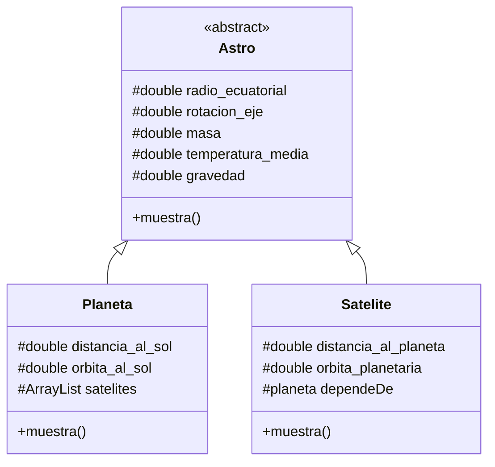
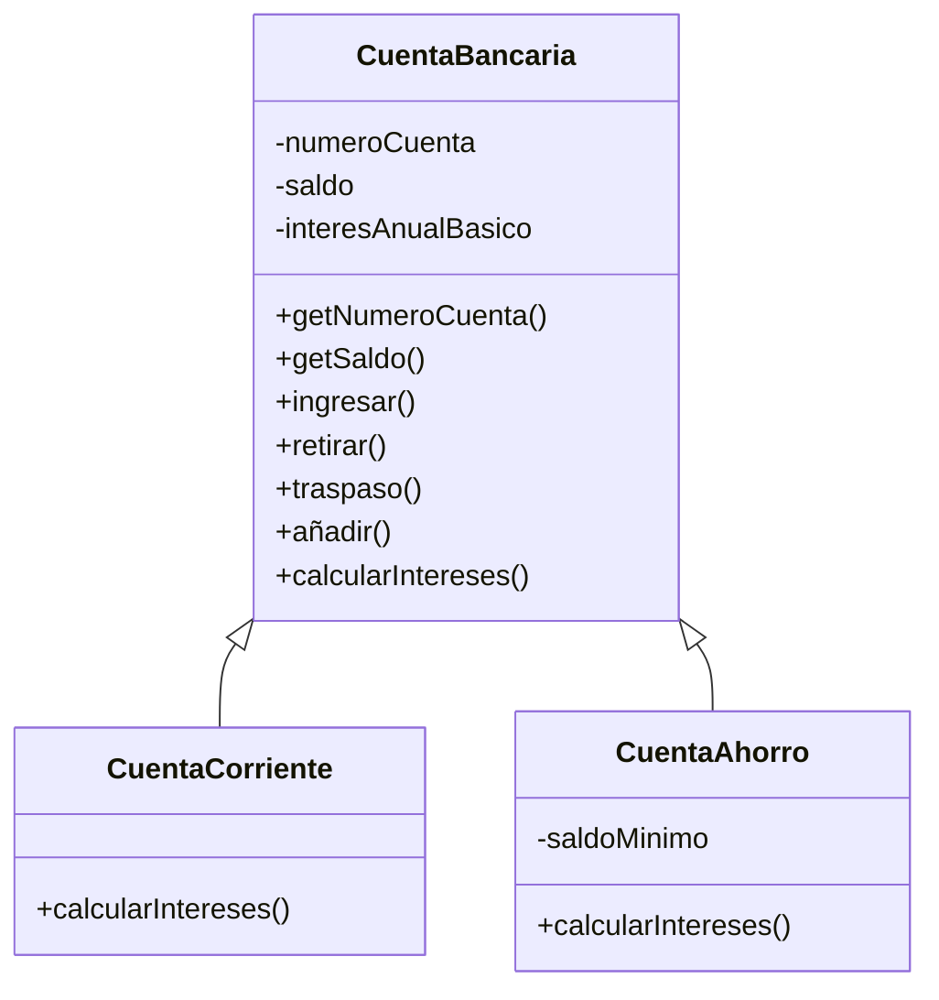

[toc]

# Ejercicios Herencia

1. Diseñar una jerarquía de clases para modelizar las **aulas de un centro de estudios**.

   De un `Aula` se conoce el `código` (numérico), la `longitud` y la `anchura`. Se desea un método que devuelva la capacidad del aula sabiendo que esta se calcula a partir de la superficie a razón de 1 alumnos por cada 1.4 metros cuadrados de superficie.

   Además de las aulas, digamos normales, existen aulas de informática y aulas de música. En las aulas de música se necesita conocer si tienen o no piano. De las aulas de informática se conoce el número de ordenadores y su capacidad no se calcula en función de la superficie, sino a razón de dos alumnos por ordenador.

   Implementar el método `toString` de cada una de las clases diseñadas para que devuelva:

   - En las aulas normales, el `código` y la `superficie` y la `capacidad`.
   - En las aulas de música e informática el texto irá precedido por "Aula de música" o "Aula de informática", según corresponda.

2. Un salón de **VideoJuegos** dispone de ordenadores en los que los clientes pueden jugar. Además de jugar en el establecimiento, la empresa alquila y vende juegos.

   1. Diseñar la clase `Juego` siguiendo las siguientes especificaciones: 
      - Atributos protected: `titulo` (String), `fabricante` (String), `año` (int).
      - Constructor `public Juego(String t, String f, int a)`
      - Consultores de todos los atributos
      - `public String toString()`, que devuelve un String con los datos del Juego 
      - `public boolean equals(Object o)`: Dos juegos son iguales si tienen el mismo título, fabricante y año.
      - `public int compareTo(Object o)`: Un juego es menor que otro si su título es menor. A igual título, si su fabricante es menor. A igual título y fabricante, si su año es menor.
   2. Diseñar las clases `JuegoEnAlquiler` y `JuegoEnVenta` (y otras si se considera oportuno), sabiendo que, además de los atributos descritos anteriormente, tienen.
      - `precio`
      - `nº de copias disponibles`
      - `JuegoEnAlquiler`
        - tiene un atributo que indica el número de días que se alquila. (Por el precio indicado, hay juegos que se alquilan por un dia, otros por 2, etc...)
        - Constructor que recibe todos sus datos
        - tiene un método `alquilar` que decrementa el número de copias disponibles.
        - tiene un método `devolver` que incrementa el número de copias disponibles.
        - `toString()` devuelve todos los datos del `JuegoEnAlquiler`
      - `JuegoEnVenta`
        - `Constructor` que recibe todos sus datos 
        - tiene un método `vender`, que decrementa el número de copias disponibles.
        - `toString()` devuelve todos los datos del `JuegoEnVenta`
   
3. La **Fabrica Nacional de Moneda y Timbre** quiere almacenar cierta información técnica del dinero (billetes y monedas) que emite. En concreto, le interesa:

   - `Valor`: Valor de la moneda o billete, en euros. (`double`)
   - `Año de emisión`: Año en que fué emitida la moneda o billete. (`int`)
   - De las monedas, 
     - `Diámetro`: Diámetro de la moneda, en milímetros. (`double`)
     - `Peso`: Peso de la moneda, en gramos (`double`)
   - De los billetes.
     - `Altura del billete`, en mm (`double`)
     - `Anchura del billete`, en mm (`double`).

   a) Diseñar la clase abstracta `Dinero` y sus subclases `Moneda` y `Billete`, desarrollando:

   - Constructores que reciban los datos necesarios para inicializar los atributos de la clase correspondiente
   - `equals`: Dos monedas o billetes son iguales si tienen el mismo año de emisión y valor.
   - `compareTo`: Es menor (mayor) el de menor (mayor) año, a igual año es menor (mayor) el de menor (mayor) valor.
   - `toString`: Que muestre todos los datos del billete o moneda. Los billetes irán precedidos por el texto "BILLETE" y las monedas por el texto "MONEDA" 

   b) Diseñar la clase `TestDinero` para probar las clases desarrolladas: Crear objetos de las clases `Moneda` y `Billete` y mostrarlos por pantalla.

4. Un **centro comercial** quiere mostrar cierta información sobre los televisores que vende. Los televisores pueden ser de dos tipos: de tubo o LCD. En concreto, de cada televisor le interesa mostrar

   - Marca (`String`)
   - Modelo (`String`)
   - Precio en euros
   - Pulgadas de la pantalla (`double`).
   - Resolución: La resolución se mide de forma distinta en los televisores de tubo que en los televisores LCD.
     - En los TV de tubo se mide en lineas.
     - En los TV LCD se mide pixels horizontales x pixels verticales.

   a) Diseñar la clase `Televisor` con los atributos y métodos comunes a los dos tipos de televisores y sus subclases `TVTubo` y `TVLCD` con los atributos y métodos que sea necesario:

   - Constructor de cada clase que permita inicializar todos los datos de la clase.
   - `equals`: Dos televisiones son iguales si son de la misma marca y modelo.
   - `compareTo`: Se considera menor (mayor) la de menor (mayor) marca. A igual marca, menor (mayor) la de menor (mayor) modelo.
   - `public String resulucion()`: Devuelve un texto con la resolución del televisor, como por ejemplo "420 lineas" o "800 x 600 pixels" dependiendo del tipo de televisor.
   - `public String toString()`: Devuelve un texto con la marca, modelo, precio, pulgadas y resolución.

   b) Diseñar la clase `TestTV` para probar las clases diseñadas. Crear algunos objetos de las clases `TVTubo` y `TVLCD` y mostrarlos por pantalla.

5. De cada pareja de afirmaciones **indica cual es la verdaderas**:

   1. - Se dice que instanciamos una clase cuando creamos objetos de dicha clase.
      - Se dice que instanciamos una clase cuando creamos una subclase de dicha clase.

   2. - Si una clase es abstracta no se puede instanciar.
      - Si una clase es abstracta no se puede heredar de ella.

   3. - Una clase abstracta tiene que tener métodos abstractos.
      - Una clase puede ser abstracta y no tener métodos abstractos.

   4. - Si una clase tiene métodos abstractos tiene que ser abstracta.
      - Una clase puede tener métodos abstractos y no ser abstracta.

   5. - Si una clase es abstracta sus subclases no pueden ser abstractas.
      - Una clase abstracta puede tener subclases que también sean abstractas.

   6. - Si un método es abstracto en una clase, tiene que ser no abstracto en la subclase, o bien, la subclase tiene que ser también abstracta.
      - Si un método es abstracto en una clase, no puede ser abstracto en las subclases.

   7. - Si un método se define final se tiene que reescribir en las subclases.
      - Si un método se define final no se puede reescribir en las subclases.

   8. - Una clase puede tener un método final y no ser una clase final.
      - Si una clase tiene un método final tiene que ser una clase final.
   9. - Si una clase se define final no se pueden definir subclases de ella.
      - Si una clase se define final no se puede instanciar.
   10. - Un método definido final y abstract resultaría inútil, puesto que nunca se podría implementar en las subclases.
       - Un método definido final y abstract podría resultar útil.
   11. - Una clase definida final y abstract resultaría inútil, puesto que no se podría instanciar ni heredar de ella.
       - Una clase definida final y abstract podría resultar útil.
   
6. Dada las siguientes **definiciónes de clases**:

   ```java
   public class Persona {
     private String nombre;
     private int edad;
     
     public Persona (){
       this.nombre = "";
       this.edad = 0;
     }
     public Persona(String n, int e){
       this.nombre = n;
       this.edad = e;
     }
     public String toString(){
     return "Nombre: " + nombre + "Edad " + edad;
     }
     public final String getNombre (){
     	return nombre;
     }
     public final int getEdad(){
    	 return edad;
     }
   }
   ```

   ```java
   class Estudiante extends Persona {
     private double creditos;
     
     public Estudiante(String n, int e, double c){
       super(n,e);
       this.creditos = c;
     }
     public String toString(){
     	return super.toString() + "\nCreditos: "+ creditos;
     }
   }
   ```

   ```java
   class Empleado extends Persona {
     private double salario;
     
     public Empleado(String n, int e, double s){
       super(n,e);
       this.salario = s;
     }
     public String toString(){
       return "Nombre: "+ this.nombre +
       "\nSalario: "+ this.salario;
     }
   }
   ```

   ```java
   class Test{
     public static void main(String[] args) {
       Estudiante e = new Estudiante("pepe",18,100);
       System.out.println(e.toString());
     }
   }
   ```

   **Responde** a las siguientes cuestiones justificando las respuestas. 

   1. ¿Es necesario el uso de `this` en el contructor de la clase `Estudiante`?
   1. ¿Es necesario el uso de `super` en el método `toString` de la clase `Estudiante`?
   1. Si quitásemos el constructor de la clase `Estudiante` ¿daría un error de compilación?
   1. En el método `toString` de la clase `Empleado` ¿por qué es incorrecto el acceso que se hace al atributo `nombre`? ¿Cómo se tendría que definir `nombre` en la clase `Persona` para evitar el error?
   1. ¿Qué consecuencia tiene que algunos métodos de la clase `Persona` se hayan definido `final`?
   1. Si el método `toString` no se hubiera definido en ninguna de las tres clases ¿daría error el `sout` del método `main`?

# Ejercicios Polimorfismo

1. Dada la siguiente **jerarquía de clases**:

   ```java
   public interface Montador{
   	void montar(String x);
   	void desmontar(String x);
   }
   
   public class Obrero{
     public Obrero(){System.out.println("Se crea Obrero");}
     public void saludar(){System.out.println("Hola, soy Obrero");}
     ...
   }
   
   public class Carpintero extends Obrero implements Montador {
     public Carpintero(){System.out.println("Se crea Carpintero");}
     public void montar(String x) {System.out.println("Montando " + x);}
     public void desmontar(String x) {System.out.println("Desmontando " + x);}
     public void clavar() {...}
   }
   
   public class Albañil extends Obrero {
   	public Albañil() {
   		super();
   		System.out.println("Se crea Albañil");
   	}
   	public void levantarMuro(){ 
   		System.out.println("Levantando muro …");
   	}
   }
   ```

   Indicar **qué líneas** del siguiente fragmento de programa **producirán errores de compilación**,

   ```java
   public static void main(String[] args){
   	Montador m1 = new Carpintero();
   	Montador m2 = new Albañil();
   	Obrero o1 = new Carpintero();
   	Obrero o2 = new Albañil();
   	o1.montar("Mesa");
    	o2.levantarMuro();
   	m1.saludar();
   	m1.montar("Silla");
   	((Albañil)o2).levantarMuro();
   	((Albañil)o1).levantarMuro();
   }
   ```

   **Una vez eliminadas** las líneas con error, indicar **cuál sería la salida** por pantalla del programa.

   ¿**Sería correcta** la instrucción siguiente?

   ```java
   Albañil a = new Albañil();
   System.out.println(a.toString());
   ```

2. Las clases siguientes implementan una **jerarquía de herencia**

   ```java
   class Base {
   	String metodo1() {return "Base.metodo1()";}
   	String metodo2(String s) {return "Base.metodo1(" + s + ")";}
   }
   
   public interface TipoI{
   	String metodoIn2(String s);
   	String metodoIn3();
   }
   
   class Derivada extends Base implements TipoI{
   	public String metodoIn2(String s) {return "Derivada.metodoIn2()";}
   	public String metodoIn3() {return "Derivada.metodoIn3()";}
   	String metodo1() {return "Derivada.metodo1()";}
   }
   
   class Derivada2 extends Derivada{
   	String metodo2 (String s) {return "Derivada2.metodo2(" + s + ")";}
   	String metodo4() {return "Derivada2.metodo4()";}
   }
   ```

   Sea la clase `CuestionHerencia` que usa las anteriores:

   ```java
   public class CuestionHerencia{
   	public static void main (String a[]){
   		String tmp;
   		Derivada derivada;
   		Derivada2 derivada2;
   		Base base;
   		derivada2 = new Derivada2();base = derivada2;
   		tmp = derivada2.metodo1(); System.out.println("1.-"+tmp);
   		tmp = derivada2.metodoIn2("EDA!!"); System.out.println("2.-"+tmp);
   		tmp = base.metodo1();System.out.println("3.-"+tmp);
   		tmp = base.metodo2("EDA!!"); System.out.println("4.-"+tmp);
   		tmp = derivada2.metodoIn3();System.out.println("5.-"+tmp);
   		tmp = derivada2.metodo4();System.out.println("6.-"+tmp);
   		tmp = base.metodo3();System.out.println("7.-"+tmp);
   		derivada = new Derivada();
   		derivada2 = new Derivada2();
   		base = new Base();
   		Distinta ref = new Distinta();
   		tmp = ref.prueba(derivada2); System.out.println("8.-"+tmp);
   		tmp = ref.prueba(derivada); System.out.println("9.-"+tmp);
   		tmp = ref.prueba(base); System.out.println("10.-"+tmp); 
   	}
   }
   ```

   **Señalar los errores **existentes.

   **Una vez corregido** el programa, **escribir la salida** por pantalla resultado de su ejecución.

# Actividades

1. Realizar una aplicación para la gestión de la información de las personas vinculadas a una `Facultad`, que se pueden clasificar en tres tipos: estudiantes, profesores y personal de servicio.
   A continuación, se detalla qué tipo de información debe gestionar esta aplicación:

   - Por cada `Personas`, se debe conocer, al menos, su `nombre` y `apellidos`, su `número de identificación` y su `estado civil`.
   - Con respecto a los `Empleados`, sean del tipo que sean, hay que saber su `año de incorporación` a la facultad y qué `número de despacho` tienen asignado.
   - En cuanto a los `Estudiantes`, se requiere almacenar el `curso` en el que están matriculados.
   - Por lo que se refiere a los `Profesores`, es necesario gestionar a qué `departamento` pertenecen (`lenguajes`, `matemáticas`, `arquitectura`, ...).
   - Sobre el `Personal de servicio`, hay que conocer a qué `sección` están asignados (`biblioteca`, `decanato`, `secretaría`, ...).

   El ejercicio consiste, en primer lugar, en definir la jerarquía de clases de esta aplicación. A continuación, debe programar las clases definidas en las que, además de los constructores, hay que desarrollar los métodos correspondientes a las siguientes acciones:

   - Cambio del estado civil de una persona.
   - Reasignación de despacho a un empleado.
   - Matriculación de un estudiante en un nuevo curso.
   - Cambio de departamento de un profesor.
   - Traslado de sección de un empleado del personal de servicio.
   - Imprimir toda la información de cada tipo de individuo.

   En el método `main` crear un array de `personas`. Crear diferentes instancias de las subclases e insertarlas en el array. Probar los diferentes métodos desarrollados.

2. Crea una clase `Empleado` y una subclase `Encargado`. Los encargados reciben un 10% más de sueldo base que un empleado normal aunque realicen el mismo trabajo. Implementa dichas clases en el paquete objetos y sobrescribe el método `getSueldo()` para ambas clases.

3. Crear la clase `Dado`, la cual desciende de la clase `Sorteo`. La clase `Dado`, en la llamada `lanzar()` mostrará un número aleatorio del 1 al 6. Crear la clase `Moneda`, la cual desciende de la clase `Sorteo`. Esta clase en la llamada al método `lanzar()` mostrará las palabras cara o cruz. Realizar una clase con un método `main` que compruebe todo lo realizado.

4. Realiza una clase `Huevo` con un atributo `tamaño` (`S`, `M`, `L`, `XL`) con el método `toString`. La clase `Huevo` está compuesta por dos clases internas, una `Clara` y otra `Yema`. Ambas clases tiene un atributo `color` y el método `toString`. Realiza un método `main` en el que se cree un objeto de tipo `Huevo`, `Clara` y `Yema`. Se le asigne valor a sus atributos y se muestren dichos valores.

# Ejercicios Lionel

## Astros

Define una jerarquía de clases que permita almacenar datos sobre los planetas y satélites (lunas) que forman parte del sistema solar.

Algunos atributos que necesitaremos almacenar son: 

- Masa del cuerpo.
- Diámetro medio.
- Período de rotación sobre su propio eje.
- Período de traslación alrededor del cuerpo que orbitan.
- Distancia media a ese cuerpo.
- etc.

Define las clases necesarias conteniendo: 

- Constructores. 
- Métodos para recuperar y almacenas atributos.
- Método para mostrar la información del objeto. 

Define un método, que dado un objeto del sistema solar (planeta o satélite), imprima toda la información que se dispone sobre el mismo (además de su lista de satélites si los tuviera).

El diagrama UML sería:



Una posible solución sería crear una lista de objetos, insertar los planetas y satélites (directamente mediante código o solicitándolos por pantalla) y luego mostrar un pequeño menú que permita al usuario imprimir la información del astro que elija.

## Mascotas

Implementa una clase llamada **Inventario** que utilizaremos para almacenar referencias a todos los animales existentes en una tienda de mascotas. 

Esta clase debe cumplir con los siguientes requisitos: 

- En la tienda existirán 4 tipos de animales: perros, gatos, loros y canarios. 
- Los animales deben almacenarse en un `ArrayList` privado dentro de la clase **Inventario**. 
  - La clase debe permitir realizar las siguientes acciones:
    - Mostrar la lista de animales (solo tipo y nombre, 1 línea por animal).
    - Mostrar todos los datos de un animal concreto.
    - Mostrar todos los datos de todos los animales.
    - Insertar animales en el inventario. 
    - Eliminar animales del inventario. 
    - Vaciar el inventario. 


Implementa las demás clases necesarias para usar la clase `Inventario`.

El diagrama UML sería:

 ```mermaid
  classDiagram
    Mascota <|-- Ave
    Mascota <|-- Perro
    Mascota <|-- Gato
    Ave <|-- Loro
    Ave <|-- Canario
 
    Mascota: -String nombre
    Mascota: -int edad
    Mascota: -String estado
    Mascota: -String fechaNacimiento
    Mascota: +void muestra()
    Mascota: +void cumpleaños()
    Mascota: + void morir()
    Mascota: + void habla()
    
    class Ave{
      - String pico
      - boolean vuela
      + void volar()
    }
    <<abstract>> Ave
    
    class Perro{
     - String raza
     - boolean tienePulgas
     + void muestra()
     + void habla()
    }
    class Gato{
     - String color
     - boolean peloLargo
     + void muestra()
     + void habla()
    }
    class Loro{
     - String origen
     - boolean habla
     + void muestra()
     + void habla()
     + void volar()
    }   
    class Canario{
     - String color
     - boolean canta
     + void muestra()
     + void habla()
     + void volar()
    }     
 ```

## Banco

Vamos a hacer una aplicación que simule el funcionamiento de un banco.

Crea una clase **CuentaBancaria** con los atributos: **iban** y **saldo**. Implementa métodos para:

- Consultar los atributos. 
- Ingresar dinero.
- Retirar dinero.
- Traspasar dinero de una cuenta a otra.

Para los tres últimos métodos puede utilizarse internamente un método privado más general llamado **añadir(...)** que añada una cantidad (positiva o negativa) al saldo.

También habrá un atributo común a todas las instancias llamado **interesAnualBasico**, que en principio puede ser constante.

La clase tiene que ser ***abstracta*** y debe tener un método **calcularIntereses()** que se dejará sin implementar.

También puede ser útil implementar un método para mostrar los datos de la cuenta.

De esta clase heredarán dos subclases: **CuentaCorriente** y **CuentaAhorro**. La diferencia entre ambas será la manera de calcular los intereses:

- A la primera se le incrementará el saldo teniendo en cuenta el interés anual básico.
- La segunda tendrá una constante de clase llamada **saldoMinimo**. Si no se llega a este saldo el interés será la mitad del interés básico. Si se supera el saldo mínimo el interés aplicado será el doble del interés anual básico.

Implementa una clase principal con función main para probar el funcionamiento de las tres clases: Crea varias cuentas bancarias de distintos tipos, pueden estar en un ArrayList si lo deseas; prueba a realizar ingresos, retiradas y transferencias; calcula los intereses y muéstralos por pantalla; etc.

El diagrama UML sería:



## Empresa y empleados

Vamos a implementar dos clases que permitan gestionar datos de empresas y sus empleados.

Los **empleados** tienen las siguientes características:

- Un empleado tiene nombre, DNI, sueldo bruto (mensual), edad, teléfono y dirección.
- El nombre y DNI de un empleado no pueden variar.
- Es obligatorio que todos los empleados tengan al menos definido su nombre, DNI y el sueldo bruto. Los demás datos no son obligatorios.
- Será necesario un método para imprimir por pantalla la información de un empleado.
- Será necesario un método para calcular el sueldo neto de un empleado. El sueldo neto se calcula descontando del sueldo bruto un porcentaje que depende del IRPF. El porcentaje del IRPF depende del sueldo bruto anual del empleado (sueldo bruto x 12 pagas).**(\*)**

| **Sueldo bruto anual** | **IRPF** |
| ---------------------- | -------- |
| Inferior a 12.000 €    | 20%      |
| De 12.000 a 25.000 €   | 30%      |
| Más de 25.000 €        | 40%      |

Por ejemplo, un empleado con un sueldo bruto anual de 17.000 € tendrá un 30% de IRPF. Para calcular su sueldo neto mensual se descontará un 30% a su sueldo bruto mensual.

Las **empresas** tienen las siguientes características:

- Una empresa tiene nombre y CIF (datos que no pueden variar), además de teléfono, dirección y empleados. Cuando se crea una nueva empresa esta carece de empleados.
- Serán necesarios métodos para:
  - Añadir y eliminar empleados a la empresa.
  - Mostrar por pantalla la información de todos los empleados.
  - Mostrar por pantalla el DNI, sueldo bruto y neto de todos los empleados.
  - Calcular la suma total de sueldos brutos de todos los empleados.
  - Calcular la suma total de sueldos netos de todos los empleados.

**Implementa las clases** **Empleado** **y Empresa** con los atributos oportunos, un constructor, los getters/setters oportunos y los métodos indicados. Puedes añadir más métodos si lo ves necesario. Estas clases no deben realizar ningún tipo de entrada por teclado.

**Implementa también** **una clase Programa** con una función main para realizar pruebas: Crear una o varias empresas, crear empleados, añadir y eliminar empleados a las empresas, listar todos los empleados, mostrar el total de sueldos brutos y netos, etc.

> **(\*)** El IRPF realmente es más complejo pero se ha simplificado para no complicar demasiado este ejercicio.

## Vehículos

**Es muy aconsejable hacer el diseño UML antes de empezar a programar.**

Debes crear varias clases para un software de una empresa de transporte. Implementa la jerarquía de clases necesaria para cumplir los siguientes criterios:

- Los vehículos de la empresa de transporte pueden ser terrestres, acuáticos y aéreos. Los vehículos terrestres pueden ser coches y motos. Los vehículos acuáticos pueden ser barcos y submarinos. Los vehículos aéreos pueden ser aviones y helicópteros.
- Todos los vehículos tienen matrícula y modelo (datos que no pueden cambiar). La matrícula de los coches terrestres deben estar formadas por 4 números y 3 letras. La de los vehículos acuáticos por entre 3 y 10 letras. La de los vehículos aéreos por 4 letras y 6 números.
- ​	Los vehículos terrestres tienen un número de ruedas (dato que no puede cambiar).
- Los vehículos acuáticos tienen eslora (dato que no puede cambiar).
- Los vehículos aéreos tienen un número de asientos (dato que no puede cambiar).
- Los coches pueden tener aire acondicionado o no tenerlo.
- Las motos tienen un color.
- Los barcos pueden tener motor o no tenerlo.
- Los submarinos tienen una profundidad máxima.
- Los aviones tienen un tiempo máximo de vuelo.
- Los helicópteros tienen un número de hélices.
- No se permiten vehículos genéricos, es decir, no se deben poder instanciar objetos que sean vehículos sin más. Pero debe ser posible instanciar vehículos terrestres, acuáticos o aéreos genéricos (es decir, que no sean coches, motos, barcos, submarinos, aviones o helicópteros).
- El diseño debe obligar a que todas las clases de vehículos tengan un método imprimir() que imprima por pantalla la información del vehículo en una sola línea.

Implementa todas las clases necesarias con: atributos, constructor con parámetros, getters/setters y el método imprimir. Utiliza **abstracción** y **herencia** de la forma más apropiada.

Implementa también una clase Programa para hacer algunas pruebas: Instancia varios vehículos de todo tipo (coches, motos, barcos, submarinos, aviones y helicópteros) así como vehículos genericos (terrestres, acuáticos y aéreos). Crea un ArrayList y añade todos los vehículos. Recorre la lista y llama al método imprimir de todos los vehículos.

## Figuras

Implementa una **interface** llamada **iFigura2D** que declare los métodos:

- double perimetro(): Para devolver el perímetro de la figura
- double area(): Para devolver el área de la figura
- void escalar(double escala): Para escalar la figura (aumentar o disminuir su tamaño). Solo hay que multiplicar los atributos de la figura por la escala (> 0).
- void imprimir(): Para mostrar la información de la figura (atributos, perímetro y área) en una sola línea.

Existen 4 tipos de figuras.

- **Cuadrado**: Sus cuatro lados son iguales.
- **Rectángulo**: Tiene ancho y alto.
- **Triángulo**: Tiene ancho y alto.
- **Círculo**: Tiene radio.

Crea las 4 clases de figuras de modo que implementen la interface iFigura2D. Define sus métodos.

Crea una clase ProgramaFiguras con un main en el que realizar las siguientes pruebas:

1. Crea un ArrayList figuras.
2. Añade figuras de varios tipos.
3. Muestra la información de todas las figuras.
4. Escala todas las figuras con escala = 2.
5. Muestra de nuevo la información de todas las figuras.
6. Escala todas las figuras con escala = 0.1.
7. Muestra de nuevo la información de todas las figuras.

# Fuentes de información

- [Wikipedia](https://es.wikipedia.org)
- [Programación (Grado Superior) - Juan Carlos Moreno Pérez (Ed. Ra-ma)](https://www.ra-ma.es/libro/programacion-grado-superior_48302/)
- Apuntes IES Henri Matisse (Javi García Jimenez?)
- Apuntes AulaCampus
- [Apuntes José Luis Comesaña](https://www.sitiolibre.com/)
- [Apuntes IOC Programació bàsica (Joan Arnedo Moreno)](https://ioc.xtec.cat/materials/FP/Recursos/fp_asx_m03_/web/fp_asx_m03_htmlindex/index.html)
- [Apuntes IOC Programació Orientada a Objectes (Joan Arnedo Moreno)](https://ioc.xtec.cat/materials/FP/Recursos/fp_dam_m03_/web/fp_dam_m03_htmlindex/index.html)
- [Apuntes Lionel](https://github.com/lionel-ict/ApuntesProgramacion)
